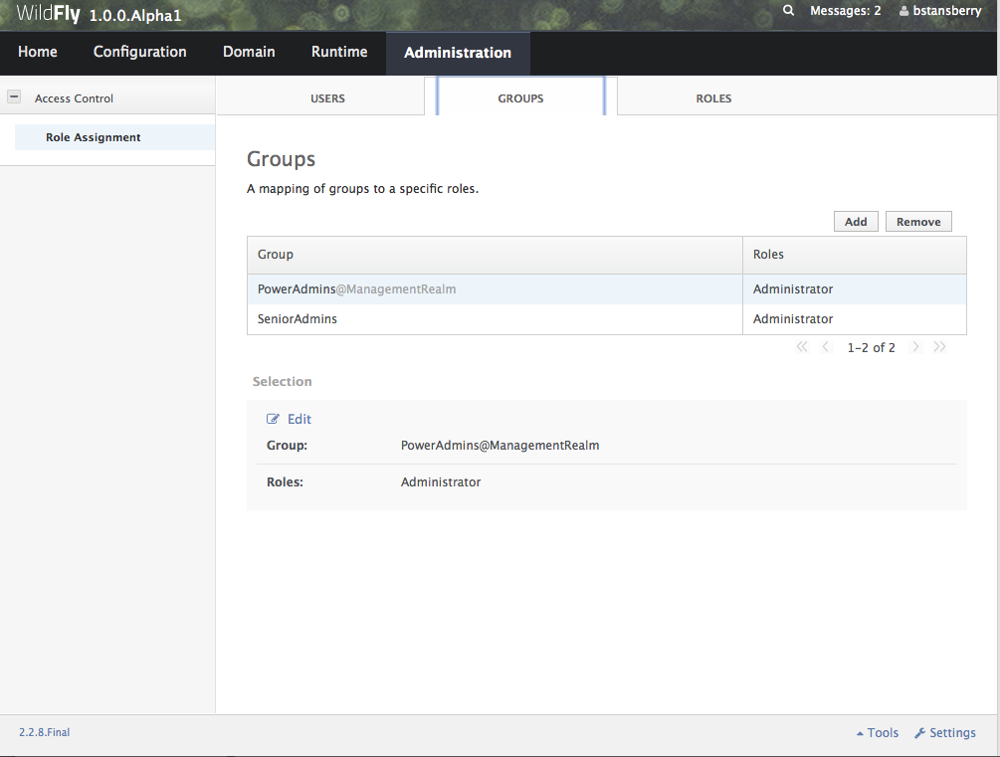
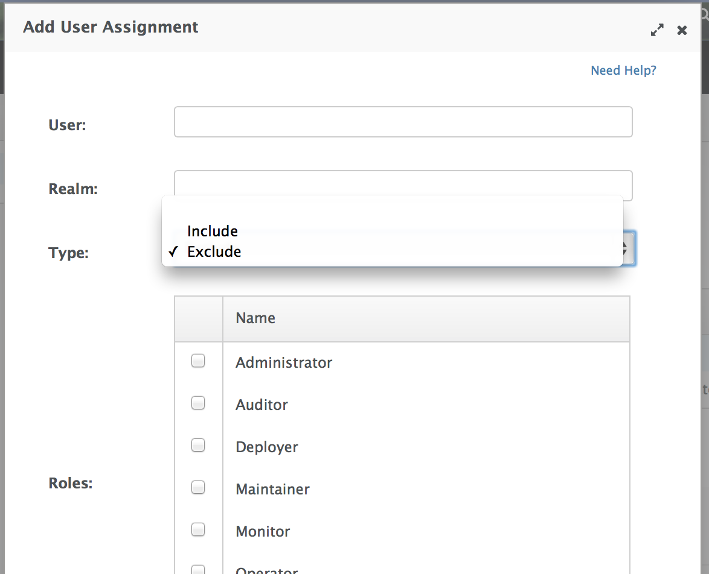
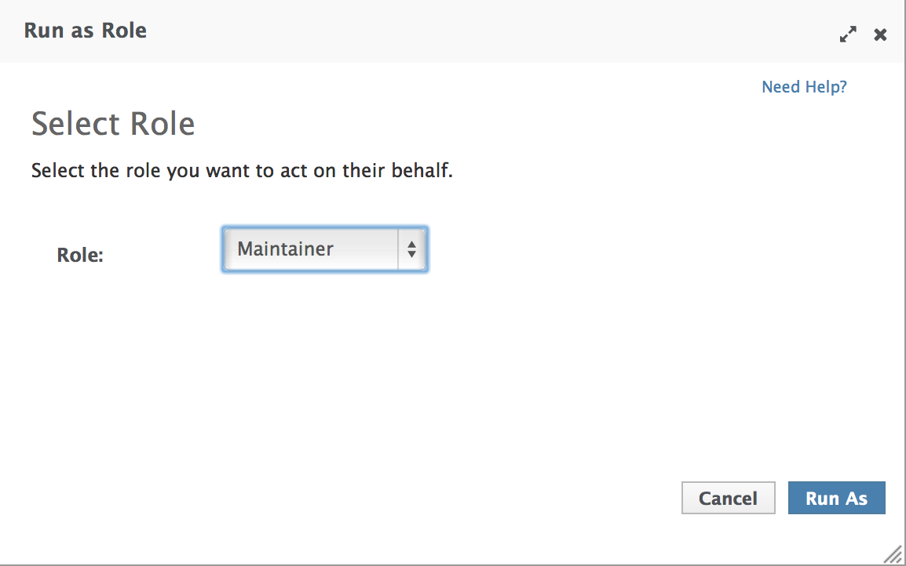

Admin Guide
===========

[[target-audience]]
= Target audience

This document is a guide to the setup, administration, and configuration
of WildFly.

[[prerequisites]]
== Prerequisites

Before continuing, you should know how to download, install and run
WildFly. For more information on these steps, refer here:
link:Getting_Started_Guide.html[Getting Started Guide].

[[examples-in-this-guide]]
== Examples in this guide

The examples in this guide are largely expressed as XML configuration
file excerpts, or by using a representation of the de-typed management
model.

[[management-clients]]
= Management clients

WildFly offers three different approaches to configure and manage
servers: a web interface, a command line client and a set of XML
configuration files. Regardless of the approach you choose, the
configuration is always synchronized across the different views and
finally persisted to the XML files.

[[web-management-interface]]
== Web Management Interface

The web interface is a GWT application that uses the HTTP management API
to configure a management domain or standalone server.

[[http-management-endpoint]]
=== HTTP Management Endpoint

The HTTP API endpoint is the entry point for management clients that
rely on the HTTP protocol to integrate with the management layer. It
uses a JSON encoded protocol and a de-typed, RPC style API to describe
and execute management operations against a managed domain or standalone
server. It's used by the web console, but offers integration
capabilities for a wide range of other clients too.

The HTTP API endpoint is co-located with either the domain controller or
a standalone server. By default, it runs on port 9990:

[source,java]
----
<management-interfaces>
 [...]
 <http-interface security-realm="ManagementRealm">
  <socket-binding http="management-http"/>
 </http-interface>
<management-interfaces>
----

~(See standalone/configuration/standalone.xml or
domain/configuration/host.xml)~

The HTTP API Endpoint serves two different contexts. One for executing
management operations and another one that allows you to access the web
interface:

* Domain API: http://<host>:9990/management
* Web Console: http://<host>:9990/console

[[accessing-the-web-console]]
=== Accessing the web console

The web console is served through the same port as the HTTP management
API. It can be accessed by pointing your browser to:

* http://<host>:9990/console

Default URL

[IMPORTANT]

By default the web interface can be accessed here:
http://localhost:9990/console.

[[default-http-management-interface-security]]
=== Default HTTP Management Interface Security

WildFly is distributed secured by default. The default security
mechanism is username / password based making use of HTTP Digest for the
authentication process.

The reason for securing the server by default is so that if the
management interfaces are accidentally exposed on a public IP address
authentication is required to connect - for this reason there is no
default user in the distribution.

If you attempt to connect to the admin console before you have added a
user to the server you will be presented with the following screen.

image:images/download/attachments/557078/no-users.png[images/download/attachments/557078/no-users.png,width=300]

The user are stored in a properties file called mgmt-users.properties
under standalone/configuration and domain/configuration depending on the
running mode of the server, these files contain the users username along
with a pre-prepared hash of the username along with the name of the
realm and the users password.

[IMPORTANT]

Although the properties files do not contain the plain text passwords
they should still be guarded as the pre-prepared hashes could be used to
gain access to any server with the same realm if the same user has used
the same password.

To manipulate the files and add users we provide a utility add-user.sh
and add-user.bat to add the users and generate the hashes, to add a user
you should execute the script and follow the guided process.
image:images/download/attachments/557078/add-user.png[images/download/attachments/557078/add-user.png] +
The full details of the add-user utility are described later but for the
purpose of accessing the management interface you need to enter the
following values: -

* Type of user - This will be a 'Management User' to selection option a.
* Realm - This MUST match the realm name used in the configuration so
unless you have changed the configuration to use a different realm name
leave this set as 'ManagementRealm'.
* Username - The username of the user you are adding.
* Password - The users password.

Provided the validation passes you will then be asked to confirm you
want to add the user and the properties files will be updated.

For the final question, as this is a user that is going to be accessing
the admin console just answer 'n' - this option will be described later
for adding slave host controllers that authenticate against a master
domain controller but that is a later topic.

Updates to the properties file are picked up in real time so either
click 'Try Again' on the error page that was displayed in the browser or
navigate to the console again and you should then be prompted to enter
the username and password to connect to the server.

[[command-line-interface]]
== Command Line Interface

The Command Line Interface (CLI) is a management tool for a managed
domain or standalone server. It allows a user to connect to the domain
controller or a standalone server and execute management operations
available through the de-typed management model.

Details on how to use the CLI can be found in the
link:Command_Line_Interface.html[Command Line Interface page].

[[configuration-files]]
== Configuration Files

WildFly stores its configuration in centralized XML configuration files,
one per server for standalone servers and, for managed domains, one per
host with an additional domain wide policy controlled by the master
host. These files are meant to be human-readable and human editable.

[IMPORTANT]

The XML configuration files act as a central, authoritative source of
configuration. Any configuration changes made via the web interface or
the CLI are persisted back to the XML configuration files. If a domain
or standalone server is offline, the XML configuration files can be hand
edited as well, and any changes will be picked up when the domain or
standalone server is next started. However, users are encouraged to use
the web interface or the CLI in preference to making offline edits to
the configuration files. External changes made to the configuration
files while processes are running will not be detected, and may be
overwritten.

[[standalone-server-configuration-file]]
=== Standalone Server Configuration File

The XML configuration for a standalone server can be found in the
`standalone/configuration` directory. The default configuration file is
`standalone/configuration/standalone.xml`.

The `standalone/configuration` directory includes a number of other
standard configuration files, e.g. `standalone-full.xml`,
`standalone-ha.xml` and `standalone-full-ha.xml` each of which is
similar to the default `standalone.xml` file but includes additional
subsystems not present in the default configuration. If you prefer to
use one of these files as your server configuration, you can specify it
with the _[line-through]*c*_ or _-server-config_ command line argument:

* `bin/standalone.sh -c=standalone-full.xml`
* `bin/standalone.sh --server-config=standalone-ha.xml`

[[managed-domain-configuration-files]]
=== Managed Domain Configuration Files

In a managed domain, the XML files are found in the
`domain/configuration` directory. There are two types of configuration
files – one per host, and then a single domain-wide file managed by the
master host, aka the Domain Controller. (For more on the types of
processes in a managed domain, see link:Operating_modes.html[Operating
Modes].)

[[host-specific-configuration-host.xml]]
==== Host Specific Configuration – host.xml

When you start a managed domain process, a Host Controller instance is
launched, and it parses its own configuration file to determine its own
configuration, how it should integrate with the rest of the domain, any
host-specific values for settings in the domain wide configuration (e.g.
IP addresses) and what servers it should launch. This information is
contained in the host-specific configuration file, the default version
of which is `domain/configuration/host.xml`.

Each host will have its own variant `host.xml`, with settings
appropriate for its role in the domain. WildFly ships with three
standard variants:

[cols=",",]
|=======================================================================
|host-master.xml |A configuration that specifies the Host Controller
should become the master, aka the Domain Controller. No servers will be
started by this Host Controller, which is a recommended setup for a
production master.

|host-slave.xml |A configuration that specifies the Host Controller
should not become master and instead should register with a remote
master and be controlled by it. This configuration launches servers,
although a user will likely wish to modify how many servers are launched
and what server groups they belong to.

|host.xml |The default host configuration, tailored for an easy out of
the box experience experimenting with a managed domain. This
configuration specifies the Host Controller should become the master,
aka the Domain Controller, but it also launches a couple of servers.
|=======================================================================

Which host-specific configuration should be used can be controlled via
the _ _--host-config__ command line argument:

[source,java]
----
$ bin/domain.sh --host-config=host-master.xml
----

[[domain-wide-configuration-domain.xml]]
==== Domain Wide Configuration – domain.xml

Once a Host Controller has processed its host-specific configuration, it
knows whether it is configured to act as the master Domain Controller.
If it is, it must parse the domain wide configuration file, by default
located at `domain/configuration/domain.xml`. This file contains the
bulk of the settings that should be applied to the servers in the domain
when they are launched – among other things, what subsystems they should
run with what settings, what sockets should be used, and what
deployments should be deployed.

Which domain-wide configuration should be used can be controlled via the
_ _--domain-config__ command line argument:

[source,java]
----
$ bin/domain.sh --domain-config=domain-production.xml
----

That argument is only relevant for hosts configured to act as the
master.

A slave Host Controller does not usually parse the domain wide
configuration file. A slave gets the domain wide configuration from the
remote master Domain Controller when it registers with it. A slave also
will not persist changes to a `domain.xml` file if one is present on the
filesystem. For that reason it is recommended that no `domain.xml` be
kept on the filesystem of hosts that will only run as slaves.

A slave can be configured to keep a locally persisted copy of the domain
wide configuration and then use it on boot (in case the master is not
available.) See _--backup and --cached-dc_ under
link:Command_line_parameters.html[Command line parameters].

[[core-management-concepts]]
= Core management concepts

[[operating-modes]]
== Operating modes

WildFly can be booted in two different modes. A _managed domain_ allows
you to run and manage a multi-server topology. Alternatively, you can
run a _standalone server_ instance.

[[standalone-server]]
=== Standalone Server

For many use cases, the centralized management capability available via
a managed domain is not necessary. For these use cases, a WildFly
instance can be run as a "standalone server". A standalone server
instance is an independent process, much like an JBoss Application
Server 3, 4, 5, or 6 instance is. Standalone instances can be launched
via the `standalone.sh` or `standalone.bat` launch scripts.

If more than one standalone instance is launched and multi-server
management is desired, it is the user's responsibility to coordinate
management across the servers. For example, to deploy an application
across all of the standalone servers, the user would need to
individually deploy the application on each server.

It is perfectly possible to launch multiple standalone server instances
and have them form an HA cluster, just like it was possible with JBoss
Application Server 3, 4, 5 and 6.

[[managed-domain]]
=== Managed Domain

One of the primary new features of WildFly is the ability to manage
multiple WildFly instances from a single control point. A collection of
such servers is referred to as the members of a "domain" with a single
Domain Controller process acting as the central management control
point. All of the WildFly instances in the domain share a common
management policy, with the Domain Controller acting to ensure that each
server is configured according to that policy. Domains can span multiple
physical (or virtual) machines, with all WildFly instances on a given
host under the control of a special Host Controller process. One Host
Controller instance is configured to act as the central Domain
Controller. The Host Controller on each host interacts with the Domain
Controller to control the lifecycle of the application server instances
running on its host and to assist the Domain Controller in managing
them.

When you launch a WildFly managed domain on a host (via the `domain.sh`
or `domain.bat` launch scripts) your intent is to launch a Host
Controller and usually at least one WildFly instance. On one of the
hosts the Host Controller should be configured to act as the Domain
Controller. See link:Domain_Setup.html[Domain Setup] for details.

The following is an example managed domain topology:

image:images/download/attachments/557077/DC-HC-Server.png[images/download/attachments/557077/DC-HC-Server.png]

[[host]]
==== Host

Each "Host" box in the above diagram represents a physical or virtual
host. A physical host can contain zero, one or more server instances.

[[host-controller]]
==== Host Controller

When the domain.sh or domain.bat script is run on a host, a process
known as a Host Controller is launched. The Host Controller is solely
concerned with server management; it does not itself handle application
server workloads. The Host Controller is responsible for starting and
stopping the individual application server processes that run on its
host, and interacts with the Domain Controller to help manage them.

Each Host Controller by default reads its configuration from the
`domain/configuration/host.xml` file located in the unzipped WildFly
installation on its host's filesystem. The `host.xml` file contains
configuration information that is specific to the particular host.
Primarily:

* the listing of the names of the actual WildFly instances that are
meant to run off of this installation.
* configuration of how the Host Controller is to contact the Domain
Controller to register itself and access the domain configuration. This
may either be configuration of how to find and contact a remote Domain
Controller, or a configuration telling the Host Controller to itself act
as the Domain Controller.
* configuration of items that are specific to the local physical
installation. For example, named interface definitions declared in
`domain.xml` (see below) can be mapped to an actual machine-specific IP
address in `host.xml`. Abstract path names in `domain.xml` can be mapped
to actual filesystem paths in `host.xml`.

[[domain-controller]]
==== Domain Controller

One Host Controller instance is configured to act as the central
management point for the entire domain, i.e. to be the Domain
Controller. The primary responsibility of the Domain Controller is to
maintain the domain's central management policy, to ensure all Host
Controllers are aware of its current contents, and to assist the Host
Controllers in ensuring any running application server instances are
configured in accordance with this policy. This central management
policy is stored by default in the `domain/configuration/domain.xml`
file in the unzipped WildFly installation on Domain Controller's host's
filesystem.

A `domain.xml` file must be located in the `domain/configuration`
directory of an installation that's meant to run the Domain Controller.
It does not need to be present in installations that are not meant to
run a Domain Controller; i.e. those whose Host Controller is configured
to contact a remote Domain Controller. The presence of a `domain.xml`
file on such a server does no harm.

The `domain.xml` file includes, among other things, the configuration of
the various "profiles" that WildFly instances in the domain can be
configured to run. A profile configuration includes the detailed
configuration of the various subsystems that comprise that profile (e.g.
an embedded JBoss Web instance is a subsystem; a JBoss TS transaction
manager is a subsystem, etc). The domain configuration also includes the
definition of groups of sockets that those subsystems may open. The
domain configuration also includes the definition of "server groups":

[[server-group]]
==== Server Group

A server group is set of server instances that will be managed and
configured as one. In a managed domain each application server instance
is a member of a server group. (Even if the group only has a single
server, the server is still a member of a group.) It is the
responsibility of the Domain Controller and the Host Controllers to
ensure that all servers in a server group have a consistent
configuration. They should all be configured with the same profile and
they should have the same deployment content deployed.

The domain can have multiple server groups. The above diagram shows two
server groups, "ServerGroupA" and "ServerGroupB". Different server
groups can be configured with different profiles and deployments; for
example in a domain with different tiers of servers providing different
services. Different server groups can also run the same profile and have
the same deployments; for example to support rolling application upgrade
scenarios where a complete service outage is avoided by first upgrading
the application on one server group and then upgrading a second server
group.

An example server group definition is as follows:

[source,java]
----
<server-group name="main-server-group" profile="default">
    <socket-binding-group ref="standard-sockets"/>
    <deployments>
        <deployment name="foo.war_v1" runtime-name="foo.war" />
        <deployment name="bar.ear" runtime-name="bar.ear" />
    </deployments>
</server-group>
----

A server-group configuration includes the following required attributes:

* name -- the name of the server group
* profile -- the name of the profile the servers in the group should run

In addition, the following optional elements are available:

* socket-binding-group -- specifies the name of the default socket
binding group to use on servers in the group. Can be overridden on a
per-server basis in `host.xml`. If not provided in the `server-group`
element, it must be provided for each server in `host.xml`.
* deployments -- the deployment content that should be deployed on the
servers in the group.
* deployment-overlays -- the overlays and their associated deployments.
* system-properties -- system properties that should be set on all
servers in the group
* jvm -- default jvm settings for all servers in the group. The Host
Controller will merge these settings with any provided in `host.xml` to
derive the settings to use to launch the server's JVM. See
link:JVM_settings.html[JVM settings] for further details.

[[server]]
==== Server

Each "Server" in the above diagram represents an actual application
server instance. The server runs in a separate JVM process from the Host
Controller. The Host Controller is responsible for launching that
process. (In a managed domain the end user cannot directly launch a
server process from the command line.)

The Host Controller synthesizes the server's configuration by combining
elements from the domain wide configuration (from `domain.xml` ) and the
host-specific configuration (from `host.xml` ).

[[deciding-between-running-standalone-servers-or-a-managed-domain]]
=== Deciding between running standalone servers or a managed domain

Which use cases are appropriate for managed domain and which are
appropriate for standalone servers? A managed domain is all about
coordinated multi-server management -- with it WildFly provides a
central point through which users can manage multiple servers, with rich
capabilities to keep those servers' configurations consistent and the
ability to roll out configuration changes (including deployments) to the
servers in a coordinated fashion.

It's important to understand that the choice between a managed domain
and standalone servers is all about how your servers are managed, not
what capabilities they have to service end user requests. This
distinction is particularly important when it comes to high availability
clusters. It's important to understand that HA functionality is
orthogonal to running standalone servers or a managed domain. That is, a
group of standalone servers can be configured to form an HA cluster. The
domain and standalone modes determine how the servers are managed, not
what capabilities they provide.

So, given all that:

* A single server installation gains nothing from running in a managed
domain, so running a standalone server is a better choice.
* For multi-server production environments, the choice of running a
managed domain versus standalone servers comes down to whether the user
wants to use the centralized management capabilities a managed domain
provides. Some enterprises have developed their own sophisticated
multi-server management capabilities and are comfortable coordinating
changes across a number of independent WildFly instances. For these
enterprises, a multi-server architecture comprised of individual
standalone servers is a good option.
* Running a standalone server is better suited for most development
scenarios. Any individual server configuration that can be achieved in a
managed domain can also be achieved in a standalone server, so even if
the application being developed will eventually run in production on a
managed domain installation, much (probably most) development can be
done using a standalone server.
* Running a managed domain mode can be helpful in some advanced
development scenarios; i.e. those involving interaction between multiple
WildFly instances. Developers may find that setting up various servers
as members of a domain is an efficient way to launch a multi-server
cluster.

[[general-configuration-concepts]]
== General configuration concepts

For both a managed domain or a standalone server, a number of common
configuration concepts apply:

[[extensions]]
=== Extensions

An extension is a module that extends the core capabilities of the
server. The WildFly core is very simple and lightweight; most of the
capabilities people associate with an application server are provided
via extensions. An extension is packaged as a module in the `modules`
folder. The user indicates that they want a particular extension to be
available by including an `<extension/>` element naming its module in
the `domain.xml` or `standalone.xml` file.

[source,java]
----
<extensions>
    [...]
    <extension module="org.jboss.as.transactions"/>
    <extension module="org.jboss.as.webservices" />
    <extension module="org.jboss.as.weld" />
    [...]
    <extension module="org.wildfly.extension.undertow"/>
</extensions>
----

[[profiles-and-subsystems]]
=== Profiles and Subsystems

The most significant part of the configuration in `domain.xml` and
`standalone.xml` is the configuration of one (in `standalone.xml`) or
more (in `domain.xml`) "profiles". A profile is a named set of subsystem
configurations. A subsystem is an added set of capabilities added to the
core server by an extension (see "Extensions" above). A subsystem
provides servlet handling capabilities; a subsystem provides an EJB
container; a subsystem provides JTA, etc. A profile is a named list of
subsystems, along with the details of each subsystem's configuration. A
profile with a large number of subsystems results in a server with a
large set of capabilities. A profile with a small, focused set of
subsystems will have fewer capabilities but a smaller footprint.

The content of an individual profile configuration looks largely the
same in `domain.xml` and `standalone.xml`. The only difference is
`standalone.xml` is only allowed to have a single profile element (the
profile the server will run), while `domain.xml` can have many profiles,
each of which can be mapped to one or more groups of servers.

The contents of individual subsystem configurations look exactly the
same between `domain.xml` and `standalone.xml`.

[[paths]]
=== Paths

A logical name for a filesystem path. The `domain.xml`, `host.xml` and
`standalone.xml` configurations all include a section where paths can be
declared. Other sections of the configuration can then reference those
paths by their logical name, rather than having to include the full
details of the path (which may vary on different machines). For example,
the logging subsystem configuration includes a reference to the "
`jboss.server.log.dir`" path that points to the server's " `log`"
directory.

[source,java]
----
<file relative-to="jboss.server.log.dir" path="server.log"/>
----

WildFly automatically provides a number of standard paths without any
need for the user to configure them in a configuration file:

* `jboss.home`.dir - the root directory of the WildFly distribution
* `user.home` - user's home directory
* `user.dir` - user's current working directory
* `java.home` - java installation directory
* `jboss.server.base.dir` - root directory for an individual server
instance
* `jboss.server.config.dir` - directory the server will use for
configuration file storage
* `jboss.server.data.dir` - directory the server will use for persistent
data file storage
* `jboss.server.log.dir` - directory the server will use for log file
storage
* `jboss.server.temp.dir` - directory the server will use for temporary
file storage
* `jboss.controller.temp.dir` - directory the server will use for
temporary file storage
* `jboss.domain.servers.dir` - directory under which a host controller
will create the working area for individual server instances (managed
domain mode only)

Users can add their own paths or override all except the first 5 of the
above by adding a `<path/>` element to their configuration file.

[source,java]
----
<path name="example" path="example" relative-to="jboss.server.data.dir"/>
----

The attributes are:

* `name` -- the name of the path.
* `path` -- the actual filesystem path. Treated as an absolute path,
unless the 'relative-to' attribute is specified, in which case the value
is treated as relative to that path.
* `relative-to` -- (optional) the name of another previously named path,
or of one of the standard paths provided by the system.

A `<path/>` element in a `domain.xml` need not include anything more
than the `name` attribute; i.e. it need not include any information
indicating what the actual filesystem path is:

[source,java]
----
<path name="x"/>
----

Such a configuration simply says, "There is a path named 'x' that other
parts of the `domain.xml` configuration can reference. The actual
filesystem location pointed to by 'x' is host-specific and will be
specified in each machine's `host.xml` file." If this approach is used,
there must be a path element in each machine's `host.xml` that specifies
what the actual filesystem path is:

[source,java]
----
<path name="x" path="/var/x" />
----

A `<path/>` element in a `standalone.xml` must include the specification
of the actual filesystem path.

[[interfaces]]
=== Interfaces

A logical name for a network interface/IP address/host name to which
sockets can be bound. The `domain.xml`, `host.xml` and `standalone.xml`
configurations all include a section where interfaces can be declared.
Other sections of the configuration can then reference those interfaces
by their logical name, rather than having to include the full details of
the interface (which may vary on different machines). An interface
configuration includes the logical name of the interface as well as
information specifying the criteria to use for resolving the actual
physical address to use. See link:Interfaces_and_ports.html[Interfaces
and ports] for further details.

An `<interface/>` element in a `domain.xml` need not include anything
more than the `name` attribute; i.e. it need not include any information
indicating what the actual IP address associated with the name is:

[source,java]
----
<interface name="internal"/>
----

Such a configuration simply says, "There is an interface named
'internal' that other parts of the domain.xml configuration can
reference. The actual IP address pointed to by 'internal' is
host-specific and will be specified in each machine's host.xml file." If
this approach is used, there must be an interface element in each
machine's `host.xml` that specifies the criteria for determining the IP
address:

[source,java]
----
<interface name="internal">
   <nic name="eth1"/>
</interface>
----

An `<interface/>` element in a `standalone.xml` must include the
criteria for determining the IP address.

[[socket-bindings-and-socket-binding-groups]]
=== Socket Bindings and Socket Binding Groups

A socket binding is a named configuration for a socket.

The `domain.xml` and `standalone.xml` configurations both include a
section where named socket configurations can be declared. Other
sections of the configuration can then reference those sockets by their
logical name, rather than having to include the full details of the
socket configuration (which may vary on different machines). See
link:Interfaces_and_ports.html[Interfaces and ports] for full details.

[[system-properties]]
=== System Properties

System property values can be set in a number of places in `domain.xml`,
`host.xml` and `standalone.xml`. The values in `standalone.xml` are set
as part of the server boot process. Values in `domain.xml` and
`host.xml` are applied to servers when they are launched.

When a system property is configured in `domain.xml` or `host.xml`, the
servers it ends up being applied to depends on where it is set. Setting
a system property in a child element directly under the `domain.xml`
root results in the property being set on all servers. Setting it in a
`<system-property/>` element inside a `<server-group/>` element in
domain.xml results in the property being set on all servers in the
group. Setting it in a child element directly under the `host.xml` root
results in the property being set on all servers controlled by that
host's Host Controller. Finally, setting it in a `<system-property/>`
element inside a `<server/>` element in `host.xml` result in the
property being set on that server. The same property can be configured
in multiple locations, with a value in a `<server/>` element taking
precedence over a value specified directly under the `host.xml` root
element, the value in a `host.xml` taking precedence over anything from
`domain.xml`, and a value in a `<server-group/>` element taking
precedence over a value specified directly under the `domain.xml` root
element.

[[management-resources]]
== Management resources

When WildFly parses your configuration files at boot, or when you use
one of the AS's link:Management_Clients.html[Management Clients] you are
adding, removing or modifying _management resources_ in the AS's
internal management model. A WildFly management resource has the
following characteristics:

[[address]]
=== Address

All WildFly management resources are organized in a tree. The path to
the node in the tree for a particular resource is its _address_. Each
segment in a resource's address is a key/value pair:

* The key is the resource's _type_, in the context of its parent. So,
for example, the root resource for a standalone server has children of
type `subsystem`, `interface`, `socket-binding`, etc. The resource for
the subsystem that provides the AS's webserver capability has children
of type `connector` and `virtual-server`. The resource for the subsystem
that provides the AS's messaging server capability has, among others,
children of type `jms-queue` and `jms-topic`.
* The value is the name of a particular resource of the given type, e.g
`web` or `messaging` for subsystems or `http` or `https` for web
subsystem connectors.

The full address for a resource is the ordered list of key/value pairs
that lead from the root of the tree to the resource. Typical notation is
to separate the elements in the address with a '/' and to separate the
key and the value with an '=':

* `/subsystem=undertow/server=default-server/http-listener=default`
* `/subsystem=messaging/jms-queue=testQueue`
* `/interface=public`

When using the HTTP API, a '/' is used to separate the key and the value
instead of an '=':

* `http://localhost:9990/management/subsystem/undertow/server/default-server/http-listener/default`
* `http://localhost:9990/management/subsystem/messaging/jms-queue/testQueue`
* `http://localhost:9990/management/interface/public`

[[operations]]
=== Operations

Querying or modifying the state of a resource is done via an operation.
An operation has the following characteristics:

* A string name
* Zero or more named parameters. Each parameter has a string name, and a
value of type `org.jboss.dmr.ModelNode` (or, when invoked via the CLI,
the text representation of a `ModelNode`; when invoked via the HTTP API,
the JSON representation of a `ModelNode`.) Parameters may be optional.
* A return value, which will be of type `org.jboss.dmr.ModelNode` (or,
when invoked via the CLI, the text representation of a `ModelNode`; when
invoked via the HTTP API, the JSON representation of a `ModelNode`.)

Every resource except the root resource will have an `add` operation and
should have a `remove` operation ("should" because in WildFly 8 many do
not). The parameters for the `add` operation vary depending on the
resource. The `remove` operation has no parameters.

There are also a number of "global" operations that apply to all
resources. See link:Global_operations.html[Global operations] for full
details.

The operations a resource supports can themselves be determined by
invoking an operation: the `read-operation-names` operation. Once the
name of an operation is known, details about its parameters and return
value can be determined by invoking the `read-operation-description`
operation. For example, to learn the names of the operations exposed by
the root resource for a standalone server, and then learn the full
details of one of them, via the CLI one would:

[source,java]
----
[standalone@localhost:9990 /] :read-operation-names
{
    "outcome" => "success",
    "result" => [
        "add-namespace",
        "add-schema-location",
        "delete-snapshot",
        "full-replace-deployment",
        "list-snapshots",
        "read-attribute",
        "read-children-names",
        "read-children-resources",
        "read-children-types",
        "read-config-as-xml",
        "read-operation-description",
        "read-operation-names",
        "read-resource",
        "read-resource-description",
        "reload",
        "remove-namespace",
        "remove-schema-location",
        "replace-deployment",
        "shutdown",
        "take-snapshot",
        "upload-deployment-bytes",
        "upload-deployment-stream",
        "upload-deployment-url",
        "validate-address",
        "write-attribute"
    ]
}
[standalone@localhost:9990 /] :read-operation-description(name=upload-deployment-url)
{
    "outcome" => "success",
    "result" => {
        "operation-name" => "upload-deployment-url",
        "description" => "Indicates that the deployment content available at the included URL should be added to the deployment content repository. Note that this operation does not indicate the content should be deployed into the runtime.",
        "request-properties" => {"url" => {
            "type" => STRING,
            "description" => "The URL at which the deployment content is available for upload to the domain's or standalone server's deployment content repository.. Note that the URL must be accessible from the target of the operation (i.e. the Domain Controller or standalone server).",
            "required" => true,
            "min-length" => 1,
            "nillable" => false
        }},
        "reply-properties" => {
            "type" => BYTES,
            "description" => "The hash of managed deployment content that has been uploaded to the domain's or standalone server's deployment content repository.",
            "min-length" => 20,
            "max-length" => 20,
            "nillable" => false
        }
    }
}
----

See link:#src-557075_AdminGuide-Descriptions[#Descriptions] below for
more on how to learn about the operations a resource exposes.

[[attributes]]
=== Attributes

Management resources expose information about their state as attributes.
Attributes have string name, and a value of type
`org.jboss.dmr.ModelNode` (or: for the CLI, the text representation of a
`ModelNode`; for HTTP API, the JSON representation of a `ModelNode`.)

Attributes can either be read-only or read-write. Reading and writing
attribute values is done via the global `read-attribute` and
`write-attribute` operations.

The `read-attribute` operation takes a single parameter "name" whose
value is a the name of the attribute. For example, to read the "port"
attribute of a socket-binding resource via the CLI:

[source,java]
----
[standalone@localhost:9990 /] /socket-binding-group=standard-sockets/socket-binding=https:read-attribute(name=port)
{
    "outcome" => "success",
    "result" => 8443
}
----

If an attribute is writable, the `write-attribute` operation is used to
mutate its state. The operation takes two parameters:

* `name` – the name of the attribute
* `value` – the value of the attribute

For example, to read the "port" attribute of a socket-binding resource
via the CLI:

[source,java]
----
[standalone@localhost:9990 /] /socket-binding-group=standard-sockets/socket-binding=https:write-attribute(name=port,value=8444)
{"outcome" => "success"}
----

Attributes can have one of two possible _storage types_:

* *CONFIGURATION* – means the value of the attribute is stored in the
persistent configuration; i.e. in the `domain.xml`, `host.xml` or
`standalone.xml` file from which the resource's configuration was read.
* *RUNTIME* – the attribute value is only available from a running
server; the value is not stored in the persistent configuration. A
metric (e.g. number of requests serviced) is a typical example of a
RUNTIME attribute.

The values of all of the attributes a resource exposes can be obtained
via the `read-resource` operation, with the "include-runtime" parameter
set to "true". For example, from the CLI:

[source,java]
----
[standalone@localhost:9990 /] /subsystem=undertow/server=default-server/http-listener=default:read-resource(include-runtime=true)
{
    "outcome" => "success",
    "result" => {
        "allow-encoded-slash" => false,
        "allow-equals-in-cookie-value" => false,
        "always-set-keep-alive" => true,
        "buffer-pipelined-data" => true,
        "buffer-pool" => "default",
        "bytes-received" => 0L,
        "bytes-sent" => 0L,
        "certificate-forwarding" => false,
        "decode-url" => true,
        "disallowed-methods" => ["TRACE"],
        "enable-http2" => false,
        "enabled" => true,
        "error-count" => 0L,
        "max-buffered-request-size" => 16384,
        "max-connections" => undefined,
        "max-cookies" => 200,
        "max-header-size" => 1048576,
        "max-headers" => 200,
        "max-parameters" => 1000,
        "max-post-size" => 10485760L,
        "max-processing-time" => 0L,
        "no-request-timeout" => undefined,
        "processing-time" => 0L,
        "proxy-address-forwarding" => false,
        "read-timeout" => undefined,
        "receive-buffer" => undefined,
        "record-request-start-time" => false,
        "redirect-socket" => "https",
        "request-count" => 0L,
        "request-parse-timeout" => undefined,
        "resolve-peer-address" => false,
        "send-buffer" => undefined,
        "socket-binding" => "http",
        "tcp-backlog" => undefined,
        "tcp-keep-alive" => undefined,
        "url-charset" => "UTF-8",
        "worker" => "default",
        "write-timeout" => undefined
    }
}
----

Omit the "include-runtime" parameter (or set it to "false") to limit
output to those attributes whose values are stored in the persistent
configuration:

[source,java]
----
[standalone@localhost:9990 /] /subsystem=undertow/server=default-server/http-listener=default:read-resource(include-runtime=false
{
    "outcome" => "success",
    "result" => {
        "allow-encoded-slash" => false,
        "allow-equals-in-cookie-value" => false,
        "always-set-keep-alive" => true,
        "buffer-pipelined-data" => true,
        "buffer-pool" => "default",
        "certificate-forwarding" => false,
        "decode-url" => true,
        "disallowed-methods" => ["TRACE"],
        "enable-http2" => false,
        "enabled" => true,
        "max-buffered-request-size" => 16384,
        "max-connections" => undefined,
        "max-cookies" => 200,
        "max-header-size" => 1048576,
        "max-headers" => 200,
        "max-parameters" => 1000,
        "max-post-size" => 10485760L,
        "no-request-timeout" => undefined,
        "proxy-address-forwarding" => false,
        "read-timeout" => undefined,
        "receive-buffer" => undefined,
        "record-request-start-time" => false,
        "redirect-socket" => "https",
        "request-parse-timeout" => undefined,
        "resolve-peer-address" => false,
        "send-buffer" => undefined,
        "socket-binding" => "http",
        "tcp-backlog" => undefined,
        "tcp-keep-alive" => undefined,
        "url-charset" => "UTF-8",
        "worker" => "default",
        "write-timeout" => undefined
    }
}
----

See link:#src-557075_AdminGuide-Descriptions[#Descriptions] below for
how to learn more about the attributes a particular resource exposes.

[[children]]
=== Children

Management resources may support child resources. The
link:#src-557075_AdminGuide-Address[_types_ of children] a resource
supports (e.g. `connector` for the web subsystem resource) can be
obtained by querying the resource's description (see
link:#src-557075_AdminGuide-Descriptions[#Descriptions] below) or by
invoking the `read-children-types` operation. Once you know the legal
child types, you can query the names of all children of a given type by
using the global `read-children-types` operation. The operation takes a
single parameter "child-type" whose value is the type. For example, a
resource representing a socket binding group has children. To find the
type of those children and the names of resources of that type via the
CLI one could:

[source,java]
----
[standalone@localhost:9990 /] /socket-binding-group=standard-sockets:read-children-types
{
    "outcome" => "success",
    "result" => ["socket-binding"]
}
[standalone@localhost:9990 /] /socket-binding-group=standard-sockets:read-children-names(child-type=socket-binding)
{
    "outcome" => "success",
    "result" => [
        "http",
        "https",
        "jmx-connector-registry",
        "jmx-connector-server",
        "jndi",
        "osgi-http",
        "remoting",
        "txn-recovery-environment",
        "txn-status-manager"
    ]
}
----

[[descriptions]]
=== Descriptions

All resources expose metadata that describes their attributes,
operations and child types. This metadata is itself obtained by invoking
one or more of the link:Global_operations.html[global operations] each
resource supports. We showed examples of the `read-operation-names`,
`read-operation-description`, `read-children-types` and
`read-children-names` operations above.

The `read-resource-description` operation can be used to find the
details of the attributes and child types associated with a resource.
For example, using the CLI:

[source,java]
----
[standalone@localhost:9990 /] /socket-binding-group=standard-sockets:read-resource-description
{
    "outcome" => "success",
    "result" => {
        "description" => "Contains a list of socket configurations.",
        "head-comment-allowed" => true,
        "tail-comment-allowed" => false,
        "attributes" => {
            "name" => {
                "type" => STRING,
                "description" => "The name of the socket binding group.",
                "required" => true,
                "head-comment-allowed" => false,
                "tail-comment-allowed" => false,
                "access-type" => "read-only",
                "storage" => "configuration"
            },
            "default-interface" => {
                "type" => STRING,
                "description" => "Name of an interface that should be used as the interface for any sockets that do not explicitly declare one.",
                "required" => true,
                "head-comment-allowed" => false,
                "tail-comment-allowed" => false,
                "access-type" => "read-write",
                "storage" => "configuration"
            },
            "port-offset" => {
                "type" => INT,
                "description" => "Increment to apply to the base port values defined in the socket bindings to derive the runtime values to use on this server.",
                "required" => false,
                "head-comment-allowed" => true,
                "tail-comment-allowed" => false,
                "access-type" => "read-write",
                "storage" => "configuration"
            }
        },
        "operations" => {},
        "children" => {"socket-binding" => {
            "description" => "The individual socket configurtions.",
            "min-occurs" => 0,
            "model-description" => undefined
        }}
    }
}
----

Note the
`"operations" => }} in the output above. If the command had included the {{operations`
parameter (i.e.
`/socket-binding-group=standard-sockets:read-resource-description(operations=true)`)
the output would have included the description of each operation
supported by the resource.

See the link:Global_operations.html[Global operations] section for
details on other parameters supported by the `read-resource-description`
operation and all the other globally available operations.

[[comparison-to-jmx-mbeans]]
=== Comparison to JMX MBeans

WildFly management resources are conceptually quite similar to Open
MBeans. They have the following primary differences:

* WildFly management resources are organized in a tree structure. The
order of the key value pairs in a resource's address is significant, as
it defines the resource's position in the tree. The order of the key
properties in a JMX `ObjectName` is not significant.
* In an Open MBean attribute values, operation parameter values and
operation return values must either be one of the simple JDK types
(String, Boolean, Integer, etc) or implement either the
`javax.management.openmbean.CompositeData` interface or the
`javax.management.openmbean.TabularData` interface. WildFly management
resource attribute values, operation parameter values and operation
return values are all of type `org.jboss.dmr.ModelNode`.

[[basic-structure-of-the-management-resource-trees]]
=== Basic structure of the management resource trees

As noted above, management resources are organized in a tree structure.
The structure of the tree depends on whether you are running a
standalone server or a managed domain.

[[standalone-server-1]]
==== Standalone server

The structure of the managed resource tree is quite close to the
structure of the `standalone.xml` configuration file.

* The root resource
** `extension` – extensions installed in the server
** `path` – paths available on the server
** `system-property` – system properties set as part of the
configuration (i.e. not on the command line)
** `core-service=management` – the server's core management services
** `core-service=service-container` – resource for the JBoss MSC
`ServiceContainer` that's at the heart of the AS
** `subsystem` – the subsystems installed on the server. The bulk of the
management model will be children of type `subsystem`
** `interface` – interface configurations
** `socket-binding-group` – the central resource for the server's socket
bindings
*** `socket-binding` – individual socket binding configurations
** `deployment` – available deployments on the server

[[managed-domain-1]]
==== Managed domain

In a managed domain, the structure of the managed resource tree spans
the entire domain, covering both the domain wide configuration (e.g.
what's in `domain.xml`, the host specific configuration for each host
(e.g. what's in `host.xml`, and the resources exposed by each running
application server. The Host Controller processes in a managed domain
provide access to all or part of the overall resource tree. How much is
available depends on whether the management client is interacting with
the Host Controller that is acting as the master Domain Controller. If
the Host Controller is the master Domain Controller, then the section of
the tree for each host is available. If the Host Controller is a slave
to a remote Domain Controller, then only the portion of the tree
associated with that host is available.

* The root resource for the entire domain. The persistent configuration
associated with this resource and its children, except for those of type
`host`, is persisted in the `domain.xml` file on the Domain Controller.
** `extension` – extensions available in the domain
** `path` – paths available on across the domain
** `system-property` – system properties set as part of the
configuration (i.e. not on the command line) and available across the
domain
** `profile` – sets of subsystem configurations that can be assigned to
server groups
*** `subsystem` – configuration of subsystems that are part of the
profile
** `interface` – interface configurations
** `socket-binding-group` – sets of socket bindings configurations that
can be applied to server groups
*** `socket-binding` – individual socket binding configurations
** `deployment` – deployments available for assignment to server groups
** deployment-overlay -- deployment-overlays content available to
overlay deployments in server groups
** `server-group` – server group configurations
** host – the individual Host Controllers. Each child of this type
represents the root resource for a particular host. The persistent
configuration associated with one of these resources or its children is
persisted in the host's `host.xml` file.
*** `path` – paths available on each server on the host
*** `system-property` – system properties to set on each server on the
host
*** `core-service=management` – the Host Controller's core management
services
*** `interface` – interface configurations that apply to the Host
Controller or servers on the host
*** `jvm` – JVM configurations that can be applied when launching
servers
*** `server-config` – configuration describing how the Host Controller
should launch a server; what server group configuration to use, and any
server-specific overrides of items specified in other resources
*** `server` – the root resource for a running server. Resources from
here and below are not directly persisted; the domain-wide and host
level resources contain the persistent configuration that drives a
server
**** `extension` – extensions installed in the server
**** `path` – paths available on the server
**** `system-property` – system properties set as part of the
configuration (i.e. not on the command line)
**** `core-service=management` – the server's core management services
**** `core-service=service-container` – resource for the JBoss MSC
`ServiceContainer` that's at the heart of the AS
**** `subsystem` – the subsystems installed on the server. The bulk of
the management model will be children of type `subsystem`
**** `interface` – interface configurations
**** `socket-binding-group` – the central resource for the server's
socket bindings
***** `socket-binding` – individual socket binding configurations
**** `deployment` – available deployments on the server
**** deployment-overlay -- available overlays on the server

[[configuring-interfaces-and-ports]]
= Configuring interfaces and ports

[[interface-declarations]]
== Interface declarations

WildFly uses named interface references throughout the configuration. A
network interface is declared by specifying a logical name and a
selection criteria for the physical interface:

[source,java]
----
[standalone@localhost:9990 /] :read-children-names(child-type=interface)
{
   "outcome" => "success",
   "result" => [
       "management",
       "public"
   ]
}
----

This means the server in question declares two interfaces: One is
referred to as " _management_"; the other one " _public_". The "
_management_" interface is used for all components and services that are
required by the management layer (i.e. the HTTP Management Endpoint).
The " _public_" interface binding is used for any application related
network communication (i.e. Web, Messaging, etc). There is nothing
special about these names; interfaces can be declared with any name.
Other sections of the configuration can then reference those interfaces
by their logical name, rather than having to include the full details of
the interface (which, on servers in a management domain, may vary on
different machines).

The `domain.xml`, `host.xml` and `standalone.xml` configuration files
all include a section where interfaces can be declared. If we take a
look at the XML declaration it reveals the selection criteria. The
criteria is one of two types: either a single element indicating that
the interface should be bound to a wildcard address, or a set of one or
more characteristics that an interface or address must have in order to
be a valid match. The selection criteria in this example are specific IP
addresses for each interface:

[source,java]
----
<interfaces>
  <interface name="management">
   <inet-address value="127.0.0.1"/>
  </interface>
  <interface name="public">
   <inet-address value="127.0.0.1"/>
  </interface>
</interfaces>
----

Some other examples:

[source,java]
----
<interface name="global">
   <!-- Use the wildcard address -->
   <any-address/>
</interface>
 
<interface name="external">
   <nic name="eth0"/>
</interface>
 
<interface name="default">
   <!-- Match any interface/address on the right subnet if it's
        up, supports multicast and isn't point-to-point -->
   <subnet-match value="192.168.0.0/16"/>
   <up/>
   <multicast/>
   <not>
      <point-to-point/>
   </not>
</interface>
----

[[the--b-command-line-argument]]
=== The -b command line argument

WildFly supports using the `-b` command line argument to specify the
address to assign to interfaces. See
link:Command_line_parameters.html#src-557062_Commandlineparameters-bind-address[Controlling
the Bind Address with -b] for further details.

[[socket-binding-groups]]
== Socket Binding Groups

The socket configuration in WildFly works similarly to the interfaces
declarations. Sockets are declared using a logical name, by which they
will be referenced throughout the configuration. Socket declarations are
grouped under a certain name. This allows you to easily reference a
particular socket binding group when configuring server groups in a
managed domain. Socket binding groups reference an interface by its
logical name:

[source,java]
----
<socket-binding-group name="standard-sockets" default-interface="public">
  <socket-binding name="management-http" interface="management" port="${jboss.management.http.port:9990}"/>
  <socket-binding name="management-https" interface="management" port="${jboss.management.https.port:9993}"/>
  <socket-binding name="ajp" port="${jboss.ajp.port:8009}"/>
  <socket-binding name="http" port="${jboss.http.port:8080}"/>
  <socket-binding name="https" port="${jboss.https.port:8443}"/>
  <socket-binding name="txn-recovery-environment" port="4712"/>
  <socket-binding name="txn-status-manager" port="4713"/>
</socket-binding-group>
----

A socket binding includes the following information:

* name -- logical name of the socket configuration that should be used
elsewhere in the configuration
* port -- base port to which a socket based on this configuration should
be bound. (Note that servers can be configured to override this base
value by applying an increment or decrement to all port values.)
* interface (optional) -- logical name (see "Interfaces declarations"
above) of the interface to which a socket based on this configuration
should be bound. If not defined, the value of the "default-interface"
attribute from the enclosing socket binding group will be used.
* multicast-address (optional) -- if the socket will be used for
multicast, the multicast address to use
* multicast-port (optional) -- if the socket will be used for multicast,
the multicast port to use
* fixed-port (optional, defaults to false) -- if true, declares that the
value of port should always be used for the socket and should not be
overridden by applying an increment or decrement

[[ipv4-versus-ipv6]]
== IPv4 versus IPv6

WildFly supports the use of both IPv4 and IPv6 addresses. By default,
WildFly is configured for use in an IPv4 network and so if you are
running in an IPv4 network, no changes are required. If you need to run
in an IPv6 network, the changes required are minimal and involve
changing the JVM stack and address preferences, and adjusting any
interface IP address values specified in the configuration
(standalone.xml or domain.xml).

[[stack-and-address-preference]]
=== Stack and address preference

The system properties java.net.preferIPv4Stack and
java.net.preferIPv6Addresses are used to configure the JVM for use with
IPv4 or IPv6 addresses. With WildFly, in order to run using IPv4
addresses, you need to specify java.net.preferIPv4Stack=true; in order
to run with IPv6 addresses, you need to specify
java.net.preferIPv4Stack=false (the JVM default) and
java.net.preferIPv6Addresses=true. The latter ensures that any hostname
to IP address conversions always return IPv6 address variants.

These system properties are conveniently set by the JAVA_OPTS
environment variable, defined in the standalone.conf (or domain.conf)
file. For example, to change the IP stack preference from its default of
IPv4 to IPv6, edit the standalone.conf (or domain.conf) file and change
its default IPv4 setting:

[source,java]
----
if [ "x$JAVA_OPTS" = "x" ]; then
   JAVA_OPTS=" ... -Djava.net.preferIPv4Stack=true ..."
...
----

to an IPv6 suitable setting:

[source,java]
----
if [ "x$JAVA_OPTS" = "x" ]; then
   JAVA_OPTS=" ... -Djava.net.preferIPv4Stack=false -Djava.net.preferIPv6Addresses=true ..."
...
----

[[ip-address-literals]]
=== IP address literals

To change the IP address literals referenced in standalone.xml (or
domain.xml), first visit the interface declarations and ensure that
valid IPv6 addresses are being used as interface values. For example, to
change the default configuration in which the loopback interface is used
as the primary interface, change from the IPv4 loopback address:

[source,java]
----
<interfaces>
  <interface name="management">
    <inet-address value="${jboss.bind.address.management:127.0.0.1}"/>
  </interface>
  <interface name="public">
    <inet-address value="${jboss.bind.address:127.0.0.1}"/>
  </interface>
</interfaces>
----

to the IPv6 loopback address:

[source,java]
----
<interfaces>
  <interface name="management">
    <inet-address value="${jboss.bind.address.management:[::1]}"/>
  </interface>
  <interface name="public">
    <inet-address value="${jboss.bind.address:[::1]}"/>
  </interface>
</interfaces>
----

Note that when embedding IPv6 address literals in the substitution
expression, square brackets surrounding the IP address literal are used
to avoid ambiguity. This follows the convention for the use of IPv6
literals in URLs.

Over and above making such changes for the interface definitions, you
should also check the rest of your configuration file and adjust IP
address literals from IPv4 to IPv6 as required.

[[administrative-security]]
= Administrative security

[[security-realms]]
== Security realms

Within WildFly we make use of security realms to secure access to the
management interfaces, these same realms are used to secure inbound
access as exposed by JBoss Remoting such as remote JNDI and EJB access,
the realms are also used to define an identity for the server - this
identity can be used for both inbound connections to the server and
outbound connections being established by the server.

[[general-structure]]
=== General Structure

The general structure of a management realm definition is: -

[source,java]
----
<security-realm name="ManagementRealm">
   <plug-ins></plug-ins>
   <server-identities></server-identities>
   <authentication></authentication>
   <authorization></authorization>
</security-realm>
----

* `plug-ins` - This is an optional element that is used to define
modules what will be searched for security realm PlugInProviders to
extend the capabilities of the security realms.
* `server-identities` - An optional element to define the identity of
the server as visible to the outside world, this applies to both inbound
connection to a resource secured by the realm and to outbound
connections also associated with the realm.

One example is the SSL identity of the server, for inbound connections
this will control the identity of the server as the SSL connection is
established, for outbound connections this same identity can be used
where CLIENT-CERT style authentication is being performed.

A second example is where the server is establishing an outbound
connection that requires username / password authentication - this
element can be used to define that password.

* `authentication` - This is probably the most important element that
will be used within a security realm definition and mostly applies to
inbound connections to the server, this element defines which backing
stores will be used to provide the verification of the inbound
connection.

This element is optional as there are some scenarios where it will not
be required such as if a realm is being defined for an outbound
connection using a username and password.

* `authorization` - This is the final optional element and is used to
define how roles are loaded for an authenticated identity. At the moment
this is more applicable for realms used for access to EE deployments
such as web applications or EJBs but this will also become relevant as
we add role based authorization checks to the management model.

[[using-a-realm]]
=== Using a Realm

After a realm has been defined it needs to be associated with an inbound
or outbound connection for it to be used, the following are some
examples where these associations are used within the WildFly 8
configuration.

[[inbound-connections]]
==== Inbound Connections

[[management-interfaces]]
===== Management Interfaces

Either within the `standalone.xml` or `host.xml` configurations the
security realms can be associated with the management interface as
follows:

[source,java]
----
<http-interface security-realm="ManagementRealm">...</http-interface>
----

If the `security-realm` attribute is omitted or removed from the
interface definition it means that access to that interface will be
unsecured.

[IMPORTANT]

By default we do bind these interfaces to the loopback address so that
the interfaces are not accessible remotely out of the box, however do be
aware that if these interfaces are then unsecured any other local user
will be able to control and administer the WildFly installation.

[[remoting-subsystem]]
===== Remoting Subsystem

The Remoting subsystem exposes a connector to allow for inbound
comunications with JNDI and the EJB subsystem by default we associate
the `ApplicationRealm` with this connection.

[source,java]
----
<subsystem xmlns="urn:jboss:domain:remoting:3.0">
  <endpoint worker="default"/>
  <http-connector name="http-remoting-connector" connector-ref="default" security-realm="ApplicationRealm"/>
</subsystem>
----

[[outbound-connections]]
==== Outbound Connections

[[remoting-subsystem-1]]
===== Remoting Subsystem

Outbound connections can also be defined within the Remoting subsystem,
these are typically used for remote EJB invocations from one AS server
to another, in this scenario the security realm is used to obtain the
server identity either it's password for X.509 certificate and possibly
a trust store to verify the certificate of the remote host.

[IMPORTANT]

Even if the referenced realm contains username and password
authentication configuration the client side of the connection will NOT
use this to verify the remote server.

[source,java]
----
<remote-outbound-connection name="remote-ejb-connection"
                            outbound-socket-binding-ref="binding-remote-ejb-connection"
                            username="user1"
                            security-realm="PasswordRealm">
----

[IMPORTANT]

The security realm is only used to obtain the password for this example,
as you can see here the username is specified separately.

[[slave-host-controller]]
===== Slave Host Controller

When running in domain mode slave host controllers need to establish a
connection to the native interface of the master domain controller so
these also need a realm for the identity of the slave.

[source,java]
----
<domain-controller>
  <remote host="${jboss.domain.master.address}" port="${jboss.domain.master.port:9999}" security-realm="ManagementRealm"/>
</domain-controller>
----

[IMPORTANT]

By default when a slave host controller authenticates against the master
domain controller it uses its configured name as its username. If you
want to override the username used for authentication a `username`
attribute can be added to the `<remote />` element.

[[authentication]]
=== Authentication

One of the primary functions of the security realms is to define the
user stores that will be used to verify the identity of inbound
connections, the actual approach taken at the transport level is based
on the capabilities of these backing store definitions. The security
realms are used to secure inbound connections for both the http
management interface and for inbound remoting connections for both the
native management interface and to access other services exposed over
remoting - because of this there are some small differences between how
the realm is used for each of these.

At the transport level we support the following authentication
mechanisms.

[cols=",",]
|========================
|HTTP |Remoting (SASL)
|None |Anonymous
|N/A |JBoss Local User
|Digest |Digest
|Basic |Plain
|Client Cert |Client Cert
|========================

The most notable are the first two in this list as they need some
additional explanation - the final 3 are fairly standard mechanisms.

If either the http interface, the native interface or a remoting
connection are difined *without* a security realm reference then they
are effectively unsecured, in the case of the http interface this means
that no authentication will be performed on the incoming connection -
for the remoting connections however we make use of SASL so require at
least one authentication mechanism so make use of the anonymous
mechanism to allow a user in without requiring a validated
authentication process.

The next mechanism 'JBoss Local User' is specific to the remoting
connections - as we ship WildFly secured by default we wanted a way to
allow users to connect to their own AS installation after it is started
without mandating that they define a user with a password - to
accomplish this we have added the 'JBoss Local User' mechanism. This
mechanism makes the use of tokens exchanged on the filesystem to prove
that the client is local to the AS installation and has the appropriate
file permissions to read a token written by the AS to file. As this
mechanism is dependent on both server and client implementation details
it is only supported for the remoting connections and not the http
connections - at some point we may review if we can add support for this
to the http interface but we would need to explore the options available
with the commony used web browsers that are used to communicate with the
http interface.

The Digest mechanism is simply the HTTP Digest / SASL Digest mechanism
that authenticates the user by making use of md5 hashed including nonces
to avoid sending passwords in plain text over the network - this is the
preferred mechanism for username / password authentication.

The HTTP Basic / SASL Plain mechanism is made available for times that
Digest can not be used but effectively this means that the users
password will be sent over the network in the clear unless SSL is
enabled.

The final mechanism Client-Cert allows X.509 certificates to be used to
verify the identity of the remote client.

[IMPORTANT]

One point bearing in mind is that it is possible that an association
with a realm can mean that a single incoming connection has the ability
to choose between one or more authentication mechanisms. As an example
it is possible that an incoming remoting connection could choose between
'Client Cert', A username password mechanism or 'JBoss Local User' for
authentication - this would allow say a local user to use the local
mechanism, a remote user to supply their username and password whilst a
remote script could make a call and authenticate using a certificate.

[[authorization]]
=== Authorization

The actual security realms are not involved in any authorization
decisions. However, they can be configured to load a user's roles, which
will subsequently be used to make authorization decisions - when
references to authorization are seen in the context of security realms,
it is this loading of roles that is being referred to.

For the loading of roles, the process is split out to occur after the
authentication step so after a user has been authenticated, a second
step will occur to load the roles based on the username they used to
authenticate with.

[[out-of-the-box-configuration]]
=== Out Of The Box Configuration

Before describing the complete set of configuration options available
within the realms, we will look at the default configuration, as for
most users, that is going to be the starting point before customising
further.

[IMPORTANT]

The examples here are taken from the standalone configuration. However,
the descriptions are equally applicable to domain mode. One point worth
noting is that all security realms defined in the `host.xml` are
available to be referenced within the domain configuration for the
servers running on that host controller.

[[management-realm]]
==== Management Realm

[source,java]
----
<security-realm name="ManagementRealm">
  <authentication>
    <local default-user="$local"/>
    <properties path="mgmt-users.properties" relative-to="jboss.server.config.dir"/>
  </authentication>
</security-realm>
----

The realm `ManagementRealm` is the simplest realm within the default
configuration. This realm simply enables two authentication mechanisms,
the local mechanism and username/password authentication which will be
using Digest authentication.

* local

When using the local mechanism, it is optional for remote clients to
send a username to the server. This configuration specifies that where
clients do not send a username, it will be assumed that the clients
username is `$local` - the `<local />` element can also be configured to
allow other usernames to be specified by remote clients. However, for
the default configuration, this is not enabled so is not supported.

* properties

For username / password authentication the users details will be loaded
from the file `mgmt-users.properties` which is located in \{
`jboss.home}/standalone/configuration` or \{
`jboss.home}/domain/configuration` depending on the running mode of the
server.

Each user is represented on their own line and the format of each line
is `username=` `HASH` where `HASH` is a pre-prepared hash of the users
password along with their username and the name of the realm which in
this case is `ManagementRealm`.

[IMPORTANT]

You do not need to worry about generating the entries within the
properties file as we provide a utility `add-user.sh` or `add-user.bat`
to add the users, this utility is described in more detail below.

[IMPORTANT]

By pre-hashing the passwords in the properties file it does mean that if
the user has used the same password on different realms then the
contents of the file falling into the wrong hands does not nescesarily
mean all accounts are compromised. *HOWEVER* the contents of the files
do still need to be protected as they can be used to access any server
where the realm name is the same and the user has the same username and
password pair.

[[application-realm]]
==== Application Realm

[source,java]
----
<security-realm name="ApplicationRealm">
  <authentication>
    <local default-user="$local" allowed-users="*"/>
    <properties path="application-users.properties" relative-to="jboss.server.config.dir"/>
  </authentication>
  <authorization>
    <properties path="application-roles.properties" relative-to="jboss.server.config.dir"/>
  </authorization>
</security-realm>
----

The realm `ApplicationRealm` is a slightly more complex realm as this is
used for both

[[authentication-1]]
===== Authentication

The authentication configuration is very similar to the
`ManagementRealm` in that it enabled both the local mechanism and a
username/password based Digest mechanism.

* local

The local configuration is similar to the `ManagementRealm` in that
where the remote user does not supply a username it will be assumed that
the username is `$local`, however in addition to this there is now an
`allowed-users` attribute with a value of `'*'` - this means that the
remote user can specify any username and it will be accepted over the
local mechanism provided that the local verification is a success.

[IMPORTANT]

To restrict the usernames that can be specified by the remote user a
comma separated list of usernames can be specified instead within the
`allowed-users` attribute.

* properties

The properties definition works in exactly the same way as the
definition for `ManagementRealm` except now the properties file is
called `application-users.properties`.

[[authorization-1]]
===== Authorization

The contents of the `Authorization` element are specific to the
`ApplicationRealm`, in this case a properties file is used to load a
users roles.

The properties file is called `application-roles.properties` and is
located in \{ `jboss.home}/standalone/configuration` or \{
`jboss.home}/domain/configuration` depending on the running mode of the
server. The format of this file is `username=` `ROLES` where _ROLES_ is
a comma separated list of the users roles.

[IMPORTANT]

As the loading of a users roles is a second step this is where it may be
desirable to restrict which users can use the local mechanism so that
some users still require username and password authentication for their
roles to be loaded.

[[other-security-domain]]
===== other security domain

[source,java]
----
<security-domain name="other" cache-type="default">
  <authentication>
    <login-module code="Remoting" flag="optional">
      <module-option name="password-stacking" value="useFirstPass"/>
    </login-module>
    <login-module code="RealmDirect" flag="required">
      <module-option name="password-stacking" value="useFirstPass"/>
    </login-module>
  </authentication>
</security-domain>
----

When applications are deployed to the application server they are
associated with a security domain within the security subsystem, the
`other` security domain is provided to work with the `ApplicationRealm`,
this domain is defined with a pair of login modules Remoting and
RealmDirect.

* Remoting

The `Remoting` login module is used to check if the request currently
being authenticated is a request received over a Remoting connection, if
so the identity that was created during the authentication process is
used and associated with the current request.

If the request did not arrive over a Remoting connection this module
does nothing and allows the JAAS based login to continue to the next
module.

* RealmDirect

The `RealmDirect` login module makes use of a security realm to
authenticate the current request if that did not occur in the `Remoting`
login module and then use the realm to load the users roles, by default
this login module assumes the realm to use is called `ApplicationRealm`
although other names can be overridden using the "realm" module-option.

The advantage of this approach is that all of the backing store
configuration can be left within the realm with the security domain just
delegating to the realm.

[[add-user.sh]]
=== add-user.sh

For use with the default configuration we supply a utility `add-user`
which can be used to manage the properties files for the default realms
used to store the users and their roles.

The add-user utility can be used to manage both the users in the
`ManagementRealm` and the users in the `ApplicationRealm`, changes made
apply to the properties file used both for domain mode and standalone
mode.

[IMPORTANT]

After you have installed your application server and decided if you are
going to run in standalone mode or domain mode you can delete the parent
folder for the mode you are not using, the add-user utility will then
only be managing the properties file for the mode in use.

The add-user utility is a command line utility however it can be run in
both interactive and non-interactive mode. Depending on your platform
the script to run the add-user utility is either `add-user.sh` or
`add-user.bat` which can be found in \{ `jboss.home}/bin`.

This guide now contains a couple of examples of this utility in use to
accomplish the most common tasks.

[[adding-a-user]]
==== Adding a User

Adding users to the properties files is the primary purpose of this
utility. Usernames can only contain the following characters in any
number and in any order:

* Alphanumeric characters (a-z, A-Z, 0-9)
* Dashes (-), periods (.), commas (,), at (@)
* Escaped backslash ( \\ )
* Escaped equals (\=)

[IMPORTANT]

The server caches the contents of the properties files in memory,
however the server does check the modified time of the properties files
on each authentication request and re-load if the time has been updated
- this means all changes made by this utility are immediately applied to
any running server.

[[a-management-user]]
===== A Management User

[IMPORTANT]

The default name of the realm for management users is `ManagementRealm`,
when the utility prompts for the realm name just accept the default
unless you have switched to a different realm.

[[interactive-mode]]
====== Interactive Mode

image:images/download/attachments/557238/add-mgmt-user-interactive.png[images/download/attachments/557238/add-mgmt-user-interactive.png]

Here we have added a new Management User called `adminUser`, as you can
see some of the questions offer default responses so you can just press
enter without repeating the default value.

For now just answer `n` or `no` to the final question, adding users to
be used by processes is described in more detail in the domain
management chapter.

[[non-interactive-mode]]
====== Non-Interactive Mode

To add a user in non-interactive mode the command
`./add-user.sh {username} {password`} can be used.

image:images/download/attachments/557238/add-mgmt-user-non-interactive.png[images/download/attachments/557238/add-mgmt-user-non-interactive.png]

[IMPORTANT]

If you add users using this approach there is a risk that any other user
that can view the list of running process may see the arguments
including the password of the user being added, there is also the risk
that the username / password combination will be cached in the history
file of the shell you are currently using.

[[an-application-user]]
===== An Application User

When adding application users in addition to adding the user with their
pre-hashed password it is also now possible to define the roles of the
user.

[[interactive-mode-1]]
====== Interactive Mode

image:images/download/attachments/557238/add-app-user-interactive.png[images/download/attachments/557238/add-app-user-interactive.png]

Here a new user called `appUser` has been added, in this case a comma
separated list of roles has also been specified.

As with adding a management user just answer `n` or `no` to the final
question until you know you are adding a user that will be establishing
a connection from one server to another.

[[non-interactive-mode-1]]
====== Non-Interactive Mode

To add an application user non-interactively use the command
`./add-user.sh -a {username} {password`}.

image:images/download/attachments/557238/add-app-user-non-interactive.png[images/download/attachments/557238/add-app-user-non-interactive.png]

[IMPORTANT]

Non-interactive mode does not support defining a list of users, to
associate a user with a set of roles you will need to manually edit the
`application-roles.properties` file by hand.

[[updating-a-user]]
==== Updating a User

Within the add-user utility it is also possible to update existing
users, in interactive mode you will be prompted to confirm if this is
your intention.

[[a-management-user-1]]
===== A Management User

[[interactive-mode-2]]
====== Interactive Mode

image:images/download/attachments/557238/update-mgmt-user-interactive.png[images/download/attachments/557238/update-mgmt-user-interactive.png]

[[non-interactive-mode-2]]
====== Non-Interactive Mode

In non-interactive mode if a user already exists the update is automatic
with no confirmation prompt.

[[an-application-user-1]]
===== An Application User

[[interactive-mode-3]]
====== Interactive Mode

image:images/download/attachments/557238/update-app-user-interactive.png[images/download/attachments/557238/update-app-user-interactive.png]

[IMPORTANT]

On updating a user with roles you will need to re-enter the list of
roles assigned to the user.

[[non-interactive-mode-3]]
====== Non-Interactive Mode

In non-interactive mode if a user already exists the update is automatic
with no confirmation prompt.

[[community-contributions]]
==== Community Contributions

There are still a few features to add to the add-user utility such as
removing users or adding application users with roles in non-interactive
mode, if you are interested in contributing to WildFly development the
add-user utility is a good place to start as it is a stand alone
utility, however it is a part of the AS build so you can become familiar
with the AS development processes without needing to delve straight into
the internals of the application server.

[[jmx-security]]
=== JMX Security

When configuring the security realms remote access to the server's
MBeanServer needs a special mention. When running in standalone mode the
following is the default configuration:

[source,java]
----
<subsystem xmlns="urn:jboss:domain:jmx:1.3">
  ...
  <remoting-connector/>
</subsystem>
----

With this configuration remote access to JMX is provided over the http
management interface, this is secured using the realm `ManagementRealm`,
this means that any user that can connect to the native interface can
also use this interface to access the MBeanServer - to disable this just
remove the `<remoting-connector />` element.

In domain mode it is slightly more complicates as the native interface
is exposed by the host controller process however each application
server is running in it's own process so by default remote access to JMX
is disabled.

[source,java]
----
<subsystem xmlns="urn:jboss:domain:remoting:3.0">
  <http-connector name="http-remoting-connector" connector-ref="default" security-realm="ApplicationRealm"/>
</subsystem>
----

[source,java]
----
<subsystem xmlns="urn:jboss:domain:jmx:1.3">
  ...
  <!--<remoting-connector use-management-endpoint="false"/>-->
</subsystem>
----

To enable remote access to JMX uncomment the `<remoting-connector />`
element however be aware that this will make the MBeanServer accessible
over the same Remoting connector used for remote JNDI and EJB access -
this means that any user that can authenticate against the realm
`ApplicationRealm` will be able to access the MBeanServer.

[IMPORTANT]

The following Jira issue is currently outstanding to allow access to the
individual MBeanServers by proxying through the host controllers native
interface https://issues.jboss.org/browse/AS7-4009[AS7-4009], if this is
a feature you would use please add your vote to the issue.

[[detailed-configuration]]
=== Detailed Configuration

This section of the documentation describes the various configuration
options when defining realms, plug-ins are a slightly special case so
the configuration options for plug-ins is within it's own section.

Within a security realm definition there are four optional elements
`<plug-ins />`, `<server-identities />`, `<authentication />`, and
`<authorization />`, as mentioned above plug-ins is defined within it's
own section below so we will begin by looking at the
`<server-identities />` element.

[[server-identities]]
==== <server-identities />

The server identities section of a realm definition is used to define
how a server appears to the outside world, currently this element can be
used to configure a password to be used when establishing a remote
outbound connection and also how to load a X.509 key which can be used
for both inbound and outbound SSL connections.

[[ssl]]
===== <ssl />

[source,java]
----
<server-identities>
  <ssl protocol="...">
    <keystore path="..." relative-to="..." keystore-password="..." alias="..." key-password="..." />
  </ssl>
</server-identities>
----

* *protocol* - By default this is set to TLS and in general does not
need to be set.

The SSL element then contains the nested `<keystore />` element, this is
used to define how to load the key from the file based (JKS) keystore.

* *path* (mandatory) - This is the path to the keystore, this can be an
absolute path or relative to the next attribute.
* *relative-to* (optional) - The name of a service representing a path
the keystore is relative to.
* *keystore-password* (mandatory) - The password required to open the
keystore.
* *alias* (optional) - The alias of the entry to use from the keystore -
for a keystore with multiple entries in practice the first usable entry
is used but this should not be relied on and the alias should be set to
guarantee which entry is used.
* *key-password* (optional) - The password to load the key entry, if
omitted the keystore-password will be used instead.

[IMPORTANT]

If you see the error `UnrecoverableKeyException: Cannot recover key` the
most likely cause that you need to specify a `key-password` and possible
even an `alias` as well to ensure only one key is loaded.

[[secret]]
===== <secret />

[source,java]
----
<server-identities>
  <secret value="..." />
</server-identities>
----

* *value* (mandatory) - The password to use for outbound connections
encoded as Base64, this field also supports a vault expression should
stronger protection be required.

[IMPORTANT]

The username for the outbound connection is specified at the point the
outbound connection is defined.

[[authentication-2]]
==== <authentication />

The authentication element is predominantly used to configure the
authentication that is performed on an inbound connection, however there
is one exception and that is if a trust store is defined - on
negotiating an outbound SSL connection the trust store will be used to
verify the remote server.

[source,java]
----
<authentication>
  <truststore />
  <local />
  <jaas />
  <ldap />
  <properties />
  <users />
  <plug-in />
</authentication>
----

An authentication definition can have zero or one `<truststore />`, it
can also have zero or one `<local />` and it can also have one of
`<jaas />`, `<ldap />`, `<properties />`, `<users />`, and `<plug-in />`
i.e. the local mechanism and a truststore for certificate verification
can be independent switched on and off and a single username / password
store can be defined.

[[truststore]]
===== <truststore />

[source,java]
----
<authentication>
  <truststore path="..." relative-to="..." keystore-password="..."/> 
</authentication>
----

This element is used to define how to load a key store file that can be
used as the trust store within the SSLContext we create internally, the
store is then used to verify the certificates of the remote side of the
connection be that inbound or outbound.

* *path* (mandatory) - This is the path to the keystore, this can be an
absolute path or relative to the next attribute.
* *relative-to* (optional) - The name of a service representing a path
the keystore is relative to.
* *keystore-password* (mandatory) - The password required to open the
keystore.

[IMPORTANT]

Although this is a definition of a trust store the attribute for the
password is `keystore-password`, this is because the underlying file
being opened is still a key store.

[[local]]
===== <local />

[source,java]
----
<authentication>
  <local default-user="..." allowed-users="..." />
</authentication>
----

This element switches on the local authentication mechanism that allows
clients to the server to verify that they are local to the server, at
the protocol level it is optional for the remote client to send a user
name in the authentication response.

* *default-user* (optional) - If the client does not pass in a username
this is the assumed username, this value is also automatically added to
the list of allowed-users.
* *allowed-users* (optional) - This attribute is used to specify a comma
separated list of users allowed to authenticate using the local
mechanism, alternatively ' `*`' can be specified to allow any username
to be specified.

[[jaas]]
===== <jaas />

[source,java]
----
<authentication>
  <jaas name="..." />
</authentication>
----

The jaas element is used to enable username and password based
authentication where the supplied username and password are verified by
making use of a configured jaas domain.

* *name* (mandatory) - The name of the jaas domain to use to verify the
supplied username and password.

[IMPORTANT]

As JAAS authentication works by taking a username and password and
verifying these the use of this element means that at the transport
level authentication will be forced to send the password in plain text,
any interception of the messages exchanged between the client and server
without SSL enabled will reveal the users password.

[[ldap]]
===== <ldap />

[source,java]
----
<authentication>
  <ldap connection="..." base-dn="..." recursive="..." user-dn="...">
    <username-filter attribute="..." />
    <advanced-filter filter="..." />
  </ldap>
</authentication>
----

The ldap element is used to define how LDAP searches will be used to
authenticate a user, this works by first connecting to LDAP and
performing a search using the supplied user name to identity the
distinguished name of the user and then a subsequent connection is made
to the server using the password supplied by the user - if this second
connection is a success then authentication succeeds.

[IMPORTANT]

Due to the verification approach used this configuration causes the
authentication mechanisms selected for the protocol to cause the
password to be sent from the client in plain text, the following Jira
issue is to investigating proxying a Digest authentication with the LDAP
server so no plain text password is needed
https://issues.jboss.org/browse/AS7-4195[AS7-4195].

* *connection* (mandatory) - The name of the connection to use to
connect to LDAP.
* *base-dn* (mandatory) - The distinguished name of the context to use
to begin the search from.
* *recursive* (optional) - Should the filter be executed recursively?
Defaults to false.
* *user-dn* (optional) - After the user has been found specifies which
attribute to read for the users distinguished name, defaults to ' `dn`'.

Within the ldap element only one of `<username-filter />` or
`<advanced-filter />` can be specified.

[[username-filter]]
====== <username-filter />

This element is used for a simple filter to match the username specified
by the remote user against a single attribute, as an example with Active
Directory the match is most likely to be against the ' `sAMAccountName`'
attribute.

* *attribute* (mandatory) - The name of the field to match the users
supplied username against.

[[advanced-filter]]
====== <advanced-filter />

This element is used where a more advanced filter is required, one
example use of this filter is to exclude certain matches by specifying
some additional criteria for the filter.

* *filter* (mandatory) - The filter to execute to locate the user, this
filter should contain '\{ `0`}' as a place holder for the username
supplied by the user authenticating.

[[properties]]
===== <properties />

[source,java]
----
<authentication>
  <properties path="..." relative-to="..." plain-text="..." />
</authentication>
----

The properties element is used to reference a properties file to load to
read a users password or pre-prepared digest for the authentication
process.

* *path* (mandatory) - The path to the properties file, either absolute
or relative to the path referenced by the relative-to attribute.
* *relative-to* (optional) - The name of a path service that the defined
path will be relative to.
* *plain-text* (optional) - Setting to specify if the passwords are
stored as plain text within the properties file, defaults to false.

[IMPORTANT]

By default the properties files are expected to store a pre-prepared
hash of the users password in the form HEX( MD5( username ':' realm ':'
password))

[[users]]
===== <users />

[source,java]
----
<authentication>
  <users>
    <user username="...">
      <password>...</password>
    </user>
  </users>
</authentication>
----

This is a very simple store of a username and password that stores both
of these within the domain model, this is only really provided for the
provision of simple examples.

* *username* (mandatory) - A users username.

The `<password/>` element is then used to define the password for the
user.

[[authorization-2]]
==== <authorization />

The authorization element is used to define how a users roles can be
loaded after the authentication process completes, these roles may then
be used for subsequent authorization decisions based on the service
being accessed. At the moment only a properties file approach or a
custom plug-in are supported - support for loading roles from LDAP or
from a database are planned for a subsequent release.

[source,java]
----
<authorization>
  <properties />
  <plug-in />
</authorization>
----

[[properties-1]]
===== <properties />

[source,java]
----
<authorization>
  <properties path="..." relative-to="..." />
</authorization>
----

The format of the properties file is `username={ROLES`} where \{
`ROLES`} is a comma separated list of the users roles.

* *path* (mandatory) - The path to the properties file, either absolute
or relative to the path referenced by the relative-to attribute.
* *relative-to* (optional) - The name of a path service that the defined
path will be relative to.

[[outbound-connection]]
==== <outbound-connection />

Strictly speaking these are not a part of the security realm definition,
however at the moment they are only used by security realms so the
definition of outbound connection is described here.

[source,java]
----
<management>
  <security-realms />
  <outbound-connections>
    <ldap />
  </outbound-connections>
</management>
----

[[ldap-1]]
===== <ldap />

At the moment we only support outbound connections to ldap servers for
the authentication process - this will later be expanded when we add
support for database based authentication.

[source,java]
----
<outbound-connections>
  <ldap name="..." url="..." search-dn="..." search-credential="..." initial-context-factory="..." />
</outbound-connections>
----

The outbound connections are defined in this section and then referenced
by name from the configuration that makes use of them.

* *name* (mandatory) - The unique name used to reference this
connection.
* *url* (mandatory) - The URL use to establish the LDAP connection.
* *search-dn* (mandatory) - The distinguished name of the user to
authenticate as to perform the searches.
* *search-credential* (mandatory) - The password required to connect to
LDAP as the search-dn.
* *initial-context-factory* (optional) - Allows overriding the initial
context factory, defaults to ' `com.sun.jndi.ldap.LdapCtxFactory`'

[[plug-ins]]
=== Plug Ins

Within WildFly 8 for communication with the management interfaces and
for other services exposed using Remoting where username / password
authentication is used the use of Digest authentication is preferred
over the use of HTTP Basic or SASL Plain so that we can avoid the
sending of password in the clear over the network. For validation of the
digests to work on the server we either need to be able to retrieve a
users plain text password or we need to be able to obtain a ready
prepared hash of their password along with the username and realm.

Previously to allow the addition of custom user stores we have added an
option to the realms to call out to a JAAS domain to validate a users
username and password, the problem with this approach is that to call
JAAS we need the remote user to send in their plain text username and
password so that a JAAS LoginModule can perform the validation, this
forces us down to use either the HTTP Basic authentication mechanism or
the SASL Plain mechanism depending on the transport used which is
undesirable as we can not longer use Digest.

To overcome this we now support plugging in custom user stores to
support loading a users password, hash and roles from a custom store to
allow different stores to be implemented without forcing the
authentication back to plain text variant, this article describes the
requirements for a plug in and shows a simple example plug-in for use
with WildFly 8.

When implementing a plug in there are two steps to the authentication
process, the first step is to load the users identity and credential
from the relevant store - this is then used to verify the user
attempting to connect is valid. After the remote user is validated we
then load the users roles in a second step. For this reason the support
for plug-ins is split into the two stages, when providing a plug-in
either of these two steps can be implemented but there is no requirement
to implement the other side.

When implementing a plug-in the following interfaces are the bare
minimum that need to be implemented so depending on if a plug-in to load
a users identity or a plug-in to load a users roles is being implemented
you will be implementing one of these interfaces.

*_Note_* _- All classes and interfaces of the SPI to be implemented are
in the 'org.jboss.as.domain.management.plugin' package which is a part
of the 'org.jboss.as.domain-management' module but for simplicity for
the rest of this section only the short names will be shown._

[[authenticationplugin]]
==== AuthenticationPlugIn

To implement an `AuthenticationPlugIn` the following interface needs to
be implemened: -

[source,java]
----
public interface AuthenticationPlugIn<T extends Credential> {
    Identity<T> loadIdentity(final String userName, final String realm) throws IOException;
}
----

During the authentication process this method will be called with the
user name supplied by the remote user and the name of the realm they are
authenticating against, this method call represents that an
authentication attempt is occurring but it is the Identity instance that
is returned that will be used for the actual authentication to verify
the remote user.

The Identity interface is also an interface you will implement: -

[source,java]
----
public interface Identity<T extends Credential> {
    String getUserName();
    T getCredential();
}
----

Additional information can be contained within the Identity
implementation although it will not currently be used, the key piece of
information here is the Credential that will be returned - this needs to
be one of the following: -

[[passwordcredential]]
===== PasswordCredential

[source,java]
----
public final class PasswordCredential implements Credential {
    public PasswordCredential(final char[] password);
    public char[] getPassword();
    void clear();
}
----

The `PasswordCredential` is already implemented so use this class if you
have the plain text password of the remote user, by using this the
secured interfaces will be able to continue using the Digest mechanism
for authentication.

[[digestcredential]]
===== DigestCredential

[source,java]
----
public final class DigestCredential implements Credential {
    public DigestCredential(final String hash);
    public String getHash();
}
----

This class is also already implemented and should be returned if instead
of the plain text password you already have a pre-prepared hash of the
username, realm and password.

[[validatepasswordcredential]]
===== ValidatePasswordCredential

[source,java]
----
public interface ValidatePasswordCredential extends Credential {
    boolean validatePassword(final char[] password);
}
----

This is a special Credential type to use when it is not possible to
obtain either a plain text representation of the password or a
pre-prepared hash - this is an interface as you will need to provide an
implementation to verify a supplied password. The down side of using
this type of Credential is that the authentication mechanism used at the
transport level will need to drop down from Digest to either HTTP Basic
or SASL Plain which will now mean that the remote client is sending
their credential across the network in the clear.

If you use this type of credential be sure to force the mechanism choice
to Plain as described in the configuration section below.

[[authorizationplugin]]
==== AuthorizationPlugIn

If you are implementing a custom mechanism to load a users roles you
need to implement the `AuthorizationPlugIn`

[source,java]
----
public interface AuthorizationPlugIn {
    String[] loadRoles(final String userName, final String realm) throws IOException;
}
----

As with the `AuthenticationPlugIn` this has a single method that takes a
users userName and realm - the return type is an array of Strings with
each entry representing a role the user is a member of.

[[pluginconfigurationsupport]]
==== PlugInConfigurationSupport

In addition to the specific interfaces above there is an additional
interface that a plug-in can implement to receive configuration
information before the plug-in is used and also to receive a Map
instance that can be used to share state between the plug-in instance
used for the authentication step of the call and the plug-in instance
used for the authorization step.

[source,java]
----
public interface PlugInConfigurationSupport {
    void init(final Map<String, String> configuration, final Map<String, Object> sharedState) throws IOException;
}
----

[[installing-and-configuring-a-plug-in]]
==== Installing and Configuring a Plug-In

The next step of this article describes the steps to implement a plug-in
provider and how to make it available within WildFly 8 and how to
configure it. Example configuration and an example implementation are
shown to illustrate this.

The following is an example security realm definition which will be used
to illustrate this: -

[source,java]
----
<security-realm name="PlugInRealm">
   <plug-ins>
      <plug-in module="org.jboss.as.sample.plugin"/>
   </plug-ins>
   <authentication>
      <plug-in name="Sample">
         <properties>
            <property name="darranl.password" value="dpd"/>
            <property name="darranl.roles" value="Admin,Banker,User"/>
         </properties>
      </plug-in>
   </authentication>
   <authorization>
      <plug-in name="Delegate" />
   </authorization>
</security-realm>
----

Before looking closely at the packaging and configuration there is one
more interface to implement and that is the `PlugInProvider` interface,
that interface is responsible for making PlugIn instances available at
runtime to handle the requests.

[[pluginprovider]]
===== PlugInProvider

[source,java]
----
public interface PlugInProvider {
    AuthenticationPlugIn<Credential> loadAuthenticationPlugIn(final String name);
    AuthorizationPlugIn loadAuthorizationPlugIn(final String name);
}
----

These methods are called with the name that is supplied in the plug-in
elements that are contained within the authentication and authorization
elements of the configuration, based on the sample configuration above
the loadAuthenticationPlugIn method will be called with a parameter of
'Sample' and the loadAuthorizationPlugIn method will be called with a
parameter of 'Delegate'.

Multiple plug-in providers may be available to the application server so
if a `PlugInProvider` implementation does not recognise a name then it
should just return null and the server will continue searching the other
providers. If a `PlugInProvider` does recognise a name but fails to
instantiate the PlugIn then a `RuntimeException` can be thrown to
indicate the failure.

As a server could have many providers registered it is recommended that
a naming convention including some form of hierarchy is used e.g. use
package style names to avoid conflicts.

For the example the implementation is as follows: -

[source,java]
----
public class SamplePluginProvider implements PlugInProvider {
 
    public AuthenticationPlugIn<Credential> loadAuthenticationPlugIn(String name) {
        if ("Sample".equals(name)) {
            return new SampleAuthenticationPlugIn();
        }
        return null;
    }
 
    public AuthorizationPlugIn loadAuthorizationPlugIn(String name) {
        if ("Sample".equals(name)) {
            return new SampleAuthenticationPlugIn();
        } else if ("Delegate".equals(name)) {
            return new DelegateAuthorizationPlugIn();
        }
        return null;
    }
}
----

The load methods are called for each authentication attempt but it will
be an implementation detail of the provider if it decides to return a
new instance of the provider each time - in this scenario as we also use
configuration and shared state then new instances of the implementations
make sense.

To load the provider use a ServiceLoader so within the META-INF/services
folder of the jar this project adds a file called '
`org.jboss.as.domain.management.plugin.PlugInProvider`' - this contains
a single entry which is the fully qualified class name of the
PlugInProvider implementation class.

[source,java]
----
org.jboss.as.sample.SamplePluginProvider
----

[[package-as-a-module]]
===== Package as a Module

To make the `PlugInProvider` available to the application it is bundled
as a module and added to the modules already shipped with WildFly 8.

To add as a module we first need a `module.xml`: -

[source,java]
----
<?xml version="1.0" encoding="UTF-8"?>
 
<module xmlns="urn:jboss:module:1.1" name="org.jboss.as.sample.plugin">
    <properties>
    </properties>
 
    <resources>
        <resource-root path="SamplePlugIn.jar"/>
    </resources>
 
    <dependencies>
        <module name="org.jboss.as.domain-management" />
    </dependencies>
</module>
----

The interfaces being implemented are in the '
`org.jboss.as.domain-management`' module so a dependency on that module
is defined, this `module.xml` is then placed in the '\{
`jboss.home}/modules/org/jboss/as/sample/plugin/main`'.

The compiled classed and `META-INF/services` as described above are
assembled into a jar called `SamplePlugIn.jar` and also placed into this
folder.

Looking back at the sample configuration at the top of the realm
definition the following element was added: -

[source,java]
----
   <plug-ins>
      <plug-in module="org.jboss.as.sample.plugin"/>
   </plug-ins>
----

This element is used to list the modules that should be searched for
plug-ins. As plug-ins are loaded during the server start up this search
is a lazy search so don't expect a definition to a non existant module
or to a module that does not contain a plug-in to report an error.

[[the-authenticationplugin]]
===== The AuthenticationPlugIn

The example `AuthenticationPlugIn` is implemented as: -

[source,java]
----
public class SampleAuthenticationPlugIn extends AbstractPlugIn {
 
    private static final String PASSWORD_SUFFIX = ".password";
    private static final String ROLES_SUFFIX = ".roles";
    private Map<String, String> configuration;
 
    public void init(Map<String, String> configuration, Map<String, Object> sharedState) throws IOException {
        this.configuration = configuration;
        // This will allow an AuthorizationPlugIn to delegate back to this instance.
        sharedState.put(AuthorizationPlugIn.class.getName(), this);
    }
 
    public Identity loadIdentity(String userName, String realm) throws IOException {
        String passwordKey = userName + PASSWORD_SUFFIX;
        if (configuration.containsKey(passwordKey)) {
            return new SampleIdentity(userName, configuration.get(passwordKey));
        }
        throw new IOException("Identity not found.");
    }
 
    public String[] loadRoles(String userName, String realm) throws IOException {
        String rolesKey = userName + ROLES_SUFFIX;
        if (configuration.containsKey(rolesKey)) {
            String roles = configuration.get(rolesKey);
            return roles.split(",");
        } else {
            return new String[0];
        }
    }
 
    private static class SampleIdentity implements Identity {
        private final String userName;
        private final Credential credential;
 
        private SampleIdentity(final String userName, final String password) {
            this.userName = userName;
            this.credential = new PasswordCredential(password.toCharArray());
        }
 
        public String getUserName() {
            return userName;
        }
 
        public Credential getCredential() {
            return credential;
        }
    }
}
----

As you can see from this implementation there is also an additional
class being extended `AbstractPlugIn` - that is simply an abstract class
that implements the `AuthenticationPlugIn`, `AuthorizationPlugIn`, and
`PlugInConfigurationSupport` interfaces already. The properties that
were defined in the configuration are passed in as a Map and importantly
for this sample the plug-in adds itself to the shared state map.

[[the-authorizationplugin]]
===== The AuthorizationPlugIn

The example implementation of the authentication plug in is as follows:
-

[source,java]
----
public class DelegateAuthorizationPlugIn extends AbstractPlugIn {
 
    private AuthorizationPlugIn authorizationPlugIn;
 
    public void init(Map<String, String> configuration, Map<String, Object> sharedState) throws IOException {
        authorizationPlugIn = (AuthorizationPlugIn) sharedState.get(AuthorizationPlugIn.class.getName());
    }
 
    public String[] loadRoles(String userName, String realm) throws IOException {
        return authorizationPlugIn.loadRoles(userName, realm);
    }
 
}
----

This plug-in illustrates how two plug-ins can work together, by the
`AuthenticationPlugIn` placing itself in the shared state map it is
possible for the authorization plug-in to make use of it for the
loadRoles implementation.

Another option to consider to achieve similar behaviour could be to
provide an Identity implementation that also contains the roles and
place this in the shared state map - the `AuthorizationPlugIn` can
retrieve this and return the roles.

[[forcing-plain-text-authentication]]
===== Forcing Plain Text Authentication

As mentioned earlier in this article if the `ValidatePasswordCredential`
is going to be used then the authentication used at the transport level
needs to be forced from Digest authentication to plain text
authentication, this can be achieved by adding a mechanism attribute to
the plug-in definition within the authentication element i.e.

[source,java]
----
  <authentication>
    <plug-in name="Sample" mechanism="PLAIN">
----

[[example-configurations]]
=== Example Configurations

This section of the document contains a couple of examples for the most
common scenarios likely to be used with the security realms, please feel
free to raise Jira issues requesting additional scenarios or if you have
configured something not covered here please feel free to add your own
examples - this document is editable after all

image:images/s/en_GB/7202/8bb4a7d7a43e6723fe7875221f32b3124c55e6e1/_/images/icons/emoticons/wink.png[images/s/en_GB/7202/8bb4a7d7a43e6723fe7875221f32b3124c55e6e1/_/images/icons/emoticons/wink.png]

At the moment these examples are making use of the ' `ManagementRealm`'
however the same can apply to the ' `ApplicationRealm`' or any custom
realm you create for yourselves.

[[ldap-authentication]]
==== LDAP Authentication

The following example demonstrates an example configuration making use
of Active Directory to verify the users username and password.

[source,java]
----
<management>
  <security-realms>
    <security-realm name="ManagementRealm">
      <authentication>
        <ldap connection="EC2" base-dn="CN=Users,DC=darranl,DC=jboss,DC=org">
          <username-filter attribute="sAMAccountName" />
        </ldap>
      </authentication>
    </security-realm>
 
  </security-realms>
 
  <outbound-connections>
    <ldap name="EC2" url="ldap://127.0.0.1:9797" search-dn="CN=wf8,CN=Users,DC=darranl,DC=jboss,DC=org" search-credential="password"/>
  </outbound-connections>
 
  ...
 
</management>
----

[IMPORTANT]

For simplicity the `<local/>` configuration has been removed from this
example, however there it is fine to leave that in place for local
authentication to remain possible.

[[enable-ssl]]
==== Enable SSL

The first step is the creation of the key, by default this is going to
be used for both the native management interface and the http management
interface - to create the key we can use the `keyTool`, the following
example will create a key valid for one year.

Open a terminal window in the folder \{
`jboss.home}/standalone/configuration` and enter the following command:
-

`keytool -genkey -alias server -keyalg RSA -keystore server.keystore -validity 365`

[source,java]
----
Enter keystore password:
Re-enter new password:
----

In this example I choose ' `keystore_password`'.

[source,java]
----
What is your first and last name?
  [Unknown]:  localhost
----

[IMPORTANT]

Of all of the questions asked this is the most important and should
match the host name that will be entered into the web browser to connect
to the admin console.

Answer the remaining questions as you see fit and at the end for the
purpose of this example I set the key password to ' `key_password`'.

The following example shows how this newly created keystore will be
referenced to enable SSL.

[source,java]
----
<security-realm name="ManagementRealm">
  <server-identities>
    <ssl>
      <keystore path="server.keystore" relative-to="jboss.server.config.dir" keystore-password="keystore_password" alias="server" key-password="key_password" />
    </ssl>
  </server-identities>
  <authentication>
    ...
  </authentication>
</security-realm>
----

The contents of the `<authentication />` have not been changed in this
example so authentication still occurs using either the local mechanism
or username/password authentication using Digest.

[[add-client-cert-to-ssl]]
==== Add Client-Cert to SSL

To enable Client-Cert style authentication we just now need to add a
`<truststore />` element to the `<authentication />` element referencing
a trust store that has had the certificates or trusted clients imported.

[source,java]
----
<security-realm name="ManagementRealm">
  <server-identities>
    <ssl>
      <keystore path="server.keystore" relative-to="jboss.server.config.dir" keystore-password="keystore_password" alias="server" key-password="key_password" />
    </ssl>
  </server-identities>
  <authentication>
    <truststore path="server.truststore" relative-to="jboss.server.config.dir" keystore-password="truststore_password" />
    <local default-user="$local"/>
    <properties path="mgmt-users.properties" relative-to="jboss.server.config.dir"/>
  </authentication>
</security-realm>
----

In this scenario if Client-Cert authentication does not occur clients
can fall back to use either the local mechanism or username/password
authentication. To make Client-Cert based authentication mandatory just
remove the `<local />` and `<properties />` elements.

[[authorizing-management-actions-with-role-based-access-control]]
== Authorizing management actions with Role Based Access Control

WildFly introduces a Role Based Access Control scheme that allows
different administrative users to have different sets of permissions to
read and update parts of the management tree. This replaces the simple
permission scheme used in JBoss AS 7, where anyone who could
successfully authenticate to the management security realm would have
all permissions.

[[access-control-providers]]
=== Access Control Providers

WildFly ships with two access control "providers", the "simple"
provider, and the "rbac" provider. The "simple" provider is the default,
and provides a permission scheme equivalent to the JBoss AS 7 behavior
where any authenticated administrator has all permissions. The "rbac"
provider gives the finer grained permission scheme that is the focus of
this section.

The access control configuration is included in the management section
of a standalone server's standalone.xml, or in a new "management"
section in a managed domain's domain.xml. The access control policy is
centrally configured in a managed domain.

[source,java]
----
<management>
    . . .
    <access-control provider="simple">
        <role-mapping>
            <role name="SuperUser">
                <include>
                    <user name="$local"/>
                </include>
            </role>
        </role-mapping>
    </access-control>
</management>
----

As you can see, the provider is set to "simple" by default. With the
"simple" provider, the nested "role-mapping" section is not actually
relevant. It's there to help ensure that if the provider attribute is
switched to "rbac" there will be at least one user mapped to a role that
can continue to administer the system. This default mapping assigns the
"$local" user name to the RBAC role that provides all permissions, the
"SuperUser" role. The "$local" user name is the name an administrator
will be assigned if he or she uses the CLI on the same system as the
WildFly instance and the
link:Detailed_Configuration.html#src-557240_DetailedConfiguration-authentication-local["local"
authentication scheme] is enabled.

[[rbac-provider-overview]]
=== RBAC provider overview

The access control scheme implemented by the "rbac" provider is based on
seven standard roles. A role is a named set of permissions to perform
one of the actions: addressing (i.e. looking up) a management resource,
reading it, or modifying it. The different roles have constraints
applied to their permissions that are used to determine whether the
permission is granted.

[[rbac-roles]]
==== RBAC roles

The seven standard roles are divided into two broad categories, based on
whether the role can deal with items that are considered to be "security
sensitive". Resources, attributes and operations that may affect
administrative security (e.g. security realm resources and attributes
that contain passwords) are "security sensitive".

Four roles are not given permissions for "security sensitive" items:

* Monitor – a read-only role. Cannot modify any resource.
* Operator – Monitor permissions, plus can modify runtime state, but
cannot modify anything that ends up in the persistent configuration.
Could, for example, restart a server.
* Maintainer – Operator permissions, plus can modify the persistent
configuration.
* Deployer – like a Maintainer, but with permission to modify persistent
configuration constrained to resources that are considered to be
"application resources". A deployment is an application resource. The
messaging server is not. Items like datasources and JMS destinations are
not considered to be application resources by default, but this is
link:#src-557075_AdminGuide-application-constraint[configurable].

Three roles are granted permissions for security sensitive items:

* SuperUser – has all permissions. Equivalent to a JBoss AS 7
administrator.
* Administrator – has all permissions except cannot read or write
resources related to the administrative audit logging system.
* Auditor – can read anything. Can only modify the resources related to
the administrative audit logging system.

The Auditor and Administrator roles are meant for organizations that
want a separation of responsibilities between those who audit normal
administrative actions and those who perform them, with those who
perform most actions (Administrator role) not being able to read or
alter the auditing configuration.

[[access-control-constraints]]
==== Access control constraints

The following factors are used to determine whether a given role is
granted a permission:

* What the requested action is (address, read, write)
* Whether the resource, attribute or operation affects the persistent
configuration
* Whether the resource, attribute or operation is related to the
administrative audit logging function
* Whether the resource, attribute or operation is configured as security
sensitive
* Whether an attribute or operation parameter value has a security vault
expression
* Whether a resource is considered to be associated with applications,
as opposed to being part of a general container configuration

The first three of these factors are non-configurable; the latter three
allow some customization. See "
link:#src-557075_AdminGuide-configuring-constraints[Configuring
constraints]" for details.

[[addressing-a-resource]]
==== Addressing a resource

As mentioned above, permissions are granted to perform one of three
actions, addressing a resource, reading it, and modifying. The latter
two actions are fairly self-explanatory. But what is meant by
"addressing" a resource?

"Addressing" a resource refers to taking an action that allows the user
to determine whether a resource at a given address actually exists. For
example, the "read-children-names" operation lets a user determine valid
addresses. Trying to read a resource and getting a "Permission denied"
error also gives the user a clue that there actually is a resource at
the requested address.

Some resources may include sensitive information as part of their
address. For example, security realm resources include the realm name as
the last element in the address. That realm name is potentially security
sensitive; for example it is part of the data used when creating a hash
of a user password. Because some addresses may contain security
sensitive data, a user needs permission to even "address" a resource. If
a user attempts to address a resource and does not have permission, they
will not receive a "permission denied" type error. Rather, the system
will respond as if the resource does not even exist, e.g. excluding the
resource from the result of the "read-children-names" operation or
responding with a "No such resource" error instead of "Permission
denied" if the user is attempting to read or write the resource.

Another term for "addressing" a resource is "looking up" the resource.

[[switching-to-the-rbac-provider]]
=== Switching to the "rbac" provider

Use the CLI to switch the access-control provider.

[IMPORTANT]

Before changing the provider to "rbac", be sure your configuration has a
user who will be mapped to one of the RBAC roles, preferably with at
least one in the Administrator or SuperUser role. Otherwise your
installation will not be manageable except by shutting it down and
editing the xml configuration. If you have started with one of the
standard xml configurations shipped with WildFly, the "$local" user will
be mapped to the "SuperUser" role and the
link:Detailed_Configuration.html#src-557240_DetailedConfiguration-authentication-local["local"
authentication scheme] will be enabled. This will allow a user running
the CLI on the same system as the WildFly process to have full
administrative permissions. Remote CLI users and web-based admin console
users will have no permissions.

We recommend link:#src-557075_AdminGuide-role-mapping[mapping at least
one user] besides "$local" before switching the provider to "rbac". You
can do all of the configuration associated with the "rbac" provider even
when the provider is set to "simple"

The management resources related to access control are located in the
`core-service=management/access=authorization` portion of the management
resource tree. Update the `provider` attribute to change between the
"simple" and "rbac" providers. Any update requires a reload or restart
to take effect.

[source,java]
----
[standalone@localhost:9990 /] cd core-service=management/access=authorization
[standalone@localhost:9990 access=authorization] :write-attribute(name=provider,value=rbac)
{
    "outcome" => "success",
    "response-headers" => {
        "operation-requires-reload" => true,
        "process-state" => "reload-required"
    }
}
[standalone@localhost:9990 access=authorization] reload
----

In a managed domain, the access control configuration is part of the
domain wide configuration, so the resource address is the same as above,
but the CLI is connected to the master Domain Controller:

[source,java]
----
[domain@localhost:9990 /] cd core-service=management/access=authorization
[domain@localhost:9990 access=authorization] :write-attribute(name=provider,value=rbac)
{
    "outcome" => "success",
    "response-headers" => {
        "operation-requires-reload" => true,
        "process-state" => "reload-required"
    },
    "result" => undefined,
    "server-groups" => {"main-server-group" => {"host" => {"master" => {
        "server-one" => {"response" => {
            "outcome" => "success",
            "response-headers" => {
                "operation-requires-reload" => true,
                "process-state" => "reload-required"
            }
        }},
        "server-two" => {"response" => {
            "outcome" => "success",
            "response-headers" => {
                "operation-requires-reload" => true,
                "process-state" => "reload-required"
            }
        }}
    }}}}
}
[domain@localhost:9990 access=authorization] reload --host=master
----

As with a standalone server, a reload or restart is required for the
change to take effect. In this case, all hosts and servers in the domain
will need to be reloaded or restarted, starting with the master Domain
Controller, so be sure to plan well before making this change.

[[mapping-users-and-groups-to-roles]]
=== Mapping users and groups to roles

Once the "rbac" access control provider is enabled, only users who are
mapped to one of the available roles will have any administrative
permissions at all. So, to make RBAC useful, a mapping between
individual users or groups of users and the available roles must be
performed.

[[mapping-individual-users]]
==== Mapping individual users

The easiest way to map individual users to roles is to use the web-based
admin console.

Navigate to the "Administration" tab and the "Users" subtab. From there
individual user mappings can be added, removed, or edited.

image:images/download/attachments/557208/usermapping.png[images/download/attachments/557208/usermapping.png,width=450]

The CLI can also be used to map individuals users to roles.

First, if one does not exist, create the parent resource for all
mappings for a role. Here we create the resource for the `Administrator`
role.

[source,java]
----
[domain@localhost:9990 /] /core-service=management/access=authorization/role-mapping=Administrator:add
{
    "outcome" => "success",
    "result" => undefined,
    "server-groups" => {"main-server-group" => {"host" => {"master" => {
        "server-one" => {"response" => {"outcome" => "success"}},
        "server-two" => {"response" => {"outcome" => "success"}}
    }}}}
}
----

Once this is done, map a user to the role:

[source,java]
----
[domain@localhost:9990 /] /core-service=management/access=authorization/role-mapping=Administrator/include=user-jsmith:add(name=jsmith,type=USER)
{
    "outcome" => "success",
    "result" => undefined,
    "server-groups" => {"main-server-group" => {"host" => {"master" => {
        "server-one" => {"response" => {"outcome" => "success"}},
        "server-two" => {"response" => {"outcome" => "success"}}
    }}}}
}
----

Now if user `jsmith` authenticates to any security realm associated with
the management interface they are using, he will be mapped to the
`Administrator` role.

To restrict the mapping to a particular security realm, change the
`realm` attribute to the realm name. This might be useful if different
realms are associated with different management interfaces, and the goal
is to limit a user to a particular interface.

[source,java]
----
[domain@localhost:9990 /] /core-service=management/access=authorization/role-mapping=Administrator/include=user-mjones:add(name=mjones,type=USER,realm=ManagementRealm)
{
    "outcome" => "success",
    "result" => undefined,
    "server-groups" => {"main-server-group" => {"host" => {"master" => {
        "server-one" => {"response" => {"outcome" => "success"}},
        "server-two" => {"response" => {"outcome" => "success"}}
    }}}}
}
----

[[user-groups]]
==== User groups

A "group" is an arbitrary collection of users that may exist in the end
user environment. They can be named whatever the end user organization
wants and can contain whatever users the end user organization wants.
Some of the authentication store types supported by WildFly security
realms include the ability to access information about what groups a
user is a member of and associate this information with the `Subject`
produced when the user is authenticated. This is currently supported for
the following authentication store types:

* properties file (via the `<realm_name>-groups.properties` file)
* LDAP (via directory-server-specific configuration)

Groups are convenient when it comes to associating a user with a role,
since entire groups can be associated with a role in a single mapping.

[[mapping-groups-to-roles]]
==== Mapping groups to roles

The easiest way to map groups to roles is to use the web-based admin
console.

Navigate to the "Administration" tab and the "Groups" subtab. From there
group mappings can be added, removed, or edited.

The CLI can also be used to map groups to roles. The only difference to
individual user mapping is the value of the `type` attribute should be
`GROUP` instead of `USER`.

[source,java]
----
[domain@localhost:9990 /] /core-service=management/access=authorization/role-mapping=Administrator/include=group-SeniorAdmins:add(name=SeniorAdmins,type=GROUP)
{
    "outcome" => "success",
    "result" => undefined,
    "server-groups" => {"main-server-group" => {"host" => {"master" => {
        "server-one" => {"response" => {"outcome" => "success"}},
        "server-two" => {"response" => {"outcome" => "success"}}
    }}}}
}
----

As with individual user mappings, the mapping can be restricted to users
authenticating via a particular security realm:

[source,java]
----
[domain@localhost:9990 /] /core-service=management/access=authorization/role-mapping=Administrator/include=group-PowerAdmins:add(name=PowerAdmins,type=GROUP,realm=ManagementRealm)
{
    "outcome" => "success",
    "result" => undefined,
    "server-groups" => {"main-server-group" => {"host" => {"master" => {
        "server-one" => {"response" => {"outcome" => "success"}},
        "server-two" => {"response" => {"outcome" => "success"}}
    }}}}
}
----

[[including-all-authenticated-users-in-a-role]]
==== Including all authenticated users in a role

It's possible to specify that all authenticated users should be mapped
to a particular role. This could be used, for example, to ensure that
anyone who can authenticate can at least have `Monitor` privileges.

[IMPORTANT]

A user who can authenticate to the management security realm but who
does not map to a role will not be able to perform any administrative
functions, not even reads.

In the web based admin console, navigate to the "Administration" tab,
"Roles" subtab, highlight the relevant role, click the "Edit" button and
click on the "Include All" checkbox:

The same change can be made using the CLI:

[source,java]
----
[domain@localhost:9990 /] /core-service=management/access=authorization/role-mapping=Monitor:write-attribute(name=include-all,value=true)
{
    "outcome" => "success",
    "result" => undefined,
    "server-groups" => {"main-server-group" => {"host" => {"master" => {
        "server-one" => {"response" => {"outcome" => "success"}},
        "server-two" => {"response" => {"outcome" => "success"}}
    }}}}
}
----

[[excluding-users-and-groups]]
==== Excluding users and groups

It is also possible to explicitly exclude certain users and groups from
a role. Exclusions take precedence over inclusions, including cases
where the `include-all` attribute is set to true for a role.

In the admin console, excludes are done in the same screens as includes.
In the add dialog, simply change the "Type" pulldown to "Exclude".

In the CLI, excludes are identical to includes, except the resource
address has `exclude` instead of `include` as the key for the last
address element:

[source,java]
----
[domain@localhost:9990 /] /core-service=management/access=authorization/role-mapping=Monitor/exclude=group-Temps:add(name=Temps,type=GROUP)
{
    "outcome" => "success",
    "result" => undefined,
    "server-groups" => {"main-server-group" => {"host" => {"master" => {
        "server-one" => {"response" => {"outcome" => "success"}},
        "server-two" => {"response" => {"outcome" => "success"}}
    }}}}
}
----

[[users-who-map-to-multiple-roles]]
==== Users who map to multiple roles

It is possible that a given user will be mapped to more than one role.
When this occurs, by default the user will be granted the union of the
permissions of the two roles. This behavior can be changed *on a global
basis* to instead respond to the user request with an error if this
situation is detected:

[source,java]
----
[standalone@localhost:9990 /] cd core-service=management/access=authorization
[standalone@localhost:9990 access=authorization] :write-attribute(name=permission-combination-policy,value=rejecting)
{"outcome" => "success"}
----

Note that no reload is required; the change takes immediate effect.

To restore the default behavior, set the value to "permissive":

[source,java]
----
[standalone@localhost:9990 /] cd core-service=management/access=authorization
[standalone@localhost:9990 access=authorization] :write-attribute(name=permission-combination-policy,value=permissive)
{"outcome" => "success"}
----

[[adding-custom-roles-in-a-managed-domain]]
=== Adding custom roles in a managed domain

A managed domain may involve a variety of servers running different
configurations and hosting different applications. In such an
environment, it is likely that there will be different teams of
administrators responsible for different parts of the domain. To allow
organizations to grant permissions to only parts of a domain, WildFly's
RBAC scheme allows for the creation of custom "scoped roles". Scoped
roles are based on the seven standard roles, but with permissions
limited to a portion of the domain – either to a set of server groups or
to a set of hosts.

[[server-group-scoped-roles]]
==== Server group scoped roles

The privileges for a server-group scoped role are constrained to
resources associated with one or more server groups. Server groups are
often associated with a particular application or set of applications;
organizations that have separate teams responsible for different
applications may find server-group scoped roles useful.

A server-group scoped role is equivalent to the default role upon which
it is based, but with privileges constrained to target resources in the
resource trees rooted in the server group resources. The server-group
scoped role can be configured to include privileges for the following
resources trees logically related to the server group:

* Profile
* Socket Binding Group
* Deployment
* Deployment override
* Server group
* Server config
* Server

Resources in the profile, socket binding group, server config and server
portions of the tree that are not logically related to a server group
associated with the server-group scoped role will not be addressable by
a user in that role. So, in a domain with server groups "a" and "b", a
user in a server-group scoped role that grants access to "a" will not be
able to address /server-group=b. The system will treat that resource as
non-existent for that user.

In addition to these privileges, users in a server-group scoped role
will have non-sensitive read privileges (equivalent to the Monitor role)
for resources other than those listed above.

The easiest way to create a server-group scoped role is to
link:#src-557075_AdminGuide-admin-console-scoped-roles[use the admin
console]. But you can also use the CLI to create a server-group scoped
role.

[source,java]
----
[domain@localhost:9990 /] /core-service=management/access=authorization/server-group-scoped-role=MainGroupAdmins:add(base-role=Administrator,server-groups=[main-server-group])
{
    "outcome" => "success",
    "result" => undefined,
    "server-groups" => {"main-server-group" => {"host" => {"master" => {
        "server-one" => {"response" => {"outcome" => "success"}},
        "server-two" => {"response" => {"outcome" => "success"}}
    }}}}
}
----

Once the role is created, users or groups can be mapped to it the same
as with the seven standard roles.

[[host-scoped-roles]]
==== Host scoped roles

The privileges for a host-scoped role are constrained to resources
associated with one or more hosts. A user with a host-scoped role cannot
modify the domain wide configuration. Organizations may use host-scoped
roles to give administrators relatively broad administrative rights for
a host without granting such rights across the managed domain.

A host-scoped role is equivalent to the default role upon which it is
based, but with privileges constrained to target resources in the
resource trees rooted in the host resources for one or more specified
hosts.

In addition to these privileges, users in a host-scoped role will have
non-sensitive read privileges (equivalent to the Monitor role) for
domain wide resources (i.e. those not in the /host=* section of the
tree.)

Resources in the /host=* portion of the tree that are unrelated to the
hosts specified for the Host Scoped Role will not be visible to users in
that host-scoped role. So, in a domain with hosts "a" and "b", a user in
a host-scoped role that grants access to "a" will not be able to address
/host=b. The system will treat that resource as non-existent for that
user.

The easiest way to create a host-scoped role is to
link:#src-557075_AdminGuide-admin-console-scoped-roles[use the admin
console]. But you can also use the CLI to create a host scoped role.

[source,java]
----
[domain@localhost:9990 /] /core-service=management/access=authorization/host-scoped-role=MasterOperators:add(base-role=Operator,hosts=[master]}
{
    "outcome" => "success",
    "result" => undefined,
    "server-groups" => {"main-server-group" => {"host" => {"master" => {
        "server-one" => {"response" => {"outcome" => "success"}},
        "server-two" => {"response" => {"outcome" => "success"}}
    }}}}
}
----

Once the role is created, users or groups can be mapped to it the same
as with the seven standard roles.

[[using-the-admin-console-to-create-scoped-roles]]
==== Using the admin console to create scoped roles

Both server-group and host scoped roles can be added, removed or edited
via the admin console. Select "Scoped Roles" from the "Administration"
tab, "Roles" subtab:

image:images/download/attachments/557208/scopedroles.png[images/download/attachments/557208/scopedroles.png,width=450]

When adding a new scoped role, use the dialogue's "Type" pull down to
choose between a host scoped role and a server-group scoped role. Then
place the names of the relevant hosts or server groups in the "Scope"
text are.

image:images/download/attachments/557208/addscopedrole.png[images/download/attachments/557208/addscopedrole.png,width=450]

[[configuring-constraints]]
=== Configuring constraints

The following factors are used to determine whether a given role is
granted a permission:

* What the requested action is (address, read, write)
* Whether the resource, attribute or operation affects the persistent
configuration
* Whether the resource, attribute or operation is related to the
administrative audit logging function
* Whether the resource, attribute or operation is configured as security
sensitive
* Whether an attribute or operation parameter value has a security vault
expression
* Whether a resource is considered to be associated with applications,
as opposed to being part of a general container configuration

The first three of these factors are non-configurable; the latter three
allow some customization.

[[configuring-sensitivity]]
==== Configuring sensitivity

"Sensitivity" constraints are about restricting access to
security-sensitive data. Different organizations may have different
opinions about what is security sensitive, so WildFly provides
configuration options to allow users to tailor these constraints.

[[sensitive-resources-attributes-and-operations]]
===== Sensitive resources, attributes and operations

The developers of the WildFly core and of any subsystem may annotate
resources, attributes or operations with a "sensitivity classification".
Classifications are either provided by the core and may be applicable
anywhere in the management model, or they are scoped to a particular
subsystem. For each classification, there will be a setting declaring
whether by default the addressing, read and write actions are considered
to be sensitive. If an action is sensitive, only users in the roles able
to deal with sensitive data (Administrator, Auditor, SuperUser) will
have permissions.

Using the CLI, administrators can see the settings for a classification.
For example, there is a core classification called "socket-config" that
is applied to elements throughout the model that relate to configuring
sockets:

[source,java]
----
[domain@localhost:9990 /] cd core-service=management/access=authorization/constraint=sensitivity-classification/type=core/classification=socket-config
[domain@localhost:9990 classification=socket-config] ls -l
ATTRIBUTE                       VALUE     TYPE    
configured-requires-addressable undefined BOOLEAN 
configured-requires-read        undefined BOOLEAN 
configured-requires-write       undefined BOOLEAN 
default-requires-addressable    false     BOOLEAN 
default-requires-read           false     BOOLEAN 
default-requires-write          true      BOOLEAN 
 
CHILD      MIN-OCCURS MAX-OCCURS 
applies-to n/a        n/a   
----

The various `default-requires-...` attributes indicate whether a user
must be in a role that allows security sensitive actions in order to
perform the action. In the `socket-config` example above,
`default-requires-write` is true, while the others are false. So, by
default modifying a setting involving socket configuration is considered
sensitive, while addressing those resources or doing reads is not
sensitive.

The `default-requires-...` attributes are read-only. The
`configured-requires-...` attributes however can be modified to override
the default settings with ones appropriate for your organization. For
example, if your organization doesn't regard modifying socket
configuration settings to be security sensitive, you can change that
setting:

[source,java]
----
[domain@localhost:9990 classification=socket-config] :write-attribute(name=configured-requires-write,value=false)
{
    "outcome" => "success",
    "result" => undefined,
    "server-groups" => {"main-server-group" => {"host" => {"master" => {
        "server-one" => {"response" => {"outcome" => "success"}},
        "server-two" => {"response" => {"outcome" => "success"}}
    }}}}
}
----

Administrators can also read the management model to see to which
resources, attributes and operations a particular sensitivity
classification applies:

[source,java]
----
[domain@localhost:9990 classification=socket-config] :read-children-resources(child-type=applies-to)
{
    "outcome" => "success",
    "result" => {
        "/host=master" => {
            "address" => "/host=master",
            "attributes" => [],
            "entire-resource" => false,
            "operations" => ["resolve-internet-address"]
        },
        "/host=master/core-service=host-environment" => {
            "address" => "/host=master/core-service=host-environment",
            "attributes" => [
                "host-controller-port",
                "host-controller-address",
                "process-controller-port",
                "process-controller-address"
            ],
            "entire-resource" => false,
            "operations" => []
        },
        "/host=master/core-service=management/management-interface=http-interface" => {
            "address" => "/host=master/core-service=management/management-interface=http-interface",
            "attributes" => [
                "port",
                "secure-interface",
                "secure-port",
                "interface"
            ],
            "entire-resource" => false,
            "operations" => []
        },
        "/host=master/core-service=management/management-interface=native-interface" => {
            "address" => "/host=master/core-service=management/management-interface=native-interface",
            "attributes" => [
                "port",
                "interface"
            ],
            "entire-resource" => false,
            "operations" => []
        },
        "/host=master/interface=*" => {
            "address" => "/host=master/interface=*",
            "attributes" => [],
            "entire-resource" => true,
            "operations" => ["resolve-internet-address"]
        },
        "/host=master/server-config=*/interface=*" => {
            "address" => "/host=master/server-config=*/interface=*",
            "attributes" => [],
            "entire-resource" => true,
            "operations" => []
        },
        "/interface=*" => {
            "address" => "/interface=*",
            "attributes" => [],
            "entire-resource" => true,
            "operations" => []
        },
        "/profile=*/subsystem=messaging/hornetq-server=*/broadcast-group=*" => {
            "address" => "/profile=*/subsystem=messaging/hornetq-server=*/broadcast-group=*",
            "attributes" => [
                "group-address",
                "group-port",
                "local-bind-address",
                "local-bind-port"
            ],
            "entire-resource" => false,
            "operations" => []
        },
        "/profile=*/subsystem=messaging/hornetq-server=*/discovery-group=*" => {
            "address" => "/profile=*/subsystem=messaging/hornetq-server=*/discovery-group=*",
            "attributes" => [
                "group-address",
                "group-port",
                "local-bind-address"
            ],
            "entire-resource" => false,
            "operations" => []
        },
        "/profile=*/subsystem=transactions" => {
            "address" => "/profile=*/subsystem=transactions",
            "attributes" => ["process-id-socket-max-ports"],
            "entire-resource" => false,
            "operations" => []
        },
        "/server-group=*" => {
            "address" => "/server-group=*",
            "attributes" => ["socket-binding-port-offset"],
            "entire-resource" => false,
            "operations" => []
        },
        "/socket-binding-group=*" => {
            "address" => "/socket-binding-group=*",
            "attributes" => [],
            "entire-resource" => true,
            "operations" => []
        }
    }
}
----

There will be a separate child for each address to which the
classification applies. The `entire-resource` attribute will be true if
the classification applies to the entire resource. Otherwise, the
`attributes` and `operations` attributes will include the names of
attributes or operations to which the classification applies.

[[classifications-with-broad-use]]
====== Classifications with broad use

Several of the core sensitivity classifications are commonly used across
the management model and deserve special mention.

[cols=",",]
|=======================================================================
|Name |Description

|credential |An attribute whose value is some sort of credential, e.g. a
password or a username. By default sensitive for both reads and writes

|security-domain-ref |An attribute whose value is the name of a security
domain. By default sensitive for both reads and writes

|security-realm-ref |An attribute whose value is the name of a security
realm. By default sensitive for both reads and writes

|socket-binding-ref |An attribute whose value is the name of a socket
binding. By default not sensitive for any action

|socket-config |A resource, attribute or operation that somehow relates
to configuring a socket. By default sensitive for writes
|=======================================================================

[[values-with-security-vault-expressions]]
===== Values with security vault expressions

By default any attribute or operation parameter whose value includes a
security vault expression will be treated as sensitive, even if no
sensitivity classification applies or the classification does not treat
the action as sensitive.

This setting can be *globally* changed via the CLI. There is a resource
for this configuration:

[source,java]
----
[domain@localhost:9990 /] cd core-service=management/access=authorization/constraint=vault-expression
[domain@localhost:9990 constraint=vault-expression] ls -l
ATTRIBUTE                 VALUE     TYPE    
configured-requires-read  undefined BOOLEAN 
configured-requires-write undefined BOOLEAN 
default-requires-read     true      BOOLEAN 
default-requires-write    true      BOOLEAN
----

The various `default-requires-...` attributes indicate whether a user
must be in a role that allows security sensitive actions in order to
perform the action. So, by default both reading and writing attributes
whose values include vault expressions requires a user to be in one of
the roles with sensitive data permissions.

The `default-requires-...` attributes are read-only. The
`configured-requires-...` attributes however can be modified to override
the default settings with settings appropriate for your organization.
For example, if your organization doesn't regard reading vault
expressions to be security sensitive, you can change that setting:

[source,java]
----
[domain@localhost:9990 constraint=vault-expression] :write-attribute(name=configured-requires-read,value=false)
{
    "outcome" => "success",
    "result" => undefined,
    "server-groups" => {"main-server-group" => {"host" => {"master" => {
        "server-one" => {"response" => {"outcome" => "success"}},
        "server-two" => {"response" => {"outcome" => "success"}}
    }}}}
}
----

[IMPORTANT]

This vault-expression constraint overlaps somewhat with the
link:#src-557075_AdminGuide-common-sensitivity-classifications[core
"credential" sensitivity classification] in that the most typical uses
of a vault expression are in attributes that contain a user name or
password, and those will typically be annotated with the "credential"
sensitivity classification. So, if you change the settings for the
"credential" sensitivity classification you may also need to make a
corresponding change to the vault-expression constraint settings, or
your change will not have full effect.

Be aware though, that vault expressions can be used in any attribute
that supports expressions, not just in credential-type attributes. So it
is important to be familiar with where and how your organization uses
vault expressions before changing these settings.

[[configuring-deployer-role-access]]
==== Configuring "Deployer" role access

The standard link:#src-557075_AdminGuide-standard-rbac-roles[Deployer
role] has its write permissions limited to resources that are considered
to be "application resources"; i.e. conceptually part of an application
and not part of the general server configuration. By default, only
deployment resources are considered to be application resources.
However, different organizations may have different opinions on what
qualifies as an application resource, so for resource types that
subsystems authors consider _potentially_ to be application resources,
WildFly provides a configuration option to declare them as such. Such
resources will be annotated with an "application classification".

For example, the mail subsystem provides such a classification:

[source,java]
----
[domain@localhost:9990 /] cd /core-service=management/access=authorization/constraint=application-classification/type=mail/classification=mail-session
[domain@localhost:9990 classification=mail-session] ls -l
ATTRIBUTE              VALUE     TYPE    
configured-application undefined BOOLEAN 
default-application    false     BOOLEAN 
 
CHILD      MIN-OCCURS MAX-OCCURS 
applies-to n/a        n/a
----

Use `read-resource` or `read-children-resources` to see what resources
have this classification applied:

[source,java]
----
[domain@localhost:9990 classification=mail-session] :read-children-resources(child-type=applies-to)
{
    "outcome" => "success",
    "result" => {"/profile=*/subsystem=mail/mail-session=*" => {
        "address" => "/profile=*/subsystem=mail/mail-session=*",
        "attributes" => [],
        "entire-resource" => true,
        "operations" => []
    }}
}
----

This indicates that this classification, intuitively enough, only
applies to mail subsystem mail-session resources.

To make resources with this classification writeable by users in the
Deployer role, set the `configured-application` attribute to true.

[source,java]
----
[domain@localhost:9990 classification=mail-session] :write-attribute(name=configured-application,value=true)
{
    "outcome" => "success",
    "result" => undefined,
    "server-groups" => {"main-server-group" => {"host" => {"master" => {
        "server-one" => {"response" => {"outcome" => "success"}},
        "server-two" => {"response" => {"outcome" => "success"}}
    }}}}
}
----

[[application-classifications-shipped-with-wildfly]]
===== Application classifications shipped with WildFly

The subsystems shipped with the full WildFly distribution include the
following application classifications:

[cols=",",]
|===================================
|Subsystem |Classification
|datasources |data-source
|datasources |jdbc-driver
|datasources |xa-data-source
|logging |logger
|logging |logging-profile
|mail |mail-session
|messaging |jms-queue
|messaging |jms-topic
|messaging |queue
|messaging |security-setting
|naming |binding
|resource-adapters |resource-adapter
|security |security-domain
|===================================

In each case the classification applies to the resources you would
expect, given its name.

[[rbac-effect-on-administrator-user-experience]]
=== RBAC effect on administrator user experience

The RBAC scheme will result in reduced permissions for administrators
who do not map to the SuperUser role, so this will of course have some
impact on their experience when using administrative tools like the
admin console and the CLI.

[[admin-console]]
==== Admin console

The admin console takes great pains to provide a good user experience
even when the user has reduced permissions. Resources the user is not
permitted to see will simply not be shown, or if appropriate will be
replaced in the UI with an indication that the user is not authorized.
Interaction units like "Add" and "Remove" buttons and "Edit" links will
be suppressed if the user has no write permissions.

[[cli]]
==== CLI

The CLI is a much more unconstrained tool than the admin console is,
allowing users to try to execute whatever operations they wish, so it's
more likely that users who attempt to do things for which they lack
necessary permissions will receive failure messages. For example, a user
in the Monitor role cannot read passwords:

[source,java]
----
[domain@localhost:9990 /] /profile=default/subsystem=datasources/data-source=ExampleDS:read-attribute(name=password)
{
    "outcome" => "failed",
    "result" => undefined,
    "failure-description" => "WFLYCTL0313: Unauthorized to execute operation 'read-attribute' for resource '[
    (\"profile\" => \"default\"),
    (\"subsystem\" => \"datasources\"),
    (\"data-source\" => \"ExampleDS\")
]' -- \"WFLYCTL0332: Permission denied\"",
    "rolled-back" => true
}
----

If the user isn't even allowed to
link:#src-557075_AdminGuide-address-action[address the resource] then
the response would be as if the resource doesn't exist, even though it
actually does:

[source,java]
----
[domain@localhost:9990 /] /profile=default/subsystem=security/security-domain=other:read-resource
{
    "outcome" => "failed",
    "failure-description" => "WFLYCTL0216: Management resource '[
    (\"profile\" => \"default\"),
    (\"subsystem\" => \"security\"),
    (\"security-domain\" => \"other\")
]' not found",
    "rolled-back" => true
}
----

This prevents unauthorized users fishing for sensitive data in resource
addresses by checking for "Permission denied" type failures.

Users who use the `read-resource` operation may ask for data, some of
which they are allowed to see and some of which they are not. If this
happens, the request will not fail, but inaccessible data will be elided
and a response header will be included advising on what was not
included. Here we show the effect of a Monitor trying to recursively
read the security subsystem configuration:

[source,java]
----
[domain@localhost:9990 /] /profile=default/subsystem=security:read-resource(recursive=true)
{
    "outcome" => "success",
    "result" => {
        "deep-copy-subject-mode" => undefined,
        "security-domain" => undefined,
        "vault" => undefined
    },
    "response-headers" => {"access-control" => [{
        "absolute-address" => [
            ("profile" => "default"),
            ("subsystem" => "security")
        ],
        "relative-address" => [],
        "filtered-attributes" => ["deep-copy-subject-mode"],
        "filtered-children-types" => ["security-domain"]
    }]}
}
----

The `response-headers` section includes access control data in a list
with one element per relevant resource. (In this case there's just one.)
The absolute and relative address of the resource is shown, along with
the fact that the value of the `deep-copy-subject-mode` attribute has
been filtered (i.e. undefined is shown as the value, which may not be
the real value) as well as the fact that child resources of type
`security-domain` have been filtered.

[[description-of-access-control-constraints-in-the-management-model-metadata]]
==== Description of access control constraints in the management model
metadata

The management model descriptive metadata returned from operations like
`read-resource-description` and `read-operation-description` can be
configured to include information describing the access control
constraints relevant to the resource, This is done by using the
`access-control` parameter. The output will be tailored to the caller's
permissions. For example, a user who maps to the Monitor role could ask
for information about a resource in the mail subsystem:

[source,java]
----
[domain@localhost:9990 /] cd /profile=default/subsystem=mail/mail-session=default/server=smtp
[domain@localhost:9990 server=smtp] :read-resource-description(access-control=trim-descriptions)
{
    "outcome" => "success",
    "result" => {
        "description" => undefined,
        "access-constraints" => {"application" => {"mail-session" => {"type" => "mail"}}},
        "attributes" => undefined,
        "operations" => undefined,
        "children" => {},
        "access-control" => {
            "default" => {
                "read" => true,
                "write" => false,
                "attributes" => {
                    "outbound-socket-binding-ref" => {
                        "read" => true,
                        "write" => false
                    },
                    "username" => {
                        "read" => false,
                        "write" => false
                    },
                    "tls" => {
                        "read" => true,
                        "write" => false
                    },
                    "ssl" => {
                        "read" => true,
                        "write" => false
                    },
                    "password" => {
                        "read" => false,
                        "write" => false
                    }
                }
            },
            "exceptions" => {}
        }
    }
}
----

Because `trim-descriptions` was used as the value for the
`access-control` parameter, the typical "description", "attributes",
"operations" and "children" data is largely suppressed. (For more on
this, link:#src-557075_AdminGuide-access-control-param[see below].) The
`access-constraints` field indicates that this resource is annotated
with an
link:/pages/createpage.action?spaceKey=WFLY&title=application-constraint&linkCreation=true&fromPageId=557208[application
constraint]. The `access-control` field includes information about the
permissions the current caller has for this resource. The `default`
section shows the default settings for resources of this type. The
`read` and `write` fields directly under `default` show that the caller
can, in general, read this resource but cannot write it. The
`attributes` section shows the individual attribute settings. Note that
Monitor cannot read the `username` and `password` attributes.

There are three valid values for the `access-control` parameter to
`read-resource-description` and `read-operation-description`:

* *none* – do not include access control information in the response.
This is the default behavior if no parameter is included.
* *trim-descriptions* – remove the normal description details, as shown
in the example above
* *combined-descriptions* – include both the normal output and the
access control data

[[learning-about-your-own-role-mappings]]
=== Learning about your own role mappings

Users can learn in which roles they are operating. In the admin console,
click on your name in the top right corner; the roles you are in will be
shown.

CLI users should use the `whoami` operation with the `verbose` attribute
set:

[source,java]
----
[domain@localhost:9990 /] :whoami(verbose=true)
{
    "outcome" => "success",
    "result" => {
        "identity" => {
            "username" => "aadams",
            "realm" => "ManagementRealm"
        },
        "mapped-roles" => [
            "Maintainer"
        ]
    }
}
----

[[run-as-capability-for-superusers]]
=== "Run-as" capability for SuperUsers

If a user maps to the SuperUser role, WildFly also supports letting that
user request that they instead map to one or more other roles. This can
be useful when doing demos, or when the SuperUser is changing the RBAC
configuration and wants to see what effect the changes have from the
perspective of a user in another role. This capability is only available
to the SuperUser role, so it can only be used to narrow a user's
permissions, not to potentially increase them.

[[cli-run-as]]
==== CLI run-as

With the CLI, run-as capability is on a per-request basis. It is done by
using the "roles" operation header, the value of which can be the name
of a single role or a bracket-enclosed, comma-delimited list of role
names.

Example with a low level operation:

[source,java]
----
[standalone@localhost:9990 /] :whoami(verbose=true){roles=[Operator,Auditor]}
{
    "outcome" => "success",
    "result" => {
        "identity" => {
            "username" => "$local",
            "realm" => "ManagementRealm"
        },
        "mapped-roles" => [
            "Auditor",
            "Operator"
        ]
    }
}
----

Example with a CLI command:

[source,java]
----
[standalone@localhost:9990 /] deploy /tmp/helloworld.war --headers={roles=Monitor}
{"WFLYCTL0062: Composite operation failed and was rolled back. Steps that failed:" => {"Operation step-1" => "WFLYCTL0313: Unauthorized to execute operation 'add' for resource '[(\"deployment\" => \"helloworld.war\")]' -- \"WFLYCTL0332: Permission denied\""}}
[standalone@localhost:9990 /] deploy /tmp/helloworld.war --headers={roles=Maintainer}
----

Here we show the effect of switching to a role that isn't granted the
necessary permission.

[[admin-console-run-as]]
==== Admin console run-as

Admin console users can change the role in which they operate by
clicking on their name in the top right corner and clicking on the "Run
as..." link.

Then select the role in which you wish to operate:

The console will need to be restarted in order for the change to take
effect.

[[using-run-as-roles-with-the-simple-access-control-provider]]
==== Using run-as roles with the "simple" access control provider

This "run-as" capability is available even if the "simple" access
control provider is used. When the "simple" provider is used, any
authenticated administrator is treated the same as if they would map to
SuperUser when the "rbac" provider is used. +
However, the "simple" provider actually understands all of the "rbac"
provider configuration settings described above, but only makes use of
them if the "run-as" capability is used for a request. Otherwise, the
SuperUser role has all permissions, so detailed configuration is
irrelevant.

Using the run-as capability with the "simple" provider may be useful if
an administrator is setting up an rbac provider configuration before
switching the provider to rbac to make that configuration take effect.
The administrator can then run-as different roles to see the effect of
the planned settings.

[[application-deployment]]
= Application deployment

[[managed-domain-2]]
== Managed Domain

In a managed domain, deployments are associated with a `server-group`
(see  link:Core_management_concepts.html[Core management concepts]).
Any server within the server group will then be provided with that
deployment.

The domain and host controller components manage the distribution of
binaries across network boundaries.

[[deployment-commands]]
=== Deployment Commands

Distributing deployment binaries involves two steps: uploading the
deployment to the repository the domain controller will use to
distribute its contents, and then assigning the deployment to one or
more server groups.

You can do this in one sweep with the CLI:

[source,java]
----
[domain@localhost:9990 /] deploy ~/Desktop/test-application.war
Either --all-server-groups or --server-groups must be specified.
 
[domain@localhost:9990 /] deploy ~/Desktop/test-application.war --all-server-groups
'test-application.war' deployed successfully.
----

The deployment will be available to the domain controller, assigned to a
server group, and deployed on all running servers in that group:

[source,java]
----
[domain@localhost:9990 /] :read-children-names(child-type=deployment)
{
   "outcome" => "success",
   "result" => [
       "mysql-connector-java-5.1.15.jar",
       "test-application.war"
   ]
}
 
[domain@localhost:9990 /] /server-group=main-server-group/deployment=test-application.war:read-resource(include-runtime)
{
   "outcome" => "success",
   "result" => {
       "enabled" => true,
       "name" => "test-application.war",
       "managed" => true,
       "runtime-name" => "test-application.war"
   }
}
----

If you only want the deployment deployed on servers in some server
groups, but not all, use the `--server-groups` parameter instead of
`-all-server-groups`:

[source,java]
----
[domain@localhost:9990 /] deploy ~/Desktop/test-application.war --server-groups=main-server-group,another-group
'test-application.war' deployed successfully.
----

If you have a new version of the deployment that you want to deploy
replacing an existing one, use the `--force` parameter:

[source,java]
----
[domain@localhost:9990 /] deploy ~/Desktop/test-application.war --all-server-groups --force
'test-application.war' deployed successfully.
----

You can remove binaries from server groups with the `undeploy` command:

[source,java]
----
[domain@localhost:9990 /] undeploy test-application.war --all-relevant-server-groups
Successfully undeployed test-application.war.
 
[domain@localhost:9990 /] /server-group=main-server-group:read-children-names(child-type=deployment)
{
   "outcome" => "success",
   "result" => []
}
----

If you only want to undeploy from some server groups but not others, use
the `-` `server-groups` parameter instead of
`-all-relevant-server-groups`.

The CLI `deploy` command supports a number of other parameters that can
control behavior. Use the `--help` parameter to learn more:

[source,java]
----
[domain@localhost:9990 /] deploy --help
[...]
----

[IMPORTANT]

Managing deployments through the web interface provides an alternate,
sometimes simpler approach.

[[exploded-managed-deployments]]
=== Exploded managed deployments

Managed and unmanaged deployments can be 'exploded', i.e. on the
filesystem in the form of a directory structure whose structure
corresponds to an unzipped version of the archive. An exploded
deployment can be convenient to administer if your administrative
processes involve inserting or replacing files from a base version in
order to create a version tailored for a particular use (for example,
copy in a base deployment and then copy in a jboss-web.xml file to
tailor a deployment for use in WildFly.) Exploded deployments are also
nice in some development scenarios, as you can replace static content
(e.g. .html, .css) files in the deployment and have the new content
visible immediately without requiring a redeploy.

Since unmanaged deployment content is directly in your charge, the
following operations only make sense for a managed deployment.

[source,java]
----
[domain@localhost:9990 /] /deployment=exploded.war:add(content=[{empty=true}])
----

This will create an empty exploded deployment to which you'll be able to
add content. The *empty* content parameter is required to check that you
really intend to create an empty deployment and not just forget to
define the content.

[source,java]
----
[domain@localhost:9990 /] /deployment=kitchensink.ear:explode()
----

This will 'explode' an existing archive deployment to its exploded
format. This operation is not recursive so you need to explode the
sub-deployment if you want to be able to manipulate the sub-deployment
content. You can do this by specifying the sub-deployment archive *path*
as a parameter to the explode operation.

[source,java]
----
[domain@localhost:9990 /] /deployment=kitchensink.ear:explode(path=wildfly-kitchensink-ear-web.war)
----

Now you can add or remove content to your exploded deployment. Note that
per-default this will overwrite existing contents, you can specify the
overwrite parameter to make the operation fail if the content already
exists.

[source,java]
----
[domain@localhost:9990 /] /deployment=exploded.war:add-content(content=[{target-path=WEB-INF/classes/org/jboss/as/test/deployment/trivial/ServiceActivatorDeployment.class, input-stream-index=/home/demo/org/jboss/as/test/deployment/trivial/ServiceActivatorDeployment.class}, {target-path=META-INF/MANIFEST.MF, input-stream-index=/home/demo/META-INF/MANIFEST.MF}, {target-path=META-INF/services/org.jboss.msc.service.ServiceActivator, input-stream-index=/home/demo/META-INF/services/org.jboss.msc.service.ServiceActivator}])
----

Each content specifies a source content and the target path to which it
will be copied relative to the deployment root. With WildFly 11 you can
use *input-stream-index* (which was a convenient way to pass a stream of
content) from the CLI by pointing it to a local file.

[source,java]
----
[domain@localhost:9990 /] /deployment=exploded.war:remove-content(paths=[WEB-INF/classes/org/jboss/as/test/deployment/trivial/ServiceActivatorDeployment.class, META-INF/MANIFEST.MF, META-INF/services/org.jboss.msc.service.ServiceActivator])
----

Now you can list the content of an exploded deployment, or just some
part of it.

[source,java]
----
[domain@localhost:9990 /] /deployment=kitchensink.ear:browse-content(archive=false, path=wildfly-kitchensink-ear-web.war)
{
    "outcome" => "success",
    "result" => [
        {
            "path" => "META-INF/",
            "directory" => true
        },
        {
            "path" => "META-INF/MANIFEST.MF",
            "directory" => false,
            "file-size" => 128L
        },
        {
            "path" => "WEB-INF/",
            "directory" => true
        },
        {
            "path" => "WEB-INF/templates/",
            "directory" => true
        },
        {
            "path" => "WEB-INF/classes/",
            "directory" => true
        },
        {
            "path" => "WEB-INF/classes/org/",
            "directory" => true
        },
        {
            "path" => "WEB-INF/classes/org/jboss/",
            "directory" => true
        },
        {
            "path" => "WEB-INF/classes/org/jboss/as/",
            "directory" => true
        },
        {
            "path" => "WEB-INF/classes/org/jboss/as/quickstarts/",
            "directory" => true
        },
        {
            "path" => "WEB-INF/classes/org/jboss/as/quickstarts/kitchensink_ear/",
            "directory" => true
        },
        {
            "path" => "WEB-INF/classes/org/jboss/as/quickstarts/kitchensink_ear/controller/",
            "directory" => true
        },
        {
            "path" => "WEB-INF/classes/org/jboss/as/quickstarts/kitchensink_ear/rest/",
            "directory" => true
        },
        {
            "path" => "WEB-INF/classes/org/jboss/as/quickstarts/kitchensink_ear/util/",
            "directory" => true
        },
        {
            "path" => "resources/",
            "directory" => true
        },
        {
            "path" => "resources/css/",
            "directory" => true
        },
        {
            "path" => "resources/gfx/",
            "directory" => true
        },
        {
            "path" => "WEB-INF/templates/default.xhtml",
            "directory" => false,
            "file-size" => 2113L
        },
        {
            "path" => "WEB-INF/faces-config.xml",
            "directory" => false,
            "file-size" => 1365L
        },
        {
            "path" => "WEB-INF/classes/org/jboss/as/quickstarts/kitchensink_ear/controller/MemberController.class",
            "directory" => false,
            "file-size" => 2750L
        },
        {
            "path" => "WEB-INF/classes/org/jboss/as/quickstarts/kitchensink_ear/rest/MemberResourceRESTService.class",
            "directory" => false,
            "file-size" => 6363L
        },
        {
            "path" => "WEB-INF/classes/org/jboss/as/quickstarts/kitchensink_ear/rest/JaxRsActivator.class",
            "directory" => false,
            "file-size" => 464L
        },
        {
            "path" => "WEB-INF/classes/org/jboss/as/quickstarts/kitchensink_ear/util/WebResources.class",
            "directory" => false,
            "file-size" => 667L
        },
        {
            "path" => "WEB-INF/beans.xml",
            "directory" => false,
            "file-size" => 1262L
        },
        {
            "path" => "index.xhtml",
            "directory" => false,
            "file-size" => 3603L
        },
        {
            "path" => "index.html",
            "directory" => false,
            "file-size" => 949L
        },
        {
            "path" => "resources/css/screen.css",
            "directory" => false,
            "file-size" => 4025L
        },
        {
            "path" => "resources/gfx/headerbkg.png",
            "directory" => false,
            "file-size" => 1147L
        },
        {
            "path" => "resources/gfx/asidebkg.png",
            "directory" => false,
            "file-size" => 1374L
        },
        {
            "path" => "resources/gfx/banner.png",
            "directory" => false,
            "file-size" => 41473L
        },
        {
            "path" => "resources/gfx/bkg-blkheader.png",
            "directory" => false,
            "file-size" => 116L
        },
        {
            "path" => "resources/gfx/rhjb_eap_logo.png",
            "directory" => false,
            "file-size" => 2637L
        },
        {
            "path" => "META-INF/maven/",
            "directory" => true
        },
        {
            "path" => "META-INF/maven/org.wildfly.quickstarts/",
            "directory" => true
        },
        {
            "path" => "META-INF/maven/org.wildfly.quickstarts/wildfly-kitchensink-ear-web/",
            "directory" => true
        },
        {
            "path" => "META-INF/maven/org.wildfly.quickstarts/wildfly-kitchensink-ear-web/pom.xml",
            "directory" => false,
            "file-size" => 4128L
        },
        {
            "path" => "META-INF/maven/org.wildfly.quickstarts/wildfly-kitchensink-ear-web/pom.properties",
            "directory" => false,
            "file-size" => 146L
        }
    ]
}
----

You also have a *read-content* operation but since it returns a binary
stream, this is not displayable from the CLI.

[source,java]
----
[domain@localhost:9990 /] /deployment=kitchensink.ear:read-content(path=META-INF/MANIFEST.MF)
{
    "outcome" => "success",
    "result" => {"uuid" => "b373d587-72ee-4b1e-a02a-71fbb0c85d32"},
    "response-headers" => {"attached-streams" => [{
        "uuid" => "b373d587-72ee-4b1e-a02a-71fbb0c85d32",
        "mime-type" => "text/plain"
    }]}
}
----

The management CLI however provides high level commands to display or
save binary stream attachments:

[source,java]
----
[domain@localhost:9990 /] attachment display --operation=/deployment=kitchensink.ear:read-content(path=META-INF/MANIFEST.MF)
ATTACHMENT d052340a-abb7-4a66-aa24-4eeeb6b256be:
Manifest-Version: 1.0
Archiver-Version: Plexus Archiver
Built-By: mjurc
Created-By: Apache Maven 3.3.9
Build-Jdk: 1.8.0_91
----

[source,java]
----
[domain@localhost:9990 /] attachment save --operation=/deployment=kitchensink.ear:read-content(path=META-INF/MANIFEST.MF) --file=example
File saved to /home/mjurc/wildfly/build/target/wildfly-11.0.0.Alpha1-SNAPSHOT/example
----

[[xml-configuration-file]]
=== XML Configuration File

When you deploy content, the domain controller adds two types of entries
to the `domain.xml` configuration file, one showing global information
about the deployment, and another for each relevant server group showing
how it is used by that server group:

[source,java]
----
[...]
<deployments>
   <deployment name="test-application.war"
               runtime-name="test-application.war">
       <content sha1="dda9881fa7811b22f1424b4c5acccb13c71202bd"/>
   </deployment>
</deployments>
[...]
<server-groups>
   <server-group name="main-server-group" profile="default">
       [...]
       <deployments>
           <deployment name="test-application.war" runtime-name="test-application.war"/>
       </deployments>
   </server-group>
</server-groups>
[...]
----

~(See domain/configuration/domain.xml)~

[[standalone-server-2]]
== Standalone Server

Deployments on a standalone server work in a similar way to those on
managed domains. The main difference is that there are no server group
associations.

[[deployment-commands-1]]
=== Deployment Commands

The same CLI commands used for managed domains work for standalone
servers when deploying and removing an application:

[source,java]
----
[standalone@localhost:9990 /] deploy ~/Desktop/test-application.war
'test-application.war' deployed successfully.
 
[standalone@localhost:9990 /] undeploy test-application.war
Successfully undeployed test-application.war.
----

[[deploying-using-the-deployment-scanner]]
=== Deploying Using the Deployment Scanner

Deployment content (for example, war, ear, jar, and sar files) can be
placed in the standalone/deployments directory of the WildFly
distribution, in order to be automatically deployed into the server
runtime. For this to work the `deployment-scanner` subsystem must be
present. The scanner periodically checks the contents of the deployments
directory and reacts to changes by updating the server.

[IMPORTANT]

Users are encouraged to use the WildFly management APIs to upload and
deploy deployment content instead of relying on the deployment scanner
that periodically scans the directory, particularly if running
production systems.

[[deployment-scanner-modes]]
==== Deployment Scanner Modes

The WildFly filesystem deployment scanner operates in one of two
different modes, depending on whether it will directly monitor the
deployment content in order to decide to deploy or redeploy it.

Auto-deploy mode:

The scanner will directly monitor the deployment content, automatically
deploying new content and redeploying content whose timestamp has
changed. This is similiar to the behavior of previous AS releases,
although there are differences:

* A change in any file in an exploded deployment triggers redeploy.
Because EE 6+ applications do not require deployment descriptors, +
there is no attempt to monitor deployment descriptors and only redeploy
when a deployment descriptor changes.
* The scanner will place marker files in this directory as an indication
of the status of its attempts to deploy or undeploy content. These are
detailed below.

Manual deploy mode:

The scanner will not attempt to directly monitor the deployment content
and decide if or when the end user wishes the content to be deployed.
Instead, the scanner relies on a system of marker files, with the user's
addition or removal of a marker file serving as a sort of command
telling the scanner to deploy, undeploy or redeploy content.

Auto-deploy mode and manual deploy mode can be independently configured
for zipped deployment content and exploded deployment content. This is
done via the "auto-deploy" attribute on the deployment-scanner element
in the standalone.xml configuration file:

[source,java]
----
<deployment-scanner scan-interval="5000" relative-to="jboss.server.base.dir"
   path="deployments" auto-deploy-zipped="true" auto-deploy-exploded="false"/>
----

By default, auto-deploy of zipped content is enabled, and auto-deploy of
exploded content is disabled. Manual deploy mode is strongly recommended
for exploded content, as exploded content is inherently vulnerable to
the scanner trying to auto-deploy partially copied content.

[[marker-files]]
==== Marker Files

The marker files always have the same name as the deployment content to
which they relate, but with an additional file suffix appended. For
example, the marker file to indicate the example.war file should be
deployed is named example.war.dodeploy. Different marker file suffixes
have different meanings.

The relevant marker file types are:

[cols=",",]
|=======================================================================
|File |Purpose

|.dodeploy |Placed by the user to indicate that the given content
shouldbe deployed into the runtime (or redeployed if alreadydeployed in
the runtime.)

|.skipdeploy |Disables auto-deploy of the content for as long as the
fileis present. Most useful for allowing updates to explodedcontent
without having the scanner initiate redeploy in themiddle of the update.
Can be used with zipped content aswell, although the scanner will detect
in-progress changesto zipped content and wait until changes are
complete.

|.isdeploying |Placed by the deployment scanner service to indicate that
ithas noticed a .dodeploy file or new or updated auto-deploymode content
and is in the process of deploying the content.This marker file will be
deleted when the deployment processcompletes.

|.deployed |Placed by the deployment scanner service to indicate that
thegiven content has been deployed into the runtime. If an enduser
deletes this file, the content will be undeployed.

|.failed |Placed by the deployment scanner service to indicate that
thegiven content failed to deploy into the runtime. The contentof the
file will include some information about the cause ofthe failure. Note
that with auto-deploy mode, removing thisfile will make the deployment
eligible for deployment again.

|.isundeploying |Placed by the deployment scanner service to indicate
that ithas noticed a .deployed file has been deleted and thecontent is
being undeployed. This marker file will be deletedwhen the undeployment
process completes.

|.undeployed |Placed by the deployment scanner service to indicate that
thegiven content has been undeployed from the runtime. If an enduser
deletes this file, it has no impact.

|.pending |Placed by the deployment scanner service to indicate that
ithas noticed the need to deploy content but has not yetinstructed the
server to deploy it. This file is created ifthe scanner detects that
some auto-deploy content is still inthe process of being copied or if
there is some problem thatprevents auto-deployment. The scanner will not
instruct theserver to deploy or undeploy any content (not just
thedirectly affected content) as long as this condition holds.
|=======================================================================

*Basic workflows:* +
All examples assume variable $JBOSS_HOME points to the root of the
WildFly distribution.

\A) Add new zipped content and deploy it:

1.  cp target/example.war/ $JBOSS_HOME/standalone/deployments
2.  (Manual mode only) touch
$JBOSS_HOME/standalone/deployments/example.war.dodeploy

\B) Add new unzipped content and deploy it:

1.  cp -r target/example.war/ $JBOSS_HOME/standalone/deployments
2.  (Manual mode only) touch
$JBOSS_HOME/standalone/deployments/example.war.dodeploy

\C) Undeploy currently deployed content:

1.  rm $JBOSS_HOME/standalone/deployments/example.war.deployed

\D) Auto-deploy mode only: Undeploy currently deployed content:

1.  rm $JBOSS_HOME/standalone/deployments/example.war

\E) Replace currently deployed zipped content with a new version and
deploy it:

1.  cp target/example.war/ $JBOSS_HOME/standalone/deployments
2.  (Manual mode only) touch
$JBOSS_HOME/standalone/deployments/example.war.dodeploy

\F) Manual mode only: Replace currently deployed unzipped content with a
new version and deploy it:

1.  rm $JBOSS_HOME/standalone/deployments/example.war.deployed
2.  wait for $JBOSS_HOME/standalone/deployments/example.war.undeployed
file to appear
3.  cp -r target/example.war/ $JBOSS_HOME/standalone/deployments
4.  touch $JBOSS_HOME/standalone/deployments/example.war.dodeploy

\G) Auto-deploy mode only: Replace currently deployed unzipped content
with a new version and deploy it:

1.  touch $JBOSS_HOME/standalone/deployments/example.war.skipdeploy
2.  cp -r target/example.war/ $JBOSS_HOME/standalone/deployments
3.  rm $JBOSS_HOME/standalone/deployments/example.war.skipdeploy

\H) Manual mode only: Live replace portions of currently deployed
unzipped content without redeploying:

1.  cp -r target/example.war/foo.html
$JBOSS_HOME/standalone/deployments/example.war

\I) Auto-deploy mode only: Live replace portions of currently deployed
unzipped content without redeploying:

1.  touch $JBOSS_HOME/standalone/deployments/example.war.skipdeploy
2.  cp -r target/example.war/foo.html
$JBOSS_HOME/standalone/deployments/example.war

\J) Manual or auto-deploy mode: Redeploy currently deployed content
(i.e. bounce it with no content change):

1.  touch $JBOSS_HOME/standalone/deployments/example.war.dodeploy

\K) Auto-deploy mode only: Redeploy currently deployed content (i.e.
bounce it with no content change):

1.  touch $JBOSS_HOME/standalone/deployments/example.war

[IMPORTANT]

The above examples use Unix shell commands. Windows equivalents are:

cp src dest --> xcopy /y src dest +
cp -r src dest --> xcopy /e /s /y src dest +
rm afile --> del afile +
touch afile --> echo>> afile

Note that the behavior of 'touch' and 'echo' are different but the
differences are not relevant to the usages in the examples above.

[[managed-and-unmanaged-deployments]]
== Managed and Unmanaged Deployments

WildFly supports two mechanisms for dealing with deployment content –
managed and unmanaged deployments.

With a managed deployment the server takes the deployment content and
copies it into an internal content repository and thereafter uses that
copy of the content, not the original user-provided content. The server
is thereafter responsible for the content it uses.

With an unmanaged deployment the user provides the local filesystem path
of deployment content, and the server directly uses that content.
However the user is responsible for ensuring that content, e.g. for
making sure that no changes are made to it that will negatively impact
the functioning of the deployed application.

To help you differentiate managed from unmanaged deployments the
deployment model has a runtime boolean attribute 'managed'.

Managed deployments have a number of benefits over unmanaged:

* They can be manipulated by remote management clients, not requiring
access to the server filesystem.
* In a managed domain, WildFly/EAP will take responsibility for
replicating a copy of the deployment to all hosts/servers in the domain
where it is needed. With an unmanaged deployment, it is the user's
responsibility to have the deployment available on the local filesystem
on all relevant hosts, at a consistent path.
* The deployment content actually used is stored on the filesystem in
the internal content repository, which should help shelter it from
unintended changes.

All of the previous examples above illustrate using managed deployments,
except for any discussion of deployment scanner handling of exploded
deployments. In WildFly 10 and earlier exploded deployments are always
unmanaged, this is no longer the case since WildFly 11.

[[content-repository]]
=== Content Repository

For a managed deployment, the actual file the server uses when creating
runtime services is not the file provided to the CLI `deploy` command or
to the web console. It is a copy of that file stored in an internal
content repository. The repository is located in the
`domain/data/content` directory for a managed domain, or in
`standalone/data/content` for a standalone server. Actual binaries are
stored in a subdirectory:

[source,java]
----
ls domain/data/content/
  |---/47
  |-----95cc29338b5049e238941231b36b3946952991
  |---/dd
  |-----a9881fa7811b22f1424b4c5acccb13c71202bd
----

[IMPORTANT]

The location of the content repository and its internal structure is
subject to change at any time and should not be relied upon by end
users.

The description of a managed deployment in the domain or standalone
configuration file includes an attribute recording the SHA1 hash of the
deployment content:

[source,java]
----
<deployments>
   <deployment name="test-application.war"
               runtime-name="test-application.war">
       <content sha1="dda9881fa7811b22f1424b4c5acccb13c71202bd"/>
   </deployment>
</deployments>
----

The WildFly process calculates and records that hash when the user
invokes a management operation (e.g. CLI `deploy` command or using the
console) providing deployment content. The user is not expected to
calculate the hash.

The sha1 attribute in the content element tells the WildFly process
where to find the deployment content in its internal content repository.

In a domain each host will have a copy of the content needed by its
servers in its own local content repository. The WildFly domain
controller and slave host controller processes take responsibility for
ensuring each host has the needed content.

[[unmanaged-deployments]]
=== Unmanaged Deployments

An unmanaged deployment is one where the server directly deploys the
content at a path you specify instead of making an internal copy and
then deploying the copy.

Initially deploying an unmanaged deployment is much like deploying a
managed one, except you tell WildFly that you do not want the deployment
to be managed:

[source,java]
----
[standalone@localhost:9990 /] deploy ~/Desktop/test-application.war --unmanaged
'test-application.war' deployed successfully.
----

When you do this, instead of the server making a copy of the content at
`/Desktop/test-application.war`, calculating the hash of the content,
storing the hash in the configuration file and then installing the copy
into the runtime, instead it will convert
`/Desktop/test-application.war` to an absolute path, store the path in
the configuration file, and then install the original content in the
runtime.

You can also use unmanaged deployments in a domain:

[source,java]
----
[domain@localhost:9990 /] deploy /home/example/Desktop/test-application.war --server-group=main-server-group --unmanaged
'test-application.war' deployed successfully.
----

However, before you run this command you must ensure that a copy of the
content is present on all machines that have servers in the target
server groups, all at the same filesystem path. The domain will not copy
the file for you.

Undeploy is no different from a managed undeploy:

[source,java]
----
[standalone@localhost:9990 /] undeploy test-application.war
Successfully undeployed test-application.war.
----

Doing a replacement of the deployment with a new version is a bit
different, the server is using the file you want to replace. You should
undeploy the deployment, replace the content, and then deploy again. Or
you can stop the server, replace the deployment and deploy again.

[[deployment-overlays]]
== Deployment overlays

Deployment overlays are our way of 'overlaying' content into an existing
deployment, without physically modifying the contents of the deployment
archive. Possible use cases include swapping out deployment descriptors,
modifying static web resources to change the branding of an application,
or even replacing jar libraries with different versions.

Deployment overlays have a different lifecycle to a deployment. In order
to use a deployment overlay, you first create the overlay, using the CLI
or the management API. You then add files to the overlay, specifying the
deployment paths you want them to overlay. Once you have created the
overlay you then have to link it to a deployment name (which is done
slightly differently depending on if you are in standalone or domain
mode). Once you have created the link any deployment that matches the
specified deployment name will have the overlay applied.

When you modify or create an overlay it will not affect existing
deployments, they must be redeployed in order to take effect

[[creating-a-deployment-overlay]]
=== Creating a deployment overlay

To create a deployment overlay the CLI provides a high level command to
do all the steps specified above in one go. An example command is given
below for both standalone and domain mode:

[source,java]
----
deployment-overlay add --name=myOverlay --content=/WEB-INF/web.xml=/myFiles/myWeb.xml,/WEB-INF/ejb-jar.xml=/myFiles/myEjbJar.xml --deployments=test.war,*-admin.war --redeploy-affected
----

[source,java]
----
deployment-overlay add --name=myOverlay --content=/WEB-INF/web.xml=/myFiles/myWeb.xml,/WEB-INF/ejb-jar.xml=/myFiles/myEjbJar.xml --deployments=test.war,*-admin.war --server-groups=main-server-group --redeploy-affected
----

[[subsystem-configuration]]
= Subsystem configuration

The following chapters will focus on the high level management use cases
that are available through the CLI and the web interface. For a detailed
description of each subsystem configuration property, please consult the
respective component reference.

Schema Location

[IMPORTANT]

The configuration schemas can found in `$JBOSS_HOME/docs/schema`.

[[ee-subsystem-configuration]]
== EE Subsystem Configuration

[[overview]]
=== Overview

The EE subsystem provides common functionality in the Java EE platform,
such as the EE Concurrency Utilities (JSR 236) and `@Resource`
injection. The subsystem is also responsible for managing the lifecycle
of Java EE application's deployments, that is, `.ear` files.

The EE subsystem configuration may be used to:

* customise the deployment of Java EE applications
* create EE Concurrency Utilities instances
* define the default bindings

The subsystem name is ee and this document covers EE subsystem version
`2.0`, which XML namespace within WildFly XML configurations is
`urn:jboss:domain:ee:2.0`. The path for the subsystem's XML schema,
within WildFly's distribution, is `docs/schema/jboss-as-ee_2_0.xsd`.

Subsystem XML configuration example with all elements and attributes
specified:

[source,java]
----
<subsystem xmlns="urn:jboss:domain:ee:2.0" >
    <global-modules>
        <module name="org.jboss.logging"
                slot="main"/>
        <module name="org.apache.log4j"
                annotations="true"
                meta-inf="true"
                services="false" />
    </global-modules>
    <ear-subdeployments-isolated>true</ear-subdeployments-isolated>
    <spec-descriptor-property-replacement>false</spec-descriptor-property-replacement>
    <jboss-descriptor-property-replacement>false</jboss-descriptor-property-replacement>
    <annotation-property-replacement>false</annotation-property-replacement>
    <concurrent>
        <context-services>
            <context-service
                    name="default"
                    jndi-name="java:jboss/ee/concurrency/context/default"
                    use-transaction-setup-provider="true" />
        </context-services>
        <managed-thread-factories>
            <managed-thread-factory
                    name="default"
                    jndi-name="java:jboss/ee/concurrency/factory/default"
                    context-service="default"
                    priority="1" />
        </managed-thread-factories>
        <managed-executor-services>
            <managed-executor-service
                    name="default"
                    jndi-name="java:jboss/ee/concurrency/executor/default"
                    context-service="default"
                    thread-factory="default"
                    hung-task-threshold="60000"
                    core-threads="5"
                    max-threads="25"
                    keepalive-time="5000"
                    queue-length="1000000"
                    reject-policy="RETRY_ABORT" />
        </managed-executor-services>
        <managed-scheduled-executor-services>
            <managed-scheduled-executor-service
                    name="default"
                    jndi-name="java:jboss/ee/concurrency/scheduler/default"
                    context-service="default"
                    thread-factory="default"
                    hung-task-threshold="60000"
                    core-threads="5"
                    keepalive-time="5000"
                    reject-policy="RETRY_ABORT" />
        </managed-scheduled-executor-services>
    </concurrent>
    <default-bindings
            context-service="java:jboss/ee/concurrency/context/default"
            datasource="java:jboss/datasources/ExampleDS"
            jms-connection-factory="java:jboss/DefaultJMSConnectionFactory"
            managed-executor-service="java:jboss/ee/concurrency/executor/default"
            managed-scheduled-executor-service="java:jboss/ee/concurrency/scheduler/default"
            managed-thread-factory="java:jboss/ee/concurrency/factory/default" />
</subsystem>
----

[[java-ee-application-deployment]]
=== Java EE Application Deployment

The EE subsystem configuration allows the customisation of the
deployment behaviour for Java EE Applications.

[[global-modules]]
==== Global Modules

Global modules is a set of JBoss Modules that will be added as
dependencies to the JBoss Module of every Java EE deployment. Such
dependencies allows Java EE deployments to see the classes exported by
the global modules.

Each global module is defined through the `module` resource, an example
of its XML configuration:

[source,java]
----
  <global-modules>
    <module name="org.jboss.logging" slot="main"/>
    <module name="org.apache.log4j" annotations="true" meta-inf="true" services="false" />
  </global-modules>
----

The only mandatory attribute is the JBoss Module `name`, the `slot`
attribute defaults to `main`, and both define the JBoss Module ID to
reference.

The optional `annotations` attribute, which defaults to `false`,
indicates if a pre-computed annotation index should be imported from
META-INF/jandex.idx

The optional `services` attribute indicates if any services exposed in
META-INF/services should be made available to the deployments class
loader, and defaults to `false`.

The optional `meta-inf` attribute, which defaults to `true`, indicates
if the Module's `META-INF` path should be available to the deployment's
class loader.

[[ear-subdeployments-isolation]]
==== EAR Subdeployments Isolation

A flag indicating whether each of the subdeployments within a `.ear` can
access classes belonging to another subdeployment within the same
`.ear`. The default value is `false`, which allows the subdeployments to
see classes belonging to other subdeployments within the `.ear`.

[source,java]
----
  <ear-subdeployments-isolated>true</ear-subdeployments-isolated>
----

For example:

[source,java]
----
myapp.ear
|
|--- web.war
|
|--- ejb1.jar
|
|--- ejb2.jar
----

If the `ear-subdeployments-isolated` is set to false, then the classes
in `web.war` can access classes belonging to `ejb1.jar` and `ejb2.jar`.
Similarly, classes from `ejb1.jar` can access classes from `ejb2.jar`
(and vice-versa).

[IMPORTANT]

This flag has no effect on the isolated classloader of the `.war`
file(s), i.e. irrespective of whether this flag is set to `true` or
`false`, the `.war` within a `.ear` will have a isolated classloader,
and other subdeployments within that `.ear` will not be able to access
classes from that `.war`. This is as per spec.

[[property-replacement]]
==== Property Replacement

The EE subsystem configuration includes flags to configure whether
system property replacement will be done on XML descriptors and Java
Annotations included in Java EE deployments.

[IMPORTANT]

System properties etc are resolved in the security context of the
application server itself, not the deployment that contains the file.
This means that if you are running with a security manager and enable
this property, a deployment can potentially access system properties or
environment entries that the security manager would have otherwise
prevented.

[[spec-descriptor-property-replacement]]
===== Spec Descriptor Property Replacement

Flag indicating whether system property replacement will be performed on
standard Java EE XML descriptors. If not configured this defaults to
`true`, however it is set to `false` in the standard configuration files
shipped with WildFly.

[source,java]
----
  <spec-descriptor-property-replacement>false</spec-descriptor-property-replacement>
----

[[jboss-descriptor-property-replacement]]
===== JBoss Descriptor Property Replacement

Flag indicating whether system property replacement will be performed on
WildFly proprietary XML descriptors, such as `jboss-app.xml`. This
defaults to `true`.

[source,java]
----
  <jboss-descriptor-property-replacement>false</jboss-descriptor-property-replacement>
----

[[annotation-property-replacement]]
===== Annotation Property Replacement

Flag indicating whether system property replacement will be performed on
Java annotations. The default value is `false`.

[source,java]
----
  <annotation-property-replacement>false</annotation-property-replacement>
----

[[ee-concurrency-utilities]]
=== EE Concurrency Utilities

EE Concurrency Utilities (JSR 236) were introduced with Java EE 7, to
ease the task of writing multithreaded Java EE applications. Instances
of these utilities are managed by WildFly, and the related configuration
provided by the EE subsystem.

[[context-services]]
==== Context Services

The Context Service is a concurrency utility which creates contextual
proxies from existent objects. WildFly Context Services are also used to
propagate the context from a Java EE application invocation thread, to
the threads internally used by the other EE Concurrency Utilities.
Context Service instances may be created using the subsystem XML
configuration:

[source,java]
----
  <context-services>
    <context-service
 name="default"
 jndi-name="java:jboss/ee/concurrency/context/default"
 use-transaction-setup-provider="true" />
  </context-services>
----

The `name` attribute is mandatory, and it's value should be a unique
name within all Context Services.

The `jndi-name` attribute is also mandatory, and defines where in the
JNDI the Context Service should be placed.

The optional `use-trasaction-setup-provider` attribute indicates if the
contextual proxies built by the Context Service should suspend
transactions in context, when invoking the proxy objects, and its value
defaults to true.

Management clients, such as the WildFly CLI, may also be used to
configure Context Service instances. An example to `add` and `remove`
one named `other`:

[source,java]
----
/subsystem=ee/context-service=other:add(jndi-name=java\:jboss\/ee\/concurrency\/other)
/subsystem=ee/context-service=other:remove
----

[[managed-thread-factories]]
==== Managed Thread Factories

The Managed Thread Factory allows Java EE applications to create new
threads. WildFly Managed Thread Factory instances may also, optionally,
use a Context Service instance to propagate the Java EE application
thread's context to the new threads. Instance creation is done through
the EE subsystem, by editing the subsystem XML configuration:

[source,java]
----
  <managed-thread-factories>
    <managed-thread-factory
 name="default"
 jndi-name="java:jboss/ee/concurrency/factory/default"
 context-service="default"
 priority="1" />
  </managed-thread-factories>
----

The `name` attribute is mandatory, and it's value should be a unique
name within all Managed Thread Factories.

The `jndi-name` attribute is also mandatory, and defines where in the
JNDI the Managed Thread Factory should be placed.

The optional `context-service` references an existent Context Service by
its `name`. If specified then thread created by the factory will
propagate the invocation context, present when creating the thread.

The optional `priority` indicates the priority for new threads created
by the factory, and defaults to `5`.

Management clients, such as the WildFly CLI, may also be used to
configure Managed Thread Factory instances. An example to `add` and
`remove` one named `other`:

[source,java]
----
/subsystem=ee/managed-thread-factory=other:add(jndi-name=java\:jboss\/ee\/factory\/other)
/subsystem=ee/managed-thread-factory=other:remove
----

[[managed-executor-services]]
==== Managed Executor Services

The Managed Executor Service is the Java EE adaptation of Java SE
Executor Service, providing to Java EE applications the functionality of
asynchronous task execution. WildFly is responsible to manage the
lifecycle of Managed Executor Service instances, which are specified
through the EE subsystem XML configuration:

[source,java]
----
  <managed-executor-services>
    <managed-executor-service
 name="default"
 jndi-name="java:jboss/ee/concurrency/executor/default"
 context-service="default"
 thread-factory="default"
 hung-task-threshold="60000"
 core-threads="5"
 max-threads="25"
 keepalive-time="5000"
 queue-length="1000000"
 reject-policy="RETRY_ABORT" />
  </managed-executor-services>
----

The `name` attribute is mandatory, and it's value should be a unique
name within all Managed Executor Services.

The `jndi-name` attribute is also mandatory, and defines where in the
JNDI the Managed Executor Service should be placed.

The optional `context-service` references an existent Context Service by
its `name`. If specified then the referenced Context Service will
capture the invocation context present when submitting a task to the
executor, which will then be used when executing the task.

The optional `thread-factory` references an existent Managed Thread
Factory by its `name`, to handle the creation of internal threads. If
not specified then a Managed Thread Factory with default configuration
will be created and used internally.

The mandatory `core-threads` provides the number of threads to keep in
the executor's pool, even if they are idle. A value of `0` means there
is no limit.

The optional `queue-length` indicates the number of tasks that can be
stored in the input queue. The default value is `0`, which means the
queue capacity is unlimited.

The executor's task queue is based on the values of the attributes
`core-threads` and `queue-length`:

* If `queue-length` is `0`, or `queue-length` is
`Integer.MAX_VALUE (2147483647)` and `core-threads` is `0`, direct
handoff queuing strategy will be used and a synchronous queue will be
created.
* If `queue-length` is `Integer.MAX_VALUE` but `core-threads` is not
`0`, an unbounded queue will be used.
* For any other valid value for `queue-length`, a bounded queue wil be
created.

The optional `hung-task-threshold` defines a threshold value, in
milliseconds, to hung a possibly blocked task. A value of `0` will never
hung a task, and is the default.

The optional `long-running-tasks` is a hint to optimize the execution of
long running tasks, and defaults to `false`.

The optional `max-threads` defines the the maximum number of threads
used by the executor, which defaults to Integer.MAX_VALUE (2147483647).

The optional `keepalive-time` defines the time, in milliseconds, that an
internal thread may be idle. The attribute default value is `60000`.

The optional reject-policy defines the policy to use when a task is
rejected by the executor. The attribute value may be the default
`ABORT`, which means an exception should be thrown, or `RETRY_ABORT`,
which means the executor will try to submit it once more, before
throwing an exception.

Management clients, such as the WildFly CLI, may also be used to
configure Managed Executor Service instances. An example to `add` and
`remove` one named `other`:

[source,java]
----
/subsystem=ee/managed-executor-service=other:add(jndi-name=java\:jboss\/ee\/executor\/other, core-threads=2)
/subsystem=ee/managed-executor-service=other:remove
----

[[managed-scheduled-executor-services]]
==== Managed Scheduled Executor Services

The Managed Scheduled Executor Service is the Java EE adaptation of Java
SE Scheduled Executor Service, providing to Java EE applications the
functionality of scheduling task execution. WildFly is responsible to
manage the lifecycle of Managed Scheduled Executor Service instances,
which are specified through the EE subsystem XML configuration:

[source,java]
----
  <managed-scheduled-executor-services>
    <managed-scheduled-executor-service
 name="default"
 jndi-name="java:jboss/ee/concurrency/scheduler/default"
 context-service="default"
 thread-factory="default"
 hung-task-threshold="60000"
 core-threads="5"
 keepalive-time="5000"
 reject-policy="RETRY_ABORT" />
  </managed-scheduled-executor-services>
----

The `name` attribute is mandatory, and it's value should be a unique
name within all Managed Scheduled Executor Services.

The `jndi-name` attribute is also mandatory, and defines where in the
JNDI the Managed Scheduled Executor Service should be placed.

The optional `context-service` references an existent Context Service by
its `name`. If specified then the referenced Context Service will
capture the invocation context present when submitting a task to the
executor, which will then be used when executing the task.

The optional `thread-factory` references an existent Managed Thread
Factory by its `name`, to handle the creation of internal threads. If
not specified then a Managed Thread Factory with default configuration
will be created and used internally.

The mandatory `core-threads` provides the number of threads to keep in
the executor's pool, even if they are idle. A value of `0` means there
is no limit.

The optional `hung-task-threshold` defines a threshold value, in
milliseconds, to hung a possibly blocked task. A value of `0` will never
hung a task, and is the default.

The optional `long-running-tasks` is a hint to optimize the execution of
long running tasks, and defaults to `false`.

The optional `keepalive-time` defines the time, in milliseconds, that an
internal thread may be idle. The attribute default value is `60000`.

The optional reject-policy defines the policy to use when a task is
rejected by the executor. The attribute value may be the default
`ABORT`, which means an exception should be thrown, or `RETRY_ABORT`,
which means the executor will try to submit it once more, before
throwing an exception.

Management clients, such as the WildFly CLI, may also be used to
configure Managed Scheduled Executor Service instances. An example to
`add` and `remove` one named `other`:

[source,java]
----
/subsystem=ee/managed-scheduled-executor-service=other:add(jndi-name=java\:jboss\/ee\/scheduler\/other, core-threads=2)
/subsystem=ee/managed-scheduled-executor-service=other:remove
----

[[default-ee-bindings]]
=== Default EE Bindings

The Java EE Specification mandates the existence of a default instance
for each of the following resources:

* Context Service
* Datasource
* JMS Connection Factory
* Managed Executor Service
* Managed Scheduled Executor Service
* Managed Thread Factory

The EE subsystem looks up the default instances from JNDI, using the
names in the default bindings configuration, before placing those in the
standard JNDI names, such as `java:comp/DefaultManagedExecutorService`:

[source,java]
----
  <default-bindings
 context-service="java:jboss/ee/concurrency/context/default"
 datasource="java:jboss/datasources/ExampleDS"
 jms-connection-factory="java:jboss/DefaultJMSConnectionFactory"
 managed-executor-service="java:jboss/ee/concurrency/executor/default"
 managed-scheduled-executor-service="java:jboss/ee/concurrency/scheduler/default"
 managed-thread-factory="java:jboss/ee/concurrency/factory/default" />
----

[IMPORTANT]

The default bindings are optional, if the jndi name for a default
binding is not configured then the related resource will not be
available to Java EE applications.

[[naming]]
== Naming

[[overview-1]]
=== Overview

The Naming subsystem provides the JNDI implementation on WildFly, and
its configuration allows to:

* bind entries in global JNDI namespaces
* turn off/on the remote JNDI interface

The subsystem name is naming and this document covers Naming subsystem
version `2.0`, which XML namespace within WildFly XML configurations is
`urn:jboss:domain:naming:2.0`. The path for the subsystem's XML schema,
within WildFly's distribution, is `docs/schema/jboss-as-naming_2_0.xsd`.

Subsystem XML configuration example with all elements and attributes
specified:

[source,java]
----
<subsystem xmlns="urn:jboss:domain:naming:2.0">
    <bindings>
        <simple name="java:global/a" value="100" type="int" />
        <simple name="java:global/jboss.org/docs/url" value="https://docs.jboss.org" type="java.net.URL" />
        <object-factory name="java:global/foo/bar/factory" module="org.foo.bar" class="org.foo.bar.ObjectFactory" />
        <external-context name="java:global/federation/ldap/example" class="javax.naming.directory.InitialDirContext" cache="true">
            <environment>
                <property name="java.naming.factory.initial" value="com.sun.jndi.ldap.LdapCtxFactory" />
                <property name="java.naming.provider.url" value="ldap://ldap.example.com:389" />
                <property name="java.naming.security.authentication" value="simple" />
                <property name="java.naming.security.principal" value="uid=admin,ou=system" />
                <property name="java.naming.security.credentials" value="secret" />
            </environment>
        </external-context>
        <lookup name="java:global/c" lookup="java:global/b" />
    </bindings>
    <remote-naming/>
</subsystem>
----

[[global-bindings-configuration]]
=== Global Bindings Configuration

The Naming subsystem configuration allows binding entries into the
following global JNDI namespaces:

* `java:global`
* `java:jboss`
* `java:`

[IMPORTANT]

If WildFly is to be used as a Java EE application server, then it's
recommended to opt for `java:global`, since it is a standard (i.e.
portable) namespace.

Four different types of bindings are supported:

* Simple
* Object Factory
* External Context
* Lookup

In the subsystem's XML configuration, global bindings are configured
through the `<bindings />` XML element, as an example:

[source,java]
----
<bindings>
    <simple name="java:global/a" value="100" type="int" />
    <object-factory name="java:global/foo/bar/factory" module="org.foo.bar" class="org.foo.bar.ObjectFactory" />
    <external-context name="java:global/federation/ldap/example" class="javax.naming.directory.InitialDirContext" cache="true">
        <environment>
            <property name="java.naming.factory.initial" value="com.sun.jndi.ldap.LdapCtxFactory" />
            <property name="java.naming.provider.url" value="ldap://ldap.example.com:389" />
            <property name="java.naming.security.authentication" value="simple" />
            <property name="java.naming.security.principal" value="uid=admin,ou=system" />
            <property name="java.naming.security.credentials" value="secret" />
        </environment>
    </external-context>
    <lookup name="java:global/c" lookup="java:global/b" />
</bindings>
----

[[simple-bindings]]
==== Simple Bindings

A simple binding is a primitive or java.net.URL entry, and it is defined
through the `simple` XML element. An example of its XML configuration:

[source,java]
----
<simple name="java:global/a" value="100" type="int" />
----

The `name` attribute is mandatory and specifies the target JNDI name for
the entry.

The `value` attribute is mandatory and defines the entry's value.

The optional `type` attribute, which defaults to `java.lang.String`,
specifies the type of the entry's value. Besides java.lang.String,
allowed types are all the primitive types and their corresponding object
wrapper classes, such as int or java.lang.Integer, and java.net.URL.

Management clients, such as the WildFly CLI, may be used to configure
simple bindings. An example to `add` and `remove` the one in the XML
example above:

[source,java]
----
/subsystem=naming/binding=java\:global\/a:add(binding-type=simple, type=int, value=100)
/subsystem=naming/binding=java\:global\/a:remove
----

[[object-factories]]
==== Object Factories

The Naming subsystem configuration allows the binding of
`javax.naming.spi.ObjectFactory` entries, through the `object-factory`
XML element, for instance:

[source,java]
----
<object-factory name="java:global/foo/bar/factory" module="org.foo.bar" class="org.foo.bar.ObjectFactory">
    <environment>
        <property name="p1" value="v1" />
        <property name="p2" value="v2" />
    </environment>
</object-factory>
----

The `name` attribute is mandatory and specifies the target JNDI name for
the entry.

The `class` attribute is mandatory and defines the object factory's Java
type.

The `module` attribute is mandatory and specifies the JBoss Module ID
where the object factory Java class may be loaded from.

The optional `environment` child element may be used to provide a custom
environment to the object factory.

Management clients, such as the WildFly CLI, may be used to configure
object factory bindings. An example to `add` and `remove` the one in the
XML example above:

[source,java]
----
/subsystem=naming/binding=java\:global\/foo\/bar\/factory:add(binding-type=object-factory, module=org.foo.bar, class=org.foo.bar.ObjectFactory, environment=[p1=v1, p2=v2])
/subsystem=naming/binding=java\:global\/foo\/bar\/factory:remove
----

[[external-context-federation]]
==== External Context Federation

Federation of external JNDI contexts, such as a LDAP context, are
achieved by adding External Context bindings to the global bindings
configuration, through the `external-context` XML element. An example of
its XML configuration:

[source,java]
----
<external-context name="java:global/federation/ldap/example" class="javax.naming.directory.InitialDirContext" cache="true">
    <environment>
        <property name="java.naming.factory.initial" value="com.sun.jndi.ldap.LdapCtxFactory" />
        <property name="java.naming.provider.url" value="ldap://ldap.example.com:389" />
        <property name="java.naming.security.authentication" value="simple" />
        <property name="java.naming.security.principal" value="uid=admin,ou=system" />
        <property name="java.naming.security.credentials" value="secret" />
    </environment>
</external-context>
----

The `name` attribute is mandatory and specifies the target JNDI name for
the entry.

The `class` attribute is mandatory and indicates the Java initial naming
context type used to create the federated context. Note that such type
must have a constructor with a single environment map argument.

The optional `module` attribute specifies the JBoss Module ID where any
classes required by the external JNDI context may be loaded from.

The optional `cache` attribute, which value defaults to `false`,
indicates if the external context instance should be cached.

The optional `environment` child element may be used to provide the
custom environment needed to lookup the external context.

Management clients, such as the WildFly CLI, may be used to configure
external context bindings. An example to `add` and `remove` the one in
the XML example above:

[source,java]
----
/subsystem=naming/binding=java\:global\/federation\/ldap\/example:add(binding-type=external-context, cache=true, class=javax.naming.directory.InitialDirContext, environment=[java.naming.factory.initial=com.sun.jndi.ldap.LdapCtxFactory, java.naming.provider.url=ldap\:\/\/ldap.example.com\:389, java.naming.security.authentication=simple, java.naming.security.principal=uid\=admin\,ou\=system, java.naming.security.credentials= secret])
 
/subsystem=naming/binding=java\:global\/federation\/ldap\/example:remove
----

Some JNDI providers may fail when their resources are looked up if they
do not implement properly the lookup(Name) method. Their errors would
look like:

[cols="",]
|=======================================================================
|11:31:49,047 ERROR org.jboss.resource.adapter.jms.inflow.JmsActivation
(default-threads -1) javax.naming.InvalidNameException: Only support
CompoundName namesat
com.tibco.tibjms.naming.TibjmsContext.lookup(TibjmsContext.java:504)at
javax.naming.InitialContext.lookup(InitialContext.java:421)
|=======================================================================

To work around their shortcomings, the
`org.jboss.as.naming.lookup.by.string` property can be specified in the
external-context's environment to use instead the lookup(String) method
(with a performance degradation):

[source,java]
----
<property name="org.jboss.as.naming.lookup.by.string" value="true"/>
----

*Binding Aliases*

The Naming subsystem configuration allows the binding of existent
entries into additional names, i.e. aliases. Binding aliases are
specified through the `lookup` XML element. An example of its XML
configuration:

[source,java]
----
<lookup name="java:global/c" lookup="java:global/b" />
----

The `name` attribute is mandatory and specifies the target JNDI name for
the entry.

The `lookup` attribute is mandatory and indicates the source JNDI name.
It can chain lookups on external contexts. For example, having an
external context bounded to _java:global/federation/ldap/example_,
searching can be done there by setting `lookup` attribute to
_java:global/federation/ldap/example/subfolder_.

Management clients, such as the WildFly CLI, may be used to configure
binding aliases. An example to `add` and `remove` the one in the XML
example above:

[source,java]
----
/subsystem=naming/binding=java\:global\/c:add(binding-type=lookup, lookup=java\:global\/b)
/subsystem=naming/binding=java\:global\/c:remove
----

[[remote-jndi-configuration]]
=== Remote JNDI Configuration

The Naming subsystem configuration may be used to (de)activate the
remote JNDI interface, which allows clients to lookup entries present in
a remote WildFly instance.

[IMPORTANT]

Only entries within the `java:jboss/exported` context are accessible
over remote JNDI.

In the subsystem's XML configuration, remote JNDI access bindings are
configured through the `<remote-naming />` XML element:

[source,java]
----
<remote-naming />
----

Management clients, such as the WildFly CLI, may be used to add/remove
the remote JNDI interface. An example to `add` and `remove` the one in
the XML example above:

[source,java]
----
/subsystem=naming/service=remote-naming:add
/subsystem=naming/service=remote-naming:remove
----

[[data-sources]]
== Data sources

Datasources are configured through the _datasource_ subsystem. Declaring
a new datasource consists of two separate steps: You would need to
provide a JDBC driver and define a datasource that references the driver
you installed.

[[jdbc-driver-installation]]
=== JDBC Driver Installation

The recommended way to install a JDBC driver into WildFly 8 is to deploy
it as a regular JAR deployment. The reason for this is that when you run
WildFly in domain mode, deployments are automatically propagated to all
servers to which the deployment applies; thus distribution of the driver
JAR is one less thing for you to worry about!

Any JDBC 4-compliant driver will automatically be recognized and
installed into the system by name and version. A JDBC JAR is identified
using the Java service provider mechanism. Such JARs will contain a text
a file named `META-INF/services/java.sql.Driver`, which contains the
name of the class(es) of the Drivers which exist in that JAR. If your
JDBC driver JAR is not JDBC 4-compliant, it can be made deployable in
one of a few ways.

*Modify the JAR*

The most straightforward solution is to simply modify the JAR and add
the missing file. You can do this from your command shell by:

1.  Change to, or create, an empty temporary directory.
2.  Create a `META-INF` subdirectory.
3.  Create a `META-INF/services` subdirectory.
4.  Create a `META-INF/services/java.sql.Driver` file which contains one
line - the fully-qualified class name of the JDBC driver.
5.  Use the `jar` command-line tool to update the JAR like this:

[source,java]
----
jar \-uf jdbc-driver.jar META-INF/services/java.sql.Driver
----

For a detailed explanation how to deploy JDBC 4 compliant driver jar,
please refer to the chapter " link:#src-557075[Application Deployment]".

[[datasource-definitions]]
=== Datasource Definitions

The datasource itself is defined within the subsystem _datasources_:

[source,java]
----
<subsystem xmlns="urn:jboss:domain:datasources:4.0">
    <datasources>
        <datasource jndi-name="java:jboss/datasources/ExampleDS" pool-name="ExampleDS">
            <connection-url>jdbc:h2:mem:test;DB_CLOSE_DELAY=-1</connection-url>
            <driver>h2</driver>
            <pool>
                <min-pool-size>10</min-pool-size>
                <max-pool-size>20</max-pool-size>
                <prefill>true</prefill>
            </pool>
            <security>
                <user-name>sa</user-name>
                <password>sa</password>
            </security>
        </datasource>
        <xa-datasource jndi-name="java:jboss/datasources/ExampleXADS" pool-name="ExampleXADS">
           <driver>h2</driver>
           <xa-datasource-property name="URL">jdbc:h2:mem:test</xa-datasource-property>
           <xa-pool>
                <min-pool-size>10</min-pool-size>
                <max-pool-size>20</max-pool-size>
                <prefill>true</prefill>
           </xa-pool>
           <security>
                <user-name>sa</user-name>
                <password>sa</password>
           </security>
        </xa-datasource>
        <drivers>
            <driver name="h2" module="com.h2database.h2">
                <xa-datasource-class>org.h2.jdbcx.JdbcDataSource</xa-datasource-class>
            </driver>
        </drivers>
  </datasources>
 
</subsystem>
----

~(See~ `standalone/configuration/standalone.xml` ~)~

As you can see the datasource references a driver by it's logical name.

You can easily query the same information through the CLI:

[source,java]
----
[standalone@localhost:9990 /] /subsystem=datasources:read-resource(recursive=true)
{
    "outcome" => "success",
    "result" => {
        "data-source" => {"H2DS" => {
            "connection-url" => "jdbc:h2:mem:test;DB_CLOSE_DELAY=-1",
            "jndi-name" => "java:/H2DS",
            "driver-name" => "h2",
            "pool-name" => "H2DS",
            "use-java-context" => true,
            "enabled" => true,
            "jta" => true,
            "pool-prefill" => true,
            "pool-use-strict-min" => false,
            "user-name" => "sa",
            "password" => "sa",
            "flush-strategy" => "FailingConnectionOnly",
            "background-validation" => false,
            "use-fast-fail" => false,
            "validate-on-match" => false,
            "use-ccm" => true
        }},
        "xa-data-source" => undefined,
        "jdbc-driver" => {"h2" => {
            "driver-name" => "h2",
            "driver-module-name" => "com.h2database.h2",
            "driver-xa-datasource-class-name" => "org.h2.jdbcx.JdbcDataSource"
        }}
    }
}
 
 
[standalone@localhost:9990 /] /subsystem=datasources:installed-drivers-list
{
    "outcome" => "success",
    "result" => [{
        "driver-name" => "h2",
        "deployment-name" => undefined,
        "driver-module-name" => "com.h2database.h2",
        "module-slot" => "main",
        "driver-xa-datasource-class-name" => "org.h2.jdbcx.JdbcDataSource",
        "driver-class-name" => "org.h2.Driver",
        "driver-major-version" => 1,
        "driver-minor-version" => 3,
        "jdbc-compliant" => true
    }]
}
----

[IMPORTANT]

Using the web console or the CLI greatly simplifies the deployment of
JDBC drivers and the creation of datasources.

The CLI offers a set of commands to create and modify datasources:

[source,java]
----
[standalone@localhost:9990 /] data-source --help
 
SYNOPSIS
  data-source --help [--properties | --commands] |
              (--name=<resource_id> (--<property>=<value>)*) |
              (<command> --name=<resource_id> (--<parameter>=<value>)*)
              [--headers={<operation_header> (;<operation_header>)*}]
DESCRIPTION
  The command is used to manage resources of type /subsystem=datasources/data-source.
[...]
 
 
[standalone@localhost:9990 /] xa-data-source --help
 
SYNOPSIS
  xa-data-source --help [--properties | --commands] |
                 (--name=<resource_id> (--<property>=<value>)*) |
                 (<command> --name=<resource_id> (--<parameter>=<value>)*)
                 [--headers={<operation_header> (;<operation_header>)*}]
 
DESCRIPTION
  The command is used to manage resources of type /subsystem=datasources/xa-data-source.
 
RESOURCE DESCRIPTION
  A JDBC XA data-source configuration
 
[...]
----

[[using-security-domains]]
=== Using security domains

Information can be found at
https://community.jboss.org/wiki/JBossAS7SecurityDomainModel

[[component-reference]]
=== Component Reference

The datasource subsystem is provided by the
http://www.jboss.org/ironjacamar[IronJacamar] project. For a detailed
description of the available configuration properties, please consult
the project documentation.

--

* IronJacamar homepage: http://ironjacamar.org/
* Project Documentation: http://ironjacamar.org/documentation.html
* Schema description:
http://www.ironjacamar.org/doc/userguide/1.1/en-US/html_single/index.html#deployingds_descriptor

--

[[logging]]
== Logging

[[overview-2]]
=== Overview

The overall server logging configuration is represented by the logging
subsystem. It consists of four notable parts: `handler` configurations,
`logger`, the `root logger` declarations (aka log categories) and
logging profiles. Each logger does reference a handler (or set of
handlers). Each handler declares the log format and output:

[source,java]
----
<subsystem xmlns="urn:jboss:domain:logging:3.0">
   <console-handler name="CONSOLE" autoflush="true">
       <level name="DEBUG"/>
       <formatter>
           <named-formatter name="COLOR-PATTERN"/>
       </formatter>
   </console-handler>
   <periodic-rotating-file-handler name="FILE" autoflush="true">
       <formatter>
           <named-formatter name="PATTERN"/>
       </formatter>
       <file relative-to="jboss.server.log.dir" path="server.log"/>
       <suffix value=".yyyy-MM-dd"/>
   </periodic-rotating-file-handler>
   <logger category="com.arjuna">
       <level name="WARN"/>
   </logger>
   [...]
   <root-logger>
       <level name="DEBUG"/>
       <handlers>
           <handler name="CONSOLE"/>
           <handler name="FILE"/>
       </handlers>
   </root-logger>
   <formatter name="PATTERN">
       <pattern-formatter pattern="%d{yyyy-MM-dd HH:mm:ss,SSS} %-5p [%c] (%t) %s%e%n"/>
   </formatter>
   <formatter name="COLOR-PATTERN">
       <pattern-formatter pattern="%K{level}%d{HH:mm:ss,SSS} %-5p [%c] (%t) %s%e%n"/>
   </formatter>
</subsystem>
----

[[attributes-1]]
=== Attributes

The root resource contains two notable attributes
`add-logging-api-dependencies` and `use-deployment-logging-config`.

[[add-logging-api-dependencies]]
==== add-logging-api-dependencies

The `add-logging-api-dependencies` controls whether or not the container
adds
link:Implicit_module_dependencies_for_deployments.html#src-557203_safe-id-SW1wbGljaXRtb2R1bGVkZXBlbmRlbmNpZXNmb3JkZXBsb3ltZW50cy1JbXBsaWNpdG1vZHVsZWRlcGVuZGVuY2llc2ZvcmRlcGxveW1lbnRzLVdoaWNoYXJldGhlaW1wbGljaXRtb2R1bGVkZXBlbmRlbmNpZXMlM0Y[implicit]
logging API dependencies to your deployments. If set to `true`, the
default, all the implicit logging API dependencies are added. If set to
`false` the dependencies are not added to your deployments.

[[use-deployment-logging-config]]
==== use-deployment-logging-config

The `use-deployment-logging-config` controls whether or not your
deployment is scanned for
link:#src-557075_AdminGuide-Per-deploymentLogging[per-deployment
logging]. If set to `true`, the default,
link:#src-557075_AdminGuide-Per-deploymentLogging[per-deployment
logging] is enabled. Set to `false` to disable this feature.

[[per-deployment-logging]]
=== Per-deployment Logging

Per-deployment logging allows you to add a logging configuration file to
your deployment and have the logging for that deployment configured
according to the configuration file. In an EAR the configuration should
be in the `META-INF` directory. In a WAR or JAR deployment the
configuration file can be in either the `META-INF` or `WEB-INF/classes`
directories.

The following configuration files are allowed:

* logging.properties
* jboss-logging.properties
* log4j.properties
* log4j.xml
* jboss-log4j.xml

You can also disable this functionality by changing the
`use-deployment-logging-config` attribute to `false`.

[[logging-profiles]]
=== Logging Profiles

Logging profiles are like additional logging subsystems. Each logging
profile constists of three of the four notable parts listed above:
`handler` configurations, `logger` and the `root logger` declarations.

You can assign a logging profile to a deployment via the deployments
manifest. Add a `Logging-Profile` entry to the `MANIFEST.MF` file with a
value of the logging profile id. For example a logging profile defined
on `/subsystem=logging/logging-profile=ejbs` the MANIFEST.MF would look
like:

[source,java]
----
Manifest-Version: 1.0
Logging-Profile: ejbs
----

A logging profile can be assigned to any number of deployments. Using a
logging profile also allows for runtime changes to the configuration.
This is an advantage over the per-deployment logging configuration as
the redeploy is not required for logging changes to take affect.

[[default-log-file-locations]]
=== Default Log File Locations

[[managed-domain-3]]
==== Managed Domain

In a managed domain two types of log files do exist: Controller and
server logs. The controller components govern the domain as whole. It's
their responsibility to start/stop server instances and execute managed
operations throughout the domain. Server logs contain the logging
information for a particular server instance. They are co-located with
the host the server is running on.

For the sake of simplicity we look at the default setup for managed
domain. In this case, both the domain controller components and the
servers are located on the same host:

[cols=",",]
|============================================================
|Process |Log File
|Host Controller |./domain/log/host-controller.log
|Process Controller |./domain/log/process-controller.log
|"Server One" |./domain/servers/server-one/log/server.log
|"Server Two" |./domain/servers/server-two/log/server.log
|"Server Three" |./domain/servers/server-three/log/server.log
|============================================================

[[standalone-server-3]]
==== Standalone Server

The default log files for a standalone server can be found in the log
subdirectory of the distribution:

[cols=",",]
|===================================
|Process |Log File
|Server |./standalone/log/server.log
|===================================

[[filter-expressions]]
=== Filter Expressions

[cols=",,,,",]
|=======================================================================
|Filter Type |Expression |Description |Parameter(s) |Examples

|accept |accept |Accepts all log messages. |None |accept

|deny |deny |enies all log messages. |None |deny

|not |not(filterExpression) |Accepts a filter as an argument and inverts
the returned value. |The expression takes a single filter for it's
argument. |not(match("JBAS"))

|all |all(filterExpressions) |A filter consisting of several filters in
a chain. If any filter find the log message to be unloggable, the
message will not be logged and subsequent filters will not be checked.
|The expression takes a comma delimited list of filters for it's
argument. |all(match("JBAS"), match("WELD"))

|any |any(filterExpressions) |A filter consisting of several filters in
a chain. If any filter fins the log message to be loggable, the message
will be logged and the subsequent filters will not be checked. |The
expression takes a comma delimited list of filters for it's argument.
|any(match("JBAS"), match("WELD"))

|levelChange |levelChange(level) |A filter which modifies the log record
with a new level. |The expression takes a single string based level for
it's argument. |levelChange(WARN)

|levels |levels(levels) |A filter which includes log messages with a
level that is listed in the list of levels. |The expression takes a
comma delimited list of string based levels for it's argument.
|levels(DEBUG, INFO, WARN, ERROR)

|levelRange |levelRange([minLevel,maxLevel]) |A filter which logs
records that are within the level range. |The filter expression uses a
"[" to indicate a minimum inclusive level and a "]" to indicate a
maximum inclusive level. Otherwise use "(" or ")" respectively indicate
exclusive. The first argument for the expression is the minimum level
allowed, the second argument is the maximum level allowed. |minimum
level must be less than ERROR and the maximum level must be greater than
DEBUGlevelRange(ERROR, DEBUG) minimum level must be less than or equal
to ERROR and the maximum level must be greater than
DEBUGlevelRange[ERROR, DEBUG) minimum level must be less than or equal
to ERROR and the maximum level must be greater or equal to
INFOlevelRange[ERROR, INFO]

|match |match("pattern") |A regular-expression based filter. The raw
unformatted message is used against the pattern. |The expression takes a
regular expression for it's argument. match("JBAS\d+") |

|substitute |substitute("pattern", "replacement value") |A filter which
replaces the first match to the pattern with the replacement value. |The
first argument for the expression is the pattern the second argument is
the replacement text. |substitute("JBAS", "EAP")

|substituteAll |substituteAll("pattern", "replacement value") |A filter
which replaces all matches of the pattern with the replacement value.
|The first argument for the expression is the pattern the second
argument is the replacement text. |substituteAll("JBAS", "EAP")
|=======================================================================

[[list-log-files-and-reading-log-files]]
=== List Log Files and Reading Log Files

Log files can be listed and viewed via management operations. The log
files allowed to be viewed are intentionally limited to files that exist
in the `jboss.server.log.dir` and are associated with a known file
handler. Known file handler types include `file-handler`,
`periodic-rotating-file-handler` and `size-rotating-file-handler`. The
operations are valid in both standalone and domain modes.

[[list-log-files]]
==== List Log Files

The logging subsystem has a `log-file` resource off the subsystem root
resource and off each `logging-profile` resource to list each log file.

CLI command and output

[source,java]
----
[standalone@localhost:9990 /] /subsystem=logging:read-children-names(child-type=log-file)
{
    "outcome" => "success",
    "result" => [
        "server.log",
        "server.log.2014-02-12",
        "server.log.2014-02-13"
    ]
}
----

[[read-log-file]]
==== Read Log File

The `read-log-file` operation is available on each `log-file` resource.
This operation has 4 optional parameters.

[cols=",",]
|=======================================================================
|Name |Description

|encoding |the encoding the file should be read in

|lines |the number of lines from the file. A value of -1 indicates all
lines should be read.

|skip |the number of lines to skip before reading.

|tail |true to read from the end of the file up or false to read top
down.
|=======================================================================

CLI command and output

[source,java]
----
[standalone@localhost:9990 /] /subsystem=logging/log-file=server.log:read-log-file
{
    "outcome" => "success",
    "result" => [
        "2014-02-14 14:16:48,781 INFO  [org.jboss.as.server.deployment.scanner] (MSC service thread 1-11) JBAS015012: Started FileSystemDeploymentService for directory /home/jperkins/servers/wildfly-8.0.0.Final/standalone/deployments",
        "2014-02-14 14:16:48,782 INFO  [org.jboss.as.connector.subsystems.datasources] (MSC service thread 1-8) JBAS010400: Bound data source [java:jboss/myDs]",
        "2014-02-14 14:16:48,782 INFO  [org.jboss.as.connector.subsystems.datasources] (MSC service thread 1-15) JBAS010400: Bound data source [java:jboss/datasources/ExampleDS]",
        "2014-02-14 14:16:48,786 INFO  [org.jboss.as.server.deployment] (MSC service thread 1-9) JBAS015876: Starting deployment of \"simple-servlet.war\" (runtime-name: \"simple-servlet.war\")",
        "2014-02-14 14:16:48,978 INFO  [org.jboss.ws.common.management] (MSC service thread 1-10) JBWS022052: Starting JBoss Web Services - Stack CXF Server 4.2.3.Final",
        "2014-02-14 14:16:49,160 INFO  [org.wildfly.extension.undertow] (MSC service thread 1-16) JBAS017534: Registered web context: /simple-servlet",
        "2014-02-14 14:16:49,189 INFO  [org.jboss.as.server] (Controller Boot Thread) JBAS018559: Deployed \"simple-servlet.war\" (runtime-name : \"simple-servlet.war\")",
        "2014-02-14 14:16:49,224 INFO  [org.jboss.as] (Controller Boot Thread) JBAS015961: Http management interface listening on http://127.0.0.1:9990/management",
        "2014-02-14 14:16:49,224 INFO  [org.jboss.as] (Controller Boot Thread) JBAS015951: Admin console listening on http://127.0.0.1:9990",
        "2014-02-14 14:16:49,225 INFO  [org.jboss.as] (Controller Boot Thread) JBAS015874: WildFly 8.0.0.Final \"WildFly\" started in 1906ms - Started 258 of 312 services (90 services are lazy, passive or on-demand)"
    ]
}
----

[[faq]]
=== FAQ

[[why-is-there-a-logging.properties-file]]
==== Why is there a logging.properties file?

You may have noticed that there is a `logging.properties` file in the
configuration directory. This is logging configuration is used when the
server boots up until the logging subsystem kicks in. If the logging
subsystem is not included in your configuration, then this would act as
the logging configuration for the entire server.

[IMPORTANT]

The `logging.properties` file is overwritten at boot and with each
change to the logging subsystem. Any changes made to the file are not
persisted. Any changes made to the XML configuration or via management
operations will be persisted to the `logging.properties` file and used
on the next boot.

[[web-undertow]]
== Web (Undertow)

--

*Web subsystem was replaced in WildFly 8 with Undertow.*

--

There are two main parts to the undertow subsystem, which are server and
Servlet container configuration, as well as some ancillary items.
Advanced topics like load balancing and failover are covered on the
"High Availability Guide". The default configuration does is suitable
for most use cases and provides reasonable performance settings.

*Required extension:*

[source,java]
----
<extension module="org.wildfly.extension.undertow" />
----

*Basic subsystem configuration example:*

[source,java]
----
<subsystem xmlns="urn:jboss:domain:undertow:1.0">
        <buffer-caches>
            <buffer-cache name="default" buffer-size="1024" buffers-per-region="1024" max-regions="10"/>
        </buffer-caches>
        <server name="default-server">
            <http-listener name="default" socket-binding="http" />
            <host name="default-host" alias="localhost">
                <location name="/" handler="welcome-content" />
            </host>
        </server>
        <servlet-container name="default" default-buffer-cache="default" stack-trace-on-error="local-only" >
            <jsp-config/>
            <persistent-sessions/>
        </servlet-container>
        <handlers>
            <file name="welcome-content" path="${jboss.home.dir}/welcome-content" directory-listing="true"/>
        </handlers>
    </subsystem>
----

*Dependencies on other subsystems:*

IO Subsystem

[[buffer-cache-configuration]]
=== Buffer cache configuration

The buffer cache is used for caching content, such as static files.
Multiple buffer caches can be configured, which allows for separate
servers to use different sized caches.

Buffers are allocated in regions, and are of a fixed size. If you are
caching many small files then using a smaller buffer size will be
better.

The total amount of space used can be calculated by multiplying the
buffer size by the number of buffers per region by the maximum number of
regions.

[source,java]
----
  <buffer-caches>
    <buffer-cache name="default" buffer-size="1024" buffers-per-region="1024" max-regions="10"/>
  </buffer-caches>
----

[cols=",",]
|=======================================================================
|Attribute |Description

|buffer-size |The size of the buffers. Smaller buffers allow space to be
utilised more effectively

|buffers-per-region |The numbers of buffers per region

|max-regions |The maximum number of regions. This controls the maximum
amount of memory that can be used for caching
|=======================================================================

[[server-configuration]]
=== Server configuration

A server represents an instance of Undertow. Basically this consists of
a set of connectors and some configured handlers.

[source,java]
----
<server name="default-server" default-host="default-host" servlet-container="default" >
----

[cols=",",]
|=======================================================================
|Attribute |Description

|default-host |the virtual host that will be used if an incoming request
as no Host: header

|servlet-container |the servlet container that will be used by this
server, unless is is explicitly overriden by the deployment
|=======================================================================

[[connector-configuration]]
==== Connector configuration

Undertow provides HTTP, HTTPS and AJP connectors, which are configured
per server.

[[common-settings]]
===== Common settings

The following settings are common to all connectors:

[cols=",",]
|=======================================================================
|Attribute |Description

|socket-binding |The socket binding to use. This determines the address
and port the listener listens on.

|worker |A reference to an XNIO worker, as defined in the IO subsystem.
The worker that is in use controls the IO and blocking thread pool.

|buffer-pool |A reference to a buffer pool as defined in the IO
subsystem. These buffers are used internally to read and write requests.
In general these should be at least 8k, unless you are in a memory
constrained environment.

|enabled |If the connector is enabled.

|max-post-size |The maximum size of incoming post requests that is
allowed.

|buffer-pipelined-data |If responses to HTTP pipelined requests should
be buffered, and send out in a single write. This can improve
performance if HTTP pipe lining is in use and responses are small.

|max-header-size |The maximum size of a HTTP header block that is
allowed. Responses with to much data in their header block will have the
request terminated and a bad request response send.

|max-parameters |The maximum number of query or path parameters that are
allowed. This limit exists to prevent hash collision based DOS attacks.

|max-headers |The maximum number of headers that are allowed. This limit
exists to prevent hash collision based DOS attacks.

|max-cookies |The maximum number of cookies that are allowed. This limit
exists to prevent hash collision based DOS attacks.

|allow-encoded-slash |Set this to true if you want the server to decode
percent encoded slash characters. This is probably a bad idea, as it can
have security implications, due to different servers interpreting the
slash differently. Only enable this if you have a legacy application
that requires it.

|decode-url |If the URL should be decoded. If this is not set to true
then percent encoded characters in the URL will be left as is.

|url-charset |The charset to decode the URL to.

|always-set-keep-alive |If the 'Connection: keep-alive' header should be
added to all responses, even if not required by spec.

|disallowed-methods |A comma separated list of HTTP methods that are not
allowed. HTTP TRACE is disabled by default.
|=======================================================================

[[http-connector]]
===== HTTP Connector

[source,java]
----
<http-listener name="default" socket-binding="http"  />
----

[cols=",",]
|=======================================================================
|Attribute |Description

|certificate-forwarding |If this is set to true then the HTTP listener
will read a client certificate from the SSL_CLIENT_CERT header. This
allows client cert authentication to be used, even if the server does
not have a direct SSL connection to the end user. This should only be
enabled for servers behind a proxy that has been configured to always
set these headers.

|redirect-socket |The socket binding to redirect requests that require
security too.

|proxy-address-forwarding |If this is enabled then the X-Forwarded-For
and X-Forwarded-Proto headers will be used to determine the peer
address. This allows applications that are behind a proxy to see the
real address of the client, rather than the address of the proxy.
|=======================================================================

[[https-listener]]
===== HTTPS listener

Https listener provides secure access to the server. The most important
configuration option is security realm which defines SSL secure context.

[source,java]
----
<https-listener name="default" socket-binding="https" security-realm="ssl-realm" />
----

[cols=",",]
|=======================================================================
|Attribute |Description

|security-realm |The security realm to use for the SSL configuration.
See Security realm examples for how to configure it: Examples

|verify-client |One of either NOT_REQUESTED, REQUESTED or REQUIRED. If
client cert auth is in use this should be either REQUESTED or REQUIRED.

|enabled-cipher-suites |A list of cypher suit names that are allowed.
|=======================================================================

[[ajp-listener]]
===== AJP listener

[source,java]
----
<ajp-listener name="default" socket-binding="ajp" />
----

[[host-configuration]]
==== Host configuration

The host element corresponds to a virtual host.

[cols=",",]
|=======================================================================
|Attribute |Description

|name |The virtual host name

|alias |A whitespace separated list of additional host names that should
be matched

|default-web-module |The name of a deployment that should be used to
serve up requests that do not match anything.
|=======================================================================

[[servlet-container-configuration]]
=== Servlet container configuration

The servlet-container element corresponds to an instance of an Undertow
Servlet container. Most servers will only need a single servlet
container, however there may be cases where it makes sense to define
multiple containers (in particular if you want applications to be
isolated, so they cannot dispatch to each other using the
RequestDispatcher. You can also use multiple Servlet containers to serve
different applications from the same context path on different virtual
hosts).

[cols=",",]
|=======================================================================
|Attribute |Description

|allow-non-standard-wrappers |The Servlet specification requires
applications to only wrap the request/response using wrapper classes
that extend from the ServletRequestWrapper and ServletResponseWrapper
classes. If this is set to true then this restriction is relaxed.

|default-buffer-cache |The buffer cache that is used to cache static
resources in the default Servlet.

|stack-trace-on-error |Can be either all, none, or local-only. When set
to none Undertow will never display stack traces. When set to All
Undertow will always display them (not recommended for production use).
When set to local-only Undertow will only display them for requests from
local addresses, where there are no headers to indicate that the request
has been proxied. Note that this feature means that the Undertow error
page will be displayed instead of the default error page specified in
web.xml.

|default-encoding |The default encoding to use for requests and
responses.

|use-listener-encoding |If this is true then the default encoding will
be the same as that used by the listener that received the request.
|=======================================================================

[[jsp-configuration]]
==== JSP configuration

[[session-cookie-configuration]]
==== Session Cookie Configuration

This allows you to change the attributes of the session cookie.

[cols=",",]
|======================================
|Attribute |Description
|name |The cookie name
|domain |The cookie domain
|comment |The cookie comment
|http-only |If the cookie is HTTP only
|secure |If the cookie is marked secure
|max-age |The max age of the cookie
|======================================

[[persistent-session-configuration]]
==== Persistent Session Configuration

Persistent sessions allow session data to be saved across redeploys and
restarts. This feature is enabled by adding the persistent-sessions
element to the server config. This is mostly intended to be a
development time feature.

If the path is not specified then session data is stored in memory, and
will only be persistent across redeploys, rather than restarts.

[cols=",",]
|======================================================
|Attribute |Description
|path |The path to the persistent sessions data
|relative-to |The location that the path is relevant to
|======================================================

[[messaging]]
== Messaging

The JMS server configuration is done through the _messaging-activemq_
subsystem. In this chapter we are going outline the frequently used
configuration options. For a more detailed explanation please consult
the Artemis user guide (See "Component Reference").

[[required-extension]]
=== Required Extension

The configuration options discussed in this section assume that the the
`org.wildfly.extension.messaging-activemq` extension is present in your
configuration. This extension is not included in the standard
`standalone.xml` and `standalone-ha.xml` configurations included in the
WildFly distribution. It is, however, included with the
`standalone-full.xml` and `standalone-full-ha.xml` configurations.

You can add the extension to a configuration without it either by adding
an `<extension module="org.wildfly.extension.messaging-activemq"/>`
element to the xml or by using the following CLI operation:

[source,java]
----
[standalone@localhost:9990 /]/extension=org.wildfly.extension.messaging-activemq:add
----

[[connectors]]
=== Connectors

There are three kind of connectors that can be used to connect to
WildFly JMS Server

* `invm-connector` can be used by a local client (i.e. one running in
the same JVM as the server)
* `netty-connector` can be used by a remote client (and uses Netty over
TCP for the communication)
* `http-connector` can be used by a remote client (and uses Undertow Web
Server to upgrade from a HTTP connection)

[[jms-connection-factories]]
=== JMS Connection Factories

There are three kinds of _basic_ JMS `connection-factory` that depends
on the type of connectors that is used.

There is also a `pooled-connection-factory` which is special in that it
is essentially a configuration facade for _both_ the inbound and
outbound connectors of the the Artemis JCA Resource Adapter. An MDB can
be configured to use a `pooled-connection-factory` (e.g. using
`@ResourceAdapter`). In this context, the MDB leverages the _inbound
connector_ of the Artemis JCA RA. Other kinds of clients can look up the
pooled-connection-factory in JNDI (or inject it) and use it to send
messages. In this context, such a client would leverage the _outbound
connector_ of the Artemis JCA RA. A `pooled-connection-factory` is also
special because:

* It is only available to local clients, although it can be configured
to point to a remote server.
* As the name suggests, it is pooled and therefore provides superior
performance to the clients which are able to use it. The pool size can
be configured via the `max-pool-size` and `min-pool-size` attributes.
* It should only be used to _send_ (i.e. produce) messages when looked
up in JNDI or injected.
* It can be configured to use specific security credentials via the
`user` and `password` attributes. This is useful if the remote server to
which it is pointing is secured.
* Resources acquired from it will be automatically enlisted any on-going
JTA transaction. If you want to send a message from an EJB using CMT
then this is likely the connection factory you want to use so the send
operation will be atomically committed along with the rest of the EJB's
transaction operations.

To be clear, the _inbound connector_ of the Artemis JCA RA (which is for
consuming messages) is only used by MDBs and other JCA-based components.
It is not available to traditional clients.

Both a `connection-factory` and a `pooled-connection-factory` reference
a `connector` declaration.

A `netty-connector` is associated with a `socket-binding` which tells
the client using the `connection-factory` where to connect.

* A `connection-factory` referencing a `netty-connector` is suitable to
be used by a _remote_ client to send messages to or receive messages
from the server (assuming the connection-factory has an appropriately
exported `entry`).
* A `pooled-connection-factory` looked up in JNDI or injected which is
referencing a `netty-connector` is suitable to be used by a _local_
client to send messages to a remote server granted the `socket-binding`
references an `outbound-socket-binding` pointing to the remote server in
question.
* A `pooled-connection-factory` used by an MDB which is referencing a
`remote-connector` is suitable to consume messages from a remote server
granted the `socket-binding` references an `outbound-socket-binding`
pointing to the remote server in question.

An `in-vm-connector` is associated with a `server-id` which tells the
client using the `connection-factory` where to connect (since multiple
Artemis servers can run in a single JVM).

* A `connection-factory` referencing an `in-vm-connector` is suitable to
be used by a _local_ client to either send messages to or receive
messages from a local server.
* A `pooled-connection-factory` looked up in JNDI or injected which is
referencing an `in-vm-connector` is suitable to be used by a _local_
client only to send messages to a local server.
* A `pooled-connection-factory` used by an MDB which is referencing an
`in-vm-connector` is suitable only to consume messages from a local
server.

A `http-connector` is associated with the `socket-binding` that
represents the HTTP socket (by default, named `http`).

* A `connection-factory` referencing a `http-connector` is suitable to
be used by a remote client to send messages to or receive messages from
the server by connecting to its HTTP port before upgrading to the
messaging protocol.
* A `pooled-connection-factory` referencing a `http-connector` is
suitable to be used by a local client to send messages to a remote
server granted the `socket-binding` references an
`outbound-socket-binding` pointing to the remote server in question.
* A `pooled-connection-factory` used by an MDB which is referencing a
`http-connector` is suitable only to consume messages from a remote
server granted the `socket-binding` references an
`outbound-socket-binding` pointing to the remote server in question.

The `entry` declaration of a `connection-factory` or a
`pooled-connection-factory` specifies the JNDI name under which the
factory will be exposed. Only JNDI names bound in the
`"java:jboss/exported"` namespace are available to remote clients. If a
`connection-factory` has an entry bound in the `"java:jboss/exported"`
namespace a remote client would look-up the `connection-factory` using
the text _after_ `"java:jboss/exported"`. For example, the "
`RemoteConnectionFactory`" is bound by default to
`"java:jboss/exported/jms/RemoteConnectionFactory"` which means a remote
client would look-up this `connection-factory` using "
`jms/RemoteConnectionFactory`". A `pooled-connection-factory` should
_not_ have any `entry` bound in the " `java:jboss/exported`" namespace
because a `pooled-connection-factory` is not suitable for remote
clients.

Since JMS 2.0, a default JMS connection factory is accessible to EE
application under the JNDI name `java:comp/DefaultJMSConnectionFactory.`
WildFly messaging subsystem defines a `pooled-connection-factory` that
is used to provide this default connection factory. Any parameter change
on this `pooled-connection-factory` will be take into account by any EE
application looking the default JMS provider under the JNDI name
`java:comp/DefaultJMSConnectionFactory.`

[source,java]
----
<subsystem xmlns="urn:jboss:domain:messaging-activemq:1.0">
    <server name="default">
        [...]
        <http-connector name="http-connector"
                        socket-binding="http"
                        endpoint="http-acceptor" />
        <http-connector name="http-connector-throughput"
                        socket-binding="http"
                        endpoint="http-acceptor-throughput">
            <param name="batch-delay"
                   value="50"/>
        </http-connector>
        <in-vm-connector name="in-vm"
                         server-id="0"/>
      [...]
      <connection-factory name="InVmConnectionFactory"
                            connectors="in-vm"
                            entries="java:/ConnectionFactory" />
      <pooled-connection-factory name="activemq-ra"
                            transaction="xa"
                            connectors="in-vm"
                            entries="java:/JmsXA java:jboss/DefaultJMSConnectionFactory"/>
      [...]
   </server>
</subsystem>
----

~(See standalone/configuration/standalone-full.xml)~

[[jms-queues-and-topics]]
=== JMS Queues and Topics

JMS queues and topics are sub resources of the messaging-actively
subsystem. One can define either a `jms-queue` or `jms-topic`. Each
destination _must_ be given a `name` and contain at least one entry in
its `entries` element (separated by whitespace).

Each entry refers to a JNDI name of the queue or topic. Keep in mind
that any `jms-queue` or `jms-topic` which needs to be accessed by a
remote client needs to have an entry in the "java:jboss/exported"
namespace. As with connection factories, if a `jms-queue` or or
`jms-topic` has an entry bound in the "java:jboss/exported" namespace a
remote client would look it up using the text _after_
`"java:jboss/exported`". For example, the following `jms-queue`
"testQueue" is bound to "java:jboss/exported/jms/queue/test" which means
a remote client would look-up this \{\{kms-queue} using
"jms/queue/test". A local client could look it up using
"java:jboss/exported/jms/queue/test", "java:jms/queue/test", or more
simply "jms/queue/test":

[source,java]
----
<subsystem xmlns="urn:jboss:domain:messaging-activemq:1.0">
    <server name="default">
    [...]
    <jms-queue name="testQueue"
               entries="jms/queue/test java:jboss/exported/jms/queue/test" />
    <jms-topic name="testTopic"
               entries="jms/topic/test java:jboss/exported/jms/topic/test" />
</subsystem>
----

~(See standalone/configuration/standalone-full.xml)~

JMS endpoints can easily be created through the CLI:

[source,java]
----
[standalone@localhost:9990 /] jms-queue add --queue-address=myQueue --entries=queues/myQueue
----

[source,java]
----
[standalone@localhost:9990 /] /subsystem=messaging-activemq/server=default/jms-queue=myQueue:read-resource
{
    "outcome" => "success",
    "result" => {
        "durable" => true,
        "entries" => ["queues/myQueue"],
        "selector" => undefined
    }
}
----

A number of additional commands to maintain the JMS subsystem are
available as well:

[source,java]
----
[standalone@localhost:9990 /] jms-queue --help --commands
add
...
remove
To read the description of a specific command execute 'jms-queue command_name --help'.
----

[[dead-letter-redelivery]]
=== Dead Letter & Redelivery

Some of the settings are applied against an address wild card instead of
a specific messaging destination. The dead letter queue and redelivery
settings belong into this group:

[source,java]
----
<subsystem xmlns="urn:jboss:domain:messaging-activemq:1.0">
   <server name="default">
      [...]
      <address-setting name="#"
                       dead-letter-address="jms.queue.DLQ"
                       expiry-address="jms.queue.ExpiryQueue"
                       [...] />
----

~(See standalone/configuration/standalone-full.xml)~

[[security-settings-for-artemis-addresses-and-jms-destinations]]
=== Security Settings for Artemis addresses and JMS destinations

Security constraints are matched against an address wildcard, similar to
the DLQ and redelivery settings.

[source,java]
----
<subsystem xmlns="urn:jboss:domain:messaging-activemq:1.0">
   <server name="default">
      [...]
      <security-setting name="#">
          <role name="guest"
                send="true"
                consume="true"
                create-non-durable-queue="true"
                delete-non-durable-queue="true"/>
----

~(See standalone/configuration/standalone-full.xml)~

[[security-domain-for-users]]
=== Security Domain for Users

By default, Artemis will use the " `other`" JAAS security domain. This
domain is used to authenticate users making connections to Artemis and
then they are authorized to perform specific functions based on their
role(s) and the `security-settings` described above. This domain can be
changed by using the `security-domain`, e.g.:

[source,java]
----
<subsystem xmlns="urn:jboss:domain:messaging-activemq:1.0">
   <server name="default">
       <security domain="mySecurityDomain" />
      [...]
----

[[using-the-elytron-subsystem]]
=== Using the Elytron Subsystem

You can also use the elytron subsystem to secure the messaging-activemq
subsystem.

To use an Elytron security domain:

1.  Undefine the legacy security domain.
+
[source,java]
----
/subsystem=messaging-activemq/server=default:undefine-attribute(name=security-domain)
----

Set an Elytron security domain.

[source,java]
----
/subsystem=messaging-activemq/server=default:write-attribute(name=elytron-domain, value=myElytronSecurityDomain)
----

[IMPORTANT]

You can only define either `security-domain` or `elytron-domain`, but
you cannot have both defined at the same time. If neither is defined,
WildFly will use the `security-domain` default value of `other`, which
maps to the `other` legacy security domain.

[[cluster-authentication]]
=== Cluster Authentication

If the Artemis server is configured to be clustered, it will use the
`cluster` 's `user` and `password` attributes to connect to other
Artemis nodes in the cluster.

If you do not change the default value of <cluster-password>, Artemis
will fail to authenticate with the error:

[source,java]
----
HQ224018: Failed to create session: HornetQExceptionerrorType=CLUSTER_SECURITY_EXCEPTION message=HQ119099: Unable to authenticate cluster user: HORNETQ.CLUSTER.ADMIN.USER
----

To prevent this error, you must specify a value for
`<cluster-password>`. It is possible to encrypt this value by following
https://access.redhat.com/site/documentation/en-US/JBoss_Enterprise_Application_Platform/6.1/html/Security_Guide/sect-Password_Vaults_for_Sensitive_Strings.html[this
guide].

Alternatively, you can use the system property
jboss.messaging.cluster.password to specify the cluster password from
the command line.

[[deployment-of--jms.xml-files]]
=== Deployment of -jms.xml files

Starting with WildFly 8, you have the ability to deploy a -jms.xml file
defining JMS destinations, e.g.:

[source,java]
----
<?xml version="1.0" encoding="UTF-8"?>
<messaging-deployment xmlns="urn:jboss:messaging-activemq-deployment:1.0">
   <server name="default">
      <jms-destinations>
         <jms-queue name="sample">
            <entry name="jms/queue/sample"/>
            <entry name="java:jboss/exported/jms/queue/sample"/>
         </jms-queue>
      </jms-destinations>
   </server>
</messaging-deployment>
----

[cols=",",]
|=======================================================================
| |This feature is primarily intended for development as destinations
deployed this way can not be managed with any of the provided management
tools (e.g. console, CLI, etc).
|=======================================================================

[[jms-bridge]]
=== JMS Bridge

The function of a JMS bridge is to consume messages from a source JMS
destination, and send them to a target JMS destination. Typically either
the source or the target destinations are on different servers. +
The bridge can also be used to bridge messages from other non Artemis
JMS servers, as long as they are JMS 1.1 compliant.

The JMS Bridge is provided by the Artemis project. For a detailed
description of the available configuration properties, please consult
the project documentation.

[[modules-for-other-messaging-brokers]]
==== Modules for other messaging brokers

Source and target JMS resources (destination and connection factories)
are looked up using JNDI. +
If either the source or the target resources are managed by another
messaging server than WildFly, the required client classes must be
bundled in a module. The name of the module must then be declared when
the JMS Bridge is configured.

The use of a JMS bridges with any messaging provider will require to
create a module containing the jar of this provider.

Let's suppose we want to use an hypothetical messaging provider named
AcmeMQ. We want to bridge messages coming from a source AcmeMQ
destination to a target destination on the local WildFly messaging
server. To lookup AcmeMQ resources from JNDI, 2 jars are required,
acmemq-1.2.3.jar, mylogapi-0.0.1.jar (please note these jars do not
exist, this is just for the example purpose). We must _not_ include a
JMS jar since it will be provided by a WildFly module directly.

To use these resources in a JMS bridge, we must bundle them in a WildFly
module:

in JBOSS_HOME/modules, we create the layout:

[source,java]
----
modules/
`-- org
    `-- acmemq
        `-- main
            |-- acmemq-1.2.3.jar
            |-- mylogapi-0.0.1.jar
            `-- module.xml
----

We define the module in `module.xml`:

[source,java]
----
<?xml version="1.0" encoding="UTF-8"?>
<module xmlns="urn:jboss:module:1.1" name="org.acmemq">
    <properties>
        <property name="jboss.api" value="private"/>
    </properties>
 
 
    <resources>
        <!-- insert resources required to connect to the source or target   -->
        <!-- messaging brokers if it not another WildFly instance           -->
        <resource-root path="acmemq-1.2.3.jar" />
        <resource-root path="mylogapi-0.0.1.jar" />
    </resources>
 
 
    <dependencies>
       <!-- add the dependencies required by JMS Bridge code                -->
       <module name="javax.api" />
       <module name="javax.jms.api" />
       <module name="javax.transaction.api"/>
       <module name="org.jboss.remote-naming"/>
       <!-- we depend on org.apache.activemq.artemis module since we will send messages to  -->
       <!-- the Artemis server embedded in the local WildFly instance       -->
       <module name="org.apache.activemq.artemis" />
    </dependencies>
</module>
----

[[configuration]]
==== Configuration

A JMS bridge is defined inside a `jms-bridge` section of the
`messaging-activemq` subsystem in the XML configuration files.

[source,java]
----
<subsystem xmlns="urn:jboss:domain:messaging-activemq:1.0">
   <jms-bridge name="myBridge" module="org.acmemq">
      <source connection-factory="ConnectionFactory"
              destination="sourceQ"
              user="user1"
              password="pwd1"
              quality-of-service="AT_MOST_ONCE"
              failure-retry-interval="500"
              max-retries="1"
              max-batch-size="500"
              max-batch-time="500"
              add-messageID-in-header="true">
         <source-context>
            <property name="java.naming.factory.initial"
                      value="org.acmemq.jndi.AcmeMQInitialContextFactory"/>
            <property name="java.naming.provider.url"
                      value="tcp://127.0.0.1:9292"/>
         </source-context>
      </source>
      <target connection-factory"/jms/invmTargetCF"
              destination="/jms/targetQ" />
      </target>
   </jms-bridge>
</subsystem>
----

The `source` and `target` sections contain the name of the JMS resource
( `connection-factory` and `destination`) that will be looked up in
JNDI. +
It optionally defines the `user` and `password` credentials. If they are
set, they will be passed as arguments when creating the JMS connection
from the looked up ConnectionFactory. +
It is also possible to define JNDI context properties in the
`source-context` and `target-context` sections. If these sections are
absent, the JMS resources will be looked up in the local WildFly
instance (as it is the case in the `target` section in the example
above).

[[management-commands]]
==== Management commands

A JMS Bridge can also be managed using the WildFly command line
interface:

[source,java]
----
[standalone@localhost:9990 /] /subsystem=messaging/jms-bridge=myBridge/:add(module="org.acmemq",      \
      source-destination="sourceQ",                                                                   \
      source-connection-factory="ConnectionFactory",                                                  \
      source-user="user1",                                                                            \
      source-password="pwd1",                                                                         \
      source-context={"java.naming.factory.initial" => "org.acmemq.jndi.AcmeMQInitialContextFactory", \
                      "java.naming.provider.url" => "tcp://127.0.0.1:9292"},                          \
      target-destination="/jms/targetQ",                                                              \
      target-connection-factory="/jms/invmTargetCF",                                                  \
      quality-of-service=AT_MOST_ONCE,                                                                \
      failure-retry-interval=500,                                                                     \
      max-retries=1,                                                                                  \
      max-batch-size=500,                                                                             \
      max-batch-time=500,                                                                             \
      add-messageID-in-header=true)
{"outcome" => "success"}
----

You can also see the complete JMS Bridge resource description from the
CLI:

[source,java]
----
[standalone@localhost:9990 /] /subsystem=messaging/jms-bridge=*/:read-resource-description
{
    "outcome" => "success",
    "result" => [{
        "address" => [
            ("subsystem" => "messaging"),
            ("jms-bridge" => "*")
        ],
        "outcome" => "success",
        "result" => {
            "description" => "A JMS bridge instance.",
            "attributes" => {
                ...
        }
    }]
}
----

[[component-reference-1]]
=== Component Reference

The messaging-activemq subsystem is provided by the Artemis project. For
a detailed description of the available configuration properties, please
consult the project documentation.

--

* Artemis Homepage: http://activemq.apache.org/artemis/
* Artemis User Documentation:
http://activemq.apache.org/artemis/docs.html

--

[[security]]
== Security

The security subsystem is the subsystem that brings the security
services provided by http://www.jboss.org/picketbox[PicketBox] to the
WildFly 8 server instances.

If you are looking to secure the management interfaces for the
management of the domain then you should read the
link:#src-557075[Securing the Management Interfaces] chapter as the
management interfaces themselves are not run within a WildFly process so
use a custom configuration.

[[structure-of-the-security-subsystem]]
=== Structure of the Security Subsystem

When deploying applications to WildFly most of the time it is likely
that you would be deploying a web application or EJBs and just require a
security domain to be defined with login modules to verify the users
identity, this chapter aims to provide additional detail regarding the
architecture and capability of the security subsystem however if you are
just looking to define a security domain and leave the rest to the
container please jump to the
link:#src-557075_AdminGuide-security-domains[security-domains] section.

The security subsystem operates by using a security context associated
with the current request, this security context then makes available to
the relevant container a number of capabilities from the configured
security domain, the capabilities exposed are an authentication manager,
an authorization manager, an audit manager and a mapping manager.

[[authentication-manager]]
==== Authentication Manager

The authentication manager is the component that performs the actual
authentication taking the declared users identity and their credential
so that the login context for the security domain can be used to 'login'
the user using the configured login module or modules.

[[authorization-manager]]
==== Authorization Manager

The authorization manager is a component which can be obtained by the
container from the current security context to either obtain information
about a users roles or to perform an authorization check against a
resource for the currently authenticated user.

[[audit-manager]]
==== Audit Manager

The audit manager from the security context is the component that can be
used to log audit events in relation to the security domain.

[[mapping-manager]]
==== Mapping Manager

The mapping manager can be used to assign additional principals,
credentials, roles or attributes to the authenticated subject.

[[security-subsystem-configuration]]
=== Security Subsystem Configuration

By default a lot of defaults have already been selected for the security
subsystem and unless there is a specific implementation detail you need
to change, these defaults should not require modification. This chapter
describes all of the possible configuration attributes for completeness
but do keep in mind that not all will need to be changed.

The security subsystem is enabled by default by the addition of the
following extension: - +
 +
<extension module="org.jboss.as.security"/>

The namespace used for the configuration of the security subsystem is
urn:jboss:domain:security:1.0, the configuration is defined within the
<subsystem> element from this namespace.

The <subsystem> element can optionally contain the following child
elements.

* security-management
* subject-factory
* security-domains
* security-properties

[[security-management]]
==== security-management

This element is used to override some of the high level implementation
details of the PicketBox implementation if you have a need to change
some of this behaviour.

The element can have any or the following attributes set, all of which
are optional.

[cols=",",]
|=======================================================================
|authentication-manager-class-name |Specifies the AuthenticationManager
implementation class name to use.

|deep-copy-subject-mode |Sets the copy mode of subjects done by the
security managers to be deep copies that makes copies of the subject
principals and credentials if they are cloneable. It should be set to
true if subject include mutable content that can be corrupted when
multiple threads have the same identity and cache flushes/logout
clearing the subject in one thread results in subject references
affecting other threads. Default value is "false".

|default-callback-handler-class-name |Specifies a global class name for
the CallbackHandler implementation to be used with login modules.

|authorization-manager-class-name |Attribute specifies the
AuthorizationManager implementation class name to use.

|audit-manager-class-name |Specifies the AuditManager implementation
class name to use.

|identity-trust-manager-class-name |Specifies the IdentityTrustManager
implementation class name to use.

|mapping-manager-class-name |Specifies the MappingManager implementation
class name to use.
|=======================================================================

[[subject-factory]]
==== subject-factory

The subject factory is responsible for creating subject instances, this
also makes use of the authentication manager to actually verify the
caller. It is used mainly by JCA components to establish a subject. It
is not likely this would need to be overridden but if it is required the
"subject-factory-class-name" attribute can be specified on the
subject-factory element.

[[security-domains]]
==== security-domains

This portion of the configuration is where the bulk of the security
subsystem configuration will actually take place for most
administrators, the security domains contain the configuration which is
specific to a deployment.

The security-domains element can contain numerous <security-domain>
definitions, a security-domain can have the following attributes set:

[cols=",",]
|=======================================================================
|name |The unique name of this security domain.

|extends |Although version 1.0 of the security subsystem schema
contained an 'extends' attribute, security domain inheritance is not
supported and this attribute should not be used.

|cache-type |The type of authentication cache to use with this domain.
If this attribute is removed no cache will be used. Allowed values are
"default" or "infinispan"
|=======================================================================

The following elements can then be set within the security-domain to
configure the domain behaviour.

[[authentication-3]]
===== authentication

The authentication element is used to hold the list of login modules
that will be used for authentication when this domain is used, the
structure of the login-module element is:

[source,java]
----
<login-module code="..." flag="..." module="...">
  <module-option name="..." value="..."/>
</login-module>
----

The code attribute is used to specify the implementing class of the
login module which can either be the full class name or one of the
abbreviated names from the following list:

[cols=",",]
|=======================================================================
|Code |Classname

|Client |org.jboss.security.ClientLoginModule

|Certificate |org.jboss.security.auth.spi.BaseCertLoginModule

|CertificateUsers |org.jboss.security.auth.spi.BaseCertLoginModule

|CertificateRoles |org.jboss.security.auth.spi.CertRolesLoginModule

|Database |org.jboss.security.auth.spi.DatabaseServerLoginModule

|DatabaseCertificate
|org.jboss.security.auth.spi.DatabaseCertLoginModule

|DatabaseUsers |org.jboss.security.auth.spi.DatabaseServerLoginModule

|Identity |org.jboss.security.auth.spi.IdentityLoginModule

|Ldap |org.jboss.security.auth.spi.LdapLoginModule

|LdapExtended |org.jboss.security.auth.spi.LdapExtLoginModule

|RoleMapping |org.jboss.security.auth.spi.RoleMappingLoginModule

|RunAs |org.jboss.security.auth.spi.RunAsLoginModule

|Simple |org.jboss.security.auth.spi.SimpleServerLoginModule

|ConfiguredIdentity
|org.picketbox.datasource.security.ConfiguredIdentityLoginModule

|SecureIdentity
|org.picketbox.datasource.security.SecureIdentityLoginModule

|PropertiesUsers |org.jboss.security.auth.spi.PropertiesUsersLoginModule

|SimpleUsers |org.jboss.security.auth.spi.SimpleUsersLoginModule

|LdapUsers |org.jboss.security.auth.spi.LdapUsersLoginModule

|Kerberos |com.sun.security.auth.module.Krb5LoginModule

|SPNEGOUsers |org.jboss.security.negotiation.spnego.SPNEGOLoginModule

|AdvancedLdap |org.jboss.security.negotiation.AdvancedLdapLoginModule

|AdvancedADLdap |org.jboss.security.negotiation.AdvancedADLoginModule

|UsersRoles |org.jboss.security.auth.spi.UsersRolesLoginModule
|=======================================================================

The module attribute specifies the name of the JBoss Modules module from
which the class specified by the code attribute should be loaded.
Specifying it is not necessary if one of the abbreviated names in the
above list is used.

The flag attribute is used to specify the JAAS flag for this module and
should be one of required, requisite, sufficient, or optional.

The module-option element can be repeated zero or more times to specify
the module options as required for the login module being configured. It
requires the name and value attributes.

See link:Authentication_Modules.html[Authentication Modules] for further
details on the various modules listed above.

[[authentication-jaspi]]
===== authentication-jaspi

The authentication-jaspi is used to configure a Java Authentication SPI
(JASPI) provider as the authentication mechanism. A security domain can
have either a <authentication> or a <authentication-jaspi> element, but
not both. We set up JASPI by configuring one or more login modules
inside the login-module-stack element and setting up an authentication
module. Here is the structure of the authentication-jaspi element:

[source,java]
----
<login-module-stack name="...">
  <login-module code="..." flag="..." module="...">
    <module-option name="..." value="..."/>
  </login-module>
</login-module-stack>
<auth-module code="..." login-module-stack-ref="...">
  <module-option name="..." value="..."/>
</auth-module>
----

The login-module-stack-ref attribute value must be the name of the
login-module-stack element to be used. The sub-element login-module is
configured just like in the
link:#src-557075_AdminGuide-authentication[authentication] part

[[authorization-3]]
===== authorization

Authorization in the AS container is normally done with RBAC (role based
access control) but there are situations where a more fine grained
authorization policy is required. The authorization element allows
definition of different authorization modules to used, such that
authorization can be checked with JACC (Java Authorization Contract for
Containers) or XACML (eXtensible Access Control Markup Language). The
structure of the authorization element is:

[source,java]
----
<policy-module code="..." flag="..." module="...">
  <module-option name="..." value="..."/>
</policy-module>
----

The code attribute is used to specify the implementing class of the
policy module which can either be the full class name or one of the
abbreviated names from the following list:

[cols=",",]
|=======================================================================
|Code |Classname

|DenyAll
|org.jboss.security.authorization.modules.AllDenyAuthorizationModule

|PermitAll
|org.jboss.security.authorization.modules.AllPermitAuthorizationModule

|Delegating
|org.jboss.security.authorization.modules.DelegatingAuthorizationModule

|Web |org.jboss.security.authorization.modules.WebAuthorizationModule

|JACC |org.jboss.security.authorization.modules.JACCAuthorizationModule

|XACML
|org.jboss.security.authorization.modules.XACMLAuthorizationModule
|=======================================================================

The module attribute specifies the name of the JBoss Modules module from
which the class specified by the code attribute should be loaded.
Specifying it is not necessary if one of the abbreviated names in the
above list is used.

The flag attribute is used to specify the JAAS flag for this module and
should be one of required, requisite, sufficient, or optional.

The module-option element can be repeated zero or more times to specify
the module options as required for the login module being configured. It
requires the name and value attributes.

[[mapping]]
===== mapping

The mapping element defines additional mapping of principals,
credentials, roles and attributes for the subject. The structure of the
mapping element is:

[source,java]
----
<mapping-module type="..."code="..." module="...">
  <module-option name="..." value="..."/>
</mapping-module>
----

The type attribute reflects the type of mapping of the provider and
should be one of principal, credential, role or attribute. By default
"role" is the type used if the attribute is not set.

The code attribute is used to specify the implementing class of the
login module which can either be the full class name or one of the
abbreviated names from the following list:

[cols=",",]
|=======================================================================
|Code |Classname

|PropertiesRoles
|org.jboss.security.mapping.providers.role.PropertiesRolesMappingProvider

|SimpleRoles
|org.jboss.security.mapping.providers.role.SimpleRolesMappingProvider

|DeploymentRoles
|org.jboss.security.mapping.providers.DeploymentRolesMappingProvider

|DatabaseRoles
|org.jboss.security.mapping.providers.role.DatabaseRolesMappingProvider

|LdapRoles
|org.jboss.security.mapping.providers.role.LdapRolesMappingProvider
|=======================================================================

The module attribute specifies the name of the JBoss Modules module from
which the class specified by the code attribute should be loaded.
Specifying it is not necessary if one of the abbreviated names in the
above list is used.

The module-option element can be repeated zero or more times to specify
the module options as required for the login module being configured. It
requires the name and value attributes.

[[audit]]
===== audit

The audit element can be used to define a custom audit provider. The
default implementation used is
`org.jboss.security.audit.providers.LogAuditProvider`. The structure of
the audit element is:

[source,java]
----
<provider-module code="..." module="...">
  <module-option name="..." value="..."/>
</provider-module>
----

The code attribute is used to specify the implementing class of the
provider module.

The module attribute specifies the name of the JBoss Modules module from
which the class specified by the code attribute should be loaded.

The module-option element can be repeated zero or more times to specify
the module options as required for the login module being configured. It
requires the name and value attributes.

[[jsse]]
===== jsse

The jsse element defines configuration for keystores and truststores
that can be used for SSL context configuration or for certificate
storing/retrieving.

The set of attributes (all of them optional) of this element are:

[cols=",",]
|=======================================================================
|keystore-password |Password of the keystore

|keystore-type |Type of the keystore. By default it's "JKS"

|keystore-url |URL where the keystore file can be found

|keystore-provider |Provider of the keystore. The default JDK provider
for the keystore type is used if this attribute is null

|keystore-provider-argument |String that can be passed as the argument
of the keystore Provider constructor

|key-manager-factory-algorithm |Algorithm of the KeyManagerFactory. The
default JDK algorithm of the key manager factory is used if this
attribute is null

|key-manager-factory-provider |Provider of the KeyManagerFactory. The
default JDK provider for the key manager factory algorithm is used if
this attribute is null

|truststore-password |Password of the truststore

|truststore-type |Type of the truststore. By deafult it's "JKS"

|truststore-url |URL where the truststore file can be found

|truststore-provider |Provider of the truststore. The default JDK
provider for the truststore type is used if this attribute is null

|truststore-provider-argument |String that can be passed as the argument
of the truststore Provider constructor

|trust-manager-factory-algorithm |Algorithm of the TrustManagerFactory.
The default JDK algorithm of the trust manager factory is used if this
attribute is null

|trust-manager-factory-provider |Provider of the TrustManagerFactory.
The default JDK provider for the trust manager factory algorithm is used
if this attribute is null

|client-alias |Alias of the keystore to be used when creating client
side SSL sockets

|server-alias |Alias of the keystore to be used when creating server
side SSL sockets

|service-auth-token |Validation token to enable third party services to
retrieve a keystore Key. This is typically used to retrieve a private
key for signing purposes

|client-auth |Flag to indicate if the server side SSL socket should
require client authentication. Default is "false"

|cipher-suites |Comma separated list of cipher suites to be used by a
SSLContext

|protocols |Comma separated list of SSL protocols to be used by a
SSLContext
|=======================================================================

The optional additional-properties element can be used to include other
options. The structure of the jsse element is:

[source,java]
----
<jsse keystore-url="..." keystore-password="..." keystore-type="..." keystore-provider="..." keystore-provider-argument="..." key-manager-factory-algorithm="..." key-manager-factory-provider="..." truststore-url="..." truststore-password="..." truststore-type="..." truststore-provider="..." truststore-provider-argument="..." trust-manager-factory-algorithm="..." trust-manager-factory-provider="..." client-alias="..." server-alias="..." service-auth-token="..." client-auth="..." cipher-suites="..." protocols="...">
  <additional-properties>x=y
    a=b
  </additional-properties>
</jsse>
----

[[security-properties]]
==== security-properties

This element is used to specify additional properties as required by the
security subsystem, properties are specified in the following format:

[source,java]
----
<security-properties>
  <property name="..." value="..."/>
</security-properties>
----

The property element can be repeated as required for as many properties
need to be defined.

Each property specified is set on the `java.security.Security` class.

[[web-services]]
== Web services

JBossWS components are provided to the application server through the
webservices subsystem. JBossWS components handle the processing of WS
endpoints. The subsystem supports the configuration of published
endpoint addresses, and endpoint handler chains. A default webservice
subsystem is provided in the server's domain and standalone
configuration files.

[[structure-of-the-webservices-subsystem]]
=== Structure of the webservices subsystem

[[published-endpoint-address]]
==== Published endpoint address

JBossWS supports the rewriting of the `<soap:address>` element of
endpoints published in WSDL contracts. This feature is useful for
controlling the server address that is advertised to clients for each
endpoint.

The following elements are available and can be modified (all are
optional):

[cols=",,",]
|=======================================================================
|Name |Type |Description

|modify-wsdl-address |boolean |This boolean enables and disables the
address rewrite functionality.When modify-wsdl-address is set to true
and the content of <soap:address> is a valid URL, JBossWS will rewrite
the URL using the values of wsdl-host and wsdl-port or
wsdl-secure-port.When modify-wsdl-address is set to false and the
content of <soap:address> is a valid URL, JBossWS will not rewrite the
URL. The <soap:address> URL will be used.When the content of
<soap:address> is not a valid URL, JBossWS will rewrite it no matter
what the setting of modify-wsdl-address.If modify-wsdl-address is set to
true and wsdl-host is not defined or explicitly set to
'jbossws.undefined.host' the content of <soap:address> URL is use.
JBossWS uses the requester's host when rewriting the <soap:address>When
modify-wsdl-address is not defined JBossWS uses a default value of true.

|wsdl-host |string |The hostname / IP address to be used for rewriting
<soap:address>.If wsdl-host is set to jbossws.undefined.host, JBossWS
uses the requester's host when rewriting the <soap:address>When
wsdl-host is not defined JBossWS uses a default value of
'jbossws.undefined.host'.

|wsdl-port |int |Set this property to explicitly define the HTTP port
that will be used for rewriting the SOAP address.Otherwise the HTTP port
will be identified by querying the list of installed HTTP connectors.

|wsdl-secure-port |int |Set this property to explicitly define the HTTPS
port that will be used for rewriting the SOAP address.Otherwise the
HTTPS port will be identified by querying the list of installed HTTPS
connectors.

|wsdl-uri-scheme |string |This property explicitly sets the URI scheme
to use for rewriting <soap:address> . Valid values are http and https.
This configuration overrides scheme computed by processing the endpoint
(even if a transport guaranteeis specified). The provided values for
wsdl-port and wsdl-secure-port (or their default values) are used
depending on specified scheme.

|wsdl-path-rewrite-rule |string |This string defines a SED substitution
command (e.g., 's/regexp/replacement/g') that JBossWS executes against
the path component of each <soap:address> URL published from the
server.When wsdl-path-rewrite-rule is not defined, JBossWS retains the
original path component of each <soap:address> URL.When
'modify-wsdl-address' is set to "false" this element is ignored.
|=======================================================================

[[predefined-endpoint-configurations]]
==== Predefined endpoint configurations

JBossWS enables extra setup configuration data to be predefined and
associated with an endpoint implementation. Predefined endpoint
configurations can be used for JAX-WS client and JAX-WS endpoint setup.
Endpoint configurations can include JAX-WS handlers and key/value
properties declarations. This feature provides a convenient way to add
handlers to WS endpoints and to set key/value properties that control
JBossWS and Apache CXF internals (
https://docs.jboss.org/author/display/JBWS/Apache+CXF+integration#ApacheCXFintegration-Deploymentdescriptorproperties[see
Apache CXF configuration]).

The webservices subsystem provides
http://www.jboss.org/schema/jbossas/jboss-as-webservices_1_2.xsd[schema]
to support the definition of named sets of endpoint configuration data.
Annotation, _org.jboss.ws.api.annotation.EndpointConfig_ is provided to
map the named configuration to the endpoint implementation.

There is no limit to the number of endpoint configurations that can be
defined within the webservices subsystem. Each endpoint configuration
must have a name that is unique within the webservices subsystem.
Endpoint configurations defined in the webservices subsystem are
available for reference by name through the annotation to any endpoint
in a deployed application.

WildFly ships with two predefined endpoint configurations.
Standard-Endpoint-Config is the default configuration.
Recording-Endpoint-Config is an example of custom endpoint configuration
and includes a recording handler.

[source,java]
----
[standalone@localhost:9999 /] /subsystem=webservices:read-resource
{
    "outcome" => "success",
    "result" => {
        "endpoint" => {},
        "modify-wsdl-address" => true,
        "wsdl-host" => expression "${jboss.bind.address:127.0.0.1}",
        "endpoint-config" => {
            "Standard-Endpoint-Config" => undefined,
            "Recording-Endpoint-Config" => undefined
        }
    }
}
----

[IMPORTANT]

The `Standard-Endpoint-Config` is a special endpoint configuration. It
is used for any endpoint that does not have an explicitly assigned
endpoint configuration.

[[endpoint-configs]]
===== Endpoint configs

Endpoint configs are defined using `the endpoint-config` element. Each
endpoint configuration may include properties and handlers set to the
endpoints associated to the configuration.

[source,java]
----
[standalone@localhost:9999 /] /subsystem=webservices/endpoint-config=Recording-Endpoint-Config:read-resource
{
    "outcome" => "success",
    "result" => {
        "post-handler-chain" => undefined,
        "property" => undefined,
        "pre-handler-chain" => {"recording-handlers" => undefined}
    }
}
----

A new endpoint configuration can be added as follows:

[source,java]
----
[standalone@localhost:9999 /] /subsystem=webservices/endpoint-config=My-Endpoint-Config:add
{
    "outcome" => "success",
    "response-headers" => {
        "operation-requires-restart" => true,
        "process-state" => "restart-required"
    }
}
----

[[handler-chains]]
===== Handler chains

Each endpoint configuration may be associated with zero or more PRE and
POST handler chains. Each handler chain may include JAXWS handlers. For
outbound messages the PRE handler chains are executed before any handler
that is attached to the endpoint using the standard means, such as with
annotation @HandlerChain, and POST handler chains are executed after
those objects have executed. For inbound messages the POST handler
chains are executed before any handler that is attached to the endpoint
using the standard means and the PRE handler chains are executed after
those objects have executed.

....
* Server inbound messages
Client --> ... --> POST HANDLER --> ENDPOINT HANDLERS --> PRE HANDLERS --> Endpoint

* Server outbound messages
Endpoint --> PRE HANDLER --> ENDPOINT HANDLERS --> POST HANDLERS --> ... --> Client
....

The protocol-binding attribute must be used to set the protocols for
which the chain will be triggered.

[source,java]
----
[standalone@localhost:9999 /] /subsystem=webservices/endpoint-config=Recording-Endpoint-Config/pre-handler-chain=recording-handlers:read-resource
{
    "outcome" => "success",
    "result" => {
        "protocol-bindings" => "##SOAP11_HTTP ##SOAP11_HTTP_MTOM ##SOAP12_HTTP ##SOAP12_HTTP_MTOM",
        "handler" => {"RecordingHandler" => undefined}
    },
    "response-headers" => {"process-state" => "restart-required"}
}
----

A new handler chain can be added as follows:

[source,java]
----
[standalone@localhost:9999 /] /subsystem=webservices/endpoint-config=My-Endpoint-Config/post-handler-chain=my-handlers:add(protocol-bindings="##SOAP11_HTTP")
{
    "outcome" => "success",
    "response-headers" => {
        "operation-requires-restart" => true,
        "process-state" => "restart-required"
    }
}
[standalone@localhost:9999 /] /subsystem=webservices/endpoint-config=My-Endpoint-Config/post-handler-chain=my-handlers:read-resource
{
    "outcome" => "success",
    "result" => {
        "handler" => undefined,
        "protocol-bindings" => "##SOAP11_HTTP"
    },
    "response-headers" => {"process-state" => "restart-required"}
}
----

[[handlers]]
===== Handlers

JAXWS handler can be added in handler chains:

[source,java]
----
[standalone@localhost:9999 /] /subsystem=webservices/endpoint-config=Recording-Endpoint-Config/pre-handler-chain=recording-handlers/handler=RecordingHandler:read-resource
{
    "outcome" => "success",
    "result" => {"class" => "org.jboss.ws.common.invocation.RecordingServerHandler"},
    "response-headers" => {"process-state" => "restart-required"}
}
[standalone@localhost:9999 /] /subsystem=webservices/endpoint-config=My-Endpoint-Config/post-handler-chain=my-handlers/handler=foo-handler:add(class="org.jboss.ws.common.invocation.RecordingServerHandler")
{
    "outcome" => "success",
    "response-headers" => {
        "operation-requires-restart" => true,
        "process-state" => "restart-required"
    }
}
----

Endpoint-config handler classloading

[IMPORTANT]

The `class` attribute is used to provide the fully qualified class name
of the handler. At deploy time, an instance of the class is created for
each referencing deployment. For class creation to succeed, the
deployment classloader must to be able to load the handler class.

[[runtime-information]]
=== Runtime information

Each web service endpoint is exposed through the deployment that
provides the endpoint implementation. Each endpoint can be queried as a
deployment resource. For further information please consult the chapter
"Application Deployment". Each web service endpoint specifies a web
context and a WSDL Url:

[source,java]
----
[standalone@localhost:9999 /] /deployment="*"/subsystem=webservices/endpoint="*":read-resource
{
   "outcome" => "success",
   "result" => [{
       "address" => [
           ("deployment" => "jaxws-samples-handlerchain.war"),
           ("subsystem" => "webservices"),
           ("endpoint" => "jaxws-samples-handlerchain:TestService")
       ],
       "outcome" => "success",
       "result" => {
           "class" => "org.jboss.test.ws.jaxws.samples.handlerchain.EndpointImpl",
           "context" => "jaxws-samples-handlerchain",
           "name" => "TestService",
           "type" => "JAXWS_JSE",
           "wsdl-url" => "http://localhost:8080/jaxws-samples-handlerchain?wsdl"
       }
   }]
}
----

[[component-reference-2]]
=== Component Reference

The web service subsystem is provided by the JBossWS project. For a
detailed description of the available configuration properties, please
consult the project documentation.

--

* JBossWS homepage: http://www.jboss.org/jbossws
* Project Documentation: https://docs.jboss.org/author/display/JBWS

--

[[resource-adapters]]
== Resource adapters

Resource adapters are configured through the _resource-adapters_
subsystem. Declaring a new resource adapter consists of two separate
steps: You would need to deploy the .rar archive and define a resource
adapter entry in the subsystem.

[[resource-adapter-definitions]]
=== Resource Adapter Definitions

The resource adapter itself is defined within the subsystem
_resource-adapters_:

[source,java]
----
<subsystem xmlns="urn:jboss:domain:resource-adapters:1.0">
    <resource-adapters>
       <resource-adapter>
          <archive>eis.rar</archive>
          <!-- Resource adapter level config-property -->
          <config-property name="Server">localhost</config-property>
          <config-property name="Port">19000</config-property>
          <transaction-support>XATransaction</transaction-support>
          <connection-definitions>
             <connection-definition class-name="com.acme.eis.ra.EISManagedConnectionFactory"
                                    jndi-name="java:/eis/AcmeConnectionFactory"
                                    pool-name="AcmeConnectionFactory">
                <!-- Managed connection factory level config-property -->
                <config-property name="Name">Acme Inc</config-property>
                <pool>
                   <min-pool-size>10</min-pool-size>
                   <max-pool-size>100</max-pool-size>
                </pool>
                <security>
                   <application/>
                </security>
             </connection-definition>
         </connection-definitions>
         <admin-objects>
             <admin-object class-name="com.acme.eis.ra.EISAdminObjectImpl"
                           jndi-name="java:/eis/AcmeAdminObject">
                <config-property name="Threshold">10</config-property>
             </admin-object>
         </admin-objects>
       </resource-adapter>
    </resource-adapters>
</subsystem>
----

Note, that only JNDI bindings under java:/ or java:jboss/ are supported.

~(See~ `standalone/configuration/standalone.xml` ~)~

[[using-security-domains-1]]
=== Using security domains

Information about using security domains can be found at
https://community.jboss.org/wiki/JBossAS7SecurityDomainModel

[[automatic-activation-of-resource-adapter-archives]]
=== Automatic activation of resource adapter archives

A resource adapter archive can be automatically activated with a
configuration by including an META-INF/ironjacamar.xml in the archive.

The schema can be found at
http://docs.jboss.org/ironjacamar/schema/ironjacamar_1_0.xsd

[[component-reference-3]]
=== Component Reference

The resource adapter subsystem is provided by the
http://www.jboss.org/ironjacamar[IronJacamar] project. For a detailed
description of the available configuration properties, please consult
the project documentation.

* IronJacamar homepage: http://www.jboss.org/ironjacamar
* Project Documentation: http://www.jboss.org/ironjacamar/docs
* Schema description:
http://docs.jboss.org/ironjacamar/userguide/1.0/en-US/html/deployment.html#deployingra_descriptor

[[batch]]
== Batch

[[overview-3]]
=== Overview

The batch subsystem is used to configure an environment for running
batch applications. http://wildfly.org[WildFly] uses
https://github.com/jberet/jsr352[JBeret] for it's batch implementation.
Specific information about JBeret can be found in the
http://jberet.gitbooks.io/jberet-user-guide/content/[user guide]. The
resource path, in link:CLI_Recipes.html[CLI notation], for the subsystem
is `subsystem=batch-jberet`.

[[default-subsystem-configuration]]
=== Default Subsystem Configuration

For up to date information about subsystem configuration options see
http://wildscribe.github.io/.

[[security-1]]
=== Security

A new `security-domain` attribute was added to the `batch-jberet`
subsystem to allow batch jobs to be executed under that security domain.
Jobs that are stopped as part of a `suspend` operation will be restarted
on execution of a `resume` with the original user that started job.

There was a
`org.wildfly.extension.batch.jberet.deployment.BatchPermission` added to
allow a security restraint to various batch functions. The following
functions can be controlled with this permission.

* start
* stop
* restart
* abandon
* read

The read function allows users to use the getter methods from the
`javax.batch.operations.JobOperator` or read the `batch-jberet`
deployment resource, for example
`/deployment=my.war/subsystem=batch-jberet:read-resource`.

[[deployment-descriptors]]
=== Deployment Descriptors

There are no deployment descriptors for configuring a batch environment
defined by the https://www.jcp.org/en/jsr/detail?id=352[JSR-352
specification]. In http://wildfly.org[WildFly] you can use a
`jboss-all.xml` deployment descriptor to define aspects of the batch
environment for your deployment.

In the `jboss-all.xml` deployment descriptor you can define a named job
repository, a new job repository and/or a named thread pool. A named job
repository and named thread pool are resources defined on the batch
subsystem. Only a named thread pool is allowed to be defined in the
deployment descriptor.

Example Named Job Repository and Thread Pool

[source,java]
----
<jboss umlns="urn:jboss:1.0">
    <batch xmlns="urn:jboss:batch-jberet:1.0">
      <job-repository>
        <named name="batch-ds"/>
      </job-repository>
      <thread-pool name="deployment-thread-pool"/>
    </batch>
</jboss>
----

Example new Job Repository

[source,java]
----
<jboss umlns="urn:jboss:1.0">
    <batch xmlns="urn:jboss:batch-jberet:1.0">
        <job-repository>
            <jdbc jndi-name="java:jboss/datasources/ExampleDS"/>
        </job-repository>
    </batch>
</jboss>
----

[[deployment-resources]]
=== Deployment Resources

Some subsystems in http://wildfly.org[WildFly] register runtime
resources for deployments. The batch subsystem registers jobs and
executions. The jobs are registered using the job name, this is _not_
the job XML name. Executions are registered using the execution id.

Batch application in a standalone server

[source,java]
----
[standalone@localhost:9990 /] /deployment=batch-jdbc-chunk.war/subsystem=batch-jberet:read-resource(recursive=true,include-runtime=true)
{
    "outcome" => "success",
    "result" => {"job" => {
        "reader-3" => {
            "instance-count" => 1,
            "running-executions" => 0,
            "execution" => {"1" => {
                "batch-status" => "COMPLETED",
                "create-time" => "2015-08-07T15:37:06.416-0700",
                "end-time" => "2015-08-07T15:37:06.519-0700",
                "exit-status" => "COMPLETED",
                "instance-id" => 1L,
                "last-updated-time" => "2015-08-07T15:37:06.519-0700",
                "start-time" => "2015-08-07T15:37:06.425-0700"
            }}
        },
        "reader-5" => {
            "instance-count" => 0,
            "running-executions" => 0,
            "execution" => undefined
        }
    }}
}
----

The batch subsystem resource on a deployment also has 3 operations to
interact with batch jobs on the selected deployment. There is a
`start-job`, `stop-job` and `restart-job` operation. The `execution`
resource also has a `stop-job` and `restart-job` operation.

Example start-job

[source,java]
----
[standalone@localhost:9990 /] /deployment=batch-chunk.war/subsystem=batch-jberet:start-job(job-xml-name=simple, properties={writer.sleep=5000})
{
    "outcome" => "success",
    "result" => 1L
}
----

Example stop-job

[source,java]
----
[standalone@localhost:9990 /] /deployment=batch-chunk.war/subsystem=batch-jberet:stop-job(execution-id=2)
----

Example restart-job

[source,java]
----
[standalone@localhost:9990 /] /deployment=batch-chunk.war/subsystem=batch-jberet:restart-job(execution-id=2)
{
    "outcome" => "success",
    "result" => 3L
}
----

Result of resource after the 3 executions

[source,java]
----
[standalone@localhost:9990 /] /deployment=batch-chunk.war/subsystem=batch-jberet:read-resource(recursive=true, include-runtime=true)
{
    "outcome" => "success",
    "result" => {"job" => {"chunkPartition" => {
        "instance-count" => 2,
        "running-executions" => 0,
        "execution" => {
            "1" => {
                "batch-status" => "COMPLETED",
                "create-time" => "2015-08-07T15:41:55.504-0700",
                "end-time" => "2015-08-07T15:42:15.513-0700",
                "exit-status" => "COMPLETED",
                "instance-id" => 1L,
                "last-updated-time" => "2015-08-07T15:42:15.513-0700",
                "start-time" => "2015-08-07T15:41:55.504-0700"
            },
            "2" => {
                "batch-status" => "STOPPED",
                "create-time" => "2015-08-07T15:44:39.879-0700",
                "end-time" => "2015-08-07T15:44:54.882-0700",
                "exit-status" => "STOPPED",
                "instance-id" => 2L,
                "last-updated-time" => "2015-08-07T15:44:54.882-0700",
                "start-time" => "2015-08-07T15:44:39.879-0700"
            },
            "3" => {
                "batch-status" => "COMPLETED",
                "create-time" => "2015-08-07T15:45:48.162-0700",
                "end-time" => "2015-08-07T15:45:53.165-0700",
                "exit-status" => "COMPLETED",
                "instance-id" => 2L,
                "last-updated-time" => "2015-08-07T15:45:53.165-0700",
                "start-time" => "2015-08-07T15:45:48.163-0700"
            }
        }
    }}}
}
----

Pro Tip

[IMPORTANT]

You can filter jobs by an attribute on the execution resource with the
`query` operation.

View all stopped jobs

[source,java]
----
/deployment=batch-chunk.war/subsystem=batch-jberet/job=*/execution=*:query(where=["batch-status", "STOPPED"])
----

As with all operations you can see details about the operation using the
`:read-operation-description` operation.

Tab completion

[IMPORTANT]

Don't forget that CLI has tab completion which will complete operations
and attributes (arguments) on operations.

Example start-job operation description

[source,java]
----
[standalone@localhost:9990 /] /deployment=batch-chunk.war/subsystem=batch-jberet:read-operation-description(name=start-job)
{
    "outcome" => "success",
    "result" => {
        "operation-name" => "start-job",
        "description" => "Starts a batch job.",
        "request-properties" => {
            "job-xml-name" => {
                "type" => STRING,
                "description" => "The name of the job XML file to use when starting the job.",
                "expressions-allowed" => false,
                "required" => true,
                "nillable" => false,
                "min-length" => 1L,
                "max-length" => 2147483647L
            },
            "properties" => {
                "type" => OBJECT,
                "description" => "Optional properties to use when starting the batch job.",
                "expressions-allowed" => false,
                "required" => false,
                "nillable" => true,
                "value-type" => STRING
            }
        },
        "reply-properties" => {"type" => LONG},
        "read-only" => false,
        "runtime-only" => true
    }
}
----

[[jsf]]
== JSF

[[overview-4]]
=== Overview

JSF configuration is handled by the JSF subsystem. The JSF subsystem
allows multiple JSF implementations to be installed on the same WildFly
server. In particular, any version of Mojarra or MyFaces that implements
spec level 2.1 or higher can be installed. For each JSF implementation,
a new slot needs to be created under `com.sun.jsf-impl`,
`javax.faces.api`, and `org.jboss.as.jsf-injection`. When the JSF
subsystem starts up, it scans the module path to find all of the JSF
implementations that have been installed. The default JSF implementation
that WildFly should use is defined by the `default-jsf-impl-slot`
attribute.

[[installing-a-new-jsf-implementation-manually]]
=== Installing a new JSF implementation manually

A new JSF implementation can be manually installed as follows:

[[add-a-module-slot-for-the-new-jsf-implementation-jar]]
==== Add a module slot for the new JSF implementation JAR

* Create the following directory structure under the
WILDFLY_HOME/modules directory: +
WILDFLY_HOME/modules/com/sun/jsf-impl/<JSF_IMPL_NAME>-<JSF_VERSION> +
 +
For example, for Mojarra 2.2.11, the above path would resolve to: +
WILDFLY_HOME/modules/com/sun/jsf-impl/mojarra-2.2.11

* Place the JSF implementation JAR in the <JSF_IMPL_NAME>-<JSF_VERSION>
subdirectory. In the same subdirectory, add a `module.xml` file similar
to the
https://github.com/wildfly/wildfly/blob/master/jsf/multi-jsf-installer/src/main/resources/mojarra-impl-module.xml[Mojarra]
or
https://github.com/wildfly/wildfly/blob/master/jsf/multi-jsf-installer/src/main/resources/myfaces-impl-module.xml[MyFaces]
template examples. Change the `resource-root-path` to the name of your
JSF implementation JAR and fill in appropriate values for $\{
`jsf-impl-name`} and $\{ `jsf-version`}.

[[add-a-module-slot-for-the-new-jsf-api-jar]]
==== Add a module slot for the new JSF API JAR

* Create the following directory structure under the
WILDFLY_HOME/modules directory: +
WILDFLY_HOME/modules/javax/faces/api/<JSF_IMPL_NAME>-<JSF_VERSION>

* Place the JSF API JAR in the <JSF_IMPL_NAME>-<JSF_VERSION>
subdirectory. In the same subdirectory, add a `module.xml` file similar
to the
https://github.com/wildfly/wildfly/blob/master/jsf/multi-jsf-installer/src/main/resources/mojarra-api-module.xml[Mojarra]
or
https://github.com/wildfly/wildfly/blob/master/jsf/multi-jsf-installer/src/main/resources/myfaces-api-module.xml[MyFaces]
template examples. Change the `resource-root-path` to the name of your
JSF API JAR and fill in appropriate values for $\{ `jsf-impl-name`} and
$\{ `jsf-version`}.

[[add-a-module-slot-for-the-jsf-injection-jar]]
==== Add a module slot for the JSF injection JAR

* Create the following directory structure under the
WILDFLY_HOME/modules directory: +
WILDFLY_HOME/modules/org/jboss/as/jsf-injection/<JSF_IMPL_NAME>-<JSF_VERSION>

* Copy the wildfly-jsf-injection JAR and the weld-core-jsf JAR from
WILDFLY_HOME/modules/system/layers/base/org/jboss/as/jsf-injection/main
to the <JSF_IMPL_NAME>-<JSF_VERSION> subdirectory.

* In the <JSF_IMPL_NAME>-<JSF_VERSION> subdirectory, add a `module.xml`
file similar to the
https://github.com/wildfly/wildfly/blob/master/jsf/multi-jsf-installer/src/main/resources/mojarra-injection-module.xml[Mojarra]
or
https://github.com/wildfly/wildfly/blob/master/jsf/multi-jsf-installer/src/main/resources/myfaces-injection-module.xml[MyFaces]
template examples and fill in appropriate values for $\{
`jsf-impl-name`}, $\{ `jsf-version`}, $\{ `version.jboss.as`}, and $\{
`version.weld.core`}. (These last two placeholders depend on the
versions of the wildfly-jsf-injection and weld-core-jsf JARs that were
copied over in the previous step.)

[[for-myfaces-only---add-a-module-for-the-commons-digester-jar]]
==== For MyFaces only - add a module for the commons-digester JAR

* Create the following directory structure under the
WILDFLY_HOME/modules directory: +
WILDFLY_HOME/modules/org/apache/commons/digester/main

* Place the
http://search.maven.org/remotecontent?filepath=commons-digester/commons-digester/1.8/commons-digester-1.8.jar[commons-digester]
JAR in WILDFLY_HOME/modules/org/apache/commons/digester/main. In the
`main` subdirectory, add a `module.xml` file similar to this
https://github.com/wildfly/wildfly/blob/master/jsf/multi-jsf-installer/src/main/resources/myfaces-digester-module.xml[template].
Fill in the appropriate value for $\{ `version.commons-digester`}.

[[start-the-server]]
==== Start the server

After starting the server, the following CLI command can be used to
verify that your new JSF implementation has been installed successfully.
The new JSF implementation should appear in the output of this command.

[source,java]
----
[standalone@localhost:9990 /] /subsystem=jsf:list-active-jsf-impls()
----

[[changing-the-default-jsf-implementation]]
=== Changing the default JSF implementation

The following CLI command can be used to make a newly installed JSF
implementation the default JSF implementation used by WildFly:

[source,java]
----
/subsystem=jsf/:write-attribute(name=default-jsf-impl-slot,value=<JSF_IMPL_NAME>-<JSF_VERSION>)
----

A server restart will be required for this change to take effect.

[[configuring-a-jsf-app-to-use-a-non-default-jsf-implementation]]
=== Configuring a JSF app to use a non-default JSF implementation

A JSF app can be configured to use an installed JSF implementation
that's not the default implementation by adding a
`org.jboss.jbossfaces.JSF_CONFIG_NAME` context parameter to its
`web.xml` file. For example, to indicate that a JSF app should use
MyFaces 2.2.12 (assuming MyFaces 2.2.12 has been installed on the
server), the following context parameter would need to be added:

[source,java]
----
<context-param>
  <param-name>org.jboss.jbossfaces.JSF_CONFIG_NAME</param-name>
  <param-value>myfaces-2.2.12</param-value>
</context-param>
----

If a JSF app does not specify this context parameter, the default JSF
implementation will be used for that app.

[[jmx]]
== JMX

The JMX subsystem registers a service with the Remoting endpoint so that
remote access to JMX can be obtained over the exposed Remoting
connector.

This is switched on by default in standalone mode and accessible over
port 9990 but in domain mode is switched off so needs to be enabled - in
domain mode the port will be the port of the Remoting connector for the
WildFly instance to be monitored.

To use the connector you can access it in the standard way using a
`service:jmx` URL:

[source,java]
----
import javax.management.MBeanServerConnection;
import javax.management.remote.JMXConnector;
import javax.management.remote.JMXConnectorFactory;
import javax.management.remote.JMXServiceURL;
 
public class JMXExample {
 
    public static void main(String[] args) throws Exception {
        //Get a connection to the WildFly MBean server on localhost
        String host = "localhost";
        int port = 9990;  // management-web port
        String urlString =
            System.getProperty("jmx.service.url","service:jmx:remote+http://" + host + ":" + port);
        JMXServiceURL serviceURL = new JMXServiceURL(urlString);
        JMXConnector jmxConnector = JMXConnectorFactory.connect(serviceURL, null);
        MBeanServerConnection connection = jmxConnector.getMBeanServerConnection();
 
        //Invoke on the WildFly MBean server
        int count = connection.getMBeanCount();
        System.out.println(count);
        jmxConnector.close();
    }
}
----

You also need to set your classpath when running the above example. The
following script covers Linux. If your environment is much different,
paste your script when you have it working.

--

!/bin/bash

# specify your WildFly folder +
export YOUR_JBOSS_HOME=~/WildFly

java -classpath $YOUR_JBOSS_HOME/bin/client/jboss-client.jar:./
JMXExample

--

You can also connect using jconsole.

[IMPORTANT]

If using jconsole use the `jconsole.sh` and `jconsole.bat` scripts
included in the /bin directory of the WildFly distribution as these set
the classpath as required to connect over Remoting.

In addition to the standard JVM MBeans, the WildFly MBean server
contains the following MBeans:

[cols=",",]
|=======================================================================
|JMX ObjectName |Description

|jboss.msc:type=container,name=jboss-as |Exposes management operations
on the JBoss Modular Service Container, which is the dependency
injection framework at the heart of WildFly. It is useful for debugging
dependency problems, for example if you are integrating your own
subsystems, as it exposes operations to dump all services and their
current states

|jboss.naming:type=JNDIView |Shows what is bound in JNDI

|jboss.modules:type=ModuleLoader,name=* |This collection of MBeans
exposes management operations on JBoss Modules classloading layer. It is
useful for debugging dependency problems arising from missing module
dependencies
|=======================================================================

[[audit-logging]]
=== Audit logging

Audit logging for the JMX MBean server managed by the JMX subsystem. The
resource is at `/subsystem=jmx/configuration=audit-log` and its
attributes are similar to the ones mentioned for
`/core-service=management/access=audit/logger=audit-log` in
link:Audit_logging.html[Audit logging].

[cols=",",]
|=======================================================================
|Attribute |Description

|enabled |true to enable logging of the JMX operations

|log-boot |true to log the JMX operations when booting the server, false
otherwise

|log-read-only |If true all operations will be audit logged, if false
only operations that change the model will be logged
|=======================================================================

Then which handlers are used to log the management operations are
configured as `handler=*` children of the logger. These handlers and
their formatters are defined in the global
`/core-service=management/access=audit` section mentioned in
link:Audit_logging.html[Audit logging].

[[json-formatter]]
==== JSON Formatter

The same JSON Formatter is used as described in
link:Audit_logging.html[Audit logging]. However the records for MBean
Server invocations have slightly different fields from those logged for
the core management layer.

[source,java]
----
2013-08-29 18:26:29 - {
    "type" : "jmx",
    "r/o" : false,
    "booting" : false,
    "version" : "10.0.0.Final",
    "user" : "$local",
    "domainUUID" : null,
    "access" : "JMX",
    "remote-address" : "127.0.0.1/127.0.0.1",
    "method" : "invoke",
    "sig" : [
        "javax.management.ObjectName",
        "java.lang.String",
        "[Ljava.lang.Object;",
        "[Ljava.lang.String;"
    ],
    "params" : [
        "java.lang:type=Threading",
        "getThreadInfo",
        "[Ljava.lang.Object;@5e6c33c",
        "[Ljava.lang.String;@4b681c69"
    ]
}
----

It includes an optional timestamp and then the following information in
the json record

[cols=",",]
|=======================================================================
|Field name |Description

|type |This will have the value jmx meaning it comes from the jmx
subsystem

|r/o |true if the operation has read only impact on the MBean(s)

|booting |true if the operation was executed during the bootup process,
false if it was executed once the server is up and running

|version |The version number of the WildFly instance

|user |The username of the authenticated user.

|domainUUID |This is not currently populated for JMX operations

|access |This can have one of the following values:*NATIVE - The
operation came in through the native management interface, for example
the CLI*HTTP - The operation came in through the domain HTTP interface,
for example the admin console*JMX - The operation came in through the
JMX subsystem. See JMX for how to configure audit logging for JMX.

|remote-address |The address of the client executing this operation

|method |The name of the called MBeanServer method

|sig |The signature of the called called MBeanServer method

|params |The actual parameters passed in to the MBeanServer method, a
simple Object.toString() is called on each parameter.

|error |If calling the MBeanServer method resulted in an error, this
field will be populated with Throwable.getMessage()
|=======================================================================

[[deployment-scanner]]
== Deployment Scanner

The deployment scanner is only used in standalone mode. Its job is to
monitor a directory for new files and to deploy those files. It can be
found in `standalone.xml`:

[source,java]
----
<subsystem xmlns="urn:jboss:domain:deployment-scanner:2.0">
   <deployment-scanner scan-interval="5000"
      relative-to="jboss.server.base.dir" path="deployments" />
</subsystem>
----

You can define more `deployment-scanner` entries to scan for deployments
from more locations. The configuration showed will scan the
`JBOSS_HOME/standalone/deployments` directory every five seconds. The
runtime model is shown below, and uses default values for attributes not
specified in the xml:

[source,java]
----
[standalone@localhost:9999 /] /subsystem=deployment-scanner:read-resource(recursive=true)
{
    "outcome" => "success",
    "result" => {"scanner" => {"default" => {
        "auto-deploy-exploded" => false,
        "auto-deploy-zipped" => true,
        "deployment-timeout" => 60L,
        "name" => "default",
        "path" => "deployments",
        "relative-to" => "jboss.server.base.dir",
        "scan-enabled" => true,
        "scan-interval" => 5000
    }}}
}
----

The attributes are

[cols=",,",]
|=======================================================================
|Name |Type |Description

|name |STRING |The name of the scanner. default is used if not specified

|path |STRING |The actual filesystem path to be scanned. Treated as an
absolute path, unless the 'relative-to' attribute is specified, in which
case the value is treated as relative to that path.

|relative-to |STRING |Reference to a filesystem path defined in the
"paths" section of the server configuration, or one of the system
properties specified on startup. In the example above
jboss.server.base.dir resolves to JBOSS_HOME/standalone

|scan-enabled |BOOLEAN |If true scanning is enabled

|scan-interval |INT |Periodic interval, in milliseconds, at which the
repository should be scanned for changes. A value of less than 1
indicates the repository should only be scanned at initial startup.

|auto-deploy-zipped |BOOLEAN |Controls whether zipped deployment content
should be automatically deployed by the scanner without requiring the
user to add a .dodeploy marker file.

|auto-deploy-exploded |BOOLEAN |Controls whether exploded deployment
content should be automatically deployed by the scanner without
requiring the user to add a .dodeploy marker file. Setting this to
'true' is not recommended for anything but basic development scenarios,
as there is no way to ensure that deployment will not occur in the
middle of changes to the content.

|auto-deploy-xml |BOOLEAN |Controls whether XML content should be
automatically deployed by the scanner without requiring a .dodeploy
marker file.

|deployment-timeout |LONG |Timeout, in seconds, a deployment is allows
to execute before being canceled. The default is 60 seconds.
|=======================================================================

Deployment scanners can be added by modifying `standalone.xml` before
starting up the server or they can be added and removed at runtime using
the CLI

[source,java]
----
[standalone@localhost:9990 /] /subsystem=deployment-scanner/scanner=new:add(scan-interval=10000,relative-to="jboss.server.base.dir",path="other-deployments")
{"outcome" => "success"}
[standalone@localhost:9990 /] /subsystem=deployment-scanner/scanner=new:remove
{"outcome" => "success"}
----

You can also change the attributes at runtime, so for example to turn
off scanning you can do

[source,java]
----
[standalone@localhost:9990 /] /subsystem=deployment-scanner/scanner=default:write-attribute(name="scan-enabled",value=false)
{"outcome" => "success"}
[standalone@localhost:9990 /] /subsystem=deployment-scanner:read-resource(recursive=true)
{
    "outcome" => "success",
    "result" => {"scanner" => {"default" => {
        "auto-deploy-exploded" => false,
        "auto-deploy-zipped" => true,
        "deployment-timeout" => 60L,
        "name" => "default",
        "path" => "deployments",
        "relative-to" => "jboss.server.base.dir",
        "scan-enabled" => false,
        "scan-interval" => 5000
    }}}
}
----

[[core-management]]
== Core Management

[[overview-5]]
=== Overview

The core management subsystem is composed services used to manage the
server or monitor its status. +
The core management subsystem configuration may be used to:

* register a listener for a server lifecycle events.
* list the last configuration changes on a server.

[[lifecycle-listener]]
=== Lifecycle listener

You can create an implementation of
_org.wildfly.extension.core.management.client.ProcessStateListener_
which will be notified on running and runtime configuration state
changes thus enabling the developer to react to those changes.

In order to use this feature you need to create your own module then
configure and deploy it using the core management subsystem.

For example let's create a simple listener :

[source,java]
----
 public class SimpleListener implements ProcessStateListener {
 
    private File file;
    private FileWriter fileWriter;
    private ProcessStateListenerInitParameters parameters;
 
    @Override
    public void init(ProcessStateListenerInitParameters parameters) {
        this.parameters = parameters;
        this.file = new File(parameters.getInitProperties().get("file"));
        try {
            fileWriter = new FileWriter(file, true);
        } catch (IOException e) {
            e.printStackTrace();
        }
    }
 
    @Override
    public void cleanup() {
        try {
            fileWriter.close();
        } catch (IOException e) {
            e.printStackTrace();
        } finally {
            fileWriter = null;
        }
    }
 
    @Override
    public void runtimeConfigurationStateChanged(RuntimeConfigurationStateChangeEvent evt) {
        try {
            fileWriter.write(String.format("%s %s %s %s\n", parameters.getProcessType(), parameters.getRunningMode(), evt.getOldState(), evt.getNewState()));
        } catch (IOException e) {
            e.printStackTrace();
        }
    }
 
    @Override
    public void runningStateChanged(RunningStateChangeEvent evt) {
        try {
            fileWriter.write(String.format("%s %s %s %s\n", parameters.getProcessType(), parameters.getRunningMode(), evt.getOldState(), evt.getNewState()));
        } catch (IOException e) {
            e.printStackTrace();
        }
    }
}
----

To compile it you need to depend on the
_org.wildfly.core:wildfly-core-management-client_ maven module. Now
let's add the module to the wildfly modules :

....
module add --name=org.simple.lifecycle.events.listener --dependencies=org.wildfly.extension.core-management-client --resources=/home/ehsavoie/dev/demo/simple-listener/target/simple-process-state-listener.jar
....

Now we can register or listener :

....
/subsystem=core-management/process-state-listener=simple-listener:add(class=org.simple.lifecycle.events.listener.SimpleListener, module=org.simple.lifecycle.events.listener, properties={file=/home/wildfly/tmp/events.txt})
....

[[configuration-changes]]
=== Configuration changes

You can use the core management subsystem to enable and configure an
*in-memory* history of the last configuration changes. +
For example to track the last 5 configuration changes let's active this
:

....
/subsystem=core-management/service=configuration-changes:add(max-history=5)
....

Now we can list the last configuration changes :

....
/subsystem=core-management/service=configuration-changes:list-changes()
{
    "outcome" => "success",
    "result" => [{
        "operation-date" => "2016-12-05T11:05:12.867Z",
        "access-mechanism" => "NATIVE",
        "remote-address" => "/127.0.0.1",
        "outcome" => "success",
        "operations" => [{
            "address" => [
                ("subsystem" => "core-management"),
                ("service" => "configuration-changes")
            ],
            "operation" => "add",
            "max-history" => 5,
            "operation-headers" => {
                "caller-type" => "user",
                "access-mechanism" => "NATIVE"
            }
        }]
    }]
}
....

[[simple-configuration-subsystems]]
== Simple configuration subsystems

The following subsystems currently have no configuration beyond its root
element in the configuration

[source,java]
----
<subsystem xmlns="urn:jboss:domain:jaxrs:1.0"/>
<subsystem xmlns="urn:jboss:domain:jdr:1.0"/>
<subsystem xmlns="urn:jboss:domain:pojo:1.0"/>
<subsystem xmlns="urn:jboss:domain:sar:1.0"/>
----

The presence of each of these turns on a piece of functionality:

[cols=",",]
|=======================================================================
|Name |Description

|jaxrs |Enables the deployment and functionality of JAX-RS applications

|jdr |Enables the gathering of diagnostic data for use in remote
analysis of error conditions. Although the data is in a simple format
and could be useful to anyone, primarily useful for JBoss EAP
subscribers who would provide the data to Red Hat when requesting
support

|pojo |Enables the deployment of applications containing JBoss
Microcontainer services, as supported by previous versions of JBoss
Application Server

|sar |Enables the deployment of .SAR archives containing MBean services,
as supported by previous versions of JBoss Application Server
|=======================================================================

[[domain-setup]]
= Domain setup

To run a group of servers as a managed domain you need to configure both
the domain controller and each host that joins the domain. This sections
focuses on the network configuration for the domain and host controller
components. For background information users are encouraged to review
the link:Operating_modes.html[Operating modes] and
link:Management_Clients.html#src-557081_ManagementClients-ConfigurationFiles[Configuration
Files] sections.

[[domain-controller-configuration]]
== Domain Controller Configuration

The domain controller is the central government for a managed domain. A
domain controller configuration requires two steps:

* A host needs to be configured to act as the Domain Controller for the
whole domain
* The host must expose an addressable management interface binding for
the managed hosts to communicate with it

Example IP Addresses

[IMPORTANT]

In this example the domain controller uses 192.168.0.101 and the host
controller 192.168.0.10

Configuring a host to act as the Domain Controller is done through the
`domain-controller` declaration in `host.xml`. If it includes the
`<local/>` element, then this host will become the domain controller:

[source,java]
----
<domain-controller>
   <local/>
</domain-controller>
----

~(See domain/configuration/host.xml)~

A host acting as the Domain Controller _must_ expose a management
interface on an address accessible to the other hosts in the domain.
Exposing an HTTP(S) management interface is not required, but is
recommended as it allows the Administration Console to work:

[source,java]
----
<management-interfaces>
  <native-interface security-realm="ManagementRealm">
    <socket interface="management" port="${jboss.management.native.port:9999}"/>
  </native-interface>
  <http-interface security-realm="ManagementRealm">
    <socket interface="management" port="${jboss.management.http.port:9990}"/>
  </http-interface>
</management-interfaces>
----

The interface attributes above refer to a named interface declaration
later in the host.xml file. This interface declaration will be used to
resolve a corresponding network interface.

[source,java]
----
<interfaces>
   <interface name="management">
       <inet-address value="192.168.0.101"/>
   </interface>
</interfaces>
----

~(See domain/configuration/host.xml)~

Please consult the chapter "Interface Configuration" for a more detailed
explanation on how to configure network interfaces.

Next by default the master domain controller is configured to require
authentication so a user needs to be added that can be used by the slave
domain controller to connect.

Make use of the `add-user` utility to add a new user, for this example I
am adding a new user called slave.

[IMPORTANT]

`add-user` MUST be run on the master domain controller and NOT the
slave.

When you reach the final question of the interactive flow answer `y` or
`yes` to indicate that the new user will be used for a process e.g.

[source,java]
----
Is this new user going to be used for one AS process to connect to another AS process e.g. slave domain controller?
yes/no? y
To represent the user add the following to the server-identities definition <secret value="cE3EBEkE=" />
----

Make a note of the XML Element output as that is going to be required
within the slave configuration.

[[host-controller-configuration]]
== Host Controller Configuration

Once the domain controller is configured correctly you can proceed with
any host that should join the domain. The host controller configuration
requires three steps:

* The logical host name (within the domain) needs to be distinct
* The host controller needs to know the domain controller IP address

Provide a distinct, logical name for the host. In the following example
we simply name it "slave":

[source,java]
----
<host xmlns="urn:jboss:domain:3.0"
     name="slave">
[...]
</host>
----

~(See domain/configuration/host.xml)~

If the `name` attribute is not set, the default name for the host will
be the value of the `jboss.host.name` system property. If that is not
set, the value of the `HOSTNAME` or `COMPUTERNAME` environment variable
will be used, one of which will be set on most operating systems. If
neither is set the name will be the value of
`InetAddress.getLocalHost().getHostName()`.

A security realm needs to be defined to hold the identity of the slave.
Since it is performing a specific purpose I would suggest a new realm is
defined although it is possible to combine this with an existing realm.

[source,java]
----
<security-realm name="SlaveRealm">
  <server-identities>
    <secret value="cE3EBEkE=" />
  </server-identities>
</security-realm>
----

The `<secret />` element here is the one output from `add-user`
previously. To create the `<secret />` element yourself the `value`
needs to be the password encoded using Base64.

Tell it how to find the domain controller so it can register itself with
the domain:

[source,java]
----
<domain-controller>
   <remote protocol="remote" host="192.168.0.101" port="9999" username="slave" security-realm="SlaveRealm"/>
</domain-controller>
----

Since we have also exposed the HTTP management interface we could also
use :

[source,java]
----
<domain-controller>
   <remote protocol="http-remoting" host="192.168.0.101" port="9990" username="slave" security-realm="SlaveRealm"/>
</domain-controller>
----

~(See domain/configuration/host.xml)~

The username attribute here is optional, if it is omitted then the name
of the host will be used instead, in this example that was already set
to name.

[IMPORTANT]

The name of each host needs to be unique when registering with the
domain controller, however the username does not - using the username
attribute allows the same account to be used by multiple hosts if this
makes sense in your environment.

The `<remote />` element is also associated with the security realm
`SlaveRealm`, this is how it picks up the password from the `<secret />`
element. +
 +
*Ignoring domain wide resources*

WildFly 10 and later make it easy for slave host controllers to "ignore"
parts of the domain wide configuration. What does the mean and why is it
useful?

One of the responsibilities of the Domain Controller is ensuring that
all running Host Controllers have a consistent local copy of the domain
wide configuration (i.e. those resources whose address does not begin
with `/host=*`, i.e. those that are persisted in `domain.xml`. Having
that local copy allows a user to do the following things:

* Ask the slave to launch its already configured servers, even if the
Domain Controller is not running.
* Configured new servers, using different server groups from those
current running, and ask the slave to launch them, even if the Domain
Controller is not running.
* Reconfigure the slave to act as the Domain Controller, allowing it to
take over as the master if the previous master has failed or been shut
down.

However, of these three things only the latter two require that the
slave maintain a _complete_ copy of the domain wide configuration. The
first only requires the slave to have the _portion_ of the domain wide
configuration that is relevant to its current servers. And the first use
case is the most common one. A slave that is only meant to support the
first use case can safely "ignore" portions of the domain wide
configuration. And there are benefits to ignoring some resources:

* If a server group is ignored, and the deployments mapped to that
server group aren't mapped to other non-ignored groups, then the slave
does not need to pull down a copy of the deployment content from the
master. That can save disk space on the slave, improve the speed of
starting new hosts and reduce network traffic.
* WildFly supports "mixed domains" where a later version Domain
Controller can manage slaves running previous versions. But those
"legacy" slaves cannot understand configuration resources, attributes
and operations introduced in newer versions. So any attempt to use newer
things in the domain wide configuration will fail unless the legacy
slaves are ignoring the relevant resources. But ignoring resources will
allow the legacy slaves to work fine managing servers using profiles
without new concepts, while other hosts can run servers with profiles
that take advantage of the latest features.

Prior to WildFly 10, a slave could be configured to ignore some
resources, but the mechanism was not particularly user friendly:

* The resources to be ignored had to be listed in a fair amount of
detail in each host's configuration.
* If a new resource is added and needs to be ignored, then *each* host
that needs to ignore that must be updated to record that.

Starting with WildFly 10, this kind of detailed configuration is no
longer required. Instead, with the standard versions of `host.xml`, the
slave will behave as follows:

* If the slave was started with the `--backup` command line parameter,
the behavior will be the same as releases prior to 10; i.e. only
resources specifically configured to be ignored will be ignored.
* Otherwise, the slave will "ignore unused resources".

What does "ignoring unused resources" mean?

* Any server-group that is not referenced by one of the host's
server-config resources is ignored.
* Any profile that is not referenced by a non-ignored server-group,
either directly or indirectly via the profile resource's 'include'
attribute, is ignored
* Any socket-binding-group that is not directly referenced by one of the
host's server-config resources, or referenced by a non-ignored
server-group, is ignored
* Extension resources will not be automatically ignored, even if no
non-ignored profile uses the extension. Ignoring an extension requires
explicit configuration. Perhaps in a future release extensions will be
explicitly ignored.
* If a change is made to the slave host's configuration or to the domain
wide configuration that reduces the set of ignored resources, then as
part of handling that change the slave will contact the master to pull
down the missing pieces of configuration and will integrate those pieces
in its local copy of the management model. Examples of such changes
include adding a new server-config that references a previously ignored
server-group or socket-binding-group, changing the server-group or
socket-binding-group assigned to a server-config, changing the profile
or socket-binding-group assigned to a non-ignored server-group, or
adding a profile or socket-binding-group to the set of those included
directly or indirectly by a non-ignored profile or socket-binding-group.

The default behavior can be changed, either to always ignore unused
resources, even if `--backup` is used, or to not ignore unused
resources, by updating the domain-controller element in the `host-xml`
file and setting the `ignore-unused-configuration` attribute:

[source,java]
----
    <domain-controller>
        <remote security-realm="ManagementRealm" ignore-unused-configuration="false">
            <discovery-options>
                <static-discovery name="primary" protocol="${jboss.domain.master.protocol:remote}" host="${jboss.domain.master.address}" port="${jboss.domain.master.port:9999}"/>
            </discovery-options>
        </remote>
    </domain-controller>
----

The "ignore unused resources" behavior can be used in combination with
the pre-WildFly 10 detailed specification of what to ignore. If that is
done both the unused resources and the explicitly declared resources
will be ignored. Here's an example of such a configuration, one where
the slave cannot use the "org.example.foo" extension that has been
installed on the Domain Controller and on some slaves, but not this one:

[source,java]
----
    <domain-controller>
        <ignored-resources type="extension">
            <instance name="org.example.foo"/>
        </ignored-resources>
        <remote security-realm="ManagementRealm" ignore-unused-configuration="true">
            <discovery-options>
                <static-discovery name="primary" protocol="${jboss.domain.master.protocol:remote}" host="${jboss.domain.master.address}" port="${jboss.domain.master.port:9999}"/>
            </discovery-options>
        </remote>
    </domain-controller>
----

[[server-groups]]
== Server groups

The domain controller defines one or more server groups and associates
each of these with a profile and a socket binding group, and also :

[source,java]
----
<server-groups>
    <server-group name="main-server-group" profile="default">
        <jvm name="default">
           <heap size="64m" max-size="512m"/>
           <permgen size="128m" max-size="128m"/>
        </jvm>
        <socket-binding-group ref="standard-sockets"/>
    </server-group>
    <server-group name="other-server-group" profile="bigger">
        <jvm name="default">
            <heap size="64m" max-size="512m"/>
        </jvm>
        <socket-binding-group ref="bigger-sockets"/>
    </server-group>
</server-groups>
----

~(See domain/configuration/domain.xml)~

The domain controller also defines the socket binding groups and the
profiles. The socket binding groups define the default socket bindings
that are used:

[source,java]
----
<socket-binding-groups>
    <socket-binding-group name="standard-sockets" default-interface="public">
        <socket-binding name="http" port="8080"/>
        [...]
    </socket-binding-group>
    <socket-binding-group name="bigger-sockets" include="standard-sockets" default-interface="public">
        <socket-binding name="unique-to-bigger" port="8123"/>
    </socket-binding-group>
</socket-binding-groups>
----

~(See domain/configuration/domain.xml)~ +
In this example the `bigger-sockets` group includes all the socket
bindings defined in the `standard-sockets` groups and then defines an
extra socket binding of its own.

A profile is a collection of subsystems, and these subsystems are what
implement the functionality people expect of an application server.

[source,java]
----
<profiles>
    <profile name="default">
        <subsystem xmlns="urn:jboss:domain:web:1.0">
            <connector name="http" scheme="http" protocol="HTTP/1.1" socket-binding="http"/>
            [...]
        </subsystem>
        <\!-\- The rest of the subsystems here \-->
        [...]
    </profile>
    <profile name="bigger">
        <subsystem xmlns="urn:jboss:domain:web:1.0">
            <connector name="http" scheme="http" protocol="HTTP/1.1" socket-binding="http"/>
            [...]
        </subsystem>
        <\!-\- The same subsystems as defined by 'default' here \-->
        [...]
        <subsystem xmlns="urn:jboss:domain:fictional-example:1.0">
            <socket-to-use name="unique-to-bigger"/>
        </subsystem>
    </profile>
</profiles>
----

~(See domain/configuration/domain.xml)~ +
Here we have two profiles. The `bigger` profile contains all the same
subsystems as the `default` profile (athough the parameters for the
various subsystems could be different in each profile), and adds the
`fictional-example` subsystem which references the `unique-to-bigger`
socket binding.

[[servers]]
== Servers

The host controller defines one or more servers:

[source,java]
----
<servers>
    <server name="server-one" group="main-server-group">
        <\!-\- server-one inherits the default socket-group declared in the server-group \-->
        <jvm name="default"/>
    </server>
 
    <server name="server-two" group="main-server-group" auto-start="true">
        <socket-binding-group ref="standard-sockets" port-offset="150"/>
        <jvm name="default">
            <heap size="64m" max-size="256m"/>
        </jvm>
    </server>
 
    <server name="server-three" group="other-server-group" auto-start="false">
        <socket-binding-group ref="bigger-sockets" port-offset="250"/>
    </server>
</servers>
----

~(See domain/configuration/host.xml)~

`server-one` and `server-two` both are associated with
`main-server-group` so that means they both run the subsystems defined
by the `default` profile, and have the socket bindings defined by the
`standard-sockets` socket binding group. Since all the servers defined
by a host will be run on the same physical host we would get port
conflicts unless we used
`<socket-binding-group ref="standard-sockets" port-offset="150"/>` for
`server-two`. This means that `server-two` will use the socket bindings
defined by `standard-sockets` but it will add `150` to each port number
defined, so the value used for `http` will be `8230` for `server-two`.

`server-three` will not be started due to its `auto-start="false"`. The
default value if no `auto-start` is given is `true` so both `server-one`
and `server-two` will be started when the host controller is started.
`server-three` belongs to `other-server-group`, so if its `auto-start`
were changed to `true` it would start up using the subsystems from the
`bigger` profile, and it would use the `bigger-sockets` socket binding
group.

[[jvm]]
=== JVM

The host controller contains the main `jvm` definitions with arguments:

[source,java]
----
<jvms>
    <jvm name="default">
        <heap size="64m" max-size="128m"/>
    </jvm>
</jvms>
----

~(See domain/configuration/host.xml)~ +
From the preceeding examples we can see that we also had a `jvm`
reference at server group level in the domain controller. The jvm's name
*must* match one of the definitions in the host controller. The values
supplied at domain controller and host controller level are combined,
with the host controller taking precedence if the same parameter is
given in both places.

Finally, as seen, we can also override the `jvm` at server level. Again,
the jvm's name *must* match one of the definitions in the host
controller. The values are combined with the ones coming in from domain
controller and host controller level, this time the server definition
takes precedence if the same parameter is given in all places.

Following these rules the jvm parameters to start each server would be

[cols=",",]
|==============================
|Server |JVM parameters
|server-one |-Xms64m -Xmx128m
|server-two |-Xms64m -Xmx256m
|server-three |-Xms64m -Xmx128m
|==============================

[[other-management-tasks]]
= Other management tasks

[[controlling-operation-via-command-line-parameters]]
== Controlling operation via command line parameters

To start up a WildFly managed domain, execute the
`$JBOSS_HOME/bin/domain.sh` script. To start up a standalone server,
execute the `$JBOSS_HOME/bin/standalone.sh`. With no arguments, the
default configuration is used. You can override the default
configuration by providing arguments on the command line, or in your
calling script.

[[system-properties-1]]
=== System properties

To set a system property, pass its new value using the standard jvm
`-Dkey=value` options:

[source,java]
----
$JBOSS_HOME/bin/standalone.sh -Djboss.home.dir=some/location/wildFly \
    -Djboss.server.config.dir=some/location/wildFly/custom-standalone
----

This command starts up a standalone server instance using a non-standard
AS home directory and a custom configuration directory. For specific
information about system properties, refer to the definitions below.

Instead of passing the parameters directly, you can put them into a
properties file, and pass the properties file to the script, as in the
two examples below.

[source,java]
----
$JBOSS_HOME/bin/domain.sh --properties=/some/location/jboss.properties
$JBOSS_HOME/bin/domain.sh -P=/some/location/jboss.properties
----

Note however, that properties set this way are not processed as part of
JVM launch. They are processed early in the boot process, but this
mechanism should not be used for setting properties that control JVM
behavior (e.g. java.net.perferIPv4Stack) or the behavior of the JBoss
Modules classloading system.

The syntax for passing in parameters and properties files is the same
regardless of whether you are running the `domain.sh`, `standalone.sh`,
or the Microsoft Windows scripts `domain.bat` or `standalone.bat`.

The properties file is a standard Java property file containing
`key=value` pairs:

[source,java]
----
jboss.home.dir=/some/location/wildFly
jboss.domain.config.dir=/some/location/wildFly/custom-domain
----

System properties can also be set via the xml configuration files. Note
however that for a standalone server properties set this way will not be
set until the xml configuration is parsed and the commands created by
the parser have been executed. So this mechanism should not be used for
setting properties whose value needs to be set before this point.

[[controlling-filesystem-locations-with-system-properties]]
==== Controlling filesystem locations with system properties

The standalone and the managed domain modes each use a default
configuration which expects various files and writable directories to
exist in standard locations. Each of these standard locations is
associated with a system property, which has a default value. To
override a system property, pass its new value using the one of the
mechanisms above. The locations which can be controlled via system
property are:

[[standalone]]
===== Standalone

[cols=",,",]
|=======================================================================
|Property name |Usage |Default value

|java.ext.dirs |The JDK extension directory paths |null

|jboss.home.dir |The root directory of the WildFly installation. |Set by
standalone.sh to $JBOSS_HOME

|jboss.server.base.dir |The base directory for server content.
|jboss.home.dir/standalone

|jboss.server.config.dir |The base configuration directory.
|jboss.server.base.dir/configuration

|jboss.server.data.dir |The directory used for persistent data file
storage. |jboss.server.base.dir/data

|jboss.server.log.dir |The directory containing the server.log file.
|jboss.server.base.dir/log

|jboss.server.temp.dir |The directory used for temporary file storage.
|jboss.server.base.dir/tmp

|jboss.server.deploy.dir |The directory used to store deployed content
|jboss.server.data.dir/content
|=======================================================================

[[managed-domain-4]]
===== Managed Domain

[cols=",,",]
|=======================================================================
|Property name |Usage |Default value

|jboss.home.dir |The root directory of the WildFly installation. |Set by
domain.sh to $JBOSS_HOME

|jboss.domain.base.dir |The base directory for domain content.
|jboss.home.dir/domain

|jboss.domain.config.dir |The base configuration directory
|jboss.domain.base.dir/configuration

|jboss.domain.data.dir |The directory used for persistent data file
storage. |jboss.domain.base.dir/data

|jboss.domain.log.dir |The directory containing the host-controller.log
and process-controller.log files |jboss.domain.base.dir/log

|jboss.domain.temp.dir |The directory used for temporary file storage
|jboss.domain.base.dir/tmp

|jboss.domain.deployment.dir |The directory used to store deployed
content |jboss.domain.base.dir/content

|jboss.domain.servers.dir |The directory containing the output for the
managed server instances |jboss.domain.base.dir/servers
|=======================================================================

[[other-command-line-parameters]]
=== Other command line parameters

The first acceptable format for command line arguments to the WildFly
launch scripts is

[source,java]
----
--name=value
----

For example:

[source,java]
----
$JBOSS_HOME/bin/standalone.sh --server-config=standalone-ha.xml
----

If the parameter name is a single character, it is prefixed by a single
'-' instead of two. Some parameters have both a long and short option.

[source,java]
----
-x=value
----

For example:

[source,java]
----
$JBOSS_HOME/bin/standalone.sh -P=/some/location/jboss.properties
----

For some command line arguments frequently used in previous major
releases of WildFly, replacing the "=" in the above examples with a
space is supported, for compatibility.

[source,java]
----
-b 192.168.100.10
----

If possible, use the `-x=value` syntax. New parameters will always
support this syntax.

The sections below describe the command line parameter names that are
available in standalone and domain mode.

[[standalone-1]]
==== Standalone

[cols=",,",]
|=======================================================================
|Name |Default if absent |Value

|--admin-only |- |Set the server's running type to ADMIN_ONLY causing it
to open administrative interfaces and accept management requests but not
start other runtime services oraccept end user requests.

|--server-config-c |standalone.xml |A relative path which is interpreted
to be relative to jboss.server.config.dir. The name of the configuration
file to use.

|--read-only-server-config |- |A relative path which is interpreted to
be relative to jboss.server.config.dir. This is similar to
--server-config but if this alternative is specified the server willnot
overwrite the file when the management model is changed. However a full
versioned history is maintained of the file.
|=======================================================================

[[managed-domain-5]]
==== Managed Domain

[cols=",,",]
|=======================================================================
|Name |Default if absent |Value

|--admin-only |- |Set the server's running type to ADMIN_ONLY causing it
to open administrative interfaces and accept management requests but not
start servers or, if this host controlleris the master for the domain,
accept incoming connections from slave host controllers.

|--domain-config-c |domain.xml |A relative path which is interpreted to
be relative to jboss.domain.config.dir. The name of the domain wide
configuration file to use.

|--read-only-domain-config |- |A relative path which is interpreted to
be relative to jboss.domain.config.dir. This is similar to
--domain-config but if this alternative is specified the host
controllerwill not overwrite the file when the management model is
changed. However a full versioned history is maintained of the file.

|--host-config |host.xml |A relative path which is interpreted to be
relative to jboss.domain.config.dir. The name of the host-specific
configuration file to use.

|--read-only-host-config |- |A relative path which is interpreted to be
relative to jboss.domain.config.dir. This is similar to --host-config
but if this alternative is specified the host controller willnot
overwrite the file when the management model is changed. However a full
versioned history is maintained of the file.
|=======================================================================

The following parameters take no value and are only usable on slave host
controllers (i.e. hosts configured to connect to a `remote` domain
controller.)

[cols=",",]
|=======================================================================
|Name |Function

|--backup |Causes the slave host controller to create and maintain a
local copy (domain.cached-remote.xml) of the domain configuration. If
ignore-unused-configuration is unset in host.xml,a complete copy of the
domain configuration will be stored locally, otherwise the configured
value of ignore-unused-configuration in host.xml will be used. (See
ignore-unused-configuration for more details.)

|--cached-dc |If the slave host controller is unable to contact the
master domain controller to get its configuration at boot, this option
will allow the slave host controller to boot and becomeoperational using
a previously cached copy of the domain configuration
(domain.cached-remote.xml.) If the cached configuration is not present,
this boot will fail. This file is created using using one ofthe
following methods:- A previously successful connection to the master
domain controller using --backup or --cached-dc.- Copying the domain
configuration from an alternative host to
domain/configuration/domain.cached-remote.xml.The unavailable master
domain controller will be polled periodically for availability, and once
becoming available, the slave host controller will reconnect to the
master host controller and synchronize the domainconfiguration. During
the interval the master domain controller is unavailable, the slave host
controller will not be able make any modifications to the domain
configuration, but it may launch servers and handlerequests to deployed
applications etc.
|=======================================================================

[cols=",",]
|====
|  | 
|====

[[common-parameters]]
==== Common parameters

These parameters apply in both standalone or managed domain mode:

[cols=",",]
|=======================================================================
|Name |Function

|-b=<value> |Sets system property jboss.bind.address to <value>. See
Controlling the Bind Address with -b for further details.

|-b<name>=<value> |Sets system property jboss.bind.address.<name> to
<value> where name can vary. See Controlling the Bind Address with -b
for further details.

|-u=<value> |Sets system property jboss.default.multicast.address to
<value>. See Controlling the Default Multicast Address with -u for
further details.

|--version-v-V |Prints the version of WildFly to standard output and
exits the JVM.

|--help-h |Prints a help message explaining the options and exits the
JVM.
|=======================================================================

[[controlling-the-bind-address-with--b]]
=== Controlling the Bind Address with -b

WildFly binds sockets to the IP addresses and interfaces contained in
the `<interfaces>` elements in `standalone.xml`, `domain.xml` and
`host.xml`. (See
link:General_configuration_concepts.html#src-557065_Generalconfigurationconcepts-interfaces[Interfaces]
and
link:General_configuration_concepts.html#src-557065_Generalconfigurationconcepts-socket-bindings[Socket
Bindings] for further information on these elements.) The standard
configurations that ship with WildFly includes two interface
configurations:

[source,java]
----
<interfaces>
    <interface name="management">
        <inet-address value="${jboss.bind.address.management:127.0.0.1}"/>
    </interface>
    <interface name="public">
       <inet-address value="${jboss.bind.address:127.0.0.1}"/>
    </interface>
</interfaces>
----

Those configurations use the values of system properties
`jboss.bind.address.management` and `jboss.bind.address` if they are
set. If they are not set, 127.0.0.1 is used for each value.

As noted in link:#src-557075_AdminGuide-common-parameters[Common
Parameters], the AS supports the `-b` and `-b<name>` command line
switches. The only function of these switches is to set system
properties `jboss.bind.address` and `jboss.bind.address.<name>`
respectively. However, because of the way the standard WildFly
configuration files are set up, using the `-b` switches can indirectly
control how the AS binds sockets.

_If your interface configurations match those shown above_, using this
as your launch command causes all sockets associated with interface
named "public" to be bound to `192.168.100.10`.

[source,java]
----
$JBOSS_HOME/bin/standalone.sh -b=192.168.100.10
----

In the standard config files, public interfaces are those not associated
with server management. Public interfaces handle normal end-user
requests.

Interface names

[IMPORTANT]

The interface named "public" is not inherently special. It is provided
as a convenience. You can name your interfaces to suit your environment.

To bind the public interfaces to all IPv4 addresses (the IPv4 wildcard
address), use the following syntax:

[source,java]
----
$JBOSS_HOME/bin/standalone.sh -b=0.0.0.0
----

You can also bind the management interfaces, as follows:

[source,java]
----
$JBOSS_HOME/bin/standalone.sh -bmanagement=192.168.100.10
----

In the standard config files, management interfaces are those sockets
associated with server management, such as the socket used by the CLI,
the HTTP socket used by the admin console, and the JMX connector socket.

Be Careful

[IMPORTANT]

The `-b` switch only controls the interface bindings because the
standard config files that ship with WildFly sets things up that way. If
you change the `<interfaces>` section in your configuration to no longer
use the system properties controlled by `-b`, then setting `-b` in your
launch command will have no effect.

For example, this perfectly valid setting for the "public" interface
causes `-b` to have no effect on the "public" interface:

[source,java]
----
<interface name="public">
   <nic name="eth0"/>
</interface>
----

The key point is *the contents of the configuration files determine the
configuration. Settings like* `-b` *are not overrides of the
configuration files.* They only provide a shorter syntax for setting a
system properties that may or may not be referenced in the configuration
files. They are provided as a convenience, and you can choose to modify
your configuration to ignore them.

[[controlling-the-default-multicast-address-with--u]]
=== Controlling the Default Multicast Address with -u

WildFly may use multicast communication for some services, particularly
those involving high availability clustering. The multicast addresses
and ports used are configured using the `socket-binding` elements in
`standalone.xml` and `domain.xml`. (See
link:General_configuration_concepts.html#src-557065_Generalconfigurationconcepts-socket-bindings[Socket
Bindings] for further information on these elements.) The standard HA
configurations that ship with WildFly include two socket binding
configurations that use a default multicast address:

[source,java]
----
<socket-binding name="jgroups-mping" port="0" multicast-address="${jboss.default.multicast.address:230.0.0.4}" multicast-port="45700"/>
<socket-binding name="jgroups-udp" port="55200" multicast-address="${jboss.default.multicast.address:230.0.0.4}" multicast-port="45688"/>
----

Those configurations use the values of system property
`jboss.default.multicast.address` if it is set. If it is not set,
230.0.0.4 is used for each value. (The configuration may include other
socket bindings for multicast-based services that are not meant to use
the default multicast address; e.g. a binding the mod-cluster services
use to communicate on a separate address/port with Apache httpd
servers.)

As noted in link:#src-557075_AdminGuide-common-parameters[Common
Parameters], the AS supports the `-u` command line switch. The only
function of this switch is to set system property
`jboss.default.multicast.address`. However, because of the way the
standard AS configuration files are set up, using the `-u` switches can
indirectly control how the AS uses multicast.

_If your socket binding configurations match those shown above_, using
this as your launch command causes the service using those sockets
configurations to be communicate over multicast address `230.0.1.2`.

[source,java]
----
$JBOSS_HOME/bin/standalone.sh -u=230.0.1.2
----

Be Careful

[IMPORTANT]

As with the `-b` switch, the `-u` switch only controls the multicast
address used because the standard config files that ship with WildFly
sets things up that way. If you change the `<socket-binding>` sections
in your configuration to no longer use the system properties controlled
by `-u`, then setting `-u` in your launch command will have no effect.

[[suspend-resume-and-graceful-shutdown]]
== Suspend, resume and graceful shutdown

[[core-concepts]]
=== Core Concepts

Wildfly introduces the ability to suspend and resume servers. This can
be combined with shutdown to enable the server to gracefully finish
processing all active requests and then shut down. When a server is
suspended it will immediately stop accepting new requests, but wait for
existing request to complete. A suspended server can be resumed at any
point, and will begin processing requests immediately. Suspending and
resuming has no effect on deployment state (e.g. if a server is
suspended singleton EJB's will not be destroyed). As of Wildfly 11 it is
also possible to start a server in suspended mode which means it will
not accept requests until it has been resumed, servers will also be
suspended during the boot process, so no requests will be accepted until
the startup process is 100% complete.

Suspend/Resume has no effect on management operations, management
operations can still be performed while a server is suspended. If you
wish to perform a management operation that will affect the operation of
the server (e.g. changing a datasource) you can suspend the server,
perform the operation, then resume the server. This allows all requests
to finish, and makes sure that no requests are running while the
management changes are taking place.

When a server is suspending it goes through four different phases:

* *RUNNING* - The normal state, the server is accepting requests and
running normally
* *PRE_SUSPEND* - In PRE_SUSPEND the server will notify external parties
that it is about to suspend, for example mod_cluster will notify the
load balancer that the deployment is suspending. Requests are still
accepted in this phase.
* *SUSPENDING* - All new requests are rejected, and the server is
waiting for all active requests to finish. If there are no active
requests at suspend time this phase will be skipped.
* *SUSPENDED* - All requests have completed, and the server is
suspended.

[[starting-suspended]]
=== Starting Suspended

In order to start into suspended mode when using a standalone server you
need to add *--start-mode=suspend* to the command line. It is also
possible to specify the start-mode in the *reload* operation to cause
the server to reload into suspended mode (other possible values for
start-mode are *normal* and *admin-only*).

In domain mode servers can be started in suspended mode by passing the
*suspend=true* parameter to any command that causes a server to start,
restart or reload (e.g. :start-servers(suspend=true)).

[[the-request-controller-subsystem]]
=== The Request Controller Subsystem

Wildfly introduces a new subsystem called the Request Controller
Subsystem. This optional subsystem tracks all requests at their entry
point, which how the graceful shutdown mechanism know when all requests
are done (it also allows you to provide a global limit on the total
number of running requests).

If this subsystem is not present suspend/resume will be limited, in
general things that happen in the PRE_SUSPEND phase will work as normal
(stopping message delivery, notifying the load balancer), however the
server will not wait for all requests to complete and instead move
straight to SUSPENDED mode.

There is a small performance penalty associated with the request
controller subsystem (about on par with enabling statistics), so if you
do not require the suspend/resume functionality this subsystem can be
removed to get a small performance boost.

[[subsystem-integrations]]
=== Subsystem Integrations

Suspend/Resume is a service provided by the Wildfly platform that any
subsystem may choose to integrate with. Some subsystems integrate
directly with the suspend controller, while others integrate through the
request controller subsystem.

The following subsystems support graceful shutdown. Note that only
subsystems that provide an external entry point to the server need
graceful shutdown support, for example the JAX-RS subsystem does not
require suspend/resume support as all access to JAX-RS is through the
web connector.

* *Undertow* - Undertow will wait for all requests to finish
* *mod_cluster* - The mod_cluster subsystem will notify the load
balancer that the server is suspending in the PRE_SUSPEND phase.
* *EJB* - EJB will wait for all remote EJB requests and MDB message
deliveries to finish. Delivery to MDB's is stopped in the PRE_SUSPEND
phase. EJB timers are suspended, and missed timers will be activated
when the server is resumed.
* *Batch* - Batch jobs will be stopped at a checkpoint while the server
is suspending. They will be restarted from that checkpoint when the
server returns to running mode.
* *EE Concurrency* - The server will wait for all active jobs to finish.
All jobs that have already been queued will be skipped.
* *Transactions* - transaction subsystem waits for all running
transactions to finish while server is suspending. During that time
server refuses to start any new transaction. But any in-flight
transaction will be serviced - e.g. it means that server accepts any
incoming remote call which carries context of the transaction already
started at the suspending server. +
When you work with EJBs you have to enable the graceful shutdown
functionality by setting attribute `enable-graceful-txn-shutdown` to
`true`. +
(at the `ejb3 subsystem` xml, for example): +
`<enable-graceful-txn-shutdown value="false"/>` +
By *default* graceful shutdown it's *disabled* for ejb subsystem. +
The reason is that the behavior might be unwelcome in cluster
environments, as the server notifies remote clients that the node is no
longer available for remote calls only after the transactions are
finished. During that brief window of time, the client of a cluster may
send a new request to a node that is shutting down and will refuse the
request because it is not related to an existing transaction. +
If this attribute `enable-graceful-txn-shutdown` is set to `false`, we
disable the graceful behavior and EJB clients will not attempt to invoke
the node when it suspends, regardless of active transactions.

[[standalone-mode]]
=== Standalone Mode

Suspend/Resume can be controlled via the following CLI operations in
standalone mode:

`:suspend(timeout=z)`

Suspends the server. If the timeout is specified it will wait up to the
specified number of seconds for all requests to finish. If there is no
timeout specified or the value is less than zero it will wait
indefinitely.

`:resume`

Resumes a previously suspended server. The server should be able to
begin serving requests immediately.

`:read-attribute(name=suspend-state)`

Returns the current suspend state of the server.

`:shutdown(timeout=x)`

If a timeout parameter is passed to the shutdown command then a graceful
shutdown will be performed. The server will be suspended, and will wait
up to the specified number of seconds for all requests to finish before
shutting down. A timeout value of less than zero means it will wait
indefinitely.

[[domain-mode]]
=== Domain Mode

Domain mode has similar commands as standalone mode, however they can be
applied at both the global and server group levels:

*Whole Domain*

`:suspend-servers(timeout=x)`

:resume-servers

:stop-servers(timeout=x)

*Server Group*

`/server-group=main-server-group:suspend-servers(timeout=x)`

`/server-group=main-server-group:resume-servers`

`/server-group=main-server-group:stop-servers(timeout=x)`

*Server*

`/host=master/server-config=server-one:suspend(timeout=x)`

/host=master/server-config=server-one:resume

/host=master/server-config=server-one:stop(timeout=x)

[[starting-stopping-servers-in-a-managed-domain]]
== Starting & stopping Servers in a Managed Domain

Starting a standalone server is done through the `bin/standalone.sh`
script. However in a managed domain server instances are managed by the
domain controller and need to be started through the management layer:

First of all, get to know which `servers` are configured on a particular
`host`:

[source,java]
----
[domain@localhost:9990 /] :read-children-names(child-type=host)
{
   "outcome" => "success",
   "result" => ["local"]
}
 
 
[domain@localhost:9990 /] /host=local:read-children-names(child-type=server-config)
{
   "outcome" => "success",
   "result" => [
       "my-server",
       "server-one",
       "server-three"
   ]
}
----

Now that we know, that there are two `servers` configured on `host` "
_local_", we can go ahead and check their status:

[source,java]
----
[domain@localhost:9990 /] /host=local/server-config=server-one:read-resource(include-runtime=true)
{
   "outcome" => "success",
   "result" => {
       "auto-start" => true,
       "group" => "main-server-group",
       "interface" => undefined,
       "name" => "server-one",
       "path" => undefined,
       "socket-binding-group" => undefined,
       "socket-binding-port-offset" => undefined,
       "status" => "STARTED",
       "system-property" => undefined,
       "jvm" => {"default" => undefined}
   }
}
----

You can change the server state through the " _start_" and " _stop_"
operations

[source,java]
----
[domain@localhost:9990 /] /host=local/server-config=server-one:stop
{
   "outcome" => "success",
   "result" => "STOPPING"
}
----

[IMPORTANT]

Navigating through the domain topology is much more simple when you use
the web interface.

[[controlling-jvm-settings]]
== Controlling JVM settings

Configuration of the JVM settings is different for a managed domain and
a standalone server. In a managed domain, the domain controller
components are responsible for starting and stoping server processes and
hence determine the JVM settings. For a standalone server, it's the
responsibility of the process that started the server (e.g. passing them
as command line arguments).

[[managed-domain-6]]
=== Managed Domain

In a managed domain the JVM settings can be declared at different
scopes: For a specific server group, for a host or for a particular
server. If not declared, the settings are inherited from the parent
scope. This allows you to customize or extend the JVM settings within
every layer.

Let's take a look at the JVM declaration for a server group:

[source,java]
----
<server-groups>
       <server-group name="main-server-group" profile="default">
           <jvm name="default">
               <heap size="64m" max-size="512m"/>
           </jvm>
           <socket-binding-group ref="standard-sockets"/>
       </server-group>
       <server-group name="other-server-group" profile="default">
           <jvm name="default">
               <heap size="64m" max-size="512m"/>
           </jvm>
           <socket-binding-group ref="standard-sockets"/>
       </server-group>
</server-groups>
----

~(See~ `domain/configuration/domain.xml` ~)~

In this example the server group "main-server-group" declares a heap
size of `64m` and a maximum heap size of `512m`. Any server that belongs
to this group will inherit these settings. You can change these settings
for the group as a whole, or a specific server or host:

[source,java]
----
<servers>
       <server name="server-one" group="main-server-group" auto-start="true">
           <jvm name="default"/>
       </server>
       <server name="server-two" group="main-server-group" auto-start="true">
           <jvm name="default">
               <heap size="64m" max-size="256m"/>
           </jvm>
           <socket-binding-group ref="standard-sockets" port-offset="150"/>
       </server>
       <server name="server-three" group="other-server-group" auto-start="false">
           <socket-binding-group ref="standard-sockets" port-offset="250"/>
       </server>
</servers>
----

~(See domain/configuration/host.xml)~

In this case, _server-two_, belongs to the _main-server-group_ and
inherits the JVM settings named _default_, but declares a lower maximum
heap size.

[source,java]
----
[domain@localhost:9999 /] /host=local/server-config=server-two/jvm=default:read-resource
{
   "outcome" => "success",
   "result" => {
       "heap-size" => "64m",
       "max-heap-size" => "256m",
   }
}
----

[[standalone-server-4]]
=== Standalone Server

For a standalone sever you have to pass in the JVM settings either as
command line arguments when executing the
`$JBOSS_HOME/bin/standalone.sh` script, or by declaring them in
`$JBOSS_HOME/bin/standalone.conf`. (For Windows users, the script to
execute is `%JBOSS_HOME%/bin/standalone.bat` while the JVM settings can
be declared in `%JBOSS_HOME%/bin/standalone.conf.bat.)`

[[administrative-audit-logging]]
== Administrative audit logging

WildFly comes with audit logging built in for management operations
affecting the management model. By default it is turned off. The
information is output as JSON records.

The default configuration of audit logging in standalone.xml looks as
follows:

[source,java]
----
    <management>
        <security-realms>
...
        </security-realms>
        <audit-log>
            <formatters>
                <json-formatter name="json-formatter"/>
            </formatters>
            <handlers>
                <file-handler name="file" formatter="json-formatter" path="audit-log.log" relative-to="jboss.server.data.dir"/>
            </handlers>
            <logger log-boot="true" log-read-only="true" enabled="false">
                <handlers>
                    <handler name="file"/>
                </handlers>
            </logger>
        </audit-log>
...
----

Looking at this via the CLI it looks like

[source,java]
----
[standalone@localhost:9990 /] /core-service=management/access=audit:read-resource(recursive=true)
{
    "outcome" => "success",
    "result" => {
        "file-handler" => {"file" => {
            "formatter" => "json-formatter",
            "max-failure-count" => 10,
            "path" => "audit-log.log",
            "relative-to" => "jboss.server.data.dir"
        }},
        "json-formatter" => {"json-formatter" => {
            "compact" => false,
            "date-format" => "yyyy-MM-dd HH:mm:ss",
            "date-separator" => " - ",
            "escape-control-characters" => false,
            "escape-new-line" => false,
            "include-date" => true
        }},
        "logger" => {"audit-log" => {
            "enabled" => false,
            "log-boot" => true,
            "log-read-only" => false,
            "handler" => {"file" => {}}
        }},
        "syslog-handler" => undefined
    }
}
----

To enable it via CLI you need just

[source,java]
----
[standalone@localhost:9990 /] /core-service=management/access=audit/logger=audit-log:write-attribute(name=enabled,value=true)
{"outcome" => "success"}
----

Audit data are stored in standalone/data/audit-log.log.

[IMPORTANT]

The audit logging subsystem has a lot of internal dependencies, and it
logs operations changing, enabling and disabling its components. When
configuring or changing things at runtime it is a good idea to make
these changes as part of a CLI batch. For example if you are adding a
syslog handler you need to add the handler and its information as one
step. Similarly if you are using a file handler, and want to change its
`path` and `relative-to` attributes, that needs to happen as one step.

[[json-formatter-1]]
=== JSON Formatter

The first thing that needs configuring is the formatter, we currently
support outputting log records as JSON. You can define several
formatters, for use with different handlers. A log record has the
following format, and it is the formatter's job to format the data
presented:

[source,java]
----
2013-08-12 11:01:12 - {
    "type" : "core",
    "r/o" : false,
    "booting" : false,
    "version" : "8.0.0.Alpha4",
    "user" : "$local",
    "domainUUID" : null,
    "access" : "NATIVE",
    "remote-address" : "127.0.0.1/127.0.0.1",
    "success" : true,
    "ops" : [JMX|WFLY8:JMX subsystem configuration],
        "operation" : "write-attribute",
        "name" : "enabled",
        "value" : true,
        "operation-headers" : {"caller-type" : "user"}
    }]
}
----

It includes an optional timestamp and then the following information in
the json record

[cols=",",]
|=======================================================================
|Field name |Description

|type |This can have the values core, meaning it is a management
operation, or jmx meaning it comes from the jmx subsystem (see the jmx
subsystem for configuration of the jmx subsystem's audit logging)

|r/o |true if the operation does not change the management model, false
otherwise

|booting |true if the operation was executed during the bootup process,
false if it was executed once the server is up and running

|version |The version number of the WildFly instance

|user |The username of the authenticated user. In this case the
operation has been logged via the CLI on the same machine as the running
server, so the special $local user is used

|domainUUID |An ID to link together all operations as they are
propagated from the Doman Controller to it servers, slave Host
Controllers, and slave Host Controller servers

|access |This can have one of the following values:*NATIVE - The
operation came in through the native management interface, for example
the CLI*HTTP - The operation came in through the domain HTTP interface,
for example the admin console*JMX - The operation came in through the
JMX subsystem. See JMX for how to configure audit logging for JMX.

|remote-address |The address of the client executing this operation

|success |true if the operation succeeded, false if it was rolled back

|ops |The operations being executed. This is a list of the operations
serialized to JSON. At boot this will be all the operations resulting
from parsing the xml. Once booted the list will typically just contain a
single entry
|=======================================================================

The json formatter resource has the following attributes:

[cols=",",]
|=======================================================================
|Attribute |Description

|include-date |Boolan toggling whether or not to include the timestamp
in the formatted log records

|date-separator |A string containing characters to separate the date and
the rest of the formatted log message. Will be ignored if
include-date=false

|date-format |The date format to use for the timestamp as understood by
java.text.SimpleDateFormat. Will be ignored if include-date=false

|compact |If true will format the JSON on one line. There may still be
values containing new lines, so if having the whole record on one line
is important, set escape-new-line or escape-control-characters to true

|escape-control-characters |If true it will escape all control
characters (ascii entries with a decimal value < 32) with the ascii code
in octal, e.g. a new line becomes '#012'. If this is true, it will
override escape-new-line=false

|escape-new-line |If true it will escape all new lines with the ascii
code in octal, e.g. "#012".
|=======================================================================

[[handlers-1]]
=== Handlers

A handler is responsible for taking the formatted data and logging it to
a location. There are currently two types of handlers, File and Syslog.
You can configure several of each type of handler and use them to log
information.

[[file-handler]]
==== File handler

The file handlers log the audit log records to a file on the server. The
attributes for the file handler are

[cols=",,",]
|=======================================================================
|Attribute |Description |Read Only

|formatter |The name of a JSON formatter to use to format the log
records |false

|path |The path of the audit log file |false

|relative-to |The name of another previously named path, or of one of
the standard paths provided by the system. If relative-to is provided,
the value of the path attribute is treated as relative to the path
specified by this attribute |false

|failure-count |The number of logging failures since the handler was
initialized |true

|max-failure-count |The maximum number of logging failures before
disabling this handler |false

|disabled-due-to-failure |true if this handler was disabled due to
logging failures |true
|=======================================================================

In our standard configuration `path=audit-log.log` and
`relative-to=jboss.server.data.dir`, typically this will be
`$JBOSS_HOME/standalone/data/audit-log.log`

[[syslog-handler]]
==== Syslog handler

The default configuration does not have syslog audit logging set up.
Syslog is a better choice for audit logging since you can log to a
remote syslog server, and secure the authentication to happen over TLS
with client certificate authentication. Syslog servers vary a lot in
their capabilities so not all settings in this section apply to all
syslog servers. We have tested with http://www.rsyslog.com[rsyslog].

The address for the syslog handler is
`/core-service=management/access=audit/syslog-handler=*` and just like
file handlers you can add as many syslog entries as you like. The syslog
handler resources reference the main RFC's for syslog a fair bit, for
reference they can be found at: +
* http://www.ietf.org/rfc/rfc3164.txt +
* http://www.ietf.org/rfc/rfc5424.txt +
* http://www.ietf.org/rfc/rfc6587.txt

The syslog handler resource has the following attributes:

[cols=",,",]
|=======================================================================
|formatter |The name of a JSON formatter to use to format the log
records |false

|failure-count |The number of logging failures since the handler was
initialized |true

|max-failure-count |The maximum number of logging failures before
disabling this handler |false

|disabled-due-to-failure |true if this handler was disabled due to
logging failures |true

|syslog-format |Whether to set the syslog format to the one specified in
RFC-5424 or RFC-3164 |false

|max-length |The maximum length in bytes a log message, including the
header, is allowed to be. If undefined, it will default to 1024 bytes if
the syslog-format is RFC3164, or 2048 bytes if the syslog-format is
RFC5424. |false

|truncate |Whether or not a message, including the header, should
truncate the message if the length in bytes is greater than the maximum
length. If set to false messages will be split and sent with the same
header values |false
|=======================================================================

When adding a syslog handler you also need to add the protocol it will
use to communicate with the syslog server. The valid choices for
protocol are `UDP`, `TCP` and `TLS`. The protocol must be added at the
same time as you add the syslog handler, or it will fail. Also, you can
only add one protocol for the handler.

[[udp]]
===== UDP

Configures the handler to use UDP to communicate with the syslog server.
The address of the `UDP` resource is
`/core-service=management/access=audit/syslog-handler=*/protocol=udp`.
The attributes of the `UDP` resource are:

[cols=",",]
|==================================================================
|Attribute |Description
|host |The host of the syslog server for the udp requests
|port |The port of the syslog server listening for the udp requests
|==================================================================

[[tcp]]
===== TCP

Configures the handler to use TCP to communicate with the syslog server.
The address of the `TCP` resource is
`/core-service=management/access=audit/syslog-handler=*/protocol=tcp`.
The attributes of the `TCP` resource are:

[cols=",",]
|=======================================================================
|Attribute |Description

|host |The host of the syslog server for the tcp requests

|port |The port of the syslog server listening for the tcp requests

|message-transfer |The message transfer setting as described in section
3.4 of RFC-6587. This can either be OCTET_COUNTING as described in
section 3.4.1 of RFC-6587, or NON_TRANSPARENT_FRAMING as described in
section 3.4.1 of RFC-6587
|=======================================================================

[[tls]]
===== TLS

Configures the handler to use TLC to communicate securely with the
syslog server. The address of the `TLS` resource is
`/core-service=management/access=audit/syslog-handler=*/protocol=tls`.
The attributes of the `TLS` resource are the same as for `TCP`:

[cols=",",]
|=======================================================================
|Attribute |Description

|host |The host of the syslog server for the tls requests

|port |The port of the syslog server listening for the tls requests

|message-transfer |The message transfer setting as described in section
3.4 of RFC-6587. This can either be OCTET_COUNTING as described in
section 3.4.1 of RFC-6587, or NON_TRANSPARENT_FRAMING as described in
section 3.4.1 of RFC-6587
|=======================================================================

If the syslog server's TLS certificate is not signed by a certificate
signing authority, you will need to set up a truststore to trust the
certificate. The resource for the trust store is a child of the `TLS`
resource, and the full address is
`/core-service=management/access=audit/syslog-handler=*/protocol=tls/authentication=truststore`.
The attributes of the truststore resource are:

[cols=",",]
|=======================================================================
|Attribute |Description

|keystore-password |The password for the truststore

|keystore-path |The path of the truststore

|keystore-relative-to |The name of another previously named path, or of
one of the standard paths provided by the system. If
keystore-relative-to is provided, the value of the keystore-path
attribute is treated as relative to the path specified by this attribute
|=======================================================================

[[tls-with-client-certificate-authentication.]]
====== TLS with Client certificate authentication.

If you have set up the syslog server to require client certificate
authentication, when creating your handler you will also need to set up
a client certificate store containing the certificate to be presented to
the syslog server. The address of the client certificate store resource
is
`/core-service=management/access=audit/syslog-handler=*/protocol=tls/authentication=client-certificate-store`
and its attributes are:

[cols=",",]
|=======================================================================
|Attribute |Description

|keystore-password |The password for the keystore

|key-password |The password for the keystore key

|keystore-path |The path of the keystore

|keystore-relative-to |The name of another previously named path, or of
one of the standard paths provided by the system. If
keystore-relative-to is provided, the value of the keystore-path
attribute is treated as relative to the path specified by this attribute
|=======================================================================

[[logger-configuration]]
=== Logger configuration

The final part that needs configuring is the logger for the management
operations. This references one or more handlers and is configured at
`/core-service=management/access=audit/logger=audit-log`. The attributes
for this resource are:

[cols=",",]
|=======================================================================
|Attribute |Description

|enabled |true to enable logging of the management operations

|log-boot |true to log the management operations when booting the
server, false otherwise

|log-read-only |If true all operations will be audit logged, if false
only operations that change the model will be logged
|=======================================================================

Then which handlers are used to log the management operations are
configured as `handler=*` children of the logger.

[[domain-mode-host-specific-configuration]]
=== Domain Mode (host specific configuration)

In domain mode audit logging is configured for each host in its
`host.xml` file. This means that when connecting to the DC, the
configuration of the audit logging is under the host's entry, e.g. here
is the default configuration:

[source,java]
----
[domain@localhost:9990 /] /host=master/core-service=management/access=audit:read-resource(recursive=true)
{
    "outcome" => "success",
    "result" => {
        "file-handler" => {
            "host-file" => {
                "formatter" => "json-formatter",
                "max-failure-count" => 10,
                "path" => "audit-log.log",
                "relative-to" => "jboss.domain.data.dir"
            },
            "server-file" => {
                "formatter" => "json-formatter",
                "max-failure-count" => 10,
                "path" => "audit-log.log",
                "relative-to" => "jboss.server.data.dir"
            }
        },
        "json-formatter" => {"json-formatter" => {
            "compact" => false,
            "date-format" => "yyyy-MM-dd HH:mm:ss",
            "date-separator" => " - ",
            "escape-control-characters" => false,
            "escape-new-line" => false,
            "include-date" => true
        }},
        "logger" => {"audit-log" => {
            "enabled" => false,
            "log-boot" => true,
            "log-read-only" => false,
            "handler" => {"host-file" => {}}
        }},
        "server-logger" => {"audit-log" => {
            "enabled" => false,
            "log-boot" => true,
            "log-read-only" => false,
            "handler" => {"server-file" => {}}
        }},
        "syslog-handler" => undefined
    }
}
----

We now have two file handlers, one called `host-file` used to configure
the file to log management operations on the host, and one called
`server-file` used to log management operations executed on the servers.
Then `logger=audit-log` is used to configure the logger for the host
controller, referencing the `host-file` handler.
`server-logger=audit-log` is used to configure the logger for the
managed servers, referencing the `server-file` handler. The attributes
for `server-logger=audit-log` are the same as for
`server-logger=audit-log` in the previous section. Having the host
controller and server loggers configured independently means we can
control audit logging for managed servers and the host controller
independently.

[[canceling-management-operations]]
== Canceling management operations

WildFly includes the ability to use the CLI to cancel management
requests that are not proceeding normally.

[[the-cancel-non-progressing-operation-operation]]
=== The cancel-non-progressing-operation operation

The `cancel-non-progressing-operation` operation instructs the target
process to find any operation that isn't proceeding normally and cancel
it.

On a standalone server:

[source,java]
----
[standalone@localhost:9990 /] /core-service=management/service=management-operations:cancel-non-progressing-operation
{
    "outcome" => "success",
    "result" => "-1155777943"
}
----

The result value is an internal identification number for the operation
that was cancelled.

On a managed domain host controller, the equivalent resource is in the
host=<hostname> portion of the management resource tree:

[source,java]
----
[domain@localhost:9990 /] /host=host-a/core-service=management/service=management-operations:cancel-non-progressing-operation
{
    "outcome" => "success",
    "result" => "2156877946"
}
----

An operation can be cancelled on an individual managed domain server as
well:

[source,java]
----
[domain@localhost:9990 /] /host=host-a/server=server-one/core-service=management/service=management-operations:cancel-non-progressing-operation
{
    "outcome" => "success",
    "result" => "6497786512"
}
----

An operation is considered to be not proceeding normally if it has been
executing with the exclusive operation lock held for longer than 15
seconds. Read-only operations do not acquire the exclusive operation
lock, so this operation will not cancel read-only operations. Operations
blocking waiting for another operation to release the exclusive lock
will also not be cancelled.

If there isn't any operation that is failing to proceed normally, there
will be a failure response:

[source,java]
----
[standalone@localhost:9990 /] /core-service=management/service=management-operations:cancel-non-progressing-operation
{
    "outcome" => "failed",
    "failure-description" => "WFLYDM0089: No operation was found that has been holding the operation execution write lock for long than [15] seconds",
    "rolled-back" => true
}
----

[[the-find-non-progressing-operation-operation]]
=== The find-non-progressing-operation operation

To simply learn the id of an operation that isn't proceeding normally,
but not cancel it, use the `find-non-progressing-operation` operation:

[source,java]
----
[standalone@localhost:9990 /] /core-service=management/service=management-operations:find-non-progressing-operation
{
    "outcome" => "success",
    "result" => "-1155777943"
}
----

If there is no non-progressing operation, the outcome will still be
`success` but the result will be `undefined`.

Once the id of the operation is known, the management resource for the
operation can be examined to learn more about its status.

[[examining-the-status-of-an-active-operation]]
=== Examining the status of an active operation

There is a management resource for any currently executing operation
that can be queried:

[source,java]
----
[standalone@localhost:9990 /] /core-service=management/service=management-operations/active-operation=-1155777943:read-resource(include-runtime=true)
{
    "outcome" => "success",
    "result" => {
        "access-mechanism" => "undefined",
        "address" => [
            ("deployment" => "example")
        ],
        "caller-thread" => "management-handler-thread - 24",
        "cancelled" => false,
        "exclusive-running-time" => 101918273645L,
        "execution-status" => "awaiting-stability",
        "operation" => "deploy",
        "running-time" => 101918279999L
    }
}
----

The response includes the following attributes:

[cols=",",]
|=======================================================================
|Field |Meaning

|access-mechanism |The mechanism used to submit a request to the server.
NATIVE, JMX, HTTP

|address |The address of the resource targeted by the operation. The
value in the final element of the address will be '<hidden>' if the
caller is not authorized to address the operation's target resource.

|caller-thread |The name of the thread that is executing the operation.

|cancelled |Whether the operation has been cancelled.

|exclusive-running-time |Amount of time in nanoseconds the operation has
been executing with the exclusive operation execution lock held, or -1
if the operation does not hold the exclusive execution lock.

|execution-status |The current activity of the operation. See below for
details.

|operation |The name of the operation, or '<hidden>' if the caller is
not authorized to address the operation's target resource.

|running-time |Amount of time the operation has been executing, in
nanoseconds.
|=======================================================================

The following are the values for the `exclusive-running-time` attribute:

[cols=",",]
|=======================================================================
|Value |Meaning

|executing |The caller thread is actively executing

|awaiting-other-operation |The caller thread is blocking waiting for
another operation to release the exclusive execution lock

|awaiting-stability |The caller thread has made changes to the service
container and is waiting for the service container to stabilize

|completing |The operation is committed and is completing execution

|rolling-back |The operation is rolling back
|=======================================================================

All currently executing operations can be viewed in one request using
the `read-children-resources` operation:

[source,java]
----
[standalone@localhost:9990 /] /core-service=management/service=management-operations:read-children-resources(child-type=active-operation)
{
    "outcome" => "success",
    "result" => {"-1155777943" => {
        "access-mechanism" => "undefined",
        "address" => [
            ("deployment" => "example")
        ],
        "caller-thread" => "management-handler-thread - 24",
        "cancelled" => false,
        "exclusive-running-time" => 101918273645L,
        "execution-status" => "awaiting-stability",
        "operation" => "deploy",
        "running-time" => 101918279999L
    },
    {"-1246693202" => {
        "access-mechanism" => "undefined",
        "address" => [
            ("core-service" => "management"),
            ("service" => "management-operations")
        ],
        "caller-thread" => "management-handler-thread - 30",
        "cancelled" => false,
        "exclusive-running-time" => -1L,
        "execution-status" => "executing",
        "operation" => "read-children-resources",
        "running-time" => 3356000L
    }}
}
----

[[canceling-a-specific-operation]]
=== Canceling a specific operation

The `cancel-non-progressing-operation` operation is a convenience
operation for identifying and canceling an operation. However, an
administrator can examine the active-operation resources to identify any
operation, and then directly cancel it by invoking the `cancel`
operation on the resource for the desired operation.

[source,java]
----
[standalone@localhost:9990 /] /core-service=management/service=management-operations/active-operation=-1155777943:cancel
{
    "outcome" => "success",
    "result" => undefined
}
----

[[controlling-operation-blocking-time]]
=== Controlling operation blocking time

As an operation executes, the execution thread may block at various
points, particularly while waiting for the service container to
stabilize following any changes. Since an operation may be holding the
exclusive execution lock while blocking, in WildFly execution behavior
was changed to ensure that blocking will eventually time out, resulting
in roll back of the operation.

The default blocking timeout is 300 seconds. This is intentionally long,
as the idea is to only trigger a timeout when something has definitely
gone wrong with the operation, without any false positives.

An administrator can control the blocking timeout for an individual
operation by using the `blocking-timeout` operation header. For example,
if a particular deployment is known to take an extremely long time to
deploy, the default 300 second timeout could be increased:

[source,java]
----
[standalone@localhost:9990 /] deploy /tmp/mega.war --headers={blocking-timeout=450}
----

Note the blocking timeout is *not* a guaranteed maximum execution time
for an operation. If it only a timeout that will be enforced at various
points during operation execution.

[[configuration-file-history]]
== Configuration file history

The management operations may modify the model. When this occurs the xml
backing the model is written out again reflecting the latest changes. In
addition a full history of the file is maintained. The history of the
file goes in a separate directory under the configuration directory.

As mentioned in link:#src-557075[Command line parameters] the default
configuration file can be selected using a command-line parameter. For a
standalone server instance the history of the active `standalone.xml` is
kept in `jboss.server.config.dir`/standalone_xml_history (See
link:#src-557075[Command line parameters#standalone_system_properties]
for more details). For a domain the active `domain.xml` and `host.xml`
histories are kept in `jboss.domain.config.dir`/domain_xml_history and
`jboss.domain.config.dir`/host_xml_history.

The rest of this section will only discuss the history for
`standalone.xml`. The concepts are exactly the same for `domain.xml` and
`host.xml`.

Within `standalone_xml_history` itself following a successful first time
boot we end up with three new files:

* `standalone.initial.xml` - This contains the original configuration
that was used the first time we successfully booted. This file will
never be overwritten. You may of course delete the history directory and
any files in it at any stage.
* `standalone.boot.xml` - This contains the original configuration that
was used for the last successful boot of the server. This gets
overwritten every time we boot the server successfully.
* `standalone.last.xml` - At this stage the contents will be identical
to `standalone.boot.xml`. This file gets overwritten each time the
server successfully writes the configuration, if there was an unexpected
failure writing the configuration this file is the last known successful
write.

`standalone_xml_history` contains a directory called `current` which
should be empty. Now if we execute a management operation that modifies
the model, for example adding a new system property using the CLI:

[source,java]
----
[standalone@localhost:9990 /] /system-property=test:add(value="test123")
{"outcome" => "success"}
----

What happens is:

* The original configuration file is backed up to
`standalone_xml_history/current/standalone.v1.xml`. The next change to
the model would result in a file called `standalone.v2.xml` etc. The 100
most recent of these files are kept.
* The change is applied to the original configuration file
* The changed original configuration file is copied to
`standalone.last.xml`

When restarting the server, any existing
`standalone_xml_history/current` directory is moved to a new timestamped
folder within the `standalone_xml_history`, and a new `current` folder
is created. These timestamped folders are kept for 30 days.

[[snapshots]]
=== Snapshots

In addition to the backups taken by the server as described above you
can manually take take snapshots which will be stored in the `snapshot`
folder under the `_xml_history` folder, the automatic backups described
above are subject to automatic house keeping so will eventually be
automatically removed, the snapshots on the other hand can be entirely
managed by the administrator.

You may also take your own snapshots using the CLI:

[source,java]
----
[standalone@localhost:9990 /] :take-snapshot
{
    "outcome" => "success",
    "result" => {"name" => "/Users/kabir/wildfly/standalone/configuration/standalone_xml_history/snapshot/20110630-172258657standalone.xml"}
}
----

You can also use the CLI to list all the snapshots

[source,java]
----
[standalone@localhost:9990 /] :list-snapshots
{
    "outcome" => "success",
    "result" => {
        "directory" => "/Users/kabir/wildfly/standalone/configuration/standalone_xml_history/snapshot",
        "names" => [
            "20110630-165714239standalone.xml",
            "20110630-165821795standalone.xml",
            "20110630-170113581standalone.xml",
            "20110630-171411463standalone.xml",
            "20110630-171908397standalone.xml",
            "20110630-172258657standalone.xml"
        ]
    }
}
----

To delete a particular snapshot:

[source,java]
----
[standalone@localhost:9990 /] :delete-snapshot(name="20110630-165714239standalone.xml")
{"outcome" => "success"}
----

and to delete all snapshots:

[source,java]
----
[standalone@localhost:9990 /] :delete-snapshot(name="all")
{"outcome" => "success"}
----

In domain mode executing the snapshot operations against the root node
will work against the domain model. To do this for a host model you need
to navigate to the host in question:

[source,java]
----
[domain@localhost:9990 /] /host=master:list-snapshots
{
    "outcome" => "success",
    "result" => {
        "domain-results" => {"step-1" => {
            "directory" => "/Users/kabir/wildfly/domain/configuration/host_xml_history/snapshot",
            "names" => [
                "20110630-141129571host.xml",
                "20110630-172522225host.xml"
            ]
        }},
        "server-operations" => undefined
    }
}
----

[[subsequent-starts]]
=== Subsequent Starts

For subsequent server starts it may be desirable to take the state of
the server back to one of the previously known states, for a number of
items an abbreviated reverence to the file can be used:

[cols=",,",]
|=======================================================================
|Abreviation |Parameter |Description

|initial |--server-config=initial |This will start the server using the
initial configuration first used to start the server.

|boot |--server-config=boot |This will use the configuration from the
last successful boot of the server.

|last |--server-config=last |This will start the server using the
configuration backed up from the last successful save.

|v? |--server-config=v? |This will server the _xml_history/current
folder for the configuration where ? is the number of the backup to use.

|-? |--server-config=-? |The server will be started after searching the
snapshot folder for the configuration which matches this prefix.
|=======================================================================

In addition to this the `--server-config` parameter can always be used
to specify a configuration relative to the `jboss.server.config.dir` and
finally if no matching configuration is found an attempt to locate the
configuration as an absolute path will be made.

[[management-api-reference]]
= Management API reference

This section is an in depth reference to the WildFly management API.
Readers are encouraged to read the
link:Management_Clients.html[Management clients] and
link:Core_management_concepts.html[Core management concepts] sections
for fundamental background information, as well as the
link:Management_tasks.html[Management tasks] and
link:Domain_Setup.html[Domain setup] sections for key task oriented
information. This section is meant as an in depth reference to delve
into some of the key details.

[[global-operations]]
== Global operations

The WildFly management API includes a number of operations that apply to
every resource.

[[the-read-resource-operation]]
=== The read-resource operation

Reads a management resource's attribute values along with either basic
or complete information about any child resources. Supports the +
following parameters, none of which are required:

* `recursive` – (boolean, default is `false`) – whether to include
complete information about child resources, recursively.
* `recursive-depth` – (int) – The depth to which information about child
resources should be included if `recursive` is `true`. If not set, the
depth will be unlimited; i.e. all descendant resources will be included.
* `proxies` – (boolean, default is `false`) – whether to include remote
resources in a recursive query (i.e. host level resources from slave
Host Controllers in a query of the Domain Controller; running server
resources in a query of a host).
* `include-runtime` – (boolean, default is `false`) – whether to include
runtime attributes (i.e. those whose value does not come from the
persistent configuration) in the response.
* `include-defaults` – (boolean, default is `true`) – whether to include
in the result default values not set by users. Many attributes have a
default value that will be used in the runtime if the users have not
provided an explicit value. If this parameter is `false` the value for
such attributes in the result will be `undefined`. If `true` the result
will include the default value for such parameters.

[[the-read-attribute-operation]]
=== The read-attribute operation

Reads the value of an individual attribute. Takes a single, required,
parameter:

* `name` – (string) – the name of the attribute to read.
* `include-defaults` – (boolean, default is `true`) – whether to include
in the result default values not set by users. Many attributes have a
default value that will be used in the runtime if the users have not
provided an explicit value. If this parameter is `false` the value for
such attributes in the result will be `undefined`. If `true` the result
will include the default value for such parameters.

[[the-write-attribute-operation]]
=== The write-attribute operation

Writes the value of an individual attribute. Takes two required
parameters:

* `name` – (string) – the name of the attribute to write.
* `value` – (type depends on the attribute being written) – the new
value.

[[the-undefine-attribute-operation]]
=== The undefine-attribute operation

Sets the value of an individual attribute to the `undefined` value, if
such a value is allowed for the attribute. The operation will fail if
the `undefined` value is not allowed. Takes a single required parameter:

* `name` – (string) – the name of the attribute to write.

[[the-list-add-operation]]
=== The list-add operation

Adds an element to the value of a list attribute, adding the element to
the end of the list unless the optional attribute `index` is passed:

* `name` – (string) – the name of the list attribute to add new value
to.
* `value` – (type depends on the element being written) – the new
element to be added to the attribute value.
* `index` – (int, optional) – index where in the list to add the new
element. By default it is `undefined` meaning add at the end. Index is
zero based.

This operation will fail if the specified attribute is not a list.

[[the-list-remove-operation]]
=== The list-remove operation

Removes an element from the value of a list attribute, either the
element at a specified `index`, or the first element whose value matches
a specified `value`:

* `name` – (string) – the name of the list attribute to add new value
to.
* `value` – (type depends on the element being written, optional) – the
element to be removed. Optional and ignored if `index` is specified.
* `index` – (int, optional) – index in the list whose element should be
removed. By default it is `undefined`, meaning `value` should be
specified.

This operation will fail if the specified attribute is not a list.

[[the-list-get-operation]]
=== The list-get operation

Gets one element from a list attribute by its index

* `name` – (string) – the name of the list attribute
* `index` – (int, required) – index of element to get from list

This operation will fail if the specified attribute is not a list.

[[the-list-clear-operation]]
=== The list-clear operation

Empties the list attribute. It is different from `:undefine-attribute`
as it results in attribute of type list with 0 elements, whereas
`:undefine-attribute` results in an `undefined` value for the attribute

* `name` – (string) – the name of the list attribute

This operation will fail if the specified attribute is not a list.

[[the-map-put-operation]]
=== The map-put operation

Adds an key/value pair entry to the value of a map attribute:

* `name` – (string) – the name of the map attribute to add the new entry
to.
* `key` – (string) – the key of the new entry to be added.
* `value` – (type depends on the entry being written) – the value of the
new entry to be added to the attribute value.

This operation will fail if the specified attribute is not a map.

[[the-map-remove-operation]]
=== The map-remove operation

Removes an entry from the value of a map attribute:

* `name` – (string) – the name of the map attribute to remove the new
entry from.
* `key` – (string) – the key of the entry to be removed.

This operation will fail if the specified attribute is not a map.

[[the-map-get-operation]]
=== The map-get operation

Gets the value of one entry from a map attribute

* `name` – (string) – the name of the map attribute
* `key` – (string) – the key of the entry.

This operation will fail if the specified attribute is not a map.

[[the-map-clear-operation]]
=== The map-clear operation

Empties the map attribute. It is different from `:undefine-attribute` as
it results in attribute of type map with 0 entries, whereas
`:undefine-attribute` results in an `undefined` value for the attribute

* `name` – (string) – the name of the map attribute

This operation will fail if the specified attribute is not a map.

[[the-read-resource-description-operation]]
=== The read-resource-description operation

Returns the description of a resource's attributes, types of children
and, optionally, operations. Supports the +
following parameters, none of which are required:

* `recursive` – (boolean, default is `false`) – whether to include
information about child resources, recursively.
* `proxies` – (boolean, default is `false`) – whether to include remote
resources in a recursive query (i.e. host level resources from slave
Host Controllers in a query of the Domain Controller; running server
resources in a query of a host)
* `operations` – (boolean, default is `false`) – whether to include
descriptions of the resource's operations
* `inherited` – (boolean, default is `true`) – if `operations` is
`true`, whether to include descriptions of operations inherited from
higher level resources. The global operations described in this section
are themselves inherited from the root resource, so the primary effect
of setting `inherited` to `false` is to exclude the descriptions of the
global operations from the output.

See link:Description_of_the_Management_Model.html[Description of the
Management Model] for details on the result of this operation.

[[the-read-operation-names-operation]]
=== The read-operation-names operation

Returns a list of the names of all the operations the resource supports.
Takes no parameters.

[[the-read-operation-description-operation]]
=== The read-operation-description operation

Returns the description of an operation, along with details of its
parameter types and its return value. Takes a single, required,
parameter:

* `name` – (string) – the name of the operation

See link:Description_of_the_Management_Model.html[Description of the
Management Model] for details on the result of this operation.

[[the-read-children-types-operation]]
=== The read-children-types operation

Returns a list of the
link:Management_resources.html#src-557064_Managementresources-Address[types
of child resources] the resource supports. Takes two optional
parameters:

* `include-aliases` – (boolean, default is `false`) – whether to include
alias children (i.e. those which are aliases of other sub-resources) in
the response.
* `include-singletons` – (boolean, default is `false`) – whether to
include singleton children (i.e. those are children that acts as
resource aggregate and are registered with a wildcard name) in the
response
http://lists.jboss.org/pipermail/wildfly-dev/2014-August/002701.html[wildfly-dev
discussion around this topic].

[[the-read-children-names-operation]]
=== The read-children-names operation

Returns a list of the names of all child resources of a given
link:Management_resources.html#src-557064_Managementresources-Address[type].
Takes a single, required, parameter:

* `child-type` – (string) – the name of the type

[[the-read-children-resources-operation]]
=== The read-children-resources operation

Returns information about all of a resource's children that are of a
given
link:Management_resources.html#src-557064_Managementresources-Address[type].
For each child resource, the returned information is equivalent to
executing the `read-resource` operation on that resource. Takes the
following parameters, of which only \{\{child-type} is required:

* `child-type` – (string) – the name of the type of child resource
* `recursive` – (boolean, default is `false`) – whether to include
complete information about child resources, recursively.
* `recursive-depth` – (int) – The depth to which information about child
resources should be included if `recursive` is \{\{true}. If not set,
the depth will be unlimited; i.e. all descendant resources will be
included.
* `proxies` – (boolean, default is `false`) – whether to include remote
resources in a recursive query (i.e. host level resources from slave
Host Controllers in a query of the Domain Controller; running server
resources in a query of a host)
* `include-runtime` – (boolean, default is `false`) – whether to include
runtime attributes (i.e. those whose value does not come from the
persistent configuration) in the response.
* `include-defaults` – (boolean, default is `true`) – whether to include
in the result default values not set by users. Many attributes have a
default value that will be used in the runtime if the users have not
provided an explicit value. If this parameter is `false` the value for
such attributes in the result will be `undefined`. If `true` the result
will include the default value for such parameters.

[[the-read-attribute-group-operation]]
=== The read-attribute-group operation

Returns a list of attributes of a
link:Management_resources.html#src-557064_Managementresources-Address[type]
for a given attribute group name. For each attribute the returned
information is equivalent to executing the `read-attribute` operation of
that resource. Takes the following parameters, of which only \{\{name}
is required:

* `name` – (string) – the name of the attribute group to read.
* `include-defaults` – (boolean, default is `true`) – whether to include
in the result default values not set by users. Many attributes have a
default value that will be used in the runtime if the users have not
provided an explicit value. If this parameter is `false` the value for
such attributes in the result will be `undefined`. If `true` the result
will include the default value for such parameters.
* `include-runtime` – (boolean, default is `false`) – whether to include
runtime attributes (i.e. those whose value does not come from the
persistent configuration) in the response.
* `include-aliases` – (boolean, default is `false`) – whether to include
alias attributes (i.e. those which are alias of other attributes) in the
response.

[[the-read-attribute-group-names-operation]]
=== The read-attribute-group-names operation

Returns a list of attribute groups names for a given
link:Management_resources.html#src-557064_Managementresources-Address[type].
Takes no parameters.

[[standard-operations]]
=== Standard Operations

Besides the global operations described above, by convention nearly
every resource should expose an `add` operation and a `remove`
operation. Exceptions to this convention are the root resource, and
resources that do not store persistent configuration and are created
dynamically at runtime (e.g. resources representing the JVM's platform
mbeans or resources representing aspects of the running state of a
deployment.)

[[the-add-operation]]
==== The add operation

The operation that creates a new resource must be named `add`. The
operation may take zero or more parameters; what those parameters are
depends on the resource being created.

[[the-remove-operation]]
==== The remove operation

The operation that removes an existing resource must be named `remove`.
The operation should take no parameters.

[[detyped-management-and-the-jboss-dmr-library]]
== Detyped management and the jboss-dmr library

The management model exposed by WildFly is very large and complex. There
are dozens, probably hundreds of logical concepts involved – hosts,
server groups, servers, subsystems, datasources, web connectors, and on
and on – each of which in a classic objected oriented API design could
be represented by a Java _type_ (i.e. a Java class or interface.)
However, a primary goal in the development of WildFly's native
management API was to ensure that clients built to use the API had as
few compile-time and run-time dependencies on JBoss-provided classes as
possible, and that the API exposed by those libraries be powerful but
also simple and stable. A management client running with the management
libraries created for an earlier version of WildFly should still work if
used to manage a later version domain. The management client libraries
needed to be _forward compatible_.

It is highly unlikely that an API that consists of hundreds of Java
types could be kept forward compatible. Instead, the WildFly management
API is a _detyped_ API. A detyped API is like decaffeinated coffee – it
still has a little bit of caffeine, but not enough to keep you awake at
night. WildFly's management API still has a few Java types in it (it's
impossible for a Java library to have no types!) but not enough to keep
you (or us) up at night worrying that your management clients won't be
forward compatible.

A detyped API works by making it possible to build up arbitrarily
complex data structures using a small number of Java types. All of the
parameter values and return values in the API are expressed using those
few types. Ideally, most of the types are basic JDK types, like
`java.lang.String`, `java.lang.Integer`, etc. In addition to the basic
JDK types, WildFly's detyped management API uses a small library called
*jboss-dmr*. The purpose of this section is to provide a basic overview
of the jboss-dmr library.

Even if you don't use jboss-dmr directly (probably the case for all but
a few users), some of the information in this section may be useful.
When you invoke operations using the application server's Command Line
Interface, the return values are just the text representation of of a
jboss-dmr `ModelNode`. If your CLI commands require complex parameter
values, you may yourself end up writing the text representation of a
`ModelNode`. And if you use the HTTP management API, all response bodies
as well as the request body for any POST will be a JSON representation
of a `ModelNode`.

The source code for jboss-dmr is available on
https://github.com/jbossas/jboss-dmr[Github]. The maven coordinates for
a jboss-dmr release are `org.jboss.jboss-dmr:jboss-dmr`.

[[modelnode-and-modeltype]]
=== ModelNode and ModelType

The public API exposed by jboss-dmr is very simple: just three classes,
one of which is an enum!

The primary class is `org.jboss.dmr.ModelNode`. A `ModelNode` is
essentially just a wrapper around some _value_; the value is typically
some basic JDK type. A `ModelNode` exposes a `getType()` method. This
method returns a value of type `org.jboss.dmr.ModelType`, which is an
enum of all the valid types of values. And that's 95% of the public API;
a class and an enum. (We'll get to the third class, `Property`, below.)

[[basic-modelnode-manipulation]]
==== Basic ModelNode manipulation

To illustrate how to work with `ModelNode` s, we'll use the
http://www.beanshell.org[Beanshell] scripting library. We won't get into
many details of beanshell here; it's a simple and intuitive tool and
hopefully the following examples are as well.

We'll start by launching a beanshell interpreter, with the jboss-dmr
library available on the classpath. Then we'll tell beanshell to import
all the jboss-dmr classes so they are available for use:

[source,java]
----
$ java -cp bsh-2.0b4.jar:jboss-dmr-1.0.0.Final.jar bsh.Interpreter
BeanShell 2.0b4 - by Pat Niemeyer (pat@pat.net)
bsh % import org.jboss.dmr.*;
bsh %
----

Next, create a `ModelNode` and use the beanshell `print` function to
output what type it is:

[source,java]
----
bsh % ModelNode node = new ModelNode();
bsh % print(node.getType());
UNDEFINED
----

A new `ModelNode` has no value stored, so its type is
`ModelType.UNDEFINED`.

Use one of the overloaded `set` method variants to assign a node's
value:

[source,java]
----
bsh % node.set(1);
bsh % print(node.getType());
INT
bsh % node.set(true);
bsh % print(node.getType());
BOOLEAN
bsh % node.set("Hello, world");
bsh % print(node.getType());
STRING
----

Use one of the `asXXX()` methods to retrieve the value:

[source,java]
----
bsh % node.set(2);
bsh % print(node.asInt());
2
bsh % node.set("A string");
bsh % print(node.asString());
A string
----

`ModelNode` will attempt to perform type conversions when you invoke the
`asXXX` methods:

[source,java]
----
bsh % node.set(1);
bsh % print(node.asString());
1
bsh % print(node.asBoolean());
true
bsh % node.set(0);
bsh % print(node.asBoolean());
false
bsh % node.set("true");
bsh % print(node.asBoolean());
true
----

Not all type conversions are possible:

[source,java]
----
bsh % node.set("A string");
bsh % print(node.asInt());
// Error: // Uncaught Exception: Method Invocation node.asInt : at Line: 20 : in file: <unknown file> : node .asInt ( )
 
Target exception: java.lang.NumberFormatException: For input string: "A string"
 
java.lang.NumberFormatException: For input string: "A string"
 at java.lang.NumberFormatException.forInputString(NumberFormatException.java:48)
 at java.lang.Integer.parseInt(Integer.java:449)
 at java.lang.Integer.parseInt(Integer.java:499)
 at org.jboss.dmr.StringModelValue.asInt(StringModelValue.java:61)
 at org.jboss.dmr.ModelNode.asInt(ModelNode.java:117)
        ....
----

The `ModelNode.getType()` method can be used to ensure a node has an
expected value type before attempting a type conversion.

One `set` variant takes another `ModelNode` as its argument. The value
of the passed in node is copied, so there is no shared state between the
two model nodes:

[source,java]
----
bsh % node.set("A string");
bsh % ModelNode another = new ModelNode();
bsh % another.set(node);
bsh % print(another.asString());
A string
bsh % node.set("changed");
bsh % print(node.asString());
changed
bsh % print(another.asString());
A string
----

A `ModelNode` can be cloned. Again, there is no shared state between the
original node and its clone:

[source,java]
----
bsh % ModelNode clone = another.clone();
bsh % print(clone.asString());
A string
bsh % another.set(42);
bsh % print(another.asString());
42
bsh % print(clone.asString());
A string
----

Use the `protect()` method to make a `ModelNode` immutable:

[source,java]
----
bsh % clone.protect();
bsh % clone.set("A different string");
// Error: // Uncaught Exception: Method Invocation clone.set : at Line: 15 : in file: <unknown file> : clone .set ( "A different string" )
 
Target exception: java.lang.UnsupportedOperationException
 
java.lang.UnsupportedOperationException
 at org.jboss.dmr.ModelNode.checkProtect(ModelNode.java:1441)
 at org.jboss.dmr.ModelNode.set(ModelNode.java:351)
        ....
----

[[lists]]
==== Lists

The above examples aren't particularly interesting; if all we can do
with a `ModelNode` is wrap a simple Java primitive, what use is that?
However, a `ModelNode`'s value can be more complex than a simple
primitive, and using these more complex types we can build complex data
structures. The first more complex type is `ModelType.LIST`.

Use the `add` methods to initialize a node's value as a list and add to
the list:

[source,java]
----
bsh % ModelNode list = new ModelNode();
bsh % list.add(5);
bsh % list.add(10);
bsh % print(list.getType());
LIST
----

Use `asInt()` to find the size of the list:

[source,java]
----
bsh % print(list.asInt());
2
----

Use the overloaded `get` method variant that takes an int param to
retrieve an item. The item is returned as a `ModelNode`:

[source,java]
----
bsh % ModelNode child = list.get(1);
bsh % print(child.asInt());
10
----

Elements in a list need not all be of the same type:

[source,java]
----
bsh % list.add("A string");
bsh % print(list.get(1).getType());
INT
bsh % print(list.get(2).getType());
STRING
----

*Here's one of the trickiest things about jboss-dmr:* _The_ `get`
_methods actually mutate state; they are not "read-only"_. For example,
calling `get` with an index that does not exist yet in the list will
actually create a child of type `ModelType.UNDEFINED` at that index (and
will create UNDEFINED children for any intervening indices.)

[source,java]
----
bsh % ModelNode four = list.get(4);
bsh % print(four.getType());
UNDEFINED
bsh % print(list.asInt());
6
----

Since the `get` call always returns a `ModelNode` and never `null` it is
safe to manipulate the return value:

[source,java]
----
bsh % list.get(5).set(30);
bsh % print(list.get(5).asInt());
30
----

That's not so interesting in the above example, but later on with node
of type `ModelType.OBJECT` we'll see how that kind of method chaining
can let you build up fairly complex data structures with a minimum of
code.

Use the `asList()` method to get a `List<ModelNode>` of the children:

[source,java]
----
bsh % for (ModelNode element : list.asList()) {
print(element.getType());
}
INT
INT
STRING
UNDEFINED
UNDEFINED
INT
----

The `asString()` and `toString()` methods provide slightly differently
formatted text representations of a `ModelType.LIST` node:

[source,java]
----
bsh % print(list.asString());
[5,10,"A string",undefined,undefined,30]
bsh % print(list.toString());
[
    5,
    10,
    "A string",
    undefined,
    undefined,
    30
]
----

Finally, if you've previously used `set` to assign a node's value to
some non-list type, you cannot use the `add` method:

[source,java]
----
bsh % node.add(5);
// Error: // Uncaught Exception: Method Invocation node.add : at Line: 18 : in file: <unknown file> : node .add ( 5 )
 
Target exception: java.lang.IllegalArgumentException
 
java.lang.IllegalArgumentException
 at org.jboss.dmr.ModelValue.addChild(ModelValue.java:120)
 at org.jboss.dmr.ModelNode.add(ModelNode.java:1007)
 at org.jboss.dmr.ModelNode.add(ModelNode.java:761)
        ...
----

You can, however, use the `setEmptyList()` method to change the node's
type, and then use `add`:

[source,java]
----
bsh % node.setEmptyList();
bsh % node.add(5);
bsh % print(node.toString());
[5]
----

[[properties-2]]
==== Properties

The third public class in the jboss-dmr library is
`org.jboss.dmr.Property`. A `Property` is a `String => ModelNode` tuple.

[source,java]
----
bsh % Property prop = new Property("stuff", list);
bsh % print(prop.toString());
org.jboss.dmr.Property@79a5f739
bsh % print(prop.getName());
stuff
bsh % print(prop.getValue());
[
    5,
    10,
    "A string",
    undefined,
    undefined,
    30
]
----

The property can be passed to `ModelNode.set`:

[source,java]
----
bsh % node.set(prop);
bsh % print(node.getType());
PROPERTY
----

The text format for a node of `ModelType.PROPERTY` is:

[source,java]
----
bsh % print(node.toString());
("stuff" => [
    5,
    10,
    "A string",
    undefined,
    undefined,
    30
])
----

Directly instantiating a `Property` via its constructor is not common.
More typically one of the two argument `ModelNode.add` or
`ModelNode.set` variants is used. The first argument is the property
name:

[source,java]
----
bsh % ModelNode simpleProp = new ModelNode();
bsh % simpleProp.set("enabled", true);
bsh % print(simpleProp.toString());
("enabled" => true)
bsh % print(simpleProp.getType());
PROPERTY
bsh % ModelNode propList = new ModelNode();
bsh % propList.add("min", 1);
bsh % propList.add("max", 10);
bsh % print(propList.toString());
[
    ("min" => 1),
    ("max" => 10)
]
bsh % print(propList.getType());
LIST
bsh % print(propList.get(0).getType());
PROPERTY
----

The `asPropertyList()` method provides easy access to a
`List<Property>`:

[source,java]
----
bsh % for (Property prop : propList.asPropertyList()) {
print(prop.getName() + " = " + prop.getValue());
}
min = 1
max = 10
----

[[modeltype.object]]
==== ModelType.OBJECT

The most powerful and most commonly used complex value type in jboss-dmr
is `ModelType.OBJECT`. A `ModelNode` whose value is `ModelType.OBJECT`
internally maintains a `Map<String, ModelNode`.

Use the `get` method variant that takes a string argument to add an
entry to the map. If no entry exists under the given name, a new entry
is added with a the value being a `ModelType.UNDEFINED` node. The node
is returned:

[source,java]
----
bsh % ModelNode range = new ModelNode();
bsh % ModelNode min = range.get("min");
bsh % print(range.toString());
{"min" => undefined}
bsh % min.set(2);
bsh % print(range.toString());
{"min" => 2}
----

Again *it is important to remember that the* `get` *operation may mutate
the state of a model node by adding a new entry.* _It is not a read-only
operation._

Since `get` will never return `null`, a common pattern is to use method
chaining to create the key/value pair:

[source,java]
----
bsh % range.get("max").set(10);
bsh % print(range.toString());
{
    "min" => 2,
    "max" => 10
}
----

A call to `get` passing an already existing key will of course return
the same model node as was returned the first time `get` was called with
that key:

[source,java]
----
bsh % print(min == range.get("min"));
true
----

Multiple parameters can be passed to `get`. This is a simple way to
traverse a tree made up of `ModelType.OBJECT` nodes. Again, `get` may
mutate the node on which it is invoked; e.g. it will actually create the
tree if nodes do not exist. This next example uses a workaround to get
beanshell to handle the overloaded `get` method that takes a variable
number of arguments:

[source,java]
----
bsh % String[] varargs = { "US", "Missouri", "St. Louis" };
bsh % salesTerritories.get(varargs).set("Brian");
bsh % print(salesTerritories.toString());
{"US" => {"Missouri" => {"St. Louis" => "Brian"}}}
----

The normal syntax would be:

[source,java]
----
salesTerritories.get("US", "Missouri", "St. Louis").set("Brian");
----

The key/value pairs in the map can be accessed as a `List<Property`:

[source,java]
----
bsh % for (Property prop : range.asPropertyList()) {
print(prop.getName() + " = " + prop.getValue());
}
min = 2
----

The semantics of the backing map in a node of `ModelType.OBJECT` are
those of a `LinkedHashMap`. The map remembers the order in which
key/value pairs are added. This is relevant when iterating over the
pairs after calling `asPropertyList()` and for controlling the order in
which key/value pairs appear in the output from `toString()`.

Since the `get` method will actually mutate the state of a node if the
given key does not exist, `ModelNode` provides a couple methods to let
you check whether the entry is there. The `has` method simply does that:

[source,java]
----
bsh % print(range.has("unit"));
false
bsh % print(range.has("min"));
true
----

Very often, the need is to not only know whether the key/value pair
exists, but whether the value is defined (i.e. not
`ModelType.UNDEFINED`. This kind of check is analogous to checking
whether a field in a Java class has a null value. The `hasDefined` lets
you do this:

[source,java]
----
bsh % print(range.hasDefined("unit"));
false
bsh % // Establish an undefined child 'unit';
bsh % range.get("unit");
bsh % print(range.toString());
{
    "min" => 2,
    "max" => 10,
    "unit" => undefined
}
bsh % print(range.hasDefined("unit"));
false
bsh % range.get("unit").set("meters");
bsh % print(range.hasDefined("unit"));
true
----

[[modeltype.expression]]
==== ModelType.EXPRESSION

A value of type `ModelType.EXPRESSION` is stored as a string, but can
later be _resolved_ to different value. The string has a special syntax
that should be familiar to those who have used the system property
substitution feature in previous JBoss AS releases.

[source,java]
----
[<prefix>][${<system-property-name>[:<default-value>]}][<suffix>]*
----

For example:

[source,java]
----
${queue.length}
http://${host}
http://${host:localhost}:${port:8080}/index.html
----

Use the `setExpression` method to set a node's value to type expression:

[source,java]
----
bsh % ModelNode expression = new ModelNode();
bsh % expression.setExpression("${queue.length}");
bsh % print(expression.getType());
EXPRESSION
----

Calling `asString()` returns the same string that was input:

[source,java]
----
bsh % print(expression.asString());
${queue.length}
----

However, calling `toString()` tells you that this node's value is not of
`ModelType.STRING`:

[source,java]
----
bsh % print(expression.toString());
expression "${queue.length}"
----

When the `resolve` operation is called, the string is parsed and any
embedded system properties are resolved against the JVM's current system
property values. A new `ModelNode` is returned whose value is the
resolved string:

[source,java]
----
bsh % System.setProperty("queue.length", "10");
bsh % ModelNode resolved = expression.resolve();
bsh % print(resolved.asInt());
10
----

Note that the type of the `ModelNode` returned by `resolve()` is
`ModelType.STRING`:

[source,java]
----
bsh % print(resolved.getType());
STRING
----

The `resolved.asInt()` call in the previous example only worked because
the string "10" happens to be convertible into the int 10.

Calling `resolve()` has no effect on the value of the node on which the
method is invoked:

[source,java]
----
bsh % resolved = expression.resolve();
bsh % print(resolved.toString());
"10"
bsh % print(expression.toString());
expression "${queue.length}"
----

If an expression cannot be resolved, `resolve` just uses the original
string. The string can include more than one system property
substitution:

[source,java]
----
bsh % expression.setExpression("http://${host}:${port}/index.html");
bsh % resolved = expression.resolve();
bsh % print(resolved.asString());
http://${host}:${port}/index.html
----

The expression can optionally include a default value, separated from
the name of the system property by a colon:

[source,java]
----
bsh % expression.setExpression("http://${host:localhost}:${port:8080}/index.html");
bsh % resolved = expression.resolve();
bsh % print(resolved.asString());
http://localhost:8080/index.html
----

Actually including a system property substitution in the expression is
not required:

[source,java]
----
bsh % expression.setExpression("no system property");
bsh % resolved = expression.resolve();
bsh % print(resolved.asString());
no system property
bsh % print(expression.toString());
expression "no system property"
----

The `resolve` method works on nodes of other types as well; it returns a
copy without attempting any real resolution:

[source,java]
----
bsh % ModelNode basic = new ModelNode();
bsh % basic.set(10);
bsh % resolved = basic.resolve();
bsh % print(resolved.getType());
INT
bsh % resolved.set(5);
bsh % print(resolved.asInt());
5
bsh % print(basic.asInt());
10
----

[[modeltype.type]]
==== ModelType.TYPE

You can also pass one of the values of the `ModelType` enum to `set`:

[source,java]
----
bsh % ModelNode type = new ModelNode();
bsh % type.set(ModelType.LIST);
bsh % print(type.getType());
TYPE
bsh % print(type.toString());
LIST
----

This is useful when using a `ModelNode` data structure to describe
another `ModelNode` data structure.

[[full-list-of-modelnode-types]]
==== Full list of ModelNode types

BIG_DECIMAL +
BIG_INTEGER +
BOOLEAN +
BYTES +
DOUBLE +
EXPRESSION +
INT +
LIST +
LONG +
OBJECT +
PROPERTY +
STRING +
TYPE +
UNDEFINED

[[text-representation-of-a-modelnode]]
==== Text representation of a ModelNode

TODO – document the grammar

[[json-representation-of-a-modelnode]]
==== JSON representation of a ModelNode

TODO – document the grammar

[[description-of-the-management-model]]
== Description of the Management Model

A detailed description of the resources, attributes and operations that
make up the management model provided by an individual WildFly instance
or by any Domain Controller or slave Host Controller process can be
queried using the `read-resource-description`, `read-operation-names`,
`read-operation-description` and `read-child-types` operations described
in the link:Global_operations.html[Global operations] section. In this
section we provide details on what's included in those descriptions.

[[description-of-the-wildfly-managed-resources]]
=== Description of the WildFly Managed Resources

All portions of the management model exposed by WildFly are addressable
via an ordered list of key/value pairs. For each addressable
_link:Management_resources.html[Management Resource]_ , the following
descriptive information will be available:

* `description` – String – text description of this portion of the model
* `min-occurs` – int, either 0 or 1 – Minimum number of resources of
this type that must exist in a valid model. If not present, the default
value is 0.
* `max-occurs` – int – Maximum number of resources of this type that may
exist in a valid model. If not present, the default value depends upon
the value of the final key/value pair in the address of the described
resource. If this value is '*', the default value is Integer.MAX_VALUE,
i.e. there is no limit. If this value is some other string, the default
value is 1.
* `attributes` – Map of String (the attribute name) to complex structure
– the configuration attributes available in this portion of the model.
See link:#src-557075_AdminGuide-attribute-description[below] for the
representation of each attribute.
* `operations` – Map of String (the operation name) to complex structure
– the operations that can be targetted at this address. See
link:#src-557075_AdminGuide-operation-description[below] for the
representation of each operation.
* `children` – Map of String (the type of child) to complex structure –
the relationship of this portion of the model to other addressable
portions of the model. See
link:#src-557075_AdminGuide-children-description[below] for the
representation of each child relationship.
* `head-comment-allowed` – boolean – indicates whether this portion of
the model can store an XML comment that would be written in the
persistent form of the model (e.g. domain.xml) before the start of the
XML element that represents this portion of the model. This item is
optional, and if not present defaults to true. (Note: storing XML
comments in the in-memory model is not currently supported. This
description key is for future use.)
* `tail-comment-allowed` – boolean – similar to `head-comment-allowed`,
but indicates whether a comment just before the close of the XML element
is supported. A tail comment can only be supported if the element has
child elements, in which case a comment can be inserted between the
final child element and the element's closing tag. This item is
optional, and if not present defaults to true. (Note: storing XML
comments in the in-memory model is not currently supported. This
description key is for future use.)

For example:

[source,java]
----
{
     "description => "A manageable resource",
     "tail-comment-allowed" => false,
     "attributes" => {
          "foo" => {
               .... details of attribute foo
          }
      },
     "operations" => {
          "start" => {
               .... details of the start operation
          }
      },
     "children" => {
          "bar" => {
               .... details of the relationship with children of type "bar"
          }
      }
}
----

[[description-of-an-attribute]]
==== Description of an Attribute

An attribute is a portion of the management model that is not directly
addressable. Instead, it is conceptually a property of an addressable
link:Management_resources.html[management resource]. For each attribute
in the model, the following descriptive information will be available:

* `description` – String – text description of the attribute
* `type` – `org.jboss.dmr.ModelType` – the type of the attribute value.
One of the enum values BIG_DECIMAL, BIG_INTEGER, BOOLEAN, BYTES, DOUBLE,
INT, LIST, LONG, OBJECT, PROPERTY, STRING. Most of these are
self-explanatory. An OBJECT will be represented in the detyped model as
a map of string keys to values of some other legal type, conceptually
similar to a `javax.management.openmbean.CompositeData`. A PROPERTY is a
single key/value pair, where the key is a string, and the value is of
some other legal type.
* `value-type` – ModelType or complex structure – Only present if type
is LIST or OBJECT. If all elements in the LIST or all the values of the
OBJECT type are of the same type, this will be one of the ModelType
enums BIG_DECIMAL, BIG_INTEGER, BOOLEAN, BYTES, DOUBLE, INT, LONG,
STRING. Otherwise, `value-type` will detail the structure of the
attribute value, enumerating the value's fields and the type of their
value. So, an attribute with a `type` of LIST and a `value-type` value
of `ModelType.STRING` is analogous to a Java `List<String>`, while one
with a `value-type` value of `ModelType.INT` is analogous to a Java
`List<Integer>`. An attribute with a `type` of OBJECT and a `value-type`
value of `ModelType.STRING` is analogous to a Java
`Map<String, String>`. An attribute with a `type` of OBJECT and a
`value-type` whose value is not of type `ModelType` represents a
fully-defined complex object, with the object's legal fields and their
values described.
* `expressions-allowed` – boolean – indicates whether the value of the
attribute may be of type `ModelType.EXPRESSION`, instead of its standard
type (see `type` and `value-type` above for discussion of an attribute's
standard type.) A value of ModelType.EXPRESSION contains a
system-property substitution expression that the server will resolve
against the server-side system property map before using the value. For
example, an attribute named max-threads may have an expression value of
`${example.pool.max-threads:10`} instead of just 10. Default value if
not present is false.
* `required` – boolean – true if the attribute must have a defined value
in a representation of its portion of the model unless another attribute
included in a list of `alternatives` is defined; false if it may be
undefined (implying a null value) even in the absence of alternatives.
If not present, true is the default.
* `nillable` – boolean – true if the attribute might not have a defined
value in a representation of its portion of the model. A nillable
attribute may +
be undefined either because it is not `required` or because it is
required but has `alternatives` and one of the alternatives is defined.
* `storage` – String – Either "configuration" or "runtime". If
"configuration", the attribute's value is stored as part of the
persistent configuration (e.g. in domain.xml, host.xml or
standalone.xml.) If "runtime" the attribute's value is not stored in the
persistent configuration; the value only exists as long as the resource
is running.
* `access-type` – String – One of "read-only", "read-write" or "metric".
Whether an attribute value can be written, or can only read. A "metric"
is a read-only attribute whose value is not stored in the persistent
configuration, and whose value may change due to activity on the server.
If an attribute is "read-write", the resource will expose an operation
named "write-attribute" whose "name" parameter will accept this
attribute's name and whose "value" parameter will accept a valid value
for this attribute. That operation will be the standard means of
updating this attribute's value.
* `restart-required` – String – One of "no-services", "all-services",
"resource-services" or "jvm". Only relevant to attributes whose
access-type is read-write. Indicates whether execution of a
write-attribute operation whose name parameter specifies this attribute
requires a restart of services (or an entire JVM) in order for the
change to take effect in the runtime . See discussion of "
link:#src-557075_AdminGuide-applying-runtime-updates[Applying Updates to
Runtime Services]" below. Default value is "no-services".
* `default` – the default value for the attribute that will be used in
runtime services if the attribute is not explicitly defined and no other
attributes listed as `alternatives` are defined.
* `alternatives` – List of string – Indicates an exclusive relationship
between attributes. If this attribute is defined, the other attributes
listed in this descriptor's value should be undefined, even if their
`required` descriptor says true; i.e. the presence of this attribute
satisfies the requirement. Note that an attribute that is not explicitly
configured but has a `default` value is still regarded as not being
defined for purposes of checking whether the exclusive relationship has
been violated. Default is undefined; i.e. this does not apply to most
attributes.
* `requires` – List of string – Indicates that if this attribute has a
value (other than undefined), the other attributes listed in this
descriptor's value must also have a value, even if their required
descriptor says false. This would typically be used in conjunction with
alternatives. For example, attributes "a" and "b" are required, but are
alternatives to each other; "c" and "d" are optional. But "b" requires
"c" and "d", so if "b" is used, "c" and "d" must also be defined.
Default is undefined; i.e. this does not apply to most attributes.
* `capability-reference` – string – if defined indicates that this
attribute's value specifies the dynamic portion of the name of the
specified capability provided by another resource. This indicates the
attribute is a reference to another area of the management model. (Note
that at present some attributes that reference other areas of the model
may not provide this information.)
* `head-comment-allowed` – boolean – indicates whether the model can
store an XML comment that would be written in the persistent form of the
model (e.g. domain.xml) before the start of the XML element that
represents this attribute. This item is optional, and if not present
defaults to false. (This is a different default from what is used for an
entire management resource, since model attributes often map to XML
attributes, which don't allow comments.) (Note: storing XML comments in
the in-memory model is not currently supported. This description key is
for future use.)
* `tail-comment-allowed` – boolean – similar to head-comment-allowed,
but indicates whether a comment just before the close of the XML element
is supported. A tail comment can only be supported if the element has
child elements, in which case a comment can be inserted between the
final child element and the element's closing tag. This item is
optional, and if not present defaults to false. (This is a different
default from what is used for an entire management resource, since model
attributes often map to XML attributes, which don't allow comments.)
(Note: storing XML comments in the in-memory model is not currently
supported. This description key is for future use.)
* arbitrary key/value pairs that further describe the attribute value,
e.g. "max" => 2. See "
link:#src-557075_AdminGuide-arbitrary-descriptors[Arbitrary
Descriptors]" below.

Some examples:

[source,java]
----
"foo" => {
     "description" => "The foo",
     "type" => INT,
     "max" => 2
}
----

[source,java]
----
"bar" => {
     "description" => "The bar",
     "type" => OBJECT,
     "value-type" => {
          "size" => INT,
          "color" => STRING
     }
}
----

[[description-of-an-operation]]
==== Description of an Operation

A management resource may have operations associated with it. The
description of an operation will include the following information:

* `operation-name` – String – the name of the operation
* `description` – String – text description of the operation
* `request-properties` – Map of String to complex structure –
description of the parameters of the operation. Keys are the names of
the parameters, values are descriptions of the parameter value types.
See link:#src-557075_AdminGuide-param-description[below] for details on
the description of parameter value types.
* `reply-properties` – complex structure, or empty – description of the
return value of the operation, with an empty node meaning void. See
link:#src-557075_AdminGuide-param-description[below] for details on the
description of operation return value types.
* `restart-required` – String – One of "no-services", "all-services",
"resource-services" or "jvm". Indicates whether the operation makes a
configuration change that requires a restart of services (or an entire
JVM) in order for the change to take effect in the runtime. See
discussion of "
link:#src-557075_AdminGuide-applying-runtime-updates[Applying Updates to
Runtime Services]" below. Default value is "no-services".

[[description-of-an-operation-parameter-or-return-value]]
===== Description of an Operation Parameter or Return Value

* `description` – String – text description of the parameter or return
value
* `type` – `org.jboss.dmr.ModelType` – the type of the parameter or
return value. One of the enum values BIG_DECIMAL, BIG_INTEGER, BOOLEAN,
BYTES, DOUBLE, INT, LIST, LONG, OBJECT, PROPERTY, STRING.
* `value-type` – `ModelType` or complex structure – Only present if type
is LIST or OBJECT. If all elements in the LIST or all the values of the
OBJECT type are of the same type, this will be one of the ModelType
enums BIG_DECIMAL, BIG_INTEGER, BOOLEAN, BYTES, DOUBLE, INT, LIST, LONG,
PROPERTY, STRING. Otherwise, value-type will detail the structure of the
attribute value, enumerating the value's fields and the type of their
value.So, a parameter with a `type` of LIST and a `value-type` value of
`ModelType.STRING` is analogous to a Java `List<String>`, while one with
a `value-type` value of `ModelType.INT` is analogous to a Java
`List<Integer>`. A parameter with a `type` of OBJECT and a `value-type`
value of `ModelType.STRING` is analogous to a Java
`Map<String, String>`. A parameter with a `type` of OBJECT and a
`value-type` whose value is not of type `ModelType` represents a
fully-defined complex object, with the object's legal fields and their
values described.
* `expressions-allowed` – boolean – indicates whether the value of the
the parameter or return value may be of type `ModelType.EXPRESSION`,
instead its standard type (see type and value-type above for discussion
of the standard type.) A value of ModelType.EXPRESSION contains a
system-property substitution expression that the server will resolve
against the server-side system property map before using the value. For
example, a parameter named max-threads may have an expression value of
`${example.pool.max-threads:10`} instead of just 10. Default value if
not present is false.
* `required` – boolean – true if the parameter or return value must have
a defined value in the operation or response unless another item
included in a list of `alternatives` is defined; false if it may be
undefined (implying a null value) even in the absence of alternatives.
If not present, true is the default.
* `nillable` – boolean – true if the parameter or return value might not
have a defined value in a representation of its portion of the model. A
nillable parameter or return value may be undefined either because it is
not `required` or because it is required but has `alternatives` and one
of the alternatives is defined.
* `default` – the default value for the parameter that will be used in
runtime services if the parameter is not explicitly defined and no other
parameters listed as `alternatives` are defined.
* `restart-required` – String – One of "no-services", "all-services",
"resource-services" or "jvm". Only relevant to attributes whose
access-type is read-write. Indicates whether execution of a
write-attribute operation whose name parameter specifies this attribute
requires a restart of services (or an entire JVM) in order for the
change to take effect in the runtime . See discussion of "
link:#src-557075_AdminGuide-applying-runtime-updates[Applying Updates to
Runtime Services]" below. Default value is "no-services".
* `alternatives` – List of string – Indicates an exclusive relationship
between parameters. If this attribute is defined, the other parameters
listed in this descriptor's value should be undefined, even if their
required descriptor says true; i.e. the presence of this parameter
satisfies the requirement. Note that an parameer that is not explicitly
configured but has a `default` value is still regarded as not being
defined for purposes of checking whether the exclusive relationship has
been violated. Default is undefined; i.e. this does not apply to most
parameters.
* `requires` – List of string – Indicates that if this parameter has a
value (other than undefined), the other parameters listed in this
descriptor's value must also have a value, even if their required
descriptor says false. This would typically be used in conjunction with
alternatives. For example, parameters "a" and "b" are required, but are
alternatives to each other; "c" and "d" are optional. But "b" requires
"c" and "d", so if "b" is used, "c" and "d" must also be defined.
Default is undefined; i.e. this does not apply to most parameters.
* arbitrary key/value pairs that further describe the attribute value,
e.g. "max" =>2. See "
link:#src-557075_AdminGuide-arbitrary-descriptors[Arbitrary
Descriptors]" below.

[[arbitrary-descriptors]]
==== Arbitrary Descriptors

The description of an attribute, operation parameter or operation return
value type can include arbitrary key/value pairs that provide extra
information. Whether a particular key/value pair is present depends on
the context, e.g. a pair with key "max" would probably only occur as
part of the description of some numeric type.

Following are standard keys and their expected value type. If descriptor
authors want to add an arbitrary key/value pair to some descriptor and
the semantic matches the meaning of one of the following items, the
standard key/value type must be used.

* `min` – int – the minimum value of some numeric type. The absence of
this item implies there is no minimum value.
* `max` – int – the maximum value of some numeric type. The absence of
this item implies there is no maximum value.
* `min-length` – int – the minimum length of some string, list or byte[]
type. The absence of this item implies a minimum length of zero.
* `max-length` – int – the maximum length of some string, list or
byte[]. The absence of this item implies there is no maximum value.
* `allowed` – List – a list of legal values. The type of the elements in
the list should match the type of the attribute.
* `unit` - The unit of the value, if one is applicable - e.g. ns, ms, s,
m, h, KB, MB, TB. See the
`org.jboss.as.controller.client.helpers.MeasurementUnit` in the
org.jboss.as:jboss-as-controller-client artifact for a listing of legal
measurement units..

Some examples:

[source,java]
----
{
     "operation-name" => "incrementFoo",
     "description" => "Increase the value of the 'foo' attribute by the given amount",
     "request-properties" => {
          "increment" => {
               "type" => INT,
               "description" => "The amount to increment",
               "required" => true
     }},
     "reply-properties" => {
               "type" => INT,
               "description" => "The new value",
     }
}
----

[source,java]
----
{
     "operation-name" => "start",
     "description" => "Starts the thing",
     "request-properties" => {},
     "reply-properties" => {}
}
----

[[description-of-parentchild-relationships]]
==== Description of Parent/Child Relationships

The address used to target an addressable portion of the model must be
an ordered list of key value pairs. The effect of this requirement is
the addressable portions of the model naturally form a tree structure,
with parent nodes in the tree defining what the valid keys are and the
children defining what the valid values are. The parent node also
defines the cardinality of the relationship. The description of the
parent node includes a children element that describes these
relationships:

[source,java]
----
{
     ....
     "children" => {
          "connector" => {
               .... description of the relationship with children of type "connector"
          },
          "virtual-host" => {
               .... description of the relationship with children of type "virtual-host"
          }
}
----

The description of each relationship will include the following
elements:

* `description` – String – text description of the relationship
* `model-description` – either "undefined" or a complex structure – This
is a node of ModelType.OBJECT, the keys of which are legal values for
the value portion of the address of a resource of this type, with the
special character '*' indicating the value portion can have an arbitrary
value. The values in the node are the full description of the particular
child resource (its text description, attributes, operations, children)
as detailed above. This `model-description` may also be "undefined",
i.e. a null value, if the query that asked for the parent node's
description did not include the "recursive" param set to true.

Example with if the recursive flag was set to true:

[source,java]
----
{
     "description" => "The connectors used to handle client connections",
     "model-description" => {
          "*" => {
              "description" => "Handles client connections",
              "min-occurs" => 1,
              "attributes => {
                   ... details of children as documented above
              },
              "operations" => {
                   .... details of operations as documented above
              },
              "children" => {
                   .... details of the children's children
              }
          }
     }
}
----

If the recursive flag was false:

[source,java]
----
{
     "description" => "The connectors used to handle client connections",
     "model-description" => undefined
}
----

[[applying-updates-to-runtime-services]]
==== Applying Updates to Runtime Services

An attribute or operation description may include a "
`restart-required`" descriptor; this section is an explanation of the
meaning of that descriptor.

An operation that changes a management resource's persistent
configuration usually can also also affect a runtime service associated
with the resource. For example, there is a runtime service associated
with any host.xml or standalone.xml `<interface>` element; other
services in the runtime depend on that service to provide the
`InetAddress` associated with the interface. In many cases, an update to
a resource's persistent configuration can be immediately applied to the
associated runtime service. The runtime service's state is updated to
reflect the new value(s).

However, in many cases the runtime service's state cannot be updated
without restarting the service. Restarting a service can have broad
effects. A restart of a service A will trigger a restart of other
services B, C and D that depend A, triggering a restart of services that
depend on B, C and D, etc. Those service restarts may very well disrupt
handling of end-user requests.

Because restarting a service can be disruptive to end-user request
handling, the handlers for management operations will not restart any
service without some form of explicit instruction from the end user
indicating a service restart is desired. In a few cases, simply
executing the operation is an indication the user wants services to
restart (e.g. a `/host=master/server-config=server-one:restart`
operation in a managed domain, or a `/:reload` operation on a standalone
server.) For all other cases, if an operation (or attribute write)
cannot be performed without restarting a service, the metadata
describing the operation or attribute will include a "
`restart-required`" descriptor whose value indicates what is necessary
for the operation to affect the runtime:

* `no-services` – Applying the operation to the runtime does not require
the restart of any services. This value is the default if the
restart-required descriptor is not present.
* `all-services` – The operation can only immediately update the
persistent configuration; applying the operation to the runtime will
require a subsequent restart of all services in the affected VM.
Executing the operation will put the server into a " `reload-required`"
state. Until a restart of all services is performed the response to this
operation and to any subsequent operation will include a response header
" `process-state" => "reload-required`". For a standalone server, a
restart of all services can be accomplished by executing the `/:reload`
CLI command. For a server in a managed domain, restarting all services
currently requires a full restart of the affected server VM (e.g.
`/host=master/server-config=server-one:restart`).
* `jvm` --The operation can only immediately update the persistent
configuration; applying the operation to the runtime will require a full
process restart (i.e. stop the JVM and launch a new JVM). Executing the
operation will put the server into a " `restart-required`" state. Until
a restart is performed the response to this operation and to any
subsequent operation will include a response header "
`process-state" => "restart-required`". For a standalone server, a full
process restart requires first stopping the server via OS-level
operations (Ctrl-C, kill) or via the `/:shutdown` CLI command, and then
starting the server again from the command line. For a server in a
managed domain, restarting a server requires executing the
`/host=<host>/server-config=<server>:restart` operation.
* `resource-services` – The operation can only immediately update the
persistent configuration; applying the operation to the runtime will
require a subsequent restart of some services associated with the
resource. If the operation includes the request header
`"allow-resource-service-restart" => true`, the handler for the
operation will go ahead and restart the runtime service. Otherwise
executing the operation will put the server into a " `reload-required`"
state. (See the discussion of " `all-services`" above for more on the "
`reload-required`" state.)

[[the-native-management-api]]
== The native management API

A standalone WildFly process, or a managed domain Domain Controller or
slave Host Controller process can be configured to listen for remote
management requests using its "native management interface":

[source,java]
----
<native-interface interface="management" port="9999" security-realm="ManagementRealm"/>
----

~(See standalone/configuration/standalone.xml or
domain/configuration/host.xml)~

The CLI tool that comes with the application server uses this interface,
and user can develop custom clients that use it as well. In this section
we'll cover the basics on how to develop such a client. We'll also cover
details on the format of low-level management operation requests and
responses – information that should prove useful for users of the CLI
tool as well.

[[native-management-client-dependencies]]
=== Native Management Client Dependencies

The native management interface uses an open protocol based on the JBoss
Remoting library. JBoss Remoting is used to establish a communication
channel from the client to the process being managed. Once the
communication channel is established the primary traffic over the
channel is management requests initiated by the client and asynchronous
responses from the target process.

A custom Java-based client should have the maven artifact
`org.jboss.as:jboss-as-controller-client` and its dependencies on the
classpath. The other dependencies are:

[cols=",",]
|=======================================================================
|Maven Artifact |Purpose

|org.jboss.remoting:jboss-remoting |Remote communication

|org.jboss:jboss-dmr |Detyped representation of the management model

|org.jboss.as:jboss-as-protocol |Wire protocol for remote WildFly
management

|org.jboss.sasl:jboss-sasl |SASL authentication

|org.jboss.xnio:xnio-api |Non-blocking IO

|org.jboss.xnio:xnio-nio |Non-blocking IO

|org.jboss.logging:jboss-logging |Logging

|org.jboss.threads:jboss-threads |Thread management

|org.jboss.marshalling:jboss-marshalling |Marshalling and unmarshalling
data to/from streams
|=======================================================================

The client API is entirely within the
`org.jboss.as:jboss-as-controller-client` artifact; the other
dependencies are part of the internal implementation of
`org.jboss.as:jboss-as-controller-client` and are not compile-time
dependencies of any custom client based on it.

The management protocol is an open protocol, so a completely custom
client could be developed without using these libraries (e.g. using
Python or some other language.)

[[working-with-a-modelcontrollerclient]]
=== Working with a ModelControllerClient

The `org.jboss.as.controller.client.ModelControllerClient` class is the
main class a custom client would use to manage a WildFly server instance
or a Domain Controller or slave Host Controller.

The custom client must have maven artifact
`org.jboss.as:jboss-as-controller-client` and its dependencies on the
classpath.

[[creating-the-modelcontrollerclient]]
==== Creating the ModelControllerClient

To create a management client that can connect to your target process's
native management socket, simply:

[source,java]
----
ModelControllerClient client = ModelControllerClient.Factory.create(InetAddress.getByName("localhost"), 9999);
----

The address and port are what is configured in the target process'
`<management><management-interfaces><native-interface.../>` element.

Typically, however, the native management interface will be secured,
requiring clients to authenticate. On the client side, the custom client
will need to provide the user's authentication credentials, obtained in
whatever manner is appropriate for the client (e.g. from a dialog box in
a GUI-based client.) Access to these credentials is provided by passing
in an implementation of the
`javax.security.auth.callback.CallbackHandler` interface. For example:

[source,java]
----
static ModelControllerClient createClient(final InetAddress host, final int port,
                  final String username, final char[] password, final String securityRealmName) {
 
    final CallbackHandler callbackHandler = new CallbackHandler() {
 
        public void handle(Callback[] callbacks) throws IOException, UnsupportedCallbackException {
            for (Callback current : callbacks) {
                if (current instanceof NameCallback) {
                    NameCallback ncb = (NameCallback) current;
                    ncb.setName(username);
                } else if (current instanceof PasswordCallback) {
                    PasswordCallback pcb = (PasswordCallback) current;
                    pcb.setPassword(password.toCharArray());
                } else if (current instanceof RealmCallback) {
                    RealmCallback rcb = (RealmCallback) current;
                    rcb.setText(rcb.getDefaultText());
                } else {
                    throw new UnsupportedCallbackException(current);
                }
            }
        }
    };
 
    return ModelControllerClient.Factory.create(host, port, callbackHandler);
}
----

[[creating-an-operation-request-object]]
==== Creating an operation request object

Management requests are formulated using the `org.jboss.dmr.ModelNode`
class from the `jboss-dmr` library. The `jboss-dmr` library allows the
complete WildFly management model to be expressed using a very small
number of Java types. See
link:Detyped_management_and_the_jboss-dmr_library.html[Detyped
management and the jboss-dmr library] for full details on using this
library.

Let's show an example of creating an operation request object that can
be used to
link:Global_operations.html#src-557234_Globaloperations-read-resource-description[read
the resource description] for the web subsystem's HTTP connector:

[source,java]
----
ModelNode op = new ModelNode();
op.get("operation").set("read-resource-description");
 
ModelNode address = op.get("address");
address.add("subsystem", "web");
address.add("connector", "http");
 
op.get("recursive").set(true);
op.get("operations").set(true);
----

What we've done here is created a ModelNode of type `ModelType.OBJECT`
with the following fields:

* `operation` – the name of the operation to invoke. All operation
requests *must* include this field and its value must be a String.
* `address` – the address of the resource to invoke the operation
against. This field's must be of `ModelType.LIST` with each element in
the list being a `ModelType.PROPERTY`. If this field is omitted the
operation will target the root resource. The operation can be targeted
at any address in the management model; here we are targeting it at the
resource for the web subsystem's http connector.

In this case, the request includes two optional parameters:

* `recursive` – true means you want the description of child resources
under this resource. Default is false
* `operations` – true means you want the description of operations
exposed by the resource to be included. Default is false.

Different operations take different parameters, and some take no
parameters at all.

See link:#src-557075_AdminGuide-request-format[Format of a Detyped
Operation Request] for full details on the structure of a ModelNode that
will represent an operation request.

The example above produces an operation request ModelNode equivalent to
what the CLI produces internally when it parses and executes the
following low-level CLI command:

[source,java]
----
[localhost:9999 /] /subsystem=web/connector=http:read-resource-description(recursive=true,operations=true)
----

[[execute-the-operation-and-manipulate-the-result]]
==== Execute the operation and manipulate the result:

The `execute` method sends the operation request ModelNode to the
process being managed and returns a ModelNode the contains the process'
response:

[source,java]
----
ModelNode returnVal = client.execute(op);
System.out.println(returnVal.get("result").toString());
----

See link:#src-557075_AdminGuide-response-format[Format of a Detyped
Operation Response] for general details on the structure of the
"returnVal" ModelNode.

The `execute` operation shown above will block the calling thread until
the response is received from the process being managed.
`ModelControllerClient` also exposes and API allowing asynchronous
invocation:

[source,java]
----
Future<ModelNode> future = client.executeAsync(op);
. . .  // do other stuff
ModelNode returnVal = future.get();
System.out.println(returnVal.get("result").toString());
----

[[close-the-modelcontrollerclient]]
==== Close the ModelControllerClient

A `ModelControllerClient` can be reused for multiple requests. Creating
a new `ModelControllerClient` for each request is an anti-pattern.
However, when the `ModelControllerClient` is no longer needed, it should
always be explicitly closed, allowing it to close down any connections
to the process it was managing and release other resources:

[source,java]
----
client.close();
----

[[format-of-a-detyped-operation-request]]
=== Format of a Detyped Operation Request

The basic method a user of the WildFly 8 programmatic management API
would use is very simple:

[source,java]
----
ModelNode execute(ModelNode operation) throws IOException;
----

where the return value is the detyped representation of the response,
and `operation` is the detyped representation of the operation being
invoked.

The purpose of this section is to document the structure of `operation`.

See link:#src-557075_AdminGuide-response-format[Format of a Detyped
Operation Response] for a discussion of the format of the response.

[[simple-operations]]
==== Simple Operations

A text representation of simple operation would look like this:

[source,java]
----
{
    "operation" => "write-attribute",
    "address" => [
        ("profile" => "production"),
        ("subsystem" => "threads"),
        ("bounded-queue-thread-pool" => "pool1")
    ],
    "name" => "count",
    "value" => 20
}
----

Java code to produce that output would be:

[source,java]
----
ModelNode op = new ModelNode();
op.get("operation").set("write-attribute");
ModelNode addr = op.get("address");
addr.add("profile", "production");
addr.add("subsystem", "threads");
addr.add("bounded-queue-thread-pool", "pool1");
op.get("name").set("count");
op.get("value").set(20);
System.out.println(op);
----

The order in which the outermost elements appear in the request is not
relevant. The required elements are:

* `operation` – String – The name of the operation being invoked.
* `address` – the address of the managed resource against which the
request should be executed. If not set, the address is the root
resource. The address is an ordered list of key-value pairs describing
where the resource resides in the overall management resource tree.
Management resources are organized in a tree, so the order in which
elements in the address occur is important.

The other key/value pairs are parameter names and their values. The
names and values should match what is specified in the
link:Description_of_the_Management_Model.html#src-557210_DescriptionoftheManagementModel-operation-description[operation's
description].

Parameters may have any name, except for the reserved words `operation`,
`address` and `operation-headers`.

[[operation-headers]]
==== Operation Headers

Besides the special operation and address values discussed above,
operation requests can also include special "header" values that help
control how the operation executes. These headers are created under the
special reserved word `operation-headers`:

[source,java]
----
ModelNode op = new ModelNode();
op.get("operation").set("write-attribute");
ModelNode addr = op.get("address");
addr.add("base", "domain");
addr.add("profile", "production");
addr.add("subsystem", "threads");
addr.add("bounded-queue-thread-pool", "pool1");
op.get("name").set("count");
op.get("value").set(20);
op.get("operation-headers", "rollback-on-runtime-failure").set(false);
System.out.println(op);
----

This produces:

[source,java]
----
{
    "operation" => "write-attribute",
    "address" => [
        ("profile" => "production"),
        ("subsystem" => "threads"),
        ("bounded-queue-thread-pool" => "pool1")
    ],
    "name" => "count",
    "value" => 20,
    "operation-headers" => {
        "rollback-on-runtime-failure => false
    }
}
----

The following operation headers are supported:

* `rollback-on-runtime-failure` – boolean, optional, defaults to true.
Whether an operation that successfully updates the persistent
configuration model should be reverted if it fails to apply to the
runtime. Operations that affect the persistent configuration are applied
in two stages – first to the configuration model and then to the actual
running services. If there is an error applying to the configuration
model the operation will be aborted with no configuration change and no
change to running services will be attempted. However, operations are
allowed to change the configuration model even if there is a failure to
apply the change to the running services – if and only if this
`rollback-on-runtime-failure` header is set to `false`. So, this header
only deals with what happens if there is a problem applying an operation
to the running state of a server (e.g. actually increasing the size of a
runtime thread pool.)
* `rollout-plan` – only relevant to requests made to a Domain Controller
or Host Controller. See "
link:#src-557075_AdminGuide-rollout-plan[Operations with a Rollout
Plan]" for details.
* `allow-resource-service-restart` – boolean, optional, defaults to
false. Whether an operation that requires restarting some runtime
services in order to take effect should do so. See discussion of
`resource-services` in the
link:Description_of_the_Management_Model.html#src-557210_DescriptionoftheManagementModel-applying-runtime-updates["Applying
Updates to Runtime Services" section of the Description of the
Management Model section] for further details.
* `roles` – String or list of strings. Name(s) of RBAC role(s) the
permissions for which should be used when making access control
decisions instead of those from the roles normally associated with the
user invoking the operation. Only respected if the user is normally
associated with a role with all permissions (i.e. SuperUser), meaning
this can only be used to reduce permissions for a caller, not to
increase permissions.
* `blocking-timeout` – int, optional, defaults to 300. Maximum time, in
seconds, that the operation should block at various points waiting for
completion. If this period is exceeded, the operation will roll back.
Does not represent an overall maximum execution time for an operation;
rather it is meant to serve as a sort of fail-safe measure to prevent
problematic operations indefinitely tying up resources.

[[composite-operations]]
==== Composite Operations

The root resource for a Domain or Host Controller or an individual
server will expose an operation named " `composite`". This operation
executes a list of other operations as an atomic unit (although the
atomicity requirement can be
link:#src-557075_AdminGuide-rollback-on-runtime-failure[relaxed]. The
structure of the request for the " `composite`" operation has the same
fundamental structure as a simple operation (i.e. operation name,
address, params as key value pairs).

[source,java]
----
{
    "operation" => "composite",
    "address" => [],
    "steps" => [
         {
              "operation" => "write-attribute",
              "address" => [
                   ("profile" => "production"),
                   ("subsystem" => "threads"),
                   ("bounded-queue-thread-pool" => "pool1")
              ],
              "count" => "count",
              "value" => 20
         },
         {
              "operation" => "write-attribute",
              "address" => [
                   ("profile" => "production"),
                   ("subsystem" => "threads"),
                   ("bounded-queue-thread-pool" => "pool2")
              ],
              "name" => "count",
              "value" => 10
         }
    ],
    "operation-headers" => {
        "rollback-on-runtime-failure => false
    }
}
----

The "composite" operation takes a single parameter:

* `steps` – a list, where each item in the list has the same structure
as a simple operation request. In the example above each of the two
steps is modifying the thread pool configuration for a different pool.
There need not be any particular relationship between the steps. Note
that the `rollback-on-runtime-failure` and `rollout-plan` operation
headers are not supported for the individual steps in a composite
operation.

 +
The `rollback-on-runtime-failure` operation header discussed above has a
particular meaning when applied to a composite operation, controlling
whether steps that successfully execute should be reverted if other
steps fail at runtime. Note that if any steps modify the persistent
configuration, and any of those steps fail, all steps will be reverted.
Partial/incomplete changes to the persistent configuration are not
allowed.

[[operations-with-a-rollout-plan]]
==== Operations with a Rollout Plan

Operations targeted at domain or host level resources can potentially
impact multiple servers. Such operations can include a "rollout plan"
detailing the sequence in which the operation should be applied to
servers as well as policies for detailing whether the operation should
be reverted if it fails to execute successfully on some servers.

If the operation includes a rollout plan, the structure is as follows:

[source,java]
----
{
    "operation" => "write-attribute",
    "address" => [
        ("profile" => "production"),
        ("subsystem" => "threads"),
        ("bounded-queue-thread-pool" => "pool1")
    ],
    "name" => "count",
    "value" => 20,
    "operation-headers" => {
        "rollout-plan" => {
            "in-series" => [
                {
                    "concurrent-groups" => {
                        "groupA" => {
                            "rolling-to-servers" => true,
                            "max-failure-percentage" => 20
                        },
                        "groupB" => undefined
                    }
                },
                {
                   "server-group" => {
                        "groupC" => {
                            "rolling-to-servers" => false,
                            "max-failed-servers" => 1
                        }
                    }
                },
                {
                    "concurrent-groups" => {
                        "groupD" => {
                            "rolling-to-servers" => true,
                            "max-failure-percentage" => 20
                        },
                        "groupE" => undefined
                    }
                }
            ],
            "rollback-across-groups" => true
        }
    }
}
----

As you can see, the rollout plan is another structure in the
operation-headers section. The root node of the structure allows two
children:

* `in-series` – a list – A list of activities that are to be performed
in series, with each activity reaching completion before the next step
is executed. Each activity involves the application of the operation to
the servers in one or more server groups. See below for details on each
element in the list.
* `rollback-across-groups` – boolean – indicates whether the need to
rollback the operation on all the servers in one server group should
trigger a rollback across all the server groups. This is an optional
setting, and defaults to `false`.

Each element in the list under the `in-series` node must have one or the
other of the following structures:

* `concurrent-groups` – a map of server group names to policies
controlling how the operation should be applied to that server group.
For each server group in the map, the operation may be applied
concurrently. See below for details on the per-server-group policy
configuration.
* `server-group` – a single key/value mapping of a server group name to
a policy controlling how the operation should be applied to that server
group. See below for details on the policy configuration. (Note: there
is no difference in plan execution between this and a "
`concurrent-groups`" map with a single entry.)

The policy controlling how the operation is applied to the servers
within a server group has the following elements, each of which is
optional:

* `rolling-to-servers` – boolean – If true, the operation will be
applied to each server in the group in series. If false or not
specified, the operation will be applied to the servers in the group
concurrently.
* `max-failed-servers` – int – Maximum number of servers in the group
that can fail to apply the operation before it should be reverted on all
servers in the group. The default value if not specified is zero; i.e.
failure on any server triggers rollback across the group.
* `max-failure-percentage` – int between 0 and 100 – Maximum percentage
of the total number of servers in the group that can fail to apply the
operation before it should be reverted on all servers in the group. The
default value if not specified is zero; i.e. failure on any server
triggers rollback across the group.

If both `max-failed-servers` and `max-failure-percentage` are set,
`max-failure-percentage` takes precedence.

Looking at the (contrived) example above, application of the operation
to the servers in the domain would be done in 3 phases. If the policy
for any server group triggers a rollback of the operation across the
server group, all other server groups will be rolled back as well. The 3
phases are:

1.  Server groups groupA and groupB will have the operation applied
concurrently. The operation will be applied to the servers in groupA in
series, while all servers in groupB will handle the operation
concurrently. If more than 20% of the servers in groupA fail to apply
the operation, it will be rolled back across that group. If any servers
in groupB fail to apply the operation it will be rolled back across that
group.
2.  Once all servers in groupA and groupB are complete, the operation
will be applied to the servers in groupC. Those servers will handle the
operation concurrently. If more than one server in groupC fails to apply
the operation it will be rolled back across that group.
3.  Once all servers in groupC are complete, server groups groupD and
groupE will have the operation applied concurrently. The operation will
be applied to the servers in groupD in series, while all servers in
groupE will handle the operation concurrently. If more than 20% of the
servers in groupD fail to apply the operation, it will be rolled back
across that group. If any servers in groupE fail to apply the operation
it will be rolled back across that group.

[[default-rollout-plan]]
===== Default Rollout Plan

All operations that impact multiple servers will be executed with a
rollout plan. However, actually specifying the rollout plan in the
operation request is not required. If no `rollout-plan` operation header
is specified, a default plan will be generated. The plan will have the
following characteristics:

* There will only be a single high level phase. All server groups
affected by the operation will have the operation applied concurrently.
* Within each server group, the operation will be applied to all servers
concurrently.
* Failure on any server in a server group will cause rollback across the
group.
* Failure of any server group will result in rollback of all other
server groups.

[[creating-and-reusing-a-rollout-plan]]
===== Creating and reusing a Rollout Plan

Since a rollout plan may be quite complex, having to pass it as a header
every time can become quickly painful. So instead we can store it in the
model and then reference it when we want to use it. +
To create a rollout plan you can use the operation `rollout-plan add`
like this :

[source,java]
----
rollout-plan add --name=simple --content={"rollout-plan" => {"in-series" => [{"server-group" => {"main-server-group" => {"rolling-to-servers" => false,"max-failed-servers" => 1}}}, {"server-group" => {"other-server-group" => {"rolling-to-servers" => true,"max-failure-percentage" => 20}}}],"rollback-across-groups" => true}}
----

This will create a rollout plan called `simple` in the content
repository.

[source,java]
----
[domain@192.168.1.20:9999 /] /management-client-content=rollout-plans/rollout-plan=simple:read-resource
{
    "outcome" => "success",
    "result" => {
        "content" => {"rollout-plan" => {
            "in-series" => [
                {"server-group" => {"main-server-group" => {
                    "rolling-to-servers" => false,
                    "max-failed-servers" => 1
                }}},
                {"server-group" => {"other-server-group" => {
                    "rolling-to-servers" => true,
                    "max-failure-percentage" => 20
                }}}
            ],
            "rollback-across-groups" => true
        }},
        "hash" => bytes {
            0x13, 0x12, 0x76, 0x65, 0x8a, 0x28, 0xb8, 0xbc,
            0x34, 0x3c, 0xe9, 0xe6, 0x9f, 0x24, 0x05, 0xd2,
            0x30, 0xff, 0xa4, 0x34
        }
    }
}
----

Now you may reference the roolout plan in your command by adding a
header just like this :

[source,java]
----
deploy /quickstart/ejb-in-war/target/wildfly-ejb-in-war.war --all-server-groups --headers={rollout name=simple}
----

[[format-of-a-detyped-operation-response]]
=== Format of a Detyped Operation Response

As noted previously, the basic method a user of the WildFly 8
programmatic management API would use is very simple:

[source,java]
----
ModelNode execute(ModelNode operation) throws IOException;
----

where the return value is the detyped representation of the response,
and `operation` is the detyped representation of the operating being
invoked.

The purpose of this section is to document the structure of the return
value.

For the format of the request, see
link:#src-557075_AdminGuide-request-format[Format of a Detyped Operation
Request].

[[simple-responses]]
==== Simple Responses

Simple responses are provided by the following types of operations:

* Non-composite operations that target a single server. (See below for
more on composite operations).
* Non-composite operations that target a Domain Controller or slave Host
Controller and don't require the responder to apply the operation on
multiple servers and aggregate their results (e.g. a simple read of a
domain configuration property.)

The response will always include a simple boolean outcome field, with
one of three possible values:

* `success` – the operation executed successfully
* `failed` – the operation failed
* `cancelled` – the execution of the operation was cancelled. (This
would be an unusual outcome for a simple operation which would generally
very rapidly reach a point in its execution where it couldn't be
cancelled.)

The other fields in the response will depend on whether the operation
was successful.

The response for a failed operation:

[source,java]
----
{
    "outcome" => "failed",
    "failure-description" => "[JBAS-12345] Some failure message"
}
----

A response for a successful operation will include an additional field:

* `result` – the return value, or `undefined` for void operations or
those that return null

A non-void result:

[source,java]
----
{
    "outcome" => "success",
    "result" => {
        "name" => "Brian",
        "age" => 22
    }
}
----

A void result:

[source,java]
----
{
    "outcome" => "success",
    "result" => undefined
}
----

The response for a cancelled operation has no other fields:

[source,java]
----
{
    "outcome" => "cancelled"
}
----

[[response-headers]]
==== Response Headers

Besides the standard `outcome`, `result` and `failure-description`
fields described above, the response may also include various headers
that provide more information about the affect of the operation or about
the overall state of the server. The headers will be child element under
a field named `response-headers`. For example:

[source,java]
----
{
    "outcome" => "success",
    "result" => undefined,
    "response-headers" => {
        "operation-requires-reload" => true,
        "process-state" => "reload-required"
    }
}
----

A response header is typically related to whether an operation could be
applied to the targeted runtime without requiring a restart of some or
all services, or even of the target process itself. Please see the
link:Description_of_the_Management_Model.html#src-557210_DescriptionoftheManagementModel-applying-runtime-updates["Applying
Updates to Runtime Services" section of the Description of the
Management Model section] for a discussion of the basic concepts related
to what happens if an operation requires a service restart to be
applied.

The current possible response headers are:

* `operation-requires-reload` – boolean – indicates that the specific
operation that has generated this response requires a restart of all
services in the process in order to take effect in the runtime. This
would typically only have a value of 'true'; the absence of the header
is the same as a value of 'false.'
* `operation-requires-restart` – boolean – indicates that the specific
operation that has generated this response requires a full process
restart in order to take effect in the runtime. This would typically
only have a value of 'true'; the absence of the header is the same as a
value of 'false.'
* `process-state` – enumeration – Provides information about the overall
state of the target process. One of the following values:
** `starting` – the process is starting
** `running` – the process is in a normal running state. The
`process-state` header would typically not be seen with this value; the
absence of the header is the same as a value of 'running'.
** `reload-required` – some operation (not necessarily this one) has
executed that requires a restart of all services in order for a
configuration change to take effect in the runtime.
** `restart-required` – some operation (not necessarily this one) has
executed that requires a full process restart in order for a
configuration change to take effect in the runtime.
** `stopping` – the process is stopping

[[basic-composite-operation-responses]]
==== Basic Composite Operation Responses

A composite operation is one that incorporates more than one simple
operation in a list and executes them atomically. See the
link:#src-557075_AdminGuide-composite-operations["Composite Operations"
section] for more information.

Basic composite responses are provided by the following types of
operations:

* Composite operations that target a single server.
* Composite operations that target a Domain Controller or a slave Host
Controller and don't require the responder to apply the operation on
multiple servers and aggregate their results (e.g. a list of simple
reads of domain configuration properties.)

The high level format of a basic composite operation response is largely
the same as that of a simple operation response, although there is an
important semantic difference. For a composite operation, the meaning of
the outcome flag is controlled by the value of the operation request's
`rollback-on-runtime-failure` header field. If that field was `false`
(default is true), the outcome flag will be success if all steps were
successfully applied to the persistent configuration even if *none* of
the composite operation's steps was successfully applied to the runtime.

What's distinctive about a composite operation response is the `result`
field. First, even if the operation was not successful, the `result`
field will usually be present. (It won't be present if there was some
sort of immediate failure that prevented the responder from even
attempting to execute the individual operations.) Second, the content of
the `result` field will be a map. Each entry in the map will record the
result of an element in the `steps` parameter of the composite operation
request. The key for each item in the map will be the string " `step-X`"
where "X" is the 1-based index of the step's position in the request's
`steps` list. So each individual operation in the composite operation
will have its result recorded.

The individual operation results will have the same basic format as the
simple operation results described above. However, there are some
differences from the simple operation case when the individual
operation's `outcome` flag is `failed`. These relate to the fact that in
a composite operation, individual operations can be rolled back or not
even attempted.

If an individual operation was not even attempted (because the overall
operation was cancelled or, more likely, a prior operation failed):

[source,java]
----
{
    "outcome" => "cancelled"
}
----

An individual operation that failed and was rolled back:

[source,java]
----
{
    "outcome" => "failed",
    "failure-description" => "[JBAS-12345] Some failure message",
    "rolled-back" => true
}
----

An individual operation that itself succeeded but was rolled back due to
failure of another operation:

[source,java]
----
{
    "outcome" => "failed",
    "result" => {
        "name" => "Brian",
        "age" => 22
    },
    "rolled-back" => true
}
----

An operation that failed and was rolled back:

[source,java]
----
{
    "outcome" => "failed",
    "failure-description" => "[JBAS-12345] Some failure message",
    "rolled-back" => true
}
----

Here's an example of the response for a successful 2 step composite
operation:

[source,java]
----
{
    "outcome" => "success",
    "result" => [
        {
            "outcome" => "success",
            "result" => {
                "name" => "Brian",
                "age" => 22
            }
        },
        {
            "outcome" => "success",
            "result" => undefined
        }
    ]
}
----

And for a failed 3 step composite operation, where the first step
succeeded and the second failed, triggering cancellation of the 3rd and
rollback of the others:

[source,java]
----
{
    "outcome" => "failed",
    "failure-description" => "[JBAS-99999] Composite operation failed; see individual operation results for details",
    "result" => [
        {
            "outcome" => "failed",
            "result" => {
                "name" => "Brian",
                "age" => 22
            },
            "rolled-back" => true
        },
        {
            "outcome" => "failed",
            "failure-description" => "[JBAS-12345] Some failure message",
            "rolled-back" => true
        },
        {
            "outcome" => "cancelled"
        }
    ]
}
----

[[multi-server-responses]]
==== Multi-Server Responses

Multi-server responses are provided by operations that target a Domain
Controller or slave Host Controller and require the responder to apply
the operation on multiple servers and aggregate their results (e.g.
nearly all domain or host configuration updates.)

Multi-server operations are executed in several stages.

First, the operation may need to be applied against the authoritative
configuration model maintained by the Domain Controller (for
`domain.xml` confgurations) or a Host Controller (for a `host.xml`
configuration). If there is a failure at this stage, the operation is
automatically rolled back, with a response like this:

[source,java]
----
{
    "outcome" => "failed",
    "failure-description" => {
        "domain-failure-description" => "[JBAS-33333] Failed to apply X to the domain model"
    }
}
----

If the operation was addressed to the domain model, in the next stage
the Domain Controller will ask each slave Host Controller to apply it to
its local copy of the domain model. If any Host Controller fails to do
so, the Domain Controller will tell all Host Controllers to revert the
change, and it will revert the change locally as well. The response to
the client will look like this:

[source,java]
----
{
    "outcome" => "failed",
    "failure-description" => {
        "host-failure-descriptions" => {
            "hostA" => "[DOM-3333] Failed to apply to the domain model",
            "hostB" => "[DOM-3333] Failed to apply to the domain model"
        }
    }
}
----

If the preceding stages succeed, the operation will be pushed to all
affected servers. If the operation is successful on all servers, the
response will look like this (this example operation has a void
response, hence the result for each server is undefined):

[source,java]
----
{
    "outcome" => "success",
    "result" => undefined,
    "server-groups" => {
        "groupA" => {
            "serverA-1" => {
                "host" => "host1",
                "response" => {
                    "outcome" => "success",
                    "result" => undefined
                }
            },
            "serverA-2" => {
                "host" => "host2",
                "response" => {
                    "outcome" => "success",
                    "result" => undefined
                }
            }
        },
        "groupB" => {
            "serverB-1" => {
                "host" => "host1",
                "response" => {
                    "outcome" => "success",
                    "result" => undefined
                }
            },
            "serverB-2" => {
                "host" => "host2",
                "response" => {
                    "outcome" => "success",
                    "result" => undefined
                }
            }
        }
    }
}
----

The operation need not succeed on all servers in order to get an
`"outcome" => "success"` result. All that is required is that it succeed
on at least one server without the rollback policies in the rollout plan
triggering a rollback on that server. An example response in such a
situation would look like this:

[source,java]
----
{
    "outcome" => "success",
    "result" => undefined,
    "server-groups" => {
        "groupA" => {
            "serverA-1" => {
                "host" => "host1",
                "response" => {
                    "outcome" => "success",
                    "result" => undefined
                }
            },
            "serverA-2" => {
                "host" => "host2",
                "response" => {
                    "outcome" => "success",
                    "result" => undefined
                }
            }
        },
        "groupB" => {
            "serverB-1" => {
                "host" => "host1",
                "response" => {
                    "outcome" => "success",
                    "result" => undefined,
                    "rolled-back" => true
                }
            },
            "serverB-2" => {
                "host" => "host2",
                "response" => {
                    "outcome" => "success",
                    "result" => undefined,
                    "rolled-back" => true
                }
            },
            "serverB-3" => {
                "host" => "host3",
                "response" => {
                    "outcome" => "failed",
                    "failure-description" => "[DOM-4556] Something didn't work right",
                    "rolled-back" => true
                }
            }
        }
    }
}
----

Finally, if the operation fails or is rolled back on all servers, an
example response would look like this:

[source,java]
----
{
    "outcome" => "failed",
    "server-groups" => {
        "groupA" => {
            "serverA-1" => {
                "host" => "host1",
                "response" => {
                    "outcome" => "success",
                    "result" => undefined
                }
            },
            "serverA-2" => {
                "host" => "host2",
                "response" => {
                    "outcome" => "success",
                    "result" => undefined
                }
            }
        },
        "groupB" => {
            "serverB-1" => {
                "host" => "host1",
                "response" => {
                    "outcome" => "failed",
                    "result" => undefined,
                    "rolled-back" => true
                }
            },
            "serverB-2" => {
                "host" => "host2",
                "response" => {
                    "outcome" => "failed",
                    "result" => undefined,
                    "rolled-back" => true
                }
            },
            "serverB-3" => {
                "host" => "host3",
                "response" => {
                    "outcome" => "failed",
                    "failure-description" => "[DOM-4556] Something didn't work right",
                    "rolled-back" => true
                }
            }
        }
    }
}
----

[[cli-recipes]]
= CLI Recipes

[[properties-3]]
== Properties

[[adding-reading-and-removing-system-property-using-cli]]
=== Adding, reading and removing system property using CLI

For standalone mode:

[source,java]
----
$ ./bin/jboss-cli.sh --connect controller=IP_ADDRESS
[standalone@IP_ADDRESS:9990 /] /system-property=foo:add(value=bar)
[standalone@IP_ADDRESS:9990 /] /system-property=foo:read-resource
{
    "outcome" => "success",
    "result" => {"value" => "bar"}
}
[standalone@IP_ADDRESS:9990 /] /system-property=foo:remove
{"outcome" => "success"}
----

For domain mode the same commands are used, you can add/read/remove
system properties for: +
All hosts and server instances in domain

[source,java]
----
[domain@IP_ADDRESS:9990 /] /system-property=foo:add(value=bar)
[domain@IP_ADDRESS:9990 /] /system-property=foo:read-resource
[domain@IP_ADDRESS:9990 /] /system-property=foo:remove
----

Host and its server instances

[source,java]
----
[domain@IP_ADDRESS:9990 /] /host=master/system-property=foo:add(value=bar)
[domain@IP_ADDRESS:9990 /] /host=master/system-property=foo:read-resource
[domain@IP_ADDRESS:9990 /] /host=master/system-property=foo:remove
----

Just one server instance

[source,java]
----
[domain@IP_ADDRESS:9990 /] /host=master/server-config=server-one/system-property=foo:add(value=bar)
[domain@IP_ADDRESS:9990 /] /host=master/server-config=server-one/system-property=foo:read-resource
[domain@IP_ADDRESS:9990 /] /host=master/server-config=server-one/system-property=foo:remove
----

[[overview-of-all-system-properties]]
=== Overview of all system properties

Overview of all system properties in WildFly including OS system
properties and properties specified on command line using -D, -P or
--properties arguments.

Standalone

[source,java]
----
[standalone@IP_ADDRESS:9990 /] /core-service=platform-mbean/type=runtime:read-attribute(name=system-properties)
----

Domain

[source,java]
----
[domain@IP_ADDRESS:9990 /] /host=master/core-service=platform-mbean/type=runtime:read-attribute(name=system-properties)
[domain@IP_ADDRESS:9990 /] /host=master/server=server-one/core-service=platform-mbean/type=runtime:read-attribute(name=system-properties)
----

[[configuration-1]]
== Configuration

[[list-subsystems]]
=== List Subsystems

[source,java]
----
[standalone@localhost:9990 /] /:read-children-names(child-type=subsystem)
{
    "outcome" => "success",
    "result" => [
        "batch",
        "datasources",
        "deployment-scanner",
        "ee",
        "ejb3",
        "infinispan",
        "io",
        "jaxrs",
        "jca",
        "jdr",
        "jmx",
        "jpa",
        "jsf",
        "logging",
        "mail",
        "naming",
        "pojo",
        "remoting",
        "resource-adapters",
        "sar",
        "security",
        "threads",
        "transactions",
        "undertow",
        "webservices",
        "weld"
    ]
}
----

[[list-description-of-available-attributes-and-childs]]
=== List description of available attributes and childs

Descriptions, possible attribute type and values, permission and whether
expressions ( _$\{ ... }_ ) are allowed from the underlying model are
shown by the read-resource-description command.

[source,java]
----
/subsystem=datasources/data-source=ExampleDS:read-resource-description
{
    "outcome" => "success",
    "result" => {
        "description" => "A JDBC data-source configuration",
        "head-comment-allowed" => true,
        "tail-comment-allowed" => true,
        "attributes" => {
            "connection-url" => {
                "type" => STRING,
                "description" => "The JDBC driver connection URL",
                "expressions-allowed" => true,
                "nillable" => false,
                "min-length" => 1L,
                "max-length" => 2147483647L,
                "access-type" => "read-write",
                "storage" => "configuration",
                "restart-required" => "no-services"
            },
            "driver-class" => {
                "type" => STRING,
                "description" => "The fully qualified name of the JDBC driver class",
                "expressions-allowed" => true,
                "nillable" => true,
                "min-length" => 1L,
                "max-length" => 2147483647L,
                "access-type" => "read-write",
                "storage" => "configuration",
                "restart-required" => "no-services"
            },
            "datasource-class" => {
                "type" => STRING,
                "description" => "The fully qualified name of the JDBC datasource class",
                "expressions-allowed" => true,
                "nillable" => true,
                "min-length" => 1L,
                "max-length" => 2147483647L,
                "access-type" => "read-write",
                "storage" => "configuration",
                "restart-required" => "no-services"
            },
            "jndi-name" => {
                "type" => STRING,
                "description" => "Specifies the JNDI name for the datasource",
                "expressions-allowed" => true,
                "nillable" => false,
                "access-type" => "read-write",
                "storage" => "configuration",
                "restart-required" => "no-services"
            },
           ...
----

[[view-configuration-as-xml-for-domain-model-or-host-model]]
=== View configuration as XML for domain model or host model

Assume you have a host that is called master

[source,java]
----
[domain@localhost:9990 /] /host=master:read-config-as-xml
----

Just for the domain or standalone

[source,java]
----
[domain@localhost:9990 /] :read-config-as-xml
----

[[take-a-snapshot-of-what-the-current-domain-is]]
=== Take a snapshot of what the current domain is

[source,java]
----
[domain@localhost:9990 /] :take-snapshot()
{
    "outcome" => "success",
    "result" => {
        "domain-results" => {"step-1" => {"name" => "JBOSS_HOME/domain/configuration/domain_xml_history/snapshot/20110908-165222603domain.xml"}},
        "server-operations" => undefined
    }
}
----

[[take-the-latest-snapshot-of-the-host.xml-for-a-particular-host]]
=== Take the latest snapshot of the host.xml for a particular host

Assume you have a host that is called master

[source,java]
----
[domain@localhost:9990 /]  /host=master:take-snapshot
{
    "outcome" => "success",
    "result" => {
        "domain-results" => {"step-1" => {"name" => "JBOSS_HOME/domain/configuration/host_xml_history/snapshot/20110908-165640215host.xml"}},
        "server-operations" => undefined
    }
}
----

[[how-to-get-interface-address]]
=== How to get interface address

The attribute for interface is named "resolved-address". It's a runtime
attribute so it does not show up in :read-resource by default. You have
to add the "include-runtime" parameter.

[source,java]
----
./jboss-cli.sh --connect
Connected to standalone controller at localhost:9990
[standalone@localhost:9990 /] cd interface=public
[standalone@localhost:9990 interface=public] :read-resource(include-runtime=true)
{
     "outcome" => "success",
     "result" => {
         "any" => undefined,
         "any-address" => undefined,
         "any-ipv4-address" => undefined,
         "any-ipv6-address" => undefined,
         "criteria" => [("inet-address" => expression "${jboss.bind.address:127.0.0.1}")],
         "inet-address" => expression "${jboss.bind.address:127.0.0.1}",
         "link-local-address" => undefined,
         "loopback" => undefined,
         "loopback-address" => undefined,
         "multicast" => undefined,
         "name" => "public",
         "nic" => undefined,
         "nic-match" => undefined,
         "not" => undefined,
         "point-to-point" => undefined,
         "public-address" => undefined,
         "resolved-address" => "127.0.0.1",
         "site-local-address" => undefined,
         "subnet-match" => undefined,
         "up" => undefined,
         "virtual" => undefined
     }
}
[standalone@localhost:9990 interface=public] :read-attribute(name=resolved-address)
{
     "outcome" => "success",
     "result" => "127.0.0.1"
}
----

It's similar for domain, just specify path to server instance:

[source,java]
----
[domain@localhost:9990 /] /host=master/server=server-one/interface=public:read-attribute(name=resolved-address)
{
    "outcome" => "success",
    "result" => "127.0.0.1"
}
----

[[runtime]]
== Runtime

[[get-all-configuration-and-runtime-details-from-cli]]
=== Get all configuration and runtime details from CLI

[source,java]
----
./bin/jboss-cli.sh -c command=":read-resource(include-runtime=true, recursive=true, recursive-depth=10)"
----

[[scripting]]
== Scripting

[[windows-and-press-any-key-to-continue-...-issue]]
=== Windows and "Press any key to continue ..." issue

WildFly scripts for Windows end with "Press any key to continue ...".
This behavior is useful when script is executed by double clicking the
script but not when you need to invoke several commands from custom
script (e.g. 'bin/jboss-admin.bat --connect command=:shutdown').

To avoid "Press any key to continue ..." message you need to specify
NOPAUSE variable. Call 'set NOPAUSE=true' in command line before running
any WildFly 8 .bat script or include it in your custom script before
invoking scripts from WildFly.

[[statistics]]
== Statistics

[[read-statistics-of-active-datasources]]
=== Read statistics of active datasources

[source,java]
----
/subsystem=datasources/data-source=ExampleDS/statistics=pool:read-resource(include-runtime=true)
/subsystem=datasources/data-source=ExampleDS/statistics=jdbc:read-resource(include-runtime=true)
----

or

[source,java]
----
/subsystem=datasources/data-source=ExampleDS:read-resource(include-runtime=true,recursive=true)
----

[[deployment]]
== Deployment

[[undeploying-and-redeploying-multiple-deployments]]
=== Undeploying and redeploying multiple deployments

CLI offers a way to efficiently undeploy or redeploy deployments in one
simple command.

* To disable all enabled deployments: _undeploy --keep-content *_
* To redeploy all disabled deployments: _deploy --name=*_

[[incremental-deployment-with-the-cli]]
=== Incremental deployment with the CLI

It can be desirable to incrementally create and(or) update a WildFly
deployment. This chapter details how this can be achieved using the
WildFly CLI tool.

Steps to create an empty deployment and add an index html file.

1.  Create an empty deployment named my app:
+
[source,java]
----
[standalone@localhost:9990 /] /deployment=myapp:add(content=[{empty=true}])
----

Add an index.html to my app:

[source,java]
----
[standalone@localhost:9990 /] /deployment=myapp:add-content(content=[{input-stream-index=<press TAB>
----

Then use completion to navigate to your index.html file.

Provide a target name for index.html inside the deployment and execute
the operation:

[source,java]
----
[standalone@localhost:9990 /] /deployment=myapp:add-content(content=[{input-stream-index=./index.html, target-path=index.xhtml}]
----

Your content has been added, you can browse the content of a deployment
using the browse-content operation:

[source,java]
----
[standalone@localhost:9990 /] /deployment=myapp:browse-content(path=./)
----

You can display (or save) the content of a deployed file using the
_attachement_ command:

[source,java]
----
attachment display --operation=/deployment=myapp:read-content(path=index.xhtml)
----

You can remove content from a deployment:

[source,java]
----
/deployment=myapp:remove-content(paths=[./index.xhtml])
----

Tips

[IMPORTANT]

* _add-content_ operation allows you to add more than one file (
_content_ argument is a list of complex types).
* CLI offers completion for __browse-conten__t's _path_ and
_remove-content_'s _paths_ argument.
* You can safely use operations that are using attached streams in batch
operations. In the case of batch operations, streams are attached to the
composite operation.

[IMPORTANT]

On Windows, path separator '\' needs to be escaped, this is a limitation
of CLI handling complex types. The file path completion is automatically
escaping the paths it is proposing.

[[notes-for-server-side-operation-handler-implementors]]
==== Notes for server side operation Handler implementors

In order to benefit from CLI support for attached file streams and file
system completion, you need to properly structure your operation
arguments. Steps to create an operation that receives a list of file
streams attached to the operation:

1.  Define your operation argument as a _LIST_ of _INT_ (The _LIST_
_value-type_ must be of type _INT_).
2.  In the description of your argument, add the 2 following boolean
descriptors: _filesystem-path_ and _attached-streams_

When your operation is called from the CLI, file system completion will
be automatically proposed for your argument. At execution time, the file
system paths will be automatically converted onto the index of the
attached streams.

[[downloading-files-with-the-cli]]
== Downloading files with the CLI

Some management resources are exposing the content of files in the
matter of _streams_. Streams returned by a management operation are
attached to the headers of the management response. The CLI command
_attachment_ (see CLI help for a detailed description of this command)
allows to display or save the content of the attached streams.

* Displaying the content of server.log file:
+
[source,java]
----
attachment display --operation=/subsystem=logging/log-file=server.log:read-resource(include-runtime)
----

Saving locally the server.log file:

[source,java]
----
attachment save --operation=/subsystem=logging/log-file=server.log:read-resource(include-runtime) --file=./server.log
----

Displaying the content of a deployed file:

[source,java]
----
attachment display --operation=/deployment=myapp:read-content(path=index.xhtml)
----

[IMPORTANT]

* By default existing files will be preserved. Use the option
_--overwrite_ to overwrite existing file.
* _attachment_ can be used in batch mode.

[[all-wildfly-documentation]]
= All WildFly documentation

There are several guides in the WildFly documentation series. This list
gives an overview of each of the guides:

* link:Getting_Started_Guide.html[Getting Started Guide] - Explains how
to download and start WildFly. +
* link:Getting_Started_Developing_Applications_Guide.html[Getting
Started Developing Applications Guide] - Talks you through developing
your first applications on WildFly, and introduces you to JBoss Tools
and how to deploy your applications. +
* link:JavaEE_6_Tutorial.html[JavaEE 6 Tutorial] - A Java EE 6
Tutorial. +
* link:#[Admin Guide] - Tells you how to configure and manage your
WildFly instances. +
* link:Developer_Guide.html[Developer Guide] - Contains concepts that
you need to be aware of when developing applications for WildFly.
Classloading is explained in depth. +
* link:High_Availability_Guide.html[High Availability Guide] - Reference
guide for how to set up clustered WildFly instances. +
* link:Extending_WildFly.html[Extending WildFly] - A guide to adding new
functionality to WildFly.
