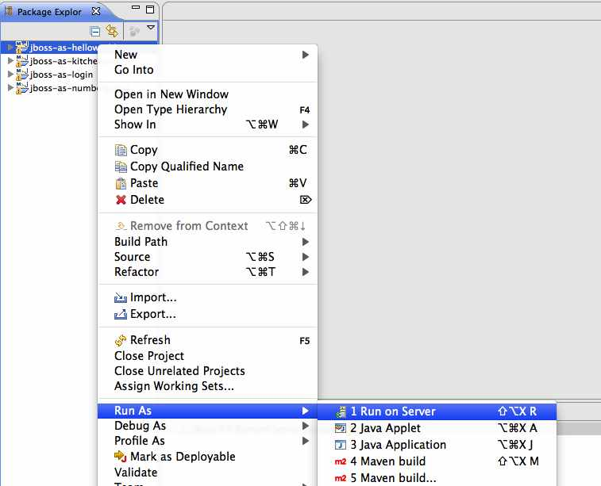
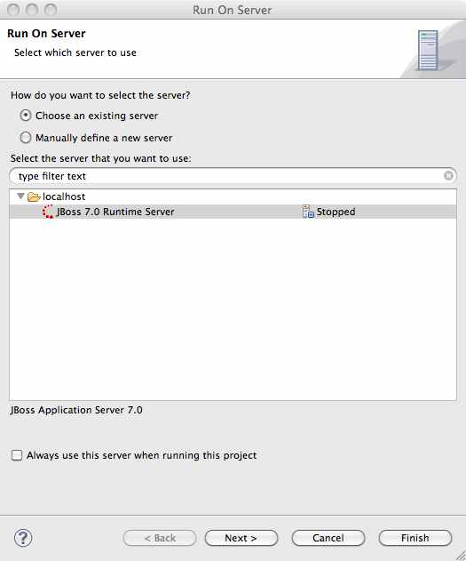
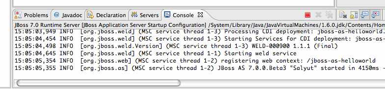

Deploying the Helloworld example using Eclipse - Latest WildFly
Documentation
=============================================================================

[[deploying-the-helloworld-example-using-eclipse]]
Deploying the Helloworld example using Eclipse
----------------------------------------------

You may choose to deploy the example using Eclipse. You'll need to have
JBoss AS started in Eclipse (as described in
https://docs.jboss.org/author/pages/createpage.action?spaceKey=WFLY&title=Starting+JBoss+AS+from+Eclipse+with+JBoss+Tools&linkCreation=true&fromPageId=108626310[Starting
JBoss AS from Eclipse with JBoss Tools]) and to have imported the
quickstarts into Eclipse (as described in
https://docs.jboss.org/author/pages/createpage.action?spaceKey=WFLY&title=Importing+the+quickstarts+into+Eclipse&linkCreation=true&fromPageId=108626310[Importing
the quickstarts into Eclipse]).

With the quickstarts imported, you can deploy the example by right
clicking on the `jboss-as-helloworld` project, and choosing
`Run As -> Run On Server`:

Make sure the JBoss AS server is selected, and hit `Finish`:

You should see JBoss AS start up (unless you already started it in
https://docs.jboss.org/author/pages/createpage.action?spaceKey=WFLY&title=Starting+JBoss+AS+from+Eclipse+with+JBoss+Tools&linkCreation=true&fromPageId=108626310[Starting
JBoss AS from Eclipse with JBoss Tools]) and the application deploy in
the Console log:

