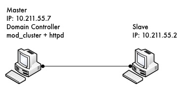
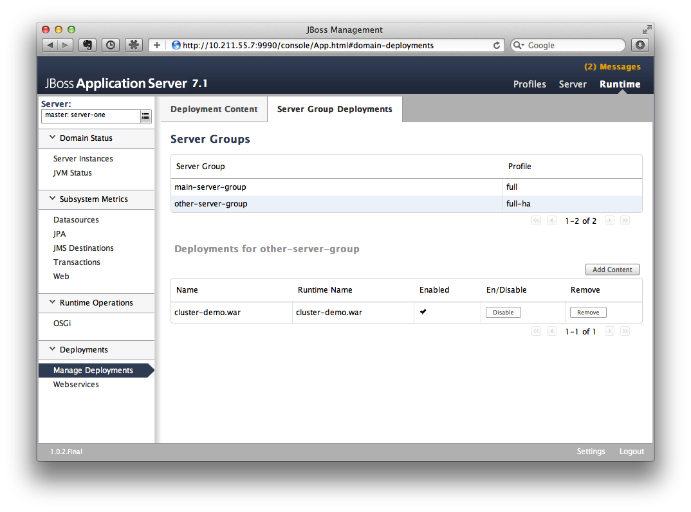

High Availability Guide
=======================

[[introduction-to-high-availability-services]]
= Introduction to High Availability Services

[[what-are-high-availability-services]]
== What are High Availability services?

WildFly's High Availability services are used to guarantee availability
of a deployed Java EE application.

Deploying critical applications on a single node suffers from two
potential problems:

* loss of application availability when the node hosting the application
crashes (single point of failure)
* loss of application availability in the form of extreme delays in
response time during high volumes of requests (overwhelmed server)

WildFly supports two features which ensure high availability of critical
Java EE applications:

* *fail-over:* allows a client interacting with a Java EE application to
have uninterrupted access to that application, even in the presence of
node failures
* *load balancing:* allows a client to have timely responses from the
application, even in the presence of high-volumes of requests

[IMPORTANT]

These two independent high availability services can very effectively
inter-operate when making use of mod_cluster for load balancing!

Taking advantage of WildFly's high availability services is easy, and
simply involves deploying WildFly on a cluster of nodes, making a small
number of application configuration changes, and then deploying the
application in the cluster.

We now take a brief look at what these services can guarantee.

[[high-availability-through-fail-over]]
== High Availability through fail-over

Fail-over allows a client interacting with a Java EE application to have
uninterrupted access to that application, even in the presence of node
failures. For example, consider a Java EE application which makes use of
the following features:

* session-oriented servlets to provide user interaction
* session-oriented EJBs to perform state-dependent business computation
* EJB entity beans to store critical data in a persistent store (e.g.
database)
* SSO login to the application

If the application makes use of WildFly's fail-over services, a client
interacting with an instance of that application will not be interrupted
even when the node on which that instance executes crashes. Behind the
scenes, WildFly makes sure that all of the user data that the
application make use of (HTTP session data, EJB SFSB sessions, EJB
entities and SSO credentials) are available at other nodes in the
cluster, so that when a failure occurs and the client is redirected to
that new node for continuation of processing (i.e. the client "fails
over" to the new node), the user's data is available and processing can
continue.

The Infinispan and JGroups subsystems are instrumental in providing
these data availability guarantees and will be discussed in detail later
in the guide.

[[high-availability-through-load-balancing]]
== High Availability through load balancing

Load balancing enables the application to respond to client requests in
a timely fashion, even when subjected to a high-volume of requests.
Using a load balancer as a front-end, each incoming HTTP request can be
directed to one node in the cluster for processing. In this way, the
cluster acts as a pool of processing nodes and the load is "balanced"
over the pool, achieving scalability and, as a consequence,
availability. Requests involving session-oriented servlets are directed
to the the same application instance in the pool for efficiency of
processing (sticky sessions). Using mod_cluster has the advantage that
changes in cluster topology (scaling the pool up or down, servers
crashing) are communicated back to the load balancer and used to update
in real time the load balancing activity and avoid requests being
directed to application instances which are no longer available.

The mod_cluster subsystem is instrumental in providing support for this
High Availability feature of WildFly and will be discussed in detail
later in this guide.

[[aims-of-the-guide]]
== Aims of the guide

This guide aims to:

* provide a description of the high-availability features available in
WildFly and the services they depend on
* show how the various high availability services can be configured for
particular application use cases
* identify default behavior for features relating to
high-availability/clustering

[[organization-of-the-guide]]
== Organization of the guide

As high availability features and their configuration depend on the
particular component they affect (e.g. HTTP sessions, EJB SFSB sessions,
Hibernate), we organize the discussion around those Java EE features. We
strive to make each section as self-contained as possible. Also, when
discussing a feature, we will introduce any WildFly subsystems upon
which the feature depends.

[[http-services]]
= HTTP Services

This section summarizes the HTTP-based clustering features.

[[subsystem-support]]
== Subsystem Support

This section describes the key clustering subsystems, JGroups and
Infinispan. Say a few words about how they work together.

[[jgroups-subsystem]]
=== JGroups Subsystem

[[purpose]]
=== Purpose

The JGroups subsystem provides group communication support for HA
services in the form of JGroups channels.

Named channel instances permit application peers in a cluster to
communicate as a group and in such a way that the communication
satisfies defined properties (e.g. reliable, ordered,
failure-sensitive). Communication properties are configurable for each
channel and are defined by the protocol stack used to create the
channel. Protocol stacks consist of a base transport layer (used to
transport messages around the cluster) together with a user-defined,
ordered stack of protocol layers, where each protocol layer supports a
given communication property.

The JGroups subsystem provides the following features:

* allows definition of named protocol stacks
* view run-time metrics associated with channels
* specify a default stack for general use

In the following sections, we describe the JGroups subsystem.

[IMPORTANT]

JGroups channels are created transparently as part of the clustering
functionality (e.g. on clustered application deployment, channels will
be created behind the scenes to support clustered features such as
session replication or transmission of SSO contexts around the cluster).

[[configuration-example]]
=== Configuration example

What follows is a sample JGroups subsystem configuration showing all of
the possible elements and attributes which may be configured. We shall
use this example to explain the meaning of the various elements and
attributes.

[IMPORTANT]

The schema for the subsystem, describing all valid elements and
attributes, can be found in the Wildfly distribution, in the docs/schema
directory.

[source,java]
----
<subsystem xmlns="urn:jboss:domain:jgroups:2.0" default-stack="udp">
    <stack name="udp">
        <transport type="UDP" socket-binding="jgroups-udp" diagnostics-socket-binding="jgroups-diagnostics"
            default-executor="jgroups" oob-executor="jgroups-oob" timer-executor="jgroups-timer"
            shared="false" thread-factory="jgroups-thread-factory"
            machine="machine1" rack="rack1" site="site1"/>
        <protocol type="PING">
            <property name="timeout">100</property>
        </protocol>
        <protocol type="MERGE3"/>
        <protocol type="FD_SOCK" socket-binding="jgroups-udp-fd"/>
        <protocol type="FD"/>
        <protocol type="VERIFY_SUSPECT"/>
        <protocol type="pbcast.NAKACK2"/>
        <protocol type="UNICAST2"/>
        <protocol type="pbcast.STABLE"/>
        <protocol type="pbcast.GMS"/>
        <protocol type="UFC"/>
        <protocol type="MFC"/>
        <protocol type="FRAG2"/>
        <protocol type="RSVP"/>
    </stack>
    <stack name="tcp">
        <transport type="TCP" socket-binding="jgroups-tcp"/>
        <protocol type="MPING" socket-binding="jgroups-mping"/>
        <protocol type="MERGE2"/>
        <protocol type="FD_SOCK" socket-binding="jgroups-tcp-fd"/>
        <protocol type="FD"/>
        <protocol type="VERIFY_SUSPECT"/>
        <protocol type="pbcast.NAKACK2"/>
        <protocol type="UNICAST2"/>
        <protocol type="pbcast.STABLE"/>
        <protocol type="pbcast.GMS"/>
        <protocol type="MFC"/>
        <protocol type="FRAG2"/>
        <protocol type="RSVP"/>
    </stack>
    <stack name="udp-xsite">
        <transport type="UDP" socket-binding="jgroups-udp"/>
        <protocol type="PING" socket-binding="jgroups-mping"/>
        <protocol type="MERGE2"/>
        <protocol type="FD_SOCK" socket-binding="jgroups-tcp-fd"/>
        <protocol type="FD"/>
        <protocol type="VERIFY_SUSPECT"/>
        <protocol type="pbcast.NAKACK2"/>
        <protocol type="UNICAST2"/>
        <protocol type="pbcast.STABLE"/>
        <protocol type="pbcast.GMS"/>
        <protocol type="MFC"/>
        <protocol type="FRAG2"/>
        <protocol type="RSVP"/>
        <relay site="LONDON">
            <remote-site name="SFO" stack="tcp" cluster="global"/>
            <remote-site name="NYC" stack="tcp" cluster="global"/>
        </relay>
    </stack>
</subsystem>
----

[[subsystem]]
==== <subsystem>

This element is used to configure the subsystem within a Wildfly system
profile.

* `xmlns` This attribute specifies the XML namespace of the JGroups
subsystem and, in particular, its version.

* `default-stack` This attribute is used to specify a default stack for
the JGroups subsystem. This default stack will be used whenever a stack
is required but no stack is specified.

[[stack]]
==== <stack>

This element is used to configure a JGroups protocol stack.

* `name` This attribute is used to specify the name of the stack.

[[transport]]
==== <transport>

This element is used to configure the transport layer (required) of the
protocol stack.

* `type` This attribute specifies the transport type (e.g. UDP, TCP,
TCPGOSSIP)
* `socket-binding` This attribute references a defined socket binding in
the server profile. It is used when JGroups needs to create general
sockets internally.
* `diagnostics-socket-binding` This attribute references a defined
socket binding in the server profile. It is used when JGroups needs to
create sockets for use with the diagnostics program. For more about the
use of diagnostics, see the JGroups documentation for probe.sh.
* `default-executor` This attribute references a defined thread pool
executor in the threads subsystem. It governs the allocation and
execution of runnable tasks to handle incoming JGroups messages.
* `oob-executor` This attribute references a defined thread pool
executor in the threads subsystem. It governs the allocation and
execution of runnable tasks to handle incoming JGroups OOB
(out-of-bound) messages.
* `timer-executor` This attribute references a defined thread pool
executor in the threads subsystem. It governs the allocation and
execution of runnable timer-related tasks.
* `shared` This attribute indicates whether or not this transport is
shared amongst several JGroups stacks or not.
* `thread-factory` This attribute references a defined thread factory in
the threads subsystem. It governs the allocation of threads for running
tasks which are not handled by the executors above.
* `site` This attribute defines a site (data centre) id for this node.
* `rack` This attribute defines a rack (server rack) id for this node.
* `machine` This attribute defines a machine (host) is for this node.

[IMPORTANT]

site, rack and machine ids are used by the Infinispan topology-aware
consistent hash function, which when using dist mode, prevents dist mode
replicas from being stored on the same host, rack or site

.

[[property]]
===== <property>

This element is used to configure a transport property.

* `name` This attribute specifies the name of the protocol property. The
value is provided as text for the property element.

[[protocol]]
==== <protocol>

This element is used to configure a (non-transport) protocol layer in
the JGroups stack. Protocol layers are ordered within the stack.

* `type` This attribute specifies the name of the JGroups protocol
implementation (e.g. MPING, pbcast.GMS), with the package prefix
org.jgroups.protocols removed.
* `socket-binding` This attribute references a defined socket binding in
the server profile. It is used when JGroups needs to create general
sockets internally for this protocol instance.

[[property-1]]
===== <property>

This element is used to configure a protocol property.

* `name` This attribute specifies the name of the protocol property. The
value is provided as text for the property element.

[[relay]]
==== <relay>

This element is used to configure the RELAY protocol for a JGroups
stack. RELAY is a protocol which provides cross-site replication between
defined sites (data centres). In the RELAY protocol, defined sites
specify the names of remote sites (backup sites) to which their data
should be backed up. Channels are defined between sites to permit the
RELAY protocol to transport the data from the current site to a backup
site.

* `site` This attribute specifies the name of the current site. Site
names can be referenced elsewhere (e.g. in the JGroups remote-site
configuration elements, as well as backup configuration elements in the
Infinispan subsystem)

[[remote-site]]
===== <remote-site>

This element is used to configure a remote site for the RELAY protocol.

* `name` This attribute specifies the name of the remote site to which
this configuration applies.
* `stack` This attribute specifies a JGroups protocol stack to use for
communication between this site and the remote site.
* `cluster` This attribute specifies the name of the JGroups channel to
use for communication between this site and the remote site.

[[use-cases]]
=== Use Cases

In many cases, channels will be configured via XML as in the example
above, so that the channels will be available upon server startup.
However, channels may also be added, removed or have their
configurations changed in a running server by making use of the Wildfly
management API command-line interface (CLI). In this section, we present
some key use cases for the JGroups management API.

The key use cases covered are:

* adding a stack
* adding a protocol to an existing stack
* adding a property to a protocol

[IMPORTANT]

The Wildfly management API command-line interface (CLI) itself can be
used to provide extensive information on the attributes and commands
available in the JGroups subsystem interface used in these examples.

[[add-a-stack]]
==== Add a stack

[source,java]
----
/subsystem=jgroups/stack=mystack:add(transport={}, protocols={})
----

[[add-a-protocol-to-a-stack]]
==== Add a protocol to a stack

[source,java]
----
/subsystem=jgroups/stack=mystack/transport=TRANSPORT:add(type=<type>, socket-binding=<socketbinding>)
----

[source,java]
----
/subsystem=jgroups/stack=mystack:add-protocol(type=<type>, socket-binding=<socketbinding>)
----

[[add-a-property-to-a-protocol]]
==== Add a property to a protocol

[source,java]
----
/subsystem=jgroups/stack=mystack/transport=TRANSPORT/property=<property>:add(value=<value>)
----

[[infinispan-subsystem]]
==== Infinispan Subsystem

[[purpose-1]]
=== Purpose

The Infinispan subsystem provides caching support for HA services in the
form of Infinispan caches: high-performance, transactional caches which
can operate in both non-distributed and distributed scenarios.
Distributed caching support is used in the provision of many key HA
services. For example, the failover of a session-oriented client HTTP
request from a failing node to a new (failover) node depends on session
data for the client being available on the new node. In other words, the
client session data needs to be replicated across nodes in the cluster.
This is effectively achieved via a distributed Infinispan cache. This
approach to providing fail-over also applies to EJB SFSB sessions. Over
and above providing support for fail-over, an underlying cache is also
required when providing second-level caching for entity beans using
Hibernate, and this case is also handled through the use of an
Infinispan cache.

The Infinispan subsystem provides the following features:

* allows definition and configuration of named cache containers and
caches
* view run-time metrics associated with cache container and cache
instances

In the following sections, we describe the Infinispan subsystem.

[IMPORTANT]

Infiispan cache containers and caches are created transparently as part
of the clustering functionality (e.g. on clustered application
deployment, cache containers and their associated caches will be created
behind the scenes to support clustered features such as session
replication or caching of entities around the cluster).

[[configuration-example-1]]
=== Configuration Example

In this section, we provide an example XML configuration of the
infinispan subsystem and review the configuration elements and
attributes.

[IMPORTANT]

The schema for the subsystem, describing all valid elements and
attributes, can be found in the Wildfly distribution, in the docs/schema
directory.

[source,java]
----
<subsystem xmlns="urn:jboss:domain:infinispan:2.0">
  <cache-container name="server" aliases="singleton cluster" default-cache="default" module="org.wildfly.clustering.server">
      <transport lock-timeout="60000"/>
      <replicated-cache name="default" mode="SYNC" batching="true">
          <locking isolation="REPEATABLE_READ"/>
      </replicated-cache>
  </cache-container>
  <cache-container name="web" aliases="standard-session-cache" default-cache="repl" module="org.wildfly.clustering.web.infinispan">
      <transport lock-timeout="60000"/>
      <replicated-cache name="repl" mode="ASYNC" batching="true">
          <file-store/>
      </replicated-cache>
      <replicated-cache name="sso" mode="SYNC" batching="true"/>
      <distributed-cache name="dist" mode="ASYNC" batching="true" l1-lifespan="0">
          <file-store/>
      </distributed-cache>
  </cache-container>
  <cache-container name="ejb" aliases="sfsb sfsb-cache" default-cache="repl" module="org.jboss.as.clustering.ejb3.infinispan">
      <transport lock-timeout="60000"/>
      <replicated-cache name="repl" mode="ASYNC" batching="true">
          <eviction strategy="LRU" max-entries="10000"/>
          <file-store/>
      </replicated-cache>
      <!--
        ~  Clustered cache used internally by EJB subsytem for managing the client-mapping(s) of
        ~                 the socketbinding referenced by the EJB remoting connector
        -->
      <replicated-cache name="remote-connector-client-mappings" mode="SYNC" batching="true"/>
      <distributed-cache name="dist" mode="ASYNC" batching="true" l1-lifespan="0">
          <eviction strategy="LRU" max-entries="10000"/>
          <file-store/>
      </distributed-cache>
  </cache-container>
  <cache-container name="hibernate" default-cache="local-query" module="org.hibernate">
      <transport lock-timeout="60000"/>
      <local-cache name="local-query">
          <transaction mode="NONE"/>
          <eviction strategy="LRU" max-entries="10000"/>
          <expiration max-idle="100000"/>
      </local-cache>
      <invalidation-cache name="entity" mode="SYNC">
          <transaction mode="NON_XA"/>
          <eviction strategy="LRU" max-entries="10000"/>
          <expiration max-idle="100000"/>
      </invalidation-cache>
      <replicated-cache name="timestamps" mode="ASYNC">
          <transaction mode="NONE"/>
          <eviction strategy="NONE"/>
       </replicated-cache>
  </cache-container>
</subsystem>
----

[[cache-container]]
==== <cache-container>

This element is used to configure a cache container.

* `name` This attribute is used to specify the name of the cache
container.
* `default-cache` This attribute configures the default cache to be
used, when no cache is otherwise specified.
* `listener-executor` This attribute references a defined thread pool
executor in the threads subsystem. It governs the allocation and
execution of runnable tasks in the replication queue.
* `eviction-executor` This attribute references a defined thread pool
executor in the threads subsystem. It governs the allocation and
execution of runnable tasks to handle evictions.
* `replication-queue-executor` This attribute references a defined
thread pool executor in the threads subsystem. It governs the allocation
and execution of runnable tasks to handle asynchronous cache operations.
* `jndi-name` This attribute is used to assign a name for the cache
container in the JNDI name service.
* `module` This attribute configures the module whose class loader
should be used when building this cache container's configuration.
* `start` This attribute configured the cache container start mode and
has since been deprecated, the only supported and the default value is
LAZY (on-demand start).
* `aliases` This attribute is used to define aliases for the cache
container name.

This element has the following child elements: *<transport>*,
*<local-cache>*, *<invalidation-cache>*, *<replicated-cache>*, and
*<distributed-cache>*.

[[transport-1]]
===== <transport>

This element is used to configure the JGroups transport used by the
cache container, when required.

* `stack` This attribute configures the JGroups stack to be used for the
transport. If none is specified, the default-stack for the JGroups
subsystem is used.
* `cluster` This attribute configures the name of the group
communication cluster. This is the name which will be seen in debugging
logs.
* `executor` This attribute references a defined thread pool executor in
the threads subsystem. It governs the allocation and execution of
runnable tasks to handle ? <fill me in >?.
* `lock-timeout` This attribute configures the time-out to be used when
obtaining locks for the transport.
* `site` This attribute configures the site id of the cache container.
* `rack` This attribute configures the rack id of the cache container.
* `machine` This attribute configures the machine id of the cache
container.
+
[IMPORTANT]

The presence of the transport element is required when operating in
clustered mode

The remaining child elements of *<cache-container>*, namely
*<local-cache>*, *<invalidation-cache>*, *<replicated-cache>* and
*<distributed-cache>*, each configures one of four key cache types or
classifications.

[IMPORTANT]

These cache-related elements are actually part of an xsd hierarchy with
abstract complexTypes *cache*, *clustered-cache*, and *shared-cache*. In
order to simplify the presentation, we notate these as pseudo-elements
*<abstract cache>*, *<abstract clustered-cache>* and *<abstract
shared-cache>*. In what follows, we first describe the extension
hierarchy of base elements, and then show how the cache type elements
relate to them.

[[abstract-cache]]
===== <abstract cache>

This abstract base element defines the attributes and child elements
common to all non-clustered caches.

* `name` This attribute configures the name of the cache. This name may
be referenced by other subsystems.
* `start` This attribute configured the cache container start mode and
has since been deprecated, the only supported and the default value is
LAZY (on-demand start).
* `batching` This attribute configures batching. If enabled, the
invocation batching API will be made available for this cache.
* `indexing` This attribute configures indexing. If enabled, entries
will be indexed when they are added to the cache. Indexes will be
updated as entries change or are removed.
* `jndi-name` This attribute is used to assign a name for the cache in
the JNDI name service.
* `module` This attribute configures the module whose class loader
should be used when building this cache container's configuration.

The <abstract cache> abstract base element has the following child
elements: *<indexing-properties>, <locking>*, *<transaction>*,
*<eviction>*, *<expiration>*, *<store>*, *<file-store>*,
*<string-keyed-jdbc-store>*, *<binary-keyed-jdbc-store>*,
*<mixed-keyed-jdbc-store>*, *<remote-store>*.

[[indexing-properties]]
====== <indexing-properties>

This child element defines properties to control indexing behaviour.

[[locking]]
====== <locking>

This child element configures the locking behaviour of the cache.

* `isolation` This attribute the cache locking isolation level.
Allowable values are NONE, SERIALIZABLE, REPEATABLE_READ,
READ_COMMITTED, READ_UNCOMMITTED.
* `striping` If true, a pool of shared locks is maintained for all
entries that need to be locked. Otherwise, a lock is created per entry
in the cache. Lock striping helps control memory footprint but may
reduce concurrency in the system.
* `acquire-timeout` This attribute configures the maximum time to
attempt a particular lock acquisition.
* `concurrency-level` This attribute is used to configure the
concurrency level. Adjust this value according to the number of
concurrent threads interacting with Infinispan.

[[transaction]]
====== <transaction>

This child element configures the transactional behaviour of the cache.

* `mode` This attribute configures the transaction mode, setting the
cache transaction mode to one of NONE, NON_XA, NON_DURABLE_XA, FULL_XA.
* `stop-timeout` If there are any ongoing transactions when a cache is
stopped, Infinispan waits for ongoing remote and local transactions to
finish. The amount of time to wait for is defined by the cache stop
timeout.
* `locking` This attribute configures the locking mode for this cache,
one of OPTIMISTIC or PESSIMISTIC.

[[eviction]]
====== <eviction>

This child element configures the eviction behaviour of the cache.

* `strategy` This attribute configures the cache eviction strategy.
Available options are 'UNORDERED', 'FIFO', 'LRU', 'LIRS' and 'NONE' (to
disable eviction).
* `max-entries` This attribute configures the maximum number of entries
in a cache instance. If selected value is not a power of two the actual
value will default to the least power of two larger than selected value.
-1 means no limit.

[[expiration]]
====== <expiration>

This child element configures the expiration behaviour of the cache.

* `max-idle` This attribute configures the maximum idle time a cache
entry will be maintained in the cache, in milliseconds. If the idle time
is exceeded, the entry will be expired cluster-wide. -1 means the
entries never expire.
* `lifespan` This attribute configures the maximum lifespan of a cache
entry, after which the entry is expired cluster-wide, in milliseconds.
-1 means the entries never expire.
* `interval` This attribute specifies the interval (in ms) between
subsequent runs to purge expired entries from memory and any cache
stores. If you wish to disable the periodic eviction process altogether,
set wakeupInterval to -1.

The remaining child elements of the abstract base element *<cache>*,
namely *<store>*, *<file-store>*, *<remote-store>*,
*<string-keyed-jdbc-store>*, *<binary-keyed-jdbc-store>* and
*<mixed-keyed-jdbc-store>*, each configures one of six key cache store
types.

[IMPORTANT]

These cache store-related elements are actually part of an xsd extension
hierarchy with abstract complexTypes *base-store* and *base-jdbc-store*.
As before, in order to simplify the presentation, we notate these as
pseudo-elements *<abstract base-store>* and *<abstract
base-jdbc-store>*. In what follows, we first describe the extension
hierarchy of base elements, and then show how the cache store elements
relate to them.

[[abstract-base-store]]
====== <abstract base-store>

This abstract base element defines the attributes and child elements
common to all cache stores.

* `shared` This attribute should be set to true when multiple cache
instances share the same cache store (e.g. multiple nodes in a cluster
using a JDBC-based CacheStore pointing to the same, shared database)
Setting this to true avoids multiple cache instances writing the same
modification multiple times. If enabled, only the node where the
modification originated will write to the cache store. If disabled, each
individual cache reacts to a potential remote update by storing the data
to the cache store.
* `preload` This attribute configures whether or not, when the cache
starts, data stored in the cache loader will be pre-loaded into memory.
This is particularly useful when data in the cache loader is needed
immediately after start-up and you want to avoid cache operations being
delayed as a result of loading this data lazily. Can be used to provide
a 'warm-cache' on start-up, however there is a performance penalty as
start-up time is affected by this process. Note that pre-loading is done
in a local fashion, so any data loaded is only stored locally in the
node. No replication or distribution of the preloaded data happens.
Also, Infinispan only pre-loads up to the maximum configured number of
entries in eviction.
* `passivation` If true, data is only written to the cache store when it
is evicted from memory, a phenomenon known as _passivation_. Next time
the data is requested, it will be 'activated' which means that data will
be brought back to memory and removed from the persistent store. If
false, the cache store contains a copy of the cache contents in memory,
so writes to cache result in cache store writes. This essentially gives
you a 'write-through' configuration.
* `fetch-state` This attribute, if true, causes persistent state to be
fetched when joining a cluster. If multiple cache stores are chained,
only one of them can have this property enabled.
* `purge` This attribute configures whether the cache store is purged
upon start-up.
* `singleton` This attribute configures whether or not the singleton
store cache store is enabled. SingletonStore is a delegating cache store
used for situations when only one instance in a cluster should interact
with the underlying store.
* `class` This attribute configures a custom store implementation class
to use for this cache store.
* `properties` This attribute is used to configure a list of cache store
properties.

The abstract base element has one child element: *<write-behind>*

[[write-behind]]
====== <write-behind>

This element is used to configure a cache store as write-behind instead
of write-through. In write-through mode, writes to the cache are also
_synchronously_ written to the cache store, whereas in write-behind
mode, writes to the cache are followed by _asynchronous_ writes to the
cache store.

* `flush-lock-timeout` This attribute configures the time-out for
acquiring the lock which guards the state to be flushed to the cache
store periodically.
* `modification-queue-size` This attribute configures the maximum number
of entries in the asynchronous queue. When the queue is full, the store
becomes write-through until it can accept new entries.
* `shutdown-timeout` This attribute configures the time-out (in ms) to
stop the cache store.
* `thread-pool` This attribute is used to configure the size of the
thread pool whose threads are responsible for applying the modifications
to the cache store.

[[abstract-base-jdbc-store-extends-abstract-base-store]]
====== <abstract base-jdbc-store> extends <abstract base-store>

This abstract base element defines the attributes and child elements
common to all JDBC-based cache stores.

* `datasource` This attribute configures the datasource for the
JDBC-based cache store.
* `entry-table` This attribute configures the database table used to
store cache entries.
* `bucket-table` This attribute configures the database table used to
store binary cache entries.

[[file-store-extends-abstract-base-store]]
====== <file-store> extends <abstract base-store>

This child element is used to configure a file-based cache store. This
requires specifying the name of the file to be used as backing storage
for the cache store.

* `relative-to` This attribute optionally configures a relative path
prefix for the file store path. Can be null.
* `path` This attribute configures an absolute path to a file if
*relative-to* is null; configures a relative path to the file, in
relation to the value for *relative-to*, otherwise.

[[remote-store-extends-abstract-base-store]]
====== <remote-store> extends <abstract base-store>

This child element of cache is used to configure a remote cache store.
It has a child <remote-servers>.

* `cache` This attribute configures the name of the remote cache to use
for this remote store.
* `tcp-nodelay` This attribute configures a TCP_NODELAY value for
communication with the remote cache.
* `socket-timeout` This attribute configures a socket time-out for
communication with the remote cache.

[[remote-servers]]
====== <remote-servers>

This child element of cache configures a list of remote servers for this
cache store.

[[remote-server]]
====== <remote-server>

This element configures a remote server. A remote server is defined
completely by a locally defined outbound socket binding, through which
communication is made with the server.

* `outbound-socket-binding` This attribute configures an outbound socket
binding for a remote server.

[[local-cache-extends-abstract-cache]]
===== <local-cache> extends <abstract cache>

This element configures a local cache.

[[abstract-clustered-cache-extends-abstract-cache]]
===== <abstract clustered-cache> extends <abstract cache>

This abstract base element defines the attributes and child elements
common to all clustered caches. A clustered cache is a cache which spans
multiple nodes in a cluster. It inherits from <cache>, so that all
attributes and elements of <cache> are also defined for
<clustered-cache>.

* `async-marshalling` This attribute configures async marshalling. If
enabled, this will cause marshalling of entries to be performed
asynchronously.
* `mode` This attribute configures the clustered cache mode, ASYNC for
asynchronous operation, or SYNC for synchronous operation.
* `queue-size` In ASYNC mode, this attribute can be used to trigger
flushing of the queue when it reaches a specific threshold.
* `queue-flush-interval` In ASYNC mode, this attribute controls how
often the asynchronous thread used to flush the replication queue runs.
This should be a positive integer which represents thread wakeup time in
milliseconds.
* `remote-timeout` In SYNC mode, this attribute (in ms) used to wait for
an acknowledgement when making a remote call, after which the call is
aborted and an exception is thrown.

[[invalidation-cache-extends-abstract-clustered-cache]]
===== <invalidation-cache> extends <abstract clustered-cache>

This element configures an invalidation cache.

[[abstract-shared-cache-extends-abstract-clustered-cache]]
===== <abstract shared-cache> extends <abstract clustered-cache>

This abstract base element defines the attributes and child elements
common to all shared caches. A shared cache is a clustered cache which
shares state with its cache peers in the cluster. It inherits from
<clustered-cache>, so that all attributes and elements of
<clustered-cache> are also defined for <shared-cache>.

[[state-transfer]]
====== <state-transfer>

* `enabled` If enabled, this will cause the cache to ask neighbouring
caches for state when it starts up, so the cache starts 'warm', although
it will impact start-up time.
* `timeout` This attribute configures the maximum amount of time (ms) to
wait for state from neighbouring caches, before throwing an exception
and aborting start-up.
* `chunk-size` This attribute configures the size, in bytes, in which to
batch the transfer of cache entries.

[[backups]]
====== <backups>

[[backup]]
====== <backup>

* `strategy` This attribute configures the backup strategy for this
cache. Allowable values are SYNC, ASYNC.
* `failure-policy` This attribute configures the policy to follow when
connectivity to the backup site fails. Allowable values are IGNORE,
WARN, FAIL, CUSTOM.
* `enabled` This attribute configures whether or not this backup is
enabled. If enabled, data will be sent to the backup site; otherwise,
the backup site will be effectively ignored.
* `timeout` This attribute configures the time-out for replicating to
the backup site.
* `after-failures` This attribute configures the number of failures
after which this backup site should go off-line.
* `min-wait` This attribute configures the minimum time (in
milliseconds) to wait after the max number of failures is reached, after
which this backup site should go off-line.

[[backup-for]]
====== <backup-for>

* `remote-cache` This attribute configures the name of the remote cache
for which this cache acts as a backup.
* `remote-site` This attribute configures the site of the remote cache
for which this cache acts as a backup.

[[replicated-cache-extends-abstract-shared-cache]]
===== <replicated-cache> extends <abstract shared-cache>

This element configures a replicated cache. With a replicated cache, all
contents (key-value pairs) of the cache are replicated on all nodes in
the cluster.

[[distributed-cache-extends-abstract-shared-cache]]
===== <distributed-cache> extends <abstract shared-cache>

This element configures a distributed cache. With a distributed cache,
contents of the cache are selectively replicated on nodes in the
cluster, according to the number of owners specified.

* `owners` This attribute configures the number of cluster-wide replicas
for each cache entry.
* `segments` This attribute configures the number of hash space segments
which is the granularity for key distribution in the cluster. Value must
be strictly positive.
* `l1-lifespan` This attribute configures the maximum lifespan of an
entry placed in the L1 cache. Configures the L1 cache behaviour in
'distributed' caches instances. In any other cache modes, this element
is ignored.

[[use-cases-1]]
=== Use Cases

In many cases, cache containers and caches will be configured via XML as
in the example above, so that they will be available upon server
start-up. However, cache containers and caches may also be added,
removed or have their configurations changed in a running server by
making use of the Wildfly management API command-line interface (CLI).
In this section, we present some key use cases for the Infinispan
management API.

The key use cases covered are:

* adding a cache container
* adding a cache to an existing cache container
* configuring the transaction subsystem of a cache
+
[IMPORTANT]

The Wildfly management API command-line interface (CLI) can be used to
provide extensive information on the attributes and commands available
in the Infinispan subsystem interface used in these examples.

[[add-a-cache-container]]
==== Add a cache container

[source,java]
----
/subsystem=infinispan/cache-container=mycontainer:add(default-cache=<default-cache-name>)
/subsystem=infinispan/cache-container=mycontainer/transport=TRANSPORT:add(lock-timeout=<timeout>)
----

[[add-a-cache]]
==== Add a cache

[source,java]
----
/subsystem=infinispan/cache-container=mycontainer/local-cache=mylocalcache:add()
----

[[configure-the-transaction-component-of-a-cache]]
==== Configure the transaction component of a cache

[source,java]
----
/subsystem=infinispan/cache-container=mycontainer/local-cache=mylocalcache/transaction=TRANSACTION:add(mode=<transaction-mode>)
----

[[clustered-web-sessions]]
== Clustered Web Sessions

[[clustered-sso]]
== Clustered SSO

[[load-balancing]]
== Load Balancing

The included page could not be found.

[[ejb-services]]
= EJB Services

This chapter explains how clustering of EJBs works in WildFly 8.

[[ejb-subsystem]]
== EJB Subsystem

[[ejb-timer]]
= EJB Timer

Wildfly now supports clustered database backed timers. For details have
a look to the
https://docs.jboss.org/author/display/WFLY/EJB3+Clustered+Database+Timers[EJB3
reference section]

[[marking-an-ejb-as-clustered]]
== Marking an EJB as clustered

WildFly 8 allows clustering of stateful session beans. A stateful
session bean can be marked with `@org.jboss.ejb3.annotation.Clustered`
annotation or be marked as clustered using the jboss-ejb3.xml's
`<clustered>` element.

MyStatefulBean

[source,java]
----
import org.jboss.ejb3.annotation.Clustered;
import javax.ejb.Stateful;
 
@Stateful
@Clustered
public class MyStatefulBean {
...
}
----

jboss-ejb3.xml

[source,java]
----
<jboss xmlns="http://www.jboss.com/xml/ns/javaee"
       xmlns:jee="http://java.sun.com/xml/ns/javaee"
       xmlns:c="urn:clustering:1.0">
 
 
    <jee:assembly-descriptor>
        <c:clustering>
            <jee:ejb-name>DDBasedClusteredBean</jee:ejb-name>
            <c:clustered>true</c:clustered>
        </c:clustering>
    </jee:assembly-descriptor>
</jboss>
----

[[deploying-clustered-ejbs]]
== Deploying clustered EJBs

Clustering support is available in the HA profiles of WildFly 8. In this
chapter we'll be using the standalone server for explaining the details.
However, the same applies to servers in a domain mode. Starting the
standalone server with HA capabilities enabled, involves starting it
with the standalone-ha.xml (or even standalone-full-ha.xml):

[source,java]
----
./standalone.sh -server-config=standalone-ha.xml
----

This will start a single instance of the server with HA capabilities.
Deploying the EJBs to this instance _doesn't_ involve anything special
and is the same as explained in the link:#src-557291[application
deployment chapter].

Obviously, to be able to see the benefits of clustering, you'll need
more than one instance of the server. So let's start another server with
HA capabilities. That another instance of the server can either be on
the same machine or on some other machine. If it's on the same machine,
the two things you have to make sure is that you pass the port offset
for the second instance and also make sure that each of the server
instances have a unique `jboss.node.name` system property. You can do
that by passing the following two system properties to the startup
command:

[source,java]
----
./standalone.sh -server-config=standalone-ha.xml -Djboss.socket.binding.port-offset=<offset of your choice> -Djboss.node.name=<unique node name>
----

Follow whichever approach you feel comfortable with for deploying the
EJB deployment to this instance too.

[IMPORTANT]

Deploying the application on just one node of a standalone instance of a
clustered server does *not* mean that it will be automatically deployed
to the other clustered instance. You will have to do deploy it
explicitly on the other standalone clustered instance too. Or you can
start the servers in domain mode so that the deployment can be deployed
to all the server within a server group. See the
https://docs.jboss.org/author/display/AS71/Admin+Guide[admin guide] for
more details on domain setup.

Now that you have deployed an application with clustered EJBs on both
the instances, the EJBs are now capable of making use of the clustering
features.

[[failover-for-clustered-ejbs]]
== Failover for clustered EJBs

Clustered EJBs have failover capability. The state of the @Stateful
@Clustered EJBs is replicated across the cluster nodes so that if one of
the nodes in the cluster goes down, some other node will be able to take
over the invocations. Let's see how it's implemented in WildFly 8. In
the next few sections we'll see how it works for remote (standalone)
clients and for clients in another remote WildFly server instance.
Although, there isn't a difference in how it works in both these cases,
we'll still explain it separately so as to make sure there aren't any
unanswered questions.

[[remote-standalone-clients]]
=== Remote standalone clients

In this section we'll consider a remote standalone client (i.e. a client
which runs in a separate JVM and _isn't_ running within another WildFly
8 instance). Let's consider that we have 2 servers, server X and server
Y which we started earlier. Each of these servers has the clustered EJB
deployment. A standalone remote client can use either the
link:#src-557291[JNDI approach] or native JBoss EJB client APIs to
communicate with the servers. The important thing to note is that when
you are invoking clustered EJB deployments, you do *not* have to list
all the servers within the cluster (which obviously wouldn't have been
feasible due the dynamic nature of cluster node additions within a
cluster).

The remote client just has to list only one of the servers with the
clustering capability. In this case, we can either list server X (in
jboss-ejb-client.properties) _or_ server Y. This server will act as the
starting point for cluster topology communication between the client and
the clustered nodes.

Note that you have to configure the _ejb_ cluster in the
jboss-ejb-client.properties configuration file, like so:

[source,java]
----
remote.clusters=ejb
remote.cluster.ejb.connect.options.org.xnio.Options.SASL_POLICY_NOANONYMOUS=false
remote.cluster.ejb.connect.options.org.xnio.Options.SSL_ENABLED=false
----

[[cluster-topology-communication]]
=== Cluster topology communication

When a client connects to a server, the JBoss EJB client implementation
(internally) communicates with the server for cluster topology
information, if the server had clustering capability. In our example
above, let's assume we listed server X as the initial server to connect
to. When the client connects to server X, the server will send back an
(asynchronous) cluster topology message to the client. This topology
message consists of the cluster name(s) and the information of the nodes
that belong to the cluster. The node information includes the node
address and port number to connect to (whenever necessary). So in this
example, the server X will send back the cluster topology consisting of
the other server Y which belongs to the cluster.

In case of stateful (clustered) EJBs, a typical invocation flow involves
creating of a session for the stateful bean, which happens when you do a
JNDI lookup for that bean, and then invoking on the returned proxy. The
lookup for stateful bean, internally, triggers a (synchronous) session
creation request from the client to the server. In this case, the
session creation request goes to server X since that's the initial
connection that we have configured in our jboss-ejb-client.properties.
Since server X is clustered, it will return back a session id and along
with send back an _"affinity"_ of that session. In case of clustered
servers, the affinity equals to the name of the cluster to which the
stateful bean belongs on the server side. For non-clustered beans, the
affinity is just the node name on which the session was created. This
_affinity_ will later help the EJB client to route the invocations on
the proxy, appropriately to either a node within a cluster (for
clustered beans) or to a specific node (for non-clustered beans). While
this session creation request is going on, the server X will also send
back an asynchronous message which contains the cluster topology. The
JBoss EJB client implementation will take note of this topology
information and will later use it for connection creation to nodes
within the cluster and routing invocations to those nodes, whenever
necessary.

Now that we know how the cluster topology information is communicated
from the server to the client, let see how failover works. Let's
continue with the example of server X being our starting point and a
client application looking up a stateful bean and invoking on it. During
these invocations, the client side will have collected the cluster
topology information from the server. Now let's assume for some reason,
server X goes down and the client application subsequent invokes on the
proxy. The JBoss EJB client implementation, at this stage will be aware
of the affinity and in this case it's a cluster affinity. Because of the
cluster topology information it has, it knows that the cluster has two
nodes server X and server Y. When the invocation now arrives, it sees
that the server X is down. So it uses a selector to fetch a suitable
node from among the cluster nodes. The selector itself is configurable,
but we'll leave it from discussion for now. When the selector returns a
node from among the cluster, the JBoss EJB client implementation creates
a connection to that node (if not already created earlier) and creates a
EJB receiver out of it. Since in our example, the only other node in the
cluster is server Y, the selector will return that node and the JBoss
EJB client implementation will use it to create a EJB receiver out of it
and use that receiver to pass on the invocation on the proxy.
Effectively, the invocation has now failed over to a different node
within the cluster.

[[remote-clients-on-another-instance-of-wildfly-8]]
=== Remote clients on another instance of WildFly 8

So far we discussed remote standalone clients which typically use either
the EJB client API or the jboss-ejb-client.properties based approach to
configure and communicate with the servers where the clustered beans are
deployed. Now let's consider the case where the client is an application
deployed another AS7 instance and it wants to invoke on a clustered
stateful bean which is deployed on another instance of WildFly 8. In
this example let's consider a case where we have 3 servers involved.
Server X and Server Y both belong to a cluster and have clustered EJB
deployed on them. Let's consider another server instance Server C (which
may or may _not_ have clustering capability) which acts as a client on
which there's a deployment which wants to invoke on the clustered beans
deployed on server X and Y and achieve failover.

The configurations required to achieve this are explained in
link:#src-557291[this chapter]. As you can see the configurations are
done in a jboss-ejb-client.xml which points to a remote outbound
connection to the other server. This jboss-ejb-client.xml goes in the
deployment of server C (since that's our client). As explained eariler,
the client configuration need *not* point to all clustered nodes.
Instead it just has to point to one of them which will act as a start
point for communication. So in this case, we can create a remote
outbound connection on server C to server X and use server X as our
starting point for communication. Just like in the case of remote
standalone clients, when the application on server C (client) looks up a
stateful bean, a session creation request will be sent to server X which
will send back a session id and the cluster affinity for it.
Furthermore, server X asynchronously send back a message to server C
(client) containing the cluster topology. This topology information will
include the node information of server Y (since that belongs to the
cluster along with server X). Subsequent invocations on the proxy will
be routed appropriately to the nodes in the cluster. If server X goes
down, as explained earlier, a different node from the cluster will be
selected and the invocation will be forwarded to that node.

As can be seen both remote standalone client and remote clients on
another WildFly 8 instance act similar in terms of failover.

[[testcases-for-failover-of-stateful-beans]]
=== Testcases for failover of stateful beans

We have testcases in WildFly 8 testsuite which test that whatever is
explained above works as expected. The
https://github.com/wildfly/wildfly/blob/master/testsuite/integration/clust/src/test/java/org/jboss/as/test/clustering/cluster/ejb3/stateful/remote/failover/RemoteEJBClientStatefulBeanFailoverTestCase.java[RemoteEJBClientStatefulBeanFailoverTestCase]
tests the case where a stateful EJB uses @Clustered annotation to mark
itself as clustered. We also have
https://github.com/wildfly/wildfly/blob/master/testsuite/integration/clust/src/test/java/org/jboss/as/test/clustering/cluster/ejb3/stateful/remote/failover/dd/RemoteEJBClientDDBasedSFSBFailoverTestCase.java[RemoteEJBClientDDBasedSFSBFailoverTestCase]
which uses jboss-ejb3.xml to mark a stateful EJB as clustered. Both
these testcases test that when a node goes down in a cluster, the client
invocation is routed to a different node in the cluster.

[[hibernate]]
= Hibernate

[[ha-singleton-features]]
= HA Singleton Features

In general, an HA or clustered singleton is a service that exists on
multiple nodes in a cluster, but is active on just a single node at any
given time. If the node providing the service fails or is shut down, a
new singleton provider is chosen and started. Thus, other than a brief
interval when one provider has stopped and another has yet to start, the
service is always running on one node.

[[singleton-subsystem]]
== Singleton subsystem

WildFly 10 introduces a "singleton" subsystem, which defines a set of
policies that define how an HA singleton should behave. A singleton
policy can be used to instrument singleton deployments or to create
singleton MSC services.

[[configuration]]
=== Configuration

The
https://github.com/wildfly/wildfly/blob/10.0.0.Final/clustering/singleton/extension/src/main/resources/schema/wildfly-singleton_1_0.xsd[default
subsystem configuration] from WildFly's ha and full-ha profile looks
like:

[source,java]
----
<subsystem xmlns="urn:jboss:domain:singleton:1.0">
    <singleton-policies default="default">
        <singleton-policy name="default" cache-container="server">
            <simple-election-policy/>
        </singleton-policy>
    </singleton-policies>
</subsystem>
----

A singleton policy defines:

1.  A unique name
2.  A cache container and cache with which to register singleton
provider candidates
3.  An election policy
4.  A quorum (optional)

One can add a new singleton policy via the following management
operation:

[source,java]
----
/subsystem=singleton/singleton-policy=foo:add(cache-container=server)
----

[[cache-configuration]]
==== Cache configuration

The cache-container and cache attributes of a singleton policy must
reference a valid cache from the Infinispan subsystem. If no specific
cache is defined, the default cache of the cache container is assumed.
This cache is used as a registry of which nodes can provide a given
service and will typically use a replicated-cache configuration.

[[election-policies]]
==== Election policies

WildFly 10 includes 2 singleton election policy implementations:

* *simple* +
Elects the provider (a.k.a. master) of a singleton service based on a
specified position in a circular linked list of eligible nodes sorted by
descending age. Position=0, the default value, refers to the oldest
node, 1 is second oldest, etc. ; while position=-1 refers to the
youngest node, -2 to the second youngest, etc. +
e.g.
+
[source,java]
----
/subsystem=singleton/singleton-policy=foo/election-policy=simple:add(position=-1)
----

* *random* +
Elects a random member to be the provider of a singleton service +
e.g.
+
[source,java]
----
/subsystem=singleton/singleton-policy=foo/election-policy=random:add()
----

[[preferences]]
===== Preferences

Additionally, any singleton election policy may indicate a preference
for one or more members of a cluster. Preferences may be defined either
via node name or via outbound socket binding name. Node preferences
always take precedent over the results of an election policy. +
e.g.

[source,java]
----
/subsystem=singleton/singleton-policy=foo/election-policy=simple:list-add(name=name-preferences, value=nodeA)
/subsystem=singleton/singleton-policy=bar/election-policy=random:list-add(name=socket-binding-preferences, value=nodeA)
----

[[quorum]]
==== Quorum

Network partitions are particularly problematic for singleton services,
since they can trigger multiple singleton providers for the same service
to run at the same time. To defend against this scenario, a singleton
policy may define a quorum that requires a minimum number of nodes to be
present before a singleton provider election can take place. A typical
deployment scenario uses a quorum of N/2 + 1, where N is the anticipated
cluster size. This value can be updated at runtime, and will immediately
affect any active singleton services. +
e.g.

[source,java]
----
/subsystem=singleton/singleton-policy=foo:write-attribute(name=quorum, value=3)
----

[[non-ha-environments]]
=== Non-HA environments

The singleton subsystem can be used in a non-HA profile, so long as the
cache that it references uses a local-cache configuration. In this
manner, an application leveraging singleton functionality (via the
singleton API or using a singleton deployment descriptor) will continue
function as if the server was a sole member of a cluster. For obvious
reasons, the use of a quorum does not make sense in such a
configuration.

[[singleton-deployments]]
== Singleton deployments

WildFly 10 resurrects the ability to start a given deployment on a
single node in the cluster at any given time. If that node shuts down,
or fails, the application will automatically start on another node on
which the given deployment exists. Long time users of JBoss AS will
recognize this functionality as being akin to the
https://docs.jboss.org/jbossclustering/cluster_guide/5.1/html/deployment.chapt.html#d0e1220[HASingletonDeployer],
a.k.a. "
https://docs.jboss.org/jbossclustering/cluster_guide/5.1/html/deployment.chapt.html#d0e1220[deploy-hasingleton]",
feature of AS6 and earlier.

[[usage]]
=== Usage

A deployment indicates that it should be deployed as a singleton via a
deployment descriptor. This can either be a standalone
"/META-INF/singleton-deployment.xml" file or embedded within an existing
jboss-all.xml descriptor. This descriptor may be applied to any
deployment type, e.g. JAR, WAR, EAR, etc., with the exception of a
subdeployment within an EAR. +
e.g.

[source,java]
----
<singleton-deployment xmlns="urn:jboss:singleton-deployment:1.0" policy="foo"/>
----

The singleton deployment descriptor defines which
link:#src-557291[singleton policy] should be used to deploy the
application. If undefined, the default singleton policy is used, as
defined by the singleton subsystem.

Using a standalone descriptor is often preferable, since it may be
overlaid onto an existing deployment archive. +
e.g.

[source,java]
----
deployment-overlay add --name=singleton-policy-foo --content=/META-INF/singleton-deployment.xml=/path/to/singleton-deployment.xml --deployments=my-app.jar --redeploy-affected
----

[[singleton-msc-services]]
== Singleton MSC services

WildFly allows any user MSC service to be installed as a singleton MSC
service via a public API. Once installed, the service will only ever
start on 1 node in the cluster at a time. If the node providing the
service is shutdown, or fails, another node on which the service was
installed will start automatically.

[[installing-an-msc-service-using-an-existing-singleton-policy]]
=== Installing an MSC service using an existing singleton policy

While singleton MSC services have been around since AS7, WildFly 10 adds
the ability to leverage the singleton subsystem to create singleton MSC
services from existing singleton policies.

The singleton subsystem exposes capabilities for each singleton policy
it defines. These policies, represented via the
`org.wildfly.clustering.singleton.SingletonPolicy` interface, can be
referenced via the following name:
"org.wildfly.clustering.singleton.policy" +
e.g.

[source,java]
----
public class MyServiceActivator implements ServiceActivator {
    @Override
    public void activate(ServiceActivatorContext context) {
        ServiceName name = ServiceName.parse("my.service.name");
        Service<?> service = new MyService();
        try {
            SingletonPolicy policy = (SingletonPolicy) context.getServiceRegistry().getRequiredService(ServiceName.parse(SingletonPolicy.CAPABILITY_NAME)).awaitValue();
            policy.createSingletonServiceBuilder(name, service).build(context.getServiceTarget()).install();
        } catch (InterruptedException e) {
            throw new ServiceRegistryException(e);
        }
    }
}
----

[[installing-an-msc-service-using-dynamic-singleton-policy]]
=== Installing an MSC service using dynamic singleton policy

Alternatively, you can build singleton policy dynamically, which is
particularly useful if you want to use a custom singleton election
policy. Specifically, `SingletonPolicy` is a generalization of the
`org.wildfly.clustering.singleton.SingletonServiceBuilderFactory`
interface, which includes support for specifying an election policy and,
optionally, a quorum. +
e.g.

[source,java]
----
public class MyServiceActivator implements ServiceActivator {
    @Override
    public void activate(ServiceActivatorContext context) {
        String containerName = "server";
        ElectionPolicy policy = new MySingletonElectionPolicy();
        int quorum = 3;
        ServiceName name = ServiceName.parse("my.service.name");
        Service<?> service = new MyService();
        try {
            SingletonServiceBuilderFactory factory = (SingletonServiceBuilderFactory) context.getServiceRegistry().getRequiredService(SingletonServiceName.BUILDER.getServiceName(containerName))).awaitValue();
            factory.createSingletonServiceBuilder(name, service)
                .electionPolicy(policy)
                .quorum(quorum)
                .build(context.getServiceTarget()).install();
        } catch (InterruptedException e) {
            throw new ServiceRegistryException(e);
        }
    }
}
----

[[related-issues]]
= Related Issues

This section describes additional issues related to the clustering
subsystems.

[[modularity-and-class-loading]]
== Modularity And Class Loading

Describe classloading and monitoring framework as it affects clustering
applications.

[[monitoring]]
== Monitoring

Describe resources available for monitoring clustered applications.

[[changes-from-previous-versions]]
= Changes From Previous Versions

Describe here key changes between releases.

[[key-changes]]
== Key changes

[[migration-to-wildfly]]
== Migration to Wildfly

[[clustering-and-domain-setup-walkthrough]]
= Clustering and Domain Setup Walkthrough

In this article, I'd like to show you how to setup WildFly 9 in domain
mode and enable clustering so we could get HA and session replication
among the nodes. It's a step to step guide so you can follow the
instructions in this article and build the sandbox by yourself
image:images/s/en_GB/7202/8bb4a7d7a43e6723fe7875221f32b3124c55e6e1/_/images/icons/emoticons/smile.png[images/s/en_GB/7202/8bb4a7d7a43e6723fe7875221f32b3124c55e6e1/_/images/icons/emoticons/smile.png]

[[preparation-scenario]]
== Preparation & Scenario

[[preparation]]
=== Preparation

We need to prepare two hosts (or virtual hosts) to do the experiment. We
will use these two hosts as following:

* Install Fedora 16 on them (Other linux version may also fine but I'll
use Fedora 16 in this article)

* Make sure that they are in same local network

* Make sure that they can access each other via different TCP/UDP
ports(better turn off firewall and disable SELinux during the experiment
or they will cause network problems).

[[scenario]]
=== Scenario

Here are some details on what we are going to do:

* Let's call one host as 'master', the other one as 'slave'.

* Both master and slave will run WildFly 9, and master will run as
domain controller, slave will under the domain management of master.

* Apache httpd will be run on master, and in httpd we will enable the
mod_cluster module. The WildFly 9 on master and slave will form a
cluster and discovered by httpd.

* We will deploy a demo project into domain, and verify that the project
is deployed into both master and slave by domain controller. Thus we
could see that domain management provide us a single point to manage the
deployments across multiple hosts in a single domain.

* We will access the cluster URL and verify that httpd has distributed
the request to one of the WildFly host. So we could see the cluster is
working properly.

* We will try to make a request on cluster, and if the request is
forwarded to master, we then kill the WildFly process on master. After
that we will go on requesting cluster and we should see the request is
forwarded to slave, but the session is not lost. Our goal is to verify
the HA is working and sessions are replicated.

* After previous step finished, we reconnect the master by restarting
it. We should see the master is registered back into cluster, also we
should see slave sees master as domain controller again and connect to
it.

Please don't worry if you cannot digest so many details currently. Let's
move on and you will get the points step by step.

[[download-wildfly-9]]
== Download WildFly 9

First we should download WildFly 9 from the website:

[source,java]
----
http://wildfly.org/downloads/
----

The version I downloaded is WildFly 9.0.0.Final.

After download finished, I got the zip file:

[source,java]
----
wildfly-9.0.0.Final.zip
----

Note: The name of your archive will differ slightly due to version
naming conventions. +
Then I unzipped the package to master and try to make a test run:

[source,java]
----
unzip wildfly-9.0.0.Final.zip
cd wildfly-9.0.0.Final/bin
./domain.sh
----

If everything ok we should see WildFly successfully startup in domain
mode:

[source,java]
----
wildfly-9.0.0.Final/bin$ ./domain.sh
=========================================================================
 
  JBoss Bootstrap Environment
 
  JBOSS_HOME: /Users/weli/Downloads/wildfly-9.0.0.Final
 
  JAVA: /Library/Java/Home/bin/java
 
  JAVA_OPTS: -Xms64m -Xmx512m -XX:MaxPermSize=256m -Djava.net.preferIPv4Stack=true -Dorg.jboss.resolver.warning=true -Dsun.rmi.dgc.client.gcInterval=3600000 -Dsun.rmi.dgc.server.gcInterval=3600000 -Djboss.modules.system.pkgs=org.jboss.byteman -Djava.awt.headless=true
 
=========================================================================
...
 
[Server:server-two] 14:46:12,375 INFO  [org.jboss.as] (Controller Boot Thread) JBAS015874: WildFly 9.0.0.Final "Kenny" started in 8860ms - Started 210 of 258 services (89 services are lazy, passive or on-demand)
----

Now exit master and let's repeat the same steps on slave host. Finally
we get WildFly 9 run on both master and slave, then we could move on to
next step.

[[domain-configuration]]
== Domain Configuration

[[interface-config-on-master]]
=== Interface config on master

In this section we'll setup both master and slave for them to run in
domain mode. And we will configure master to be the domain controller.

First open the host.xml in master for editing:

[source,java]
----
vi domain/configuration/host.xml
----

The default settings for interface in this file is like:

[source,java]
----
<interfaces>
    <interface name="management">
        <inet-address value="${jboss.bind.address.management:127.0.0.1}"/>
    </interface>
    <interface name="public">
       <inet-address value="${jboss.bind.address:127.0.0.1}"/>
    </interface>
    <interface name="unsecured">       
       <inet-address value="127.0.0.1" />    
    </interface>
</interfaces>
----

We need to change the address to the management interface so slave could
connect to master. The public interface allows the application to be
accessed by non-local HTTP, and the unsecured interface allows remote
RMI access. My master's ip address is 10.211.55.7, so I change the
config to:

[source,java]
----
<interfaces>
    <interface name="management"
        <inet-address value="${jboss.bind.address.management:10.211.55.7}"/>
    </interface>
    <interface name="public">
       <inet-address value="${jboss.bind.address:10.211.55.7}"/>
    </interface>    
    <interface name="unsecured">
       <inet-address value="10.211.55.7" />    
    </interface>
</interfaces> 
----

[[interface-config-on-slave]]
=== Interface config on slave

Now we will setup interfaces on slave. Let's edit host.xml. Similar to
the steps on master, open host.xml first:

[source,java]
----
vi domain/configuration/host.xml
----

The configuration we'll use on slave is a little bit different, because
we need to let slave connect to master. First we need to set the
hostname. We change the name property from:

[source,java]
----
<host name="master" xmlns="urn:jboss:domain:3.0">
----

to:

[source,java]
----
<host name="slave" xmlns="urn:jboss:domain:3.0">
----

Then we need to modify domain-controller section so slave can connect to
master's management port:

[source,java]
----
<domain-controller>
   <remote protocol="remote" host="10.211.55.7" port="9999" />
</domain-controller>
----

As we know, 10.211.55.7 is the ip address of master. +
You may use discovery options to define multiple mechanisms to connect
to the remote domain controller :

[source,java]
----
<domain-controller>
 <remote security-realm="ManagementRealm" >
   <discovery-options>
     <static-discovery name="master-native" protocol="remote"  host="10.211.55.7" port=9999" />
     <static-discovery name="master-https" protocol="https-remoting" host="10.211.55.7" port="9993" security-realm="ManagementRealm"/>
     <static-discovery name="master-http" protocol="http-remoting" host="10.211.55.7" port="9990" />
   </discovery-options>
        </remote>
    </domain-controller>
----

Finally, we also need to configure interfaces section and expose the
management ports to public address:

[source,java]
----
<interfaces>
    <interface name="management">
        <inet-address value="${jboss.bind.address.management:10.211.55.2}"/>
    </interface>
    <interface name="public">
       <inet-address value="${jboss.bind.address:10.211.55.2}"/>
    </interface>
    <interface name="unsecured">       
       <inet-address value="10.211.55.2" />    
    </interface>
</interfaces>
----

10.211.55.2 is the ip address of the slave. Refer to the domain
controller configuration above for an explanation of the management,
public, and unsecured interfaces.

[IMPORTANT]

It is easier to turn off all firewalls for testing, but in production,
you need to enable the firewall and allow access to the following ports:
9999.

[[security-configuration]]
=== Security Configuration

If you start WildFly on both master and slave now, you will see the
slave cannot be started with following error:

[source,java]
----
[Host Controller] 20:31:24,575 ERROR [org.jboss.remoting.remote] (Remoting "endpoint" read-1) JBREM000200: Remote connection failed: javax.security.sasl.SaslException: Authentication failed: all available authentication mechanisms failed
[Host Controller] 20:31:24,579 WARN  [org.jboss.as.host.controller] (Controller Boot Thread) JBAS010900: Could not connect to remote domain controller 10.211.55.7:9999
[Host Controller] 20:31:24,582 ERROR [org.jboss.as.host.controller] (Controller Boot Thread) JBAS010901: Could not connect to master. Aborting. Error was: java.lang.IllegalStateException: JBAS010942: Unable to connect due to authentication failure.
----

Because we haven't properly set up the authentication between master and
slave. Now let's work on it:

[[master]]
==== Master

In bin directory there is a script called add-user.sh, we'll use it to
add new users to the properties file used for domain management
authentication:

[source,java]
----
./add-user.sh
 
Enter the details of the new user to add.
Realm (ManagementRealm) :
Username : admin
Password recommendations are listed below. To modify these restrictions edit the add-user.properties configuration file.
 - The password should not be one of the following restricted values {root, admin, administrator}
 - The password should contain at least 8 characters, 1 alphabetic character(s), 1 digit(s), 1 non-alphanumeric symbol(s)
 - The password should be different from the username
Password : passw0rd!
Re-enter Password : passw0rd!
The username 'admin' is easy to guess
Are you sure you want to add user 'admin' yes/no? yes
About to add user 'admin' for realm 'ManagementRealm'
Is this correct yes/no? yes
Added user 'admin' to file '/home/weli/projs/wildfly-9.0.0.Final/standalone/configuration/mgmt-users.properties'
Added user 'admin' to file '/home/weli/projs/wildfly-9.0.0.Final/domain/configuration/mgmt-users.properties'
----

As shown above, we have created a user named 'admin' and its password is
'passw0rd!'. Then we add another user called 'slave':

[source,java]
----
./add-user.sh
 
Enter the details of the new user to add.
Realm (ManagementRealm) :
Username : slave
Password recommendations are listed below. To modify these restrictions edit the add-user.properties configuration file.
 - The password should not be one of the following restricted values {root, admin, administrator}
 - The password should contain at least 8 characters, 1 alphabetic character(s), 1 digit(s), 1 non-alphanumeric symbol(s)
 - The password should be different from the username
Password : passw0rd!
Re-enter Password : passw0rd!
What groups do you want this user to belong to? (Please enter a comma separated list, or leave blank for none)[  ]:
About to add user 'slave' for realm 'ManagementRealm'
Is this correct yes/no? yes
Added user 'slave' to file '/home/weli/projs/wildfly-9.0.0.Final/standalone/configuration/mgmt-users.properties'
Added user 'slave' to file '/home/weli/projs/wildfly-9.0.0.Final/domain/configuration/mgmt-users.properties'
Added user 'slave' with groups  to file '/home/weli/projs/wildfly-9.0.0.Final/standalone/configuration/mgmt-groups.properties'
Added user 'slave' with groups  to file '/home/weli/projs/wildfly-9.0.0.Final/domain/configuration/mgmt-groups.properties'
Is this new user going to be used for one AS process to connect to another AS process?
e.g. for a slave host controller connecting to the master or for a Remoting connection for server to server EJB calls.
yes/no? yes
To represent the user add the following to the server-identities definition <secret value="cGFzc3cwcmQh" />
----

We will use this user for slave host to connect to master. The
add-user.sh will let you choose the type of the user. Here we need to
choose 'Management User' type for both 'admin' and 'slave' account.

[[slave]]
==== Slave

In slave we need to configure host.xml for authentication. We should
change the security-realms section as following:

[source,java]
----
<security-realms>
   <security-realm name="ManagementRealm">
       <server-identities>
           <secret value="cGFzc3cwcmQh" />
           <!-- This is required for SSL remoting -->
           <ssl>
             <keystore path="server.keystore" relative-to="jboss.domain.config.dir" keystore-password="jbossas" alias="jboss" key-password="jbossas"/>
           </ssl>
       </server-identities>
       <authentication>
           <properties path="mgmt-users.properties" relative-to="jboss.domain.config.dir"/>
       </authentication>
   </security-realm>
</security-realms>
----

We've added server-identities into security-realm, which is used for
authentication host when slave tries to connect to master. In secret
value property we have 'cGFzc3cwcmQh', which is the base64 code for
'passw0rd!'. You can generate this value by using a base64 calculator
such as the one at http://www.webutils.pl/index.php?idx=base64.

Then in domain controller section we also need to add security-realm
property:

[source,java]
----
<domain-controller>
   <remote protocol="remote" host="10.211.55.7" port="9999" username="slave" security-realm="ManagementRealm"  />
</domain-controller>
----

So the slave host could use the authentication information we provided
in 'ManagementRealm'.

[[dry-run]]
==== Dry Run

Now everything is set for the two hosts to run in domain mode. Let's
start them by running domain.sh on both hosts. If everything goes fine,
we could see from the log on master:

[source,java]
----
[Host Controller] 21:30:52,042 INFO  [org.jboss.as.domain] (management-handler-threads - 1) JBAS010918: Registered remote slave host slave
----

That means all the configurations are correct and two hosts are run in
domain mode now as expected. Hurrah!

[[deployment]]
== Deployment

Now we can deploy a demo project into the domain. I have created a
simple project located at:

[source,java]
----
https://github.com/liweinan/cluster-demo
----

We can use git command to fetch a copy of the demo:

[source,java]
----
git clone git://github.com/liweinan/cluster-demo.git
----

In this demo project we have a very simple web application. In web.xml
we've enabled session replication by adding following entry:

[source,java]
----
<distributable/>
----

And it contains a jsp page called put.jsp which will put current time to
a session entry called 'current.time':

[source,java]
----
<%
    session.setAttribute("current.time", new java.util.Date());
%>
----

Then we could fetch this value from get.jsp:

[source,java]
----
The time is <%= session.getAttribute("current.time") %>
----

It's an extremely simple project but it could help us to test the
cluster later: We will access put.jsp from cluster and see the request
are distributed to master, then we disconnect master and access get.jsp.
We should see the request is forwarded to slave but the 'current.time'
value is held by session replication. We'll cover more details on this
one later.

Let's go back to this demo project. Now we need to create a war from it.
In the project directory, run the following command to get the war:

[source,java]
----
mvn package
----

It will generate cluster-demo.war. Then we need to deploy the war into
domain. First we should access the http management console on
master(Because master is acting as domain controller):

[source,java]
----
http://10.211.55.7:9990
----

It will popup a windows ask you to input account name and password, we
can use the 'admin' account we've added just now. After logging in we
could see the 'Server Instances' window. By default there are three
servers listed, which are:

* server-one

* server-two

* server-three

We could see server-one and server-two are in running status and they
belong to main-server-group; server-three is in idle status, and it
belongs to other-server-group.

All these servers and server groups are set in domain.xml on master as7.
What we are interested in is the 'other-server-group' in domain.xml:

[source,java]
----
<server-group name="other-server-group" profile="ha">
   <jvm name="default">
       <heap size="64m" max-size="512m"/>
   </jvm>
   <socket-binding-group ref="ha-sockets"/>
</server-group>
----

We could see this server-group is using 'ha' profile, which then uses
'ha-sockets' socket binding group. It enable all the modules we need to
establish cluster later(including infinispan, jgroup and mod_cluster
modules). So we will deploy our demo project into a server that belongs
to 'other-server-group', so 'server-three' is our choice.

[IMPORTANT]

In newer version of WildFly, the profile 'ha' changes to 'full-ha':

[source,java]
----
<server-group name="other-server-group" profile="full-ha">
----

Let's go back to domain controller's management console:

[source,java]
----
http://10.211.55.7:9990
----

Now server-three is not running, so let's click on 'server-three' and
then click the 'start' button at bottom right of the server list. Wait a
moment and server-three should start now.

Now we should also enable 'server-three' on slave: From the top of menu
list on left side of the page, we could see now we are managing master
currently. Click on the list, and click 'slave', then choose
'server-three', and we are in slave host management page now.

Then repeat the steps we've done on master to start 'server-three' on
slave.

[IMPORTANT]

server-three on master and slave are two different hosts, their names
can be different.

After server-three on both master and slave are started, we will add our
cluster-demo.war for deployment. Click on the 'Manage Deployments' link
at the bottom of left menu list.

image:images/download/attachments/557290/JBoss_Management.png[images/download/attachments/557290/JBoss_Management.png] +
(We should ensure the server-three should be started on both master and
slave)

After enter 'Manage Deployments' page, click 'Add Content' at top right
corner. Then we should choose our cluster-demo.war, and follow the
instruction to add it into our content repository.

Now we can see cluster-demo.war is added. Next we click 'Add to Groups'
button and add the war to 'other-server-group' and then click 'save'.

Wait a few seconds, management console will tell you that the project is
deployed into 'other-server-group'.：

Please note we have two hosts participate in this server group, so the
project should be deployed in both master and slave now - that's the
power of domain management.

Now let's verify this, trying to access cluster-demo from both master
and slave, and they should all work now:

[source,java]
----
http://10.211.55.7:8330/cluster-demo/
----

image:images/download/attachments/557290/http---10.211.55.7-8330-cluster-demo-.png[images/download/attachments/557290/http---10.211.55.7-8330-cluster-demo-.png]

[source,java]
----
http://10.211.55.2:8330/cluster-demo/
----

image:images/download/attachments/557290/http---10.211.55.2-8330-cluster-demo-.png[images/download/attachments/557290/http---10.211.55.2-8330-cluster-demo-.png]

Now that we have finished the project deployment and see the usages of
domain controller, we will then head up for using these two hosts to
establish a cluster
image:images/s/en_GB/7202/8bb4a7d7a43e6723fe7875221f32b3124c55e6e1/_/images/icons/emoticons/smile.png[images/s/en_GB/7202/8bb4a7d7a43e6723fe7875221f32b3124c55e6e1/_/images/icons/emoticons/smile.png]

[IMPORTANT]

Why is the port number 8330 instead of 8080? Please check the settings
in host.xml on both master and slave:

[source,java]
----
<server name="server-three" group="other-server-group" auto-start="false">
    <!-- server-three avoids port conflicts by incrementing the ports in
         the default socket-group declared in the server-group -->
    <socket-bindings port-offset="250"/>
</server>
----

The port-offset is set to 250, so 8080 + 250 = 8330

Now we quit the WildFly process on both master and slave. We have some
work left on host.xml configurations. Open the host.xml of master, and
do some modifications the servers section from:

[source,java]
----
<server name="server-three" group="other-server-group" auto-start="false">
    <!-- server-three avoids port conflicts by incrementing the ports in
         the default socket-group declared in the server-group -->
    <socket-bindings port-offset="250"/>
</server>
----

to:

[source,java]
----
<server name="server-three" group="other-server-group" auto-start="true">
    <!-- server-three avoids port conflicts by incrementing the ports in
         the default socket-group declared in the server-group -->
    <socket-bindings port-offset="250"/>
</server>
----

We've set auto-start to true so we don't need to enable it in management
console each time WildFly restart. Now open slave's host.xml, and modify
the server-three section:

[source,java]
----
<server name="server-three-slave" group="other-server-group" auto-start="true">
    <!-- server-three avoids port conflicts by incrementing the ports in
         the default socket-group declared in the server-group -->
    <socket-bindings port-offset="250"/>
</server>
----

Besides setting auto-start to true, we've renamed the 'server-three' to
'server-three-slave'. We need to do this because mod_cluster will fail
to register the hosts with same name in a single server group. It will
cause name conflict.

After finishing the above configuration, let's restart two as7 hosts and
go on cluster configuration.

[[cluster-configuration]]
== Cluster Configuration

We will use mod_cluster + apache httpd on master as our cluster
controller here. Because WildFly 8 has been configured to support
mod_cluster out of box so it's the easiest way.

[IMPORTANT]

The WildFly 8 domain controller and httpd are not necessary to be on
same host. But in this article I just install them all on master for
convenience.

First we need to ensure that httpd is installed:

[source,java]
----
sudo yum install httpd
----

And then we need to download newer version of mod_cluster from its
website:

[source,java]
----
http://www.jboss.org/mod_cluster/downloads
----

The version I downloaded is:

[source,java]
----
http://downloads.jboss.org/mod_cluster/1.1.3.Final/mod_cluster-1.1.3.Final-linux2-x86-so.tar.gz
----

[IMPORTANT]

Jean-Frederic has suggested to use mod_cluster 1.2.x. Because 1.1.x it
is affected by CVE-2011-4608

With mod_cluster-1.2.0 you need to add EnableMCPMReceive in the
VirtualHost.

Then we extract it into:

[source,java]
----
/etc/httpd/modules
----

Then we edit httpd.conf:

[source,java]
----
sudo vi /etc/httpd/conf/httpd.conf
----

We should add the modules:

[source,java]
----
LoadModule slotmem_module modules/mod_slotmem.so
LoadModule manager_module modules/mod_manager.so
LoadModule proxy_cluster_module modules/mod_proxy_cluster.so
LoadModule advertise_module modules/mod_advertise.so
----

Please note we should comment out:

[source,java]
----
#LoadModule proxy_balancer_module modules/mod_proxy_balancer.so
----

This is conflicted with cluster module. And then we need to make httpd
to listen to public address so we could do the testing. Because we
installed httpd on master host so we know the ip address of it:

[source,java]
----
Listen 10.211.55.7:80
----

Then we do the necessary configuration at the bottom of httpd.conf:

[source,java]
----
# This Listen port is for the mod_cluster-manager, where you can see the status of mod_cluster.
# Port 10001 is not a reserved port, so this prevents problems with SELinux.
Listen 10.211.55.7:10001
# This directive only applies to Red Hat Enterprise Linux. It prevents the temmporary
# files from being written to /etc/httpd/logs/ which is not an appropriate location.
MemManagerFile /var/cache/httpd
 
<VirtualHost 10.211.55.7:10001>
 
  <Directory />
    Order deny,allow
    Deny from all
    Allow from 10.211.55.
  </Directory>
 
 
  # This directive allows you to view mod_cluster status at URL http://10.211.55.4:10001/mod_cluster-manager
  <Location /mod_cluster-manager>
   SetHandler mod_cluster-manager
   Order deny,allow
   Deny from all
   Allow from 10.211.55.
  </Location>
 
  KeepAliveTimeout 60
  MaxKeepAliveRequests 0
 
  ManagerBalancerName other-server-group
  AdvertiseFrequency 5
 
</VirtualHost>
----

[IMPORTANT]

For more details on mod_cluster configurations please see this document:

[source,java]
----
http://docs.jboss.org/mod_cluster/1.1.0/html/Quick_Start_Guide.html
----

[[testing]]
== Testing

If everything goes fine we can start httpd service now:

[source,java]
----
service httpd start
----

Now we access the cluster:

[source,java]
----
http://10.211.55.7/cluster-demo/put.jsp
----

image:images/download/attachments/557290/http---10.211.55.7-cluster-demo-put.jsp.png[images/download/attachments/557290/http---10.211.55.7-cluster-demo-put.jsp.png]

We should see the request is distributed to one of the hosts(master or
slave) from the WildFly log. For me the request is sent to master:

[source,java]
----
[Server:server-three] 16:06:22,256 INFO  [stdout] (http-10.211.55.7-10.211.55.7-8330-4) Putting date now
----

Now I disconnect master by using the management interface. Select
'runtime' and the server 'master' in the upper corners.

Select 'server-three' and kick the stop button, the active-icon should
change.

Killing the server by using system commands will have the effect that
the Host-Controller restart the instance imediately!

Then wait for a few seconds and access cluster:

[source,java]
----
http://10.211.55.7/cluster-demo/get.jsp
----

image:images/download/attachments/557290/http---10.211.55.7-cluster-demo-get.jsp.png[images/download/attachments/557290/http---10.211.55.7-cluster-demo-get.jsp.png]

Now the request should be served by slave and we should see the log from
slave:

[source,java]
----
[Server:server-three-slave] 16:08:29,860 INFO  [stdout] (http-10.211.55.2-10.211.55.2-8330-1) Getting date now
----

And from the get.jsp we should see that the time we get is the same
we've put by 'put.jsp'. Thus it's proven that the session is correctly
replicated to slave.

Now we restart master and should see the host is registered back to
cluster.

[IMPORTANT]

It doesn't matter if you found the request is distributed to slave at
first time. Then just disconnect slave and do the testing, the request
should be sent to master instead. The point is we should see the request
is redirect from one host to another and the session is held.

[[special-thanks]]
== Special Thanks

https://community.jboss.org/people/wdfink[Wolf-Dieter Fink] has
contributed the updated add-user.sh usages and configs in host.xml from
7.1.0.Final. +
https://community.jboss.org/people/jfclere[Jean-Frederic Clere] provided
the mod_cluster 1.2.0 usages. +
Misty Stanley-Jones has given a lot of suggestions and helps to make
this document readable.

[[references]]
= References

The included page could not be found.

[[all-wildfly-documentation]]
= All WildFly documentation

There are several guides in the WildFly documentation series. This list
gives an overview of each of the guides:

* link:Getting_Started_Guide.html[Getting Started Guide] - Explains how
to download and start WildFly. +
* link:Getting_Started_Developing_Applications_Guide.html[Getting
Started Developing Applications Guide] - Talks you through developing
your first applications on WildFly, and introduces you to JBoss Tools
and how to deploy your applications. +
* link:JavaEE_6_Tutorial.html[JavaEE 6 Tutorial] - A Java EE 6
Tutorial. +
* link:Admin_Guide.html[Admin Guide] - Tells you how to configure and
manage your WildFly instances. +
* link:Developer_Guide.html[Developer Guide] - Contains concepts that
you need to be aware of when developing applications for WildFly.
Classloading is explained in depth. +
* link:#[High Availability Guide] - Reference guide for how to set up
clustered WildFly instances. +
* link:Extending_WildFly.html[Extending WildFly] - A guide to adding new
functionality to WildFly.
