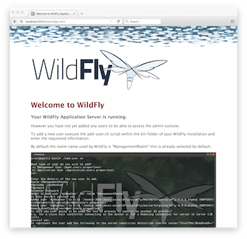

Management Clients - Latest WildFly Documentation
=================================================

[[management-clients]]
Management Clients
------------------

WildFly offers three different approaches to configure and manage
servers: a web interface, a command line client and a set of XML
configuration files. Regardless of the approach you choose, the
configuration is always synchronized across the different views and
finally persisted to the XML files.

[[web-management-interface]]
Web Management Interface
~~~~~~~~~~~~~~~~~~~~~~~~

The web interface is a GWT application that uses the HTTP management API
to configure a management domain or standalone server.

[[http-management-endpoint]]
HTTP Management Endpoint
^^^^^^^^^^^^^^^^^^^^^^^^

The HTTP API endpoint is the entry point for management clients that
rely on the HTTP protocol to integrate with the management layer. It
uses a JSON encoded protocol and a de-typed, RPC style API to describe
and execute management operations against a managed domain or standalone
server. It's used by the web console, but offers integration
capabilities for a wide range of other clients too.

The HTTP API endpoint is co-located with either the domain controller or
a standalone server. By default, it runs on port 9990:

[source,java]
----
<management-interfaces>
 [...]
 <http-interface security-realm="ManagementRealm">
  <socket-binding http="management-http"/>
 </http-interface>
<management-interfaces>
----

~(See standalone/configuration/standalone.xml or
domain/configuration/host.xml)~

The HTTP API Endpoint serves two different contexts. One for executing
management operations and another one that allows you to access the web
interface:

* Domain API: http://<host>:9990/management
* Web Console: http://<host>:9990/console

[[accessing-the-web-console]]
Accessing the web console
^^^^^^^^^^^^^^^^^^^^^^^^^

The web console is served through the same port as the HTTP management
API. It can be accessed by pointing your browser to:

* http://<host>:9990/console 

Default URL

By default the web interface can be accessed here:
http://localhost:9990/console.

[[default-http-management-interface-security]]
Default HTTP Management Interface Security
^^^^^^^^^^^^^^^^^^^^^^^^^^^^^^^^^^^^^^^^^^

WildFly is distributed secured by default. The default security
mechanism is username / password based making use of HTTP Digest for the
authentication process.

The reason for securing the server by default is so that if the
management interfaces are accidentally exposed on a public IP address
authentication is required to connect - for this reason there is no
default user in the distribution.

If you attempt to connect to the admin console before you have added a
user to the server you will be presented with the following screen.

The user are stored in a properties file called mgmt-users.properties
under standalone/configuration and domain/configuration depending on the
running mode of the server, these files contain the users username along
with a pre-prepared hash of the username along with the name of the
realm and the users password.

Although the properties files do not contain the plain text passwords
they should still be guarded as the pre-prepared hashes could be used to
gain access to any server with the same realm if the same user has used
the same password.

To manipulate the files and add users we provide a utility add-user.sh
and add-user.bat to add the users and generate the hashes, to add a user
you should execute the script and follow the guided process.
image:images/author/download/attachments/108625991/add-user.png[images/author/download/attachments/108625991/add-user.png] +
The full details of the add-user utility are described later but for the
purpose of accessing the management interface you need to enter the
following values: -

* Type of user - This will be a 'Management User' to selection option a.
* Realm - This MUST match the realm name used in the configuration so
unless you have changed the configuration to use a different realm name
leave this set as 'ManagementRealm'.
* Username - The username of the user you are adding.
* Password - The users password.

Provided the validation passes you will then be asked to confirm you
want to add the user and the properties files will be updated.

For the final question, as this is a user that is going to be accessing
the admin console just answer 'n' - this option will be described later
for adding slave host controllers that authenticate against a master
domain controller but that is a later topic.

Updates to the properties file are picked up in real time so either
click 'Try Again' on the error page that was displayed in the browser or
navigate to the console again and you should then be prompted to enter
the username and password to connect to the server.

[[command-line-interface]]
Command Line Interface
~~~~~~~~~~~~~~~~~~~~~~

The Command Line Interface (CLI) is a management tool for a managed
domain or standalone server. It allows a user to connect to the domain
controller or a standalone server and execute management operations
available through the de-typed management model.

Details on how to use the CLI can be found in the
link:Command_Line_Interface.html[Command Line Interface page].

[[configuration-files]]
Configuration Files
~~~~~~~~~~~~~~~~~~~

WildFly stores its configuration in centralized XML configuration files,
one per server for standalone servers and, for managed domains, one per
host with an additional domain wide policy controlled by the master
host. These files are meant to be human-readable and human editable.

The XML configuration files act as a central, authoritative source of
configuration. Any configuration changes made via the web interface or
the CLI are persisted back to the XML configuration files. If a domain
or standalone server is offline, the XML configuration files can be hand
edited as well, and any changes will be picked up when the domain or
standalone server is next started. However, users are encouraged to use
the web interface or the CLI in preference to making offline edits to
the configuration files. External changes made to the configuration
files while processes are running will not be detected, and may be
overwritten.

[[standalone-server-configuration-file]]
Standalone Server Configuration File
^^^^^^^^^^^^^^^^^^^^^^^^^^^^^^^^^^^^

The XML configuration for a standalone server can be found in the
`standalone/configuration` directory. The default configuration file is
`standalone/configuration/standalone.xml`.

The `standalone/configuration` directory includes a number of other
standard configuration files, e.g. `standalone-full.xml`,
`standalone-ha.xml` and `standalone-full-ha.xml` each of which is
similar to the default `standalone.xml` file but includes additional
subsystems not present in the default configuration. If you prefer to
use one of these files as your server configuration, you can specify it
with the _[line-through]*c*_ or _-server-config_ command line argument:

* `bin/standalone.sh -c=standalone-full.xml`
* `bin/standalone.sh --server-config=standalone-ha.xml`

[[managed-domain-configuration-files]]
Managed Domain Configuration Files
^^^^^^^^^^^^^^^^^^^^^^^^^^^^^^^^^^

In a managed domain, the XML files are found in the
`domain/configuration` directory. There are two types of configuration
files – one per host, and then a single domain-wide file managed by the
master host, aka the Domain Controller. (For more on the types of
processes in a managed domain, see link:Operating_modes.html[Operating
modes].)

[[host-specific-configuration-host.xml]]
Host Specific Configuration – host.xml
++++++++++++++++++++++++++++++++++++++

When you start a managed domain process, a Host Controller instance is
launched, and it parses its own configuration file to determine its own
configuration, how it should integrate with the rest of the domain, any
host-specific values for settings in the domain wide configuration (e.g.
IP addresses) and what servers it should launch. This information is
contained in the host-specific configuration file, the default version
of which is `domain/configuration/host.xml`.

Each host will have its own variant `host.xml`, with settings
appropriate for its role in the domain. WildFly ships with three
standard variants:

host-master.xml

A configuration that specifies the Host Controller should become the
master, aka the Domain Controller. No servers will be started by this
Host Controller, which is a recommended setup for a production master.

host-slave.xml

A configuration that specifies the Host Controller should not become
master and instead should register with a remote master and be
controlled by it. This configuration launches servers, although a user
will likely wish to modify how many servers are launched and what server
groups they belong to.

host.xml

The default host configuration, tailored for an easy out of the box
experience experimenting with a managed domain. This configuration
specifies the Host Controller should become the master, aka the Domain
Controller, but it also launches a couple of servers.

Which host-specific configuration should be used can be controlled via
the _ _--host-config__ command line argument:

[source,java]
----
$ bin/domain.sh --host-config=host-master.xml
----

[[domain-wide-configuration-domain.xml]]
Domain Wide Configuration – domain.xml
++++++++++++++++++++++++++++++++++++++

Once a Host Controller has processed its host-specific configuration, it
knows whether it is configured to act as the master Domain Controller.
If it is, it must parse the domain wide configuration file, by default
located at `domain/configuration/domain.xml`. This file contains the
bulk of the settings that should be applied to the servers in the domain
when they are launched – among other things, what subsystems they should
run with what settings, what sockets should be used, and what
deployments should be deployed.

Which domain-wide configuration should be used can be controlled via the
_ _--domain-config__ command line argument:

[source,java]
----
$ bin/domain.sh --domain-config=domain-production.xml
----

That argument is only relevant for hosts configured to act as the
master.

A slave Host Controller does not usually parse the domain wide
configuration file. A slave gets the domain wide configuration from the
remote master Domain Controller when it registers with it. A slave also
will not persist changes to a `domain.xml` file if one is present on the
filesystem. For that reason it is recommended that no `domain.xml` be
kept on the filesystem of hosts that will only run as slaves.

A slave can be configured to keep a locally persisted copy of the domain
wide configuration and then use it on boot (in case the master is not
available.) See _--backup and --cached-dc_ under
link:Command_line_parameters.html[Command line parameters].
