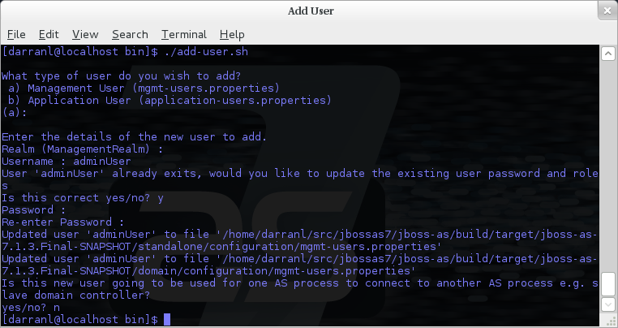

Security Realms
===============

Within WildFly we make use of security realms to secure access to the
management interfaces, these same realms are used to secure inbound
access as exposed by JBoss Remoting such as remote JNDI and EJB access,
the realms are also used to define an identity for the server - this
identity can be used for both inbound connections to the server and
outbound connections being established by the server.

[[general-structure]]
= General Structure

The general structure of a management realm definition is: -

[source,java]
----
<security-realm name="ManagementRealm">
   <plug-ins></plug-ins>
   <server-identities></server-identities>
   <authentication></authentication>
   <authorization></authorization>
</security-realm>
----

* `plug-ins` - This is an optional element that is used to define
modules what will be searched for security realm PlugInProviders to
extend the capabilities of the security realms.
* `server-identities` - An optional element to define the identity of
the server as visible to the outside world, this applies to both inbound
connection to a resource secured by the realm and to outbound
connections also associated with the realm.

One example is the SSL identity of the server, for inbound connections
this will control the identity of the server as the SSL connection is
established, for outbound connections this same identity can be used
where CLIENT-CERT style authentication is being performed.

A second example is where the server is establishing an outbound
connection that requires username / password authentication - this
element can be used to define that password.

* `authentication` - This is probably the most important element that
will be used within a security realm definition and mostly applies to
inbound connections to the server, this element defines which backing
stores will be used to provide the verification of the inbound
connection.

This element is optional as there are some scenarios where it will not
be required such as if a realm is being defined for an outbound
connection using a username and password.

* `authorization` - This is the final optional element and is used to
define how roles are loaded for an authenticated identity. At the moment
this is more applicable for realms used for access to EE deployments
such as web applications or EJBs but this will also become relevant as
we add role based authorization checks to the management model.

[[using-a-realm]]
= Using a Realm

After a realm has been defined it needs to be associated with an inbound
or outbound connection for it to be used, the following are some
examples where these associations are used within the WildFly 8
configuration.

[[inbound-connections]]
== Inbound Connections

[[management-interfaces]]
=== Management Interfaces

Either within the `standalone.xml` or `host.xml` configurations the
security realms can be associated with the management interface as
follows:

[source,java]
----
<http-interface security-realm="ManagementRealm">...</http-interface>
----

If the `security-realm` attribute is omitted or removed from the
interface definition it means that access to that interface will be
unsecured.

[IMPORTANT]

By default we do bind these interfaces to the loopback address so that
the interfaces are not accessible remotely out of the box, however do be
aware that if these interfaces are then unsecured any other local user
will be able to control and administer the WildFly installation.

[[remoting-subsystem]]
=== Remoting Subsystem

The Remoting subsystem exposes a connector to allow for inbound
comunications with JNDI and the EJB subsystem by default we associate
the `ApplicationRealm` with this connection.

[source,java]
----
<subsystem xmlns="urn:jboss:domain:remoting:3.0">
  <endpoint worker="default"/>
  <http-connector name="http-remoting-connector" connector-ref="default" security-realm="ApplicationRealm"/>
</subsystem>
----

[[outbound-connections]]
== Outbound Connections

[[remoting-subsystem-1]]
=== Remoting Subsystem

Outbound connections can also be defined within the Remoting subsystem,
these are typically used for remote EJB invocations from one AS server
to another, in this scenario the security realm is used to obtain the
server identity either it's password for X.509 certificate and possibly
a trust store to verify the certificate of the remote host.

[IMPORTANT]

Even if the referenced realm contains username and password
authentication configuration the client side of the connection will NOT
use this to verify the remote server.

[source,java]
----
<remote-outbound-connection name="remote-ejb-connection"
                            outbound-socket-binding-ref="binding-remote-ejb-connection"
                            username="user1"
                            security-realm="PasswordRealm">
----

[IMPORTANT]

The security realm is only used to obtain the password for this example,
as you can see here the username is specified separately.

[[slave-host-controller]]
=== Slave Host Controller

When running in domain mode slave host controllers need to establish a
connection to the native interface of the master domain controller so
these also need a realm for the identity of the slave.

[source,java]
----
<domain-controller>
  <remote host="${jboss.domain.master.address}" port="${jboss.domain.master.port:9999}" security-realm="ManagementRealm"/>
</domain-controller>
----

[IMPORTANT]

By default when a slave host controller authenticates against the master
domain controller it uses its configured name as its username. If you
want to override the username used for authentication a `username`
attribute can be added to the `<remote />` element.

[[authentication]]
= Authentication

One of the primary functions of the security realms is to define the
user stores that will be used to verify the identity of inbound
connections, the actual approach taken at the transport level is based
on the capabilities of these backing store definitions. The security
realms are used to secure inbound connections for both the http
management interface and for inbound remoting connections for both the
native management interface and to access other services exposed over
remoting - because of this there are some small differences between how
the realm is used for each of these.

At the transport level we support the following authentication
mechanisms.

[cols=",",]
|========================
|HTTP |Remoting (SASL)
|None |Anonymous
|N/A |JBoss Local User
|Digest |Digest
|Basic |Plain
|Client Cert |Client Cert
|========================

The most notable are the first two in this list as they need some
additional explanation - the final 3 are fairly standard mechanisms.

If either the http interface, the native interface or a remoting
connection are difined *without* a security realm reference then they
are effectively unsecured, in the case of the http interface this means
that no authentication will be performed on the incoming connection -
for the remoting connections however we make use of SASL so require at
least one authentication mechanism so make use of the anonymous
mechanism to allow a user in without requiring a validated
authentication process.

The next mechanism 'JBoss Local User' is specific to the remoting
connections - as we ship WildFly secured by default we wanted a way to
allow users to connect to their own AS installation after it is started
without mandating that they define a user with a password - to
accomplish this we have added the 'JBoss Local User' mechanism. This
mechanism makes the use of tokens exchanged on the filesystem to prove
that the client is local to the AS installation and has the appropriate
file permissions to read a token written by the AS to file. As this
mechanism is dependent on both server and client implementation details
it is only supported for the remoting connections and not the http
connections - at some point we may review if we can add support for this
to the http interface but we would need to explore the options available
with the commony used web browsers that are used to communicate with the
http interface.

The Digest mechanism is simply the HTTP Digest / SASL Digest mechanism
that authenticates the user by making use of md5 hashed including nonces
to avoid sending passwords in plain text over the network - this is the
preferred mechanism for username / password authentication.

The HTTP Basic / SASL Plain mechanism is made available for times that
Digest can not be used but effectively this means that the users
password will be sent over the network in the clear unless SSL is
enabled.

The final mechanism Client-Cert allows X.509 certificates to be used to
verify the identity of the remote client.

[IMPORTANT]

One point bearing in mind is that it is possible that an association
with a realm can mean that a single incoming connection has the ability
to choose between one or more authentication mechanisms. As an example
it is possible that an incoming remoting connection could choose between
'Client Cert', A username password mechanism or 'JBoss Local User' for
authentication - this would allow say a local user to use the local
mechanism, a remote user to supply their username and password whilst a
remote script could make a call and authenticate using a certificate.

[[authorization]]
= Authorization

The actual security realms are not involved in any authorization
decisions. However, they can be configured to load a user's roles, which
will subsequently be used to make authorization decisions - when
references to authorization are seen in the context of security realms,
it is this loading of roles that is being referred to.

For the loading of roles, the process is split out to occur after the
authentication step so after a user has been authenticated, a second
step will occur to load the roles based on the username they used to
authenticate with.

[[out-of-the-box-configuration]]
= Out Of The Box Configuration

Before describing the complete set of configuration options available
within the realms, we will look at the default configuration, as for
most users, that is going to be the starting point before customising
further.

[IMPORTANT]

The examples here are taken from the standalone configuration. However,
the descriptions are equally applicable to domain mode. One point worth
noting is that all security realms defined in the `host.xml` are
available to be referenced within the domain configuration for the
servers running on that host controller.

[[management-realm]]
== Management Realm

[source,java]
----
<security-realm name="ManagementRealm">
  <authentication>
    <local default-user="$local"/>
    <properties path="mgmt-users.properties" relative-to="jboss.server.config.dir"/>
  </authentication>
</security-realm>
----

The realm `ManagementRealm` is the simplest realm within the default
configuration. This realm simply enables two authentication mechanisms,
the local mechanism and username/password authentication which will be
using Digest authentication.

* local

When using the local mechanism, it is optional for remote clients to
send a username to the server. This configuration specifies that where
clients do not send a username, it will be assumed that the clients
username is `$local` - the `<local />` element can also be configured to
allow other usernames to be specified by remote clients. However, for
the default configuration, this is not enabled so is not supported.

* properties

For username / password authentication the users details will be loaded
from the file `mgmt-users.properties` which is located in \{
`jboss.home}/standalone/configuration` or \{
`jboss.home}/domain/configuration` depending on the running mode of the
server.

Each user is represented on their own line and the format of each line
is `username=` `HASH` where `HASH` is a pre-prepared hash of the users
password along with their username and the name of the realm which in
this case is `ManagementRealm`.

[IMPORTANT]

You do not need to worry about generating the entries within the
properties file as we provide a utility `add-user.sh` or `add-user.bat`
to add the users, this utility is described in more detail below.

[IMPORTANT]

By pre-hashing the passwords in the properties file it does mean that if
the user has used the same password on different realms then the
contents of the file falling into the wrong hands does not nescesarily
mean all accounts are compromised. *HOWEVER* the contents of the files
do still need to be protected as they can be used to access any server
where the realm name is the same and the user has the same username and
password pair.

[[application-realm]]
== Application Realm

[source,java]
----
<security-realm name="ApplicationRealm">
  <authentication>
    <local default-user="$local" allowed-users="*"/>
    <properties path="application-users.properties" relative-to="jboss.server.config.dir"/>
  </authentication>
  <authorization>
    <properties path="application-roles.properties" relative-to="jboss.server.config.dir"/>
  </authorization>
</security-realm>
----

The realm `ApplicationRealm` is a slightly more complex realm as this is
used for both

[[authentication-1]]
=== Authentication

The authentication configuration is very similar to the
`ManagementRealm` in that it enabled both the local mechanism and a
username/password based Digest mechanism.

* local

The local configuration is similar to the `ManagementRealm` in that
where the remote user does not supply a username it will be assumed that
the username is `$local`, however in addition to this there is now an
`allowed-users` attribute with a value of `'*'` - this means that the
remote user can specify any username and it will be accepted over the
local mechanism provided that the local verification is a success.

[IMPORTANT]

To restrict the usernames that can be specified by the remote user a
comma separated list of usernames can be specified instead within the
`allowed-users` attribute.

* properties

The properties definition works in exactly the same way as the
definition for `ManagementRealm` except now the properties file is
called `application-users.properties`.

[[authorization-1]]
=== Authorization

The contents of the `Authorization` element are specific to the
`ApplicationRealm`, in this case a properties file is used to load a
users roles.

The properties file is called `application-roles.properties` and is
located in \{ `jboss.home}/standalone/configuration` or \{
`jboss.home}/domain/configuration` depending on the running mode of the
server. The format of this file is `username=` `ROLES` where _ROLES_ is
a comma separated list of the users roles.

[IMPORTANT]

As the loading of a users roles is a second step this is where it may be
desirable to restrict which users can use the local mechanism so that
some users still require username and password authentication for their
roles to be loaded.

[[other-security-domain]]
=== other security domain

[source,java]
----
<security-domain name="other" cache-type="default">
  <authentication>
    <login-module code="Remoting" flag="optional">
      <module-option name="password-stacking" value="useFirstPass"/>
    </login-module>
    <login-module code="RealmDirect" flag="required">
      <module-option name="password-stacking" value="useFirstPass"/>
    </login-module>
  </authentication>
</security-domain>
----

When applications are deployed to the application server they are
associated with a security domain within the security subsystem, the
`other` security domain is provided to work with the `ApplicationRealm`,
this domain is defined with a pair of login modules Remoting and
RealmDirect.

* Remoting

The `Remoting` login module is used to check if the request currently
being authenticated is a request received over a Remoting connection, if
so the identity that was created during the authentication process is
used and associated with the current request.

If the request did not arrive over a Remoting connection this module
does nothing and allows the JAAS based login to continue to the next
module.

* RealmDirect

The `RealmDirect` login module makes use of a security realm to
authenticate the current request if that did not occur in the `Remoting`
login module and then use the realm to load the users roles, by default
this login module assumes the realm to use is called `ApplicationRealm`
although other names can be overridden using the "realm" module-option.

The advantage of this approach is that all of the backing store
configuration can be left within the realm with the security domain just
delegating to the realm.

[[add-user.sh]]
= add-user.sh

For use with the default configuration we supply a utility `add-user`
which can be used to manage the properties files for the default realms
used to store the users and their roles.

The add-user utility can be used to manage both the users in the
`ManagementRealm` and the users in the `ApplicationRealm`, changes made
apply to the properties file used both for domain mode and standalone
mode.

[IMPORTANT]

After you have installed your application server and decided if you are
going to run in standalone mode or domain mode you can delete the parent
folder for the mode you are not using, the add-user utility will then
only be managing the properties file for the mode in use.

The add-user utility is a command line utility however it can be run in
both interactive and non-interactive mode. Depending on your platform
the script to run the add-user utility is either `add-user.sh` or
`add-user.bat` which can be found in \{ `jboss.home}/bin`.

This guide now contains a couple of examples of this utility in use to
accomplish the most common tasks.

[[adding-a-user]]
== Adding a User

Adding users to the properties files is the primary purpose of this
utility. Usernames can only contain the following characters in any
number and in any order:

* Alphanumeric characters (a-z, A-Z, 0-9)
* Dashes (-), periods (.), commas (,), at (@)
* Escaped backslash ( \\ )
* Escaped equals (\=)

[IMPORTANT]

The server caches the contents of the properties files in memory,
however the server does check the modified time of the properties files
on each authentication request and re-load if the time has been updated
- this means all changes made by this utility are immediately applied to
any running server.

[[a-management-user]]
=== A Management User

[IMPORTANT]

The default name of the realm for management users is `ManagementRealm`,
when the utility prompts for the realm name just accept the default
unless you have switched to a different realm.

[[interactive-mode]]
==== Interactive Mode

image:images/download/attachments/557238/add-mgmt-user-interactive.png[images/download/attachments/557238/add-mgmt-user-interactive.png]

Here we have added a new Management User called `adminUser`, as you can
see some of the questions offer default responses so you can just press
enter without repeating the default value.

For now just answer `n` or `no` to the final question, adding users to
be used by processes is described in more detail in the domain
management chapter.

[[non-interactive-mode]]
==== Non-Interactive Mode

To add a user in non-interactive mode the command
`./add-user.sh {username} {password`} can be used.

image:images/download/attachments/557238/add-mgmt-user-non-interactive.png[images/download/attachments/557238/add-mgmt-user-non-interactive.png]

[IMPORTANT]

If you add users using this approach there is a risk that any other user
that can view the list of running process may see the arguments
including the password of the user being added, there is also the risk
that the username / password combination will be cached in the history
file of the shell you are currently using.

[[an-application-user]]
=== An Application User

When adding application users in addition to adding the user with their
pre-hashed password it is also now possible to define the roles of the
user.

[[interactive-mode-1]]
==== Interactive Mode

image:images/download/attachments/557238/add-app-user-interactive.png[images/download/attachments/557238/add-app-user-interactive.png]

Here a new user called `appUser` has been added, in this case a comma
separated list of roles has also been specified.

As with adding a management user just answer `n` or `no` to the final
question until you know you are adding a user that will be establishing
a connection from one server to another.

[[non-interactive-mode-1]]
==== Non-Interactive Mode

To add an application user non-interactively use the command
`./add-user.sh -a {username} {password`}.

image:images/download/attachments/557238/add-app-user-non-interactive.png[images/download/attachments/557238/add-app-user-non-interactive.png]

[IMPORTANT]

Non-interactive mode does not support defining a list of users, to
associate a user with a set of roles you will need to manually edit the
`application-roles.properties` file by hand.

[[updating-a-user]]
== Updating a User

Within the add-user utility it is also possible to update existing
users, in interactive mode you will be prompted to confirm if this is
your intention.

[[a-management-user-1]]
=== A Management User

[[interactive-mode-2]]
==== Interactive Mode

[[non-interactive-mode-2]]
==== Non-Interactive Mode

In non-interactive mode if a user already exists the update is automatic
with no confirmation prompt.

[[an-application-user-1]]
=== An Application User

[[interactive-mode-3]]
==== Interactive Mode

image:images/download/attachments/557238/update-app-user-interactive.png[images/download/attachments/557238/update-app-user-interactive.png]

[IMPORTANT]

On updating a user with roles you will need to re-enter the list of
roles assigned to the user.

[[non-interactive-mode-3]]
==== Non-Interactive Mode

In non-interactive mode if a user already exists the update is automatic
with no confirmation prompt.

[[community-contributions]]
== Community Contributions

There are still a few features to add to the add-user utility such as
removing users or adding application users with roles in non-interactive
mode, if you are interested in contributing to WildFly development the
add-user utility is a good place to start as it is a stand alone
utility, however it is a part of the AS build so you can become familiar
with the AS development processes without needing to delve straight into
the internals of the application server.

[[jmx-security]]
= JMX Security

When configuring the security realms remote access to the server's
MBeanServer needs a special mention. When running in standalone mode the
following is the default configuration:

[source,java]
----
<subsystem xmlns="urn:jboss:domain:jmx:1.3">
  ...
  <remoting-connector/>
</subsystem>
----

With this configuration remote access to JMX is provided over the http
management interface, this is secured using the realm `ManagementRealm`,
this means that any user that can connect to the native interface can
also use this interface to access the MBeanServer - to disable this just
remove the `<remoting-connector />` element.

In domain mode it is slightly more complicates as the native interface
is exposed by the host controller process however each application
server is running in it's own process so by default remote access to JMX
is disabled.

[source,java]
----
<subsystem xmlns="urn:jboss:domain:remoting:3.0">
  <http-connector name="http-remoting-connector" connector-ref="default" security-realm="ApplicationRealm"/>
</subsystem>
----

[source,java]
----
<subsystem xmlns="urn:jboss:domain:jmx:1.3">
  ...
  <!--<remoting-connector use-management-endpoint="false"/>-->
</subsystem>
----

To enable remote access to JMX uncomment the `<remoting-connector />`
element however be aware that this will make the MBeanServer accessible
over the same Remoting connector used for remote JNDI and EJB access -
this means that any user that can authenticate against the realm
`ApplicationRealm` will be able to access the MBeanServer.

[IMPORTANT]

The following Jira issue is currently outstanding to allow access to the
individual MBeanServers by proxying through the host controllers native
interface https://issues.jboss.org/browse/AS7-4009[AS7-4009], if this is
a feature you would use please add your vote to the issue.

[[detailed-configuration]]
= Detailed Configuration

This section of the documentation describes the various configuration
options when defining realms, plug-ins are a slightly special case so
the configuration options for plug-ins is within it's own section.

Within a security realm definition there are four optional elements
`<plug-ins />`, `<server-identities />`, `<authentication />`, and
`<authorization />`, as mentioned above plug-ins is defined within it's
own section below so we will begin by looking at the
`<server-identities />` element.

[[server-identities]]
== <server-identities />

The server identities section of a realm definition is used to define
how a server appears to the outside world, currently this element can be
used to configure a password to be used when establishing a remote
outbound connection and also how to load a X.509 key which can be used
for both inbound and outbound SSL connections.

[[ssl]]
=== <ssl />

[source,java]
----
<server-identities>
  <ssl protocol="...">
    <keystore path="..." relative-to="..." keystore-password="..." alias="..." key-password="..." />
  </ssl>
</server-identities>
----

* *protocol* - By default this is set to TLS and in general does not
need to be set.

The SSL element then contains the nested `<keystore />` element, this is
used to define how to load the key from the file based (JKS) keystore.

* *path* (mandatory) - This is the path to the keystore, this can be an
absolute path or relative to the next attribute.
* *relative-to* (optional) - The name of a service representing a path
the keystore is relative to.
* *keystore-password* (mandatory) - The password required to open the
keystore.
* *alias* (optional) - The alias of the entry to use from the keystore -
for a keystore with multiple entries in practice the first usable entry
is used but this should not be relied on and the alias should be set to
guarantee which entry is used.
* *key-password* (optional) - The password to load the key entry, if
omitted the keystore-password will be used instead.

[IMPORTANT]

If you see the error `UnrecoverableKeyException: Cannot recover key` the
most likely cause that you need to specify a `key-password` and possible
even an `alias` as well to ensure only one key is loaded.

[[secret]]
=== <secret />

[source,java]
----
<server-identities>
  <secret value="..." />
</server-identities>
----

* *value* (mandatory) - The password to use for outbound connections
encoded as Base64, this field also supports a vault expression should
stronger protection be required.

[IMPORTANT]

The username for the outbound connection is specified at the point the
outbound connection is defined.

[[authentication-2]]
== <authentication />

The authentication element is predominantly used to configure the
authentication that is performed on an inbound connection, however there
is one exception and that is if a trust store is defined - on
negotiating an outbound SSL connection the trust store will be used to
verify the remote server.

[source,java]
----
<authentication>
  <truststore />
  <local />
  <jaas />
  <ldap />
  <properties />
  <users />
  <plug-in />
</authentication>
----

An authentication definition can have zero or one `<truststore />`, it
can also have zero or one `<local />` and it can also have one of
`<jaas />`, `<ldap />`, `<properties />`, `<users />`, and `<plug-in />`
i.e. the local mechanism and a truststore for certificate verification
can be independent switched on and off and a single username / password
store can be defined.

[[truststore]]
=== <truststore />

[source,java]
----
<authentication>
  <truststore path="..." relative-to="..." keystore-password="..."/> 
</authentication>
----

This element is used to define how to load a key store file that can be
used as the trust store within the SSLContext we create internally, the
store is then used to verify the certificates of the remote side of the
connection be that inbound or outbound.

* *path* (mandatory) - This is the path to the keystore, this can be an
absolute path or relative to the next attribute.
* *relative-to* (optional) - The name of a service representing a path
the keystore is relative to.
* *keystore-password* (mandatory) - The password required to open the
keystore.

[IMPORTANT]

Although this is a definition of a trust store the attribute for the
password is `keystore-password`, this is because the underlying file
being opened is still a key store.

[[local]]
=== <local />

[source,java]
----
<authentication>
  <local default-user="..." allowed-users="..." />
</authentication>
----

This element switches on the local authentication mechanism that allows
clients to the server to verify that they are local to the server, at
the protocol level it is optional for the remote client to send a user
name in the authentication response.

* *default-user* (optional) - If the client does not pass in a username
this is the assumed username, this value is also automatically added to
the list of allowed-users.
* *allowed-users* (optional) - This attribute is used to specify a comma
separated list of users allowed to authenticate using the local
mechanism, alternatively ' `*`' can be specified to allow any username
to be specified.

[[jaas]]
=== <jaas />

[source,java]
----
<authentication>
  <jaas name="..." />
</authentication>
----

The jaas element is used to enable username and password based
authentication where the supplied username and password are verified by
making use of a configured jaas domain.

* *name* (mandatory) - The name of the jaas domain to use to verify the
supplied username and password.

[IMPORTANT]

As JAAS authentication works by taking a username and password and
verifying these the use of this element means that at the transport
level authentication will be forced to send the password in plain text,
any interception of the messages exchanged between the client and server
without SSL enabled will reveal the users password.

[[ldap]]
=== <ldap />

[source,java]
----
<authentication>
  <ldap connection="..." base-dn="..." recursive="..." user-dn="...">
    <username-filter attribute="..." />
    <advanced-filter filter="..." />
  </ldap>
</authentication>
----

The ldap element is used to define how LDAP searches will be used to
authenticate a user, this works by first connecting to LDAP and
performing a search using the supplied user name to identity the
distinguished name of the user and then a subsequent connection is made
to the server using the password supplied by the user - if this second
connection is a success then authentication succeeds.

[IMPORTANT]

Due to the verification approach used this configuration causes the
authentication mechanisms selected for the protocol to cause the
password to be sent from the client in plain text, the following Jira
issue is to investigating proxying a Digest authentication with the LDAP
server so no plain text password is needed
https://issues.jboss.org/browse/AS7-4195[AS7-4195].

* *connection* (mandatory) - The name of the connection to use to
connect to LDAP.
* *base-dn* (mandatory) - The distinguished name of the context to use
to begin the search from.
* *recursive* (optional) - Should the filter be executed recursively?
Defaults to false.
* *user-dn* (optional) - After the user has been found specifies which
attribute to read for the users distinguished name, defaults to ' `dn`'.

Within the ldap element only one of `<username-filter />` or
`<advanced-filter />` can be specified.

[[username-filter]]
==== <username-filter />

This element is used for a simple filter to match the username specified
by the remote user against a single attribute, as an example with Active
Directory the match is most likely to be against the ' `sAMAccountName`'
attribute.

* *attribute* (mandatory) - The name of the field to match the users
supplied username against.

[[advanced-filter]]
==== <advanced-filter />

This element is used where a more advanced filter is required, one
example use of this filter is to exclude certain matches by specifying
some additional criteria for the filter.

* *filter* (mandatory) - The filter to execute to locate the user, this
filter should contain '\{ `0`}' as a place holder for the username
supplied by the user authenticating.

[[properties]]
=== <properties />

[source,java]
----
<authentication>
  <properties path="..." relative-to="..." plain-text="..." />
</authentication>
----

The properties element is used to reference a properties file to load to
read a users password or pre-prepared digest for the authentication
process.

* *path* (mandatory) - The path to the properties file, either absolute
or relative to the path referenced by the relative-to attribute.
* *relative-to* (optional) - The name of a path service that the defined
path will be relative to.
* *plain-text* (optional) - Setting to specify if the passwords are
stored as plain text within the properties file, defaults to false.

[IMPORTANT]

By default the properties files are expected to store a pre-prepared
hash of the users password in the form HEX( MD5( username ':' realm ':'
password))

[[users]]
=== <users />

[source,java]
----
<authentication>
  <users>
    <user username="...">
      <password>...</password>
    </user>
  </users>
</authentication>
----

This is a very simple store of a username and password that stores both
of these within the domain model, this is only really provided for the
provision of simple examples.

* *username* (mandatory) - A users username.

The `<password/>` element is then used to define the password for the
user.

[[authorization-2]]
== <authorization />

The authorization element is used to define how a users roles can be
loaded after the authentication process completes, these roles may then
be used for subsequent authorization decisions based on the service
being accessed. At the moment only a properties file approach or a
custom plug-in are supported - support for loading roles from LDAP or
from a database are planned for a subsequent release.

[source,java]
----
<authorization>
  <properties />
  <plug-in />
</authorization>
----

[[properties-1]]
=== <properties />

[source,java]
----
<authorization>
  <properties path="..." relative-to="..." />
</authorization>
----

The format of the properties file is `username={ROLES`} where \{
`ROLES`} is a comma separated list of the users roles.

* *path* (mandatory) - The path to the properties file, either absolute
or relative to the path referenced by the relative-to attribute.
* *relative-to* (optional) - The name of a path service that the defined
path will be relative to.

[[outbound-connection]]
== <outbound-connection />

Strictly speaking these are not a part of the security realm definition,
however at the moment they are only used by security realms so the
definition of outbound connection is described here.

[source,java]
----
<management>
  <security-realms />
  <outbound-connections>
    <ldap />
  </outbound-connections>
</management>
----

[[ldap-1]]
=== <ldap />

At the moment we only support outbound connections to ldap servers for
the authentication process - this will later be expanded when we add
support for database based authentication.

[source,java]
----
<outbound-connections>
  <ldap name="..." url="..." search-dn="..." search-credential="..." initial-context-factory="..." />
</outbound-connections>
----

The outbound connections are defined in this section and then referenced
by name from the configuration that makes use of them.

* *name* (mandatory) - The unique name used to reference this
connection.
* *url* (mandatory) - The URL use to establish the LDAP connection.
* *search-dn* (mandatory) - The distinguished name of the user to
authenticate as to perform the searches.
* *search-credential* (mandatory) - The password required to connect to
LDAP as the search-dn.
* *initial-context-factory* (optional) - Allows overriding the initial
context factory, defaults to ' `com.sun.jndi.ldap.LdapCtxFactory`'

[[plug-ins]]
= Plug Ins

Within WildFly 8 for communication with the management interfaces and
for other services exposed using Remoting where username / password
authentication is used the use of Digest authentication is preferred
over the use of HTTP Basic or SASL Plain so that we can avoid the
sending of password in the clear over the network. For validation of the
digests to work on the server we either need to be able to retrieve a
users plain text password or we need to be able to obtain a ready
prepared hash of their password along with the username and realm.

Previously to allow the addition of custom user stores we have added an
option to the realms to call out to a JAAS domain to validate a users
username and password, the problem with this approach is that to call
JAAS we need the remote user to send in their plain text username and
password so that a JAAS LoginModule can perform the validation, this
forces us down to use either the HTTP Basic authentication mechanism or
the SASL Plain mechanism depending on the transport used which is
undesirable as we can not longer use Digest.

To overcome this we now support plugging in custom user stores to
support loading a users password, hash and roles from a custom store to
allow different stores to be implemented without forcing the
authentication back to plain text variant, this article describes the
requirements for a plug in and shows a simple example plug-in for use
with WildFly 8.

When implementing a plug in there are two steps to the authentication
process, the first step is to load the users identity and credential
from the relevant store - this is then used to verify the user
attempting to connect is valid. After the remote user is validated we
then load the users roles in a second step. For this reason the support
for plug-ins is split into the two stages, when providing a plug-in
either of these two steps can be implemented but there is no requirement
to implement the other side.

When implementing a plug-in the following interfaces are the bare
minimum that need to be implemented so depending on if a plug-in to load
a users identity or a plug-in to load a users roles is being implemented
you will be implementing one of these interfaces.

*_Note_* _- All classes and interfaces of the SPI to be implemented are
in the 'org.jboss.as.domain.management.plugin' package which is a part
of the 'org.jboss.as.domain-management' module but for simplicity for
the rest of this section only the short names will be shown._

[[authenticationplugin]]
== AuthenticationPlugIn

To implement an `AuthenticationPlugIn` the following interface needs to
be implemened: -

[source,java]
----
public interface AuthenticationPlugIn<T extends Credential> {
    Identity<T> loadIdentity(final String userName, final String realm) throws IOException;
}
----

During the authentication process this method will be called with the
user name supplied by the remote user and the name of the realm they are
authenticating against, this method call represents that an
authentication attempt is occurring but it is the Identity instance that
is returned that will be used for the actual authentication to verify
the remote user.

The Identity interface is also an interface you will implement: -

[source,java]
----
public interface Identity<T extends Credential> {
    String getUserName();
    T getCredential();
}
----

Additional information can be contained within the Identity
implementation although it will not currently be used, the key piece of
information here is the Credential that will be returned - this needs to
be one of the following: -

[[passwordcredential]]
=== PasswordCredential

[source,java]
----
public final class PasswordCredential implements Credential {
    public PasswordCredential(final char[] password);
    public char[] getPassword();
    void clear();
}
----

The `PasswordCredential` is already implemented so use this class if you
have the plain text password of the remote user, by using this the
secured interfaces will be able to continue using the Digest mechanism
for authentication.

[[digestcredential]]
=== DigestCredential

[source,java]
----
public final class DigestCredential implements Credential {
    public DigestCredential(final String hash);
    public String getHash();
}
----

This class is also already implemented and should be returned if instead
of the plain text password you already have a pre-prepared hash of the
username, realm and password.

[[validatepasswordcredential]]
=== ValidatePasswordCredential

[source,java]
----
public interface ValidatePasswordCredential extends Credential {
    boolean validatePassword(final char[] password);
}
----

This is a special Credential type to use when it is not possible to
obtain either a plain text representation of the password or a
pre-prepared hash - this is an interface as you will need to provide an
implementation to verify a supplied password. The down side of using
this type of Credential is that the authentication mechanism used at the
transport level will need to drop down from Digest to either HTTP Basic
or SASL Plain which will now mean that the remote client is sending
their credential across the network in the clear.

If you use this type of credential be sure to force the mechanism choice
to Plain as described in the configuration section below.

[[authorizationplugin]]
== AuthorizationPlugIn

If you are implementing a custom mechanism to load a users roles you
need to implement the `AuthorizationPlugIn`

[source,java]
----
public interface AuthorizationPlugIn {
    String[] loadRoles(final String userName, final String realm) throws IOException;
}
----

As with the `AuthenticationPlugIn` this has a single method that takes a
users userName and realm - the return type is an array of Strings with
each entry representing a role the user is a member of.

[[pluginconfigurationsupport]]
== PlugInConfigurationSupport

In addition to the specific interfaces above there is an additional
interface that a plug-in can implement to receive configuration
information before the plug-in is used and also to receive a Map
instance that can be used to share state between the plug-in instance
used for the authentication step of the call and the plug-in instance
used for the authorization step.

[source,java]
----
public interface PlugInConfigurationSupport {
    void init(final Map<String, String> configuration, final Map<String, Object> sharedState) throws IOException;
}
----

[[installing-and-configuring-a-plug-in]]
== Installing and Configuring a Plug-In

The next step of this article describes the steps to implement a plug-in
provider and how to make it available within WildFly 8 and how to
configure it. Example configuration and an example implementation are
shown to illustrate this.

The following is an example security realm definition which will be used
to illustrate this: -

[source,java]
----
<security-realm name="PlugInRealm">
   <plug-ins>
      <plug-in module="org.jboss.as.sample.plugin"/>
   </plug-ins>
   <authentication>
      <plug-in name="Sample">
         <properties>
            <property name="darranl.password" value="dpd"/>
            <property name="darranl.roles" value="Admin,Banker,User"/>
         </properties>
      </plug-in>
   </authentication>
   <authorization>
      <plug-in name="Delegate" />
   </authorization>
</security-realm>
----

Before looking closely at the packaging and configuration there is one
more interface to implement and that is the `PlugInProvider` interface,
that interface is responsible for making PlugIn instances available at
runtime to handle the requests.

[[pluginprovider]]
=== PlugInProvider

[source,java]
----
public interface PlugInProvider {
    AuthenticationPlugIn<Credential> loadAuthenticationPlugIn(final String name);
    AuthorizationPlugIn loadAuthorizationPlugIn(final String name);
}
----

These methods are called with the name that is supplied in the plug-in
elements that are contained within the authentication and authorization
elements of the configuration, based on the sample configuration above
the loadAuthenticationPlugIn method will be called with a parameter of
'Sample' and the loadAuthorizationPlugIn method will be called with a
parameter of 'Delegate'.

Multiple plug-in providers may be available to the application server so
if a `PlugInProvider` implementation does not recognise a name then it
should just return null and the server will continue searching the other
providers. If a `PlugInProvider` does recognise a name but fails to
instantiate the PlugIn then a `RuntimeException` can be thrown to
indicate the failure.

As a server could have many providers registered it is recommended that
a naming convention including some form of hierarchy is used e.g. use
package style names to avoid conflicts.

For the example the implementation is as follows: -

[source,java]
----
public class SamplePluginProvider implements PlugInProvider {
 
    public AuthenticationPlugIn<Credential> loadAuthenticationPlugIn(String name) {
        if ("Sample".equals(name)) {
            return new SampleAuthenticationPlugIn();
        }
        return null;
    }
 
    public AuthorizationPlugIn loadAuthorizationPlugIn(String name) {
        if ("Sample".equals(name)) {
            return new SampleAuthenticationPlugIn();
        } else if ("Delegate".equals(name)) {
            return new DelegateAuthorizationPlugIn();
        }
        return null;
    }
}
----

The load methods are called for each authentication attempt but it will
be an implementation detail of the provider if it decides to return a
new instance of the provider each time - in this scenario as we also use
configuration and shared state then new instances of the implementations
make sense.

To load the provider use a ServiceLoader so within the META-INF/services
folder of the jar this project adds a file called '
`org.jboss.as.domain.management.plugin.PlugInProvider`' - this contains
a single entry which is the fully qualified class name of the
PlugInProvider implementation class.

[source,java]
----
org.jboss.as.sample.SamplePluginProvider
----

[[package-as-a-module]]
=== Package as a Module

To make the `PlugInProvider` available to the application it is bundled
as a module and added to the modules already shipped with WildFly 8.

To add as a module we first need a `module.xml`: -

[source,java]
----
<?xml version="1.0" encoding="UTF-8"?>
 
<module xmlns="urn:jboss:module:1.1" name="org.jboss.as.sample.plugin">
    <properties>
    </properties>
 
    <resources>
        <resource-root path="SamplePlugIn.jar"/>
    </resources>
 
    <dependencies>
        <module name="org.jboss.as.domain-management" />
    </dependencies>
</module>
----

The interfaces being implemented are in the '
`org.jboss.as.domain-management`' module so a dependency on that module
is defined, this `module.xml` is then placed in the '\{
`jboss.home}/modules/org/jboss/as/sample/plugin/main`'.

The compiled classed and `META-INF/services` as described above are
assembled into a jar called `SamplePlugIn.jar` and also placed into this
folder.

Looking back at the sample configuration at the top of the realm
definition the following element was added: -

[source,java]
----
   <plug-ins>
      <plug-in module="org.jboss.as.sample.plugin"/>
   </plug-ins>
----

This element is used to list the modules that should be searched for
plug-ins. As plug-ins are loaded during the server start up this search
is a lazy search so don't expect a definition to a non existant module
or to a module that does not contain a plug-in to report an error.

[[the-authenticationplugin]]
=== The AuthenticationPlugIn

The example `AuthenticationPlugIn` is implemented as: -

[source,java]
----
public class SampleAuthenticationPlugIn extends AbstractPlugIn {
 
    private static final String PASSWORD_SUFFIX = ".password";
    private static final String ROLES_SUFFIX = ".roles";
    private Map<String, String> configuration;
 
    public void init(Map<String, String> configuration, Map<String, Object> sharedState) throws IOException {
        this.configuration = configuration;
        // This will allow an AuthorizationPlugIn to delegate back to this instance.
        sharedState.put(AuthorizationPlugIn.class.getName(), this);
    }
 
    public Identity loadIdentity(String userName, String realm) throws IOException {
        String passwordKey = userName + PASSWORD_SUFFIX;
        if (configuration.containsKey(passwordKey)) {
            return new SampleIdentity(userName, configuration.get(passwordKey));
        }
        throw new IOException("Identity not found.");
    }
 
    public String[] loadRoles(String userName, String realm) throws IOException {
        String rolesKey = userName + ROLES_SUFFIX;
        if (configuration.containsKey(rolesKey)) {
            String roles = configuration.get(rolesKey);
            return roles.split(",");
        } else {
            return new String[0];
        }
    }
 
    private static class SampleIdentity implements Identity {
        private final String userName;
        private final Credential credential;
 
        private SampleIdentity(final String userName, final String password) {
            this.userName = userName;
            this.credential = new PasswordCredential(password.toCharArray());
        }
 
        public String getUserName() {
            return userName;
        }
 
        public Credential getCredential() {
            return credential;
        }
    }
}
----

As you can see from this implementation there is also an additional
class being extended `AbstractPlugIn` - that is simply an abstract class
that implements the `AuthenticationPlugIn`, `AuthorizationPlugIn`, and
`PlugInConfigurationSupport` interfaces already. The properties that
were defined in the configuration are passed in as a Map and importantly
for this sample the plug-in adds itself to the shared state map.

[[the-authorizationplugin]]
=== The AuthorizationPlugIn

The example implementation of the authentication plug in is as follows:
-

[source,java]
----
public class DelegateAuthorizationPlugIn extends AbstractPlugIn {
 
    private AuthorizationPlugIn authorizationPlugIn;
 
    public void init(Map<String, String> configuration, Map<String, Object> sharedState) throws IOException {
        authorizationPlugIn = (AuthorizationPlugIn) sharedState.get(AuthorizationPlugIn.class.getName());
    }
 
    public String[] loadRoles(String userName, String realm) throws IOException {
        return authorizationPlugIn.loadRoles(userName, realm);
    }
 
}
----

This plug-in illustrates how two plug-ins can work together, by the
`AuthenticationPlugIn` placing itself in the shared state map it is
possible for the authorization plug-in to make use of it for the
loadRoles implementation.

Another option to consider to achieve similar behaviour could be to
provide an Identity implementation that also contains the roles and
place this in the shared state map - the `AuthorizationPlugIn` can
retrieve this and return the roles.

[[forcing-plain-text-authentication]]
=== Forcing Plain Text Authentication

As mentioned earlier in this article if the `ValidatePasswordCredential`
is going to be used then the authentication used at the transport level
needs to be forced from Digest authentication to plain text
authentication, this can be achieved by adding a mechanism attribute to
the plug-in definition within the authentication element i.e.

[source,java]
----
  <authentication>
    <plug-in name="Sample" mechanism="PLAIN">
----

[[example-configurations]]
= Example Configurations

This section of the document contains a couple of examples for the most
common scenarios likely to be used with the security realms, please feel
free to raise Jira issues requesting additional scenarios or if you have
configured something not covered here please feel free to add your own
examples - this document is editable after all

image:images/s/en_GB/7202/8bb4a7d7a43e6723fe7875221f32b3124c55e6e1/_/images/icons/emoticons/wink.png[images/s/en_GB/7202/8bb4a7d7a43e6723fe7875221f32b3124c55e6e1/_/images/icons/emoticons/wink.png]

At the moment these examples are making use of the ' `ManagementRealm`'
however the same can apply to the ' `ApplicationRealm`' or any custom
realm you create for yourselves.

[[ldap-authentication]]
== LDAP Authentication

The following example demonstrates an example configuration making use
of Active Directory to verify the users username and password.

[source,java]
----
<management>
  <security-realms>
    <security-realm name="ManagementRealm">
      <authentication>
        <ldap connection="EC2" base-dn="CN=Users,DC=darranl,DC=jboss,DC=org">
          <username-filter attribute="sAMAccountName" />
        </ldap>
      </authentication>
    </security-realm>
 
  </security-realms>
 
  <outbound-connections>
    <ldap name="EC2" url="ldap://127.0.0.1:9797" search-dn="CN=wf8,CN=Users,DC=darranl,DC=jboss,DC=org" search-credential="password"/>
  </outbound-connections>
 
  ...
 
</management>
----

[IMPORTANT]

For simplicity the `<local/>` configuration has been removed from this
example, however there it is fine to leave that in place for local
authentication to remain possible.

[[enable-ssl]]
== Enable SSL

The first step is the creation of the key, by default this is going to
be used for both the native management interface and the http management
interface - to create the key we can use the `keyTool`, the following
example will create a key valid for one year.

Open a terminal window in the folder \{
`jboss.home}/standalone/configuration` and enter the following command:
-

`keytool -genkey -alias server -keyalg RSA -keystore server.keystore -validity 365`

[source,java]
----
Enter keystore password:
Re-enter new password:
----

In this example I choose ' `keystore_password`'.

[source,java]
----
What is your first and last name?
  [Unknown]:  localhost
----

[IMPORTANT]

Of all of the questions asked this is the most important and should
match the host name that will be entered into the web browser to connect
to the admin console.

Answer the remaining questions as you see fit and at the end for the
purpose of this example I set the key password to ' `key_password`'.

The following example shows how this newly created keystore will be
referenced to enable SSL.

[source,java]
----
<security-realm name="ManagementRealm">
  <server-identities>
    <ssl>
      <keystore path="server.keystore" relative-to="jboss.server.config.dir" keystore-password="keystore_password" alias="server" key-password="key_password" />
    </ssl>
  </server-identities>
  <authentication>
    ...
  </authentication>
</security-realm>
----

The contents of the `<authentication />` have not been changed in this
example so authentication still occurs using either the local mechanism
or username/password authentication using Digest.

[[add-client-cert-to-ssl]]
== Add Client-Cert to SSL

To enable Client-Cert style authentication we just now need to add a
`<truststore />` element to the `<authentication />` element referencing
a trust store that has had the certificates or trusted clients imported.

[source,java]
----
<security-realm name="ManagementRealm">
  <server-identities>
    <ssl>
      <keystore path="server.keystore" relative-to="jboss.server.config.dir" keystore-password="keystore_password" alias="server" key-password="key_password" />
    </ssl>
  </server-identities>
  <authentication>
    <truststore path="server.truststore" relative-to="jboss.server.config.dir" keystore-password="truststore_password" />
    <local default-user="$local"/>
    <properties path="mgmt-users.properties" relative-to="jboss.server.config.dir"/>
  </authentication>
</security-realm>
----

In this scenario if Client-Cert authentication does not occur clients
can fall back to use either the local mechanism or username/password
authentication. To make Client-Cert based authentication mandatory just
remove the `<local />` and `<properties />` elements.
